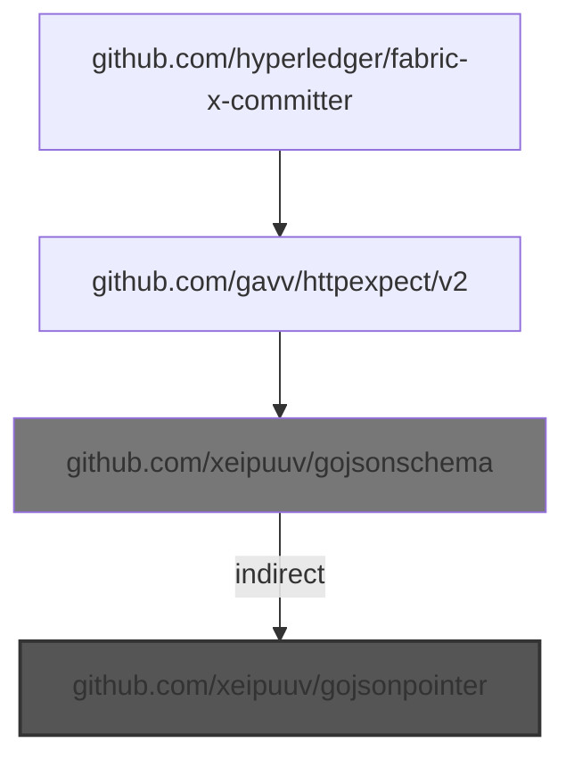

# Unmaintained Imports Report

- **📦 github.com/xeipuuv/gojsonpointer**

  - Choke: github.com/xeipuuv/gojsonschema

    Root to choke:
    - - `github.com/hyperledger/fabric-x-committer` -> `github.com/gavv/httpexpect/v2` -> `github.com/xeipuuv/gojsonschema`

    Root from choke:
    - - `github.com/xeipuuv/gojsonschema` *(indirect)* -> `github.com/xeipuuv/gojsonpointer`
  - 🎯 Blamed: `github.com/gavv/httpexpect/v2`

    - `github.com/gavv/httpexpect/v2` -> `github.com/xeipuuv/gojsonschema` *(indirect)* -> `github.com/xeipuuv/gojsonpointer`

---

## 🎯 BLAME POINT: `github.com/gavv/httpexpect/v2`
Responsible for 1 unmaintained import(s)

- **⚠️  Unmaintained imports:**

  - **📦 github.com/xeipuuv/gojsonpointer**
    - `github.com/gavv/httpexpect/v2` -> `github.com/xeipuuv/gojsonschema` *(indirect)* -> `github.com/xeipuuv/gojsonpointer`

- **📝 Imported in your code at:**

  - `loadgen/client_test.go:19`

---

## SUMMARY

**Total unmaintained imports analyzed:** 1
- In go.mod: 1
- Indirect unmaintained imports grouped by 1 external blame point(s)
- Not in go.mod: 0

