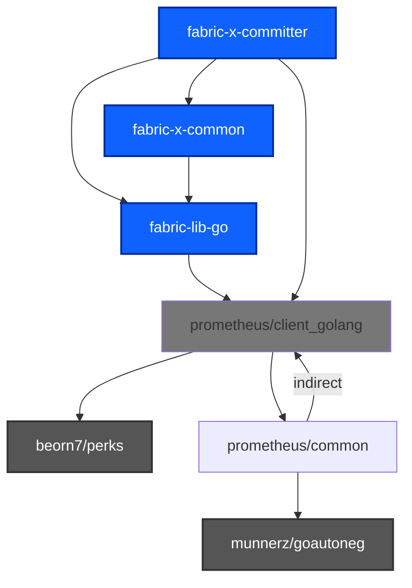
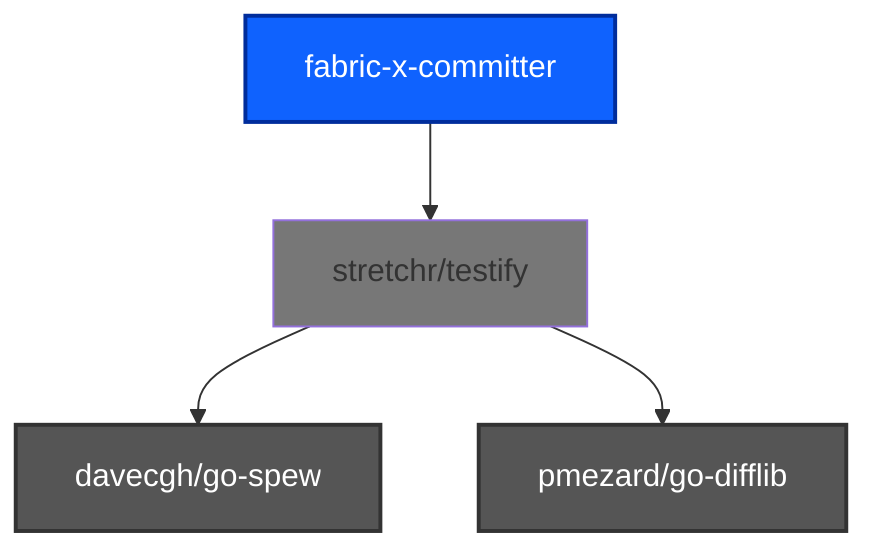
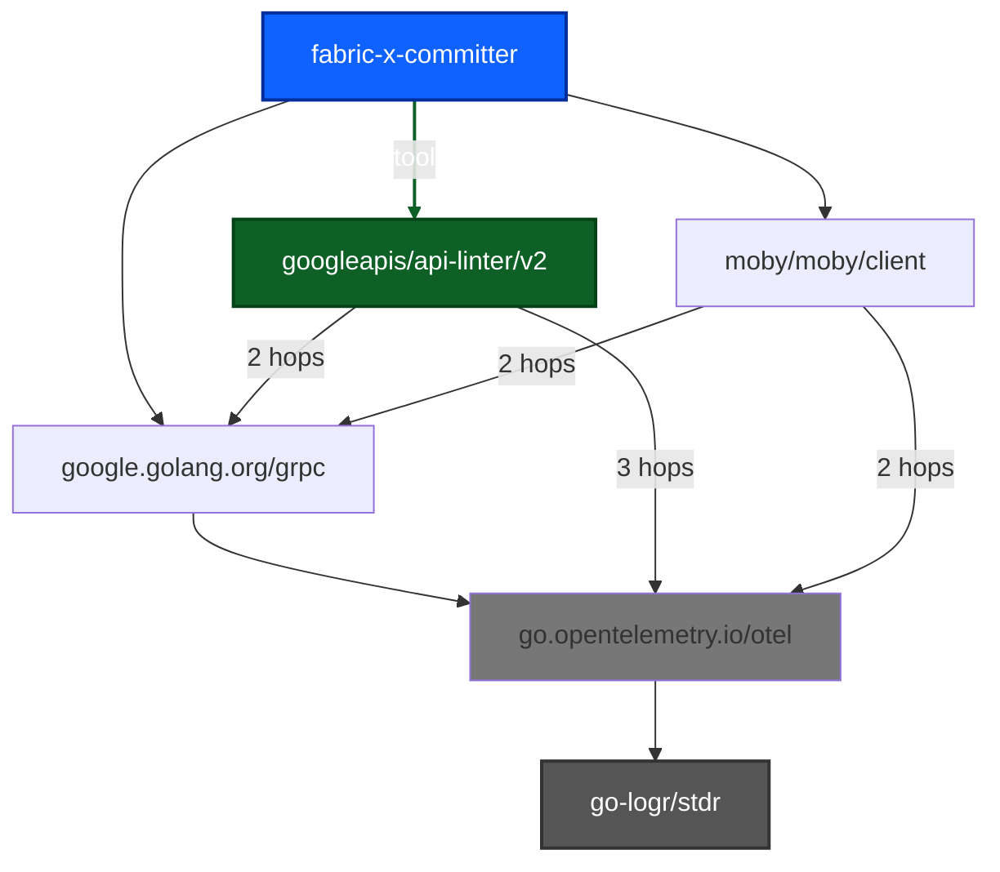
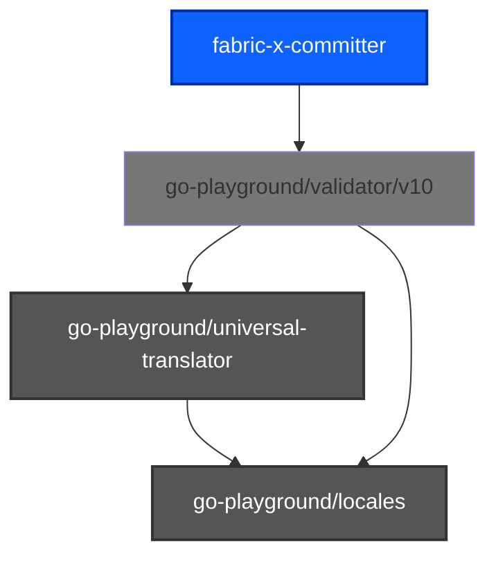
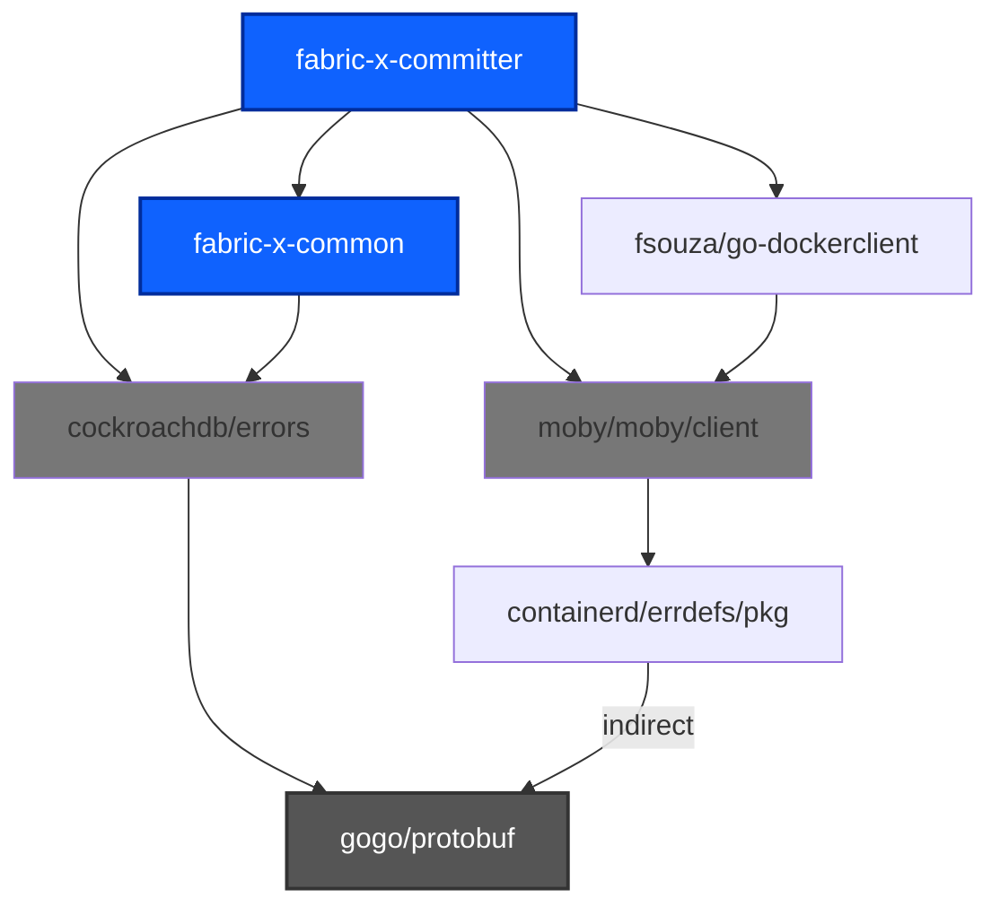
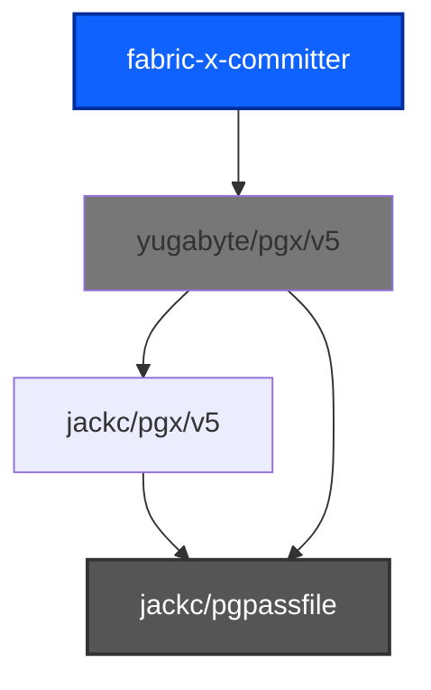
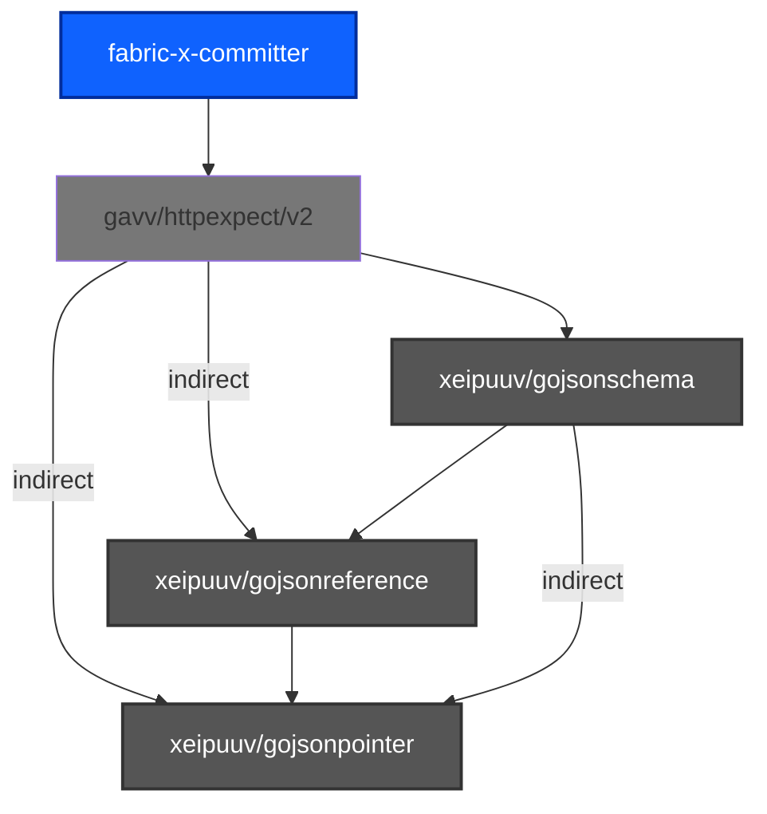

```mermaid
graph TD
    Kunde21/markdownfmt/v3 --> pkg/diff
    cockroachdb/errors --> google.golang.org/grpc
    cockroachdb/errors --> kr/pretty
    cockroachdb/errors -->|3 hops| pkg/diff
    consensys/gnark-crypto -->|indirect| kr/pretty
    fabric-x-committer -->|tool| Kunde21/markdownfmt/v3
    fabric-x-committer --> cockroachdb/errors
    fabric-x-committer --> consensys/gnark-crypto
    fabric-x-committer --> fabric-x-common
    fabric-x-committer --> gavv/httpexpect/v2
    fabric-x-committer --> google.golang.org/grpc
    fabric-x-committer -->|tool| googleapis/api-linter/v2
    fabric-x-committer -->|tool| gotest.tools/gotestsum
    fabric-x-committer --> moby/moby/client
    fabric-x-committer -->|tool| mvdan.cc/gofumpt
    fabric-x-committer --> prometheus/client_golang
    fabric-x-committer --> spf13/viper
    fabric-x-committer --> yugabyte/pgx/v5
    fabric-x-common --> cockroachdb/errors
    fabric-x-common -->|3 hops| consensys/gnark-crypto
    fabric-x-common --> google.golang.org/grpc
    fabric-x-common -->|tool| googleapis/api-linter/v2
    fabric-x-common -->|tool| gotest.tools/gotestsum
    fabric-x-common -->|tool| mvdan.cc/gofumpt
    fabric-x-common -->|4 hops| pkg/diff
    fabric-x-common -->|2 hops| prometheus/client_golang
    fabric-x-common --> spf13/viper
    gavv/httpexpect/v2 -->|3 hops| pkg/diff
    google.golang.org/grpc -->|4 hops| pkg/diff
    googleapis/api-linter/v2 -->|2 hops| google.golang.org/grpc
    googleapis/api-linter/v2 -->|6 hops| pkg/diff
    gotest.tools/gotestsum -->|3 hops| pkg/diff
    moby/moby/client -->|2 hops| google.golang.org/grpc
    moby/moby/client -->|5 hops| pkg/diff
    mvdan.cc/gofumpt -->|2 hops| pkg/diff
    pkg/diff -->|2 hops| kr/pretty
    prometheus/client_golang -->|3 hops| pkg/diff
    spf13/viper -->|3 hops| pkg/diff
    yugabyte/pgx/v5 -->|2 hops| kr/pretty
    style Kunde21/markdownfmt/v3 fill:#0e6027,stroke:#044317,stroke-width:2px,color:#fff
    style cockroachdb/errors fill:#777
    style consensys/gnark-crypto fill:#777
    style googleapis/api-linter/v2 fill:#0e6027,stroke:#044317,stroke-width:2px,color:#fff
    style fabric-x-committer fill:#0f62fe,stroke:#002d9c,stroke-width:2px,color:#fff
    style fabric-x-common fill:#0f62fe,stroke:#002d9c,stroke-width:2px,color:#fff
    style kr/pretty fill:#555,stroke:#333,stroke-width:2px,color:#fff
    style pkg/diff fill:#777
    style yugabyte/pgx/v5 fill:#777
    style gotest.tools/gotestsum fill:#0e6027,stroke:#044317,stroke-width:2px,color:#fff
    style mvdan.cc/gofumpt fill:#0e6027,stroke:#044317,stroke-width:2px,color:#fff
    linkStyle 5,11,12,14,21,22,23 stroke:#0e6027,stroke-width:2px,color:#fff,background-color:#0e6027
```

```mermaid
graph TD
    Kunde21/markdownfmt/v3 -->|3 hops| kr/pretty
    cockroachdb/errors --> google.golang.org/grpc
    cockroachdb/errors --> kr/pretty
    consensys/gnark-crypto -->|indirect| kr/pretty
    fabric-x-committer -->|tool| Kunde21/markdownfmt/v3
    fabric-x-committer --> cockroachdb/errors
    fabric-x-committer --> consensys/gnark-crypto
    fabric-x-committer --> fabric-x-common
    fabric-x-committer --> gavv/httpexpect/v2
    fabric-x-committer --> go.uber.org/zap
    fabric-x-committer --> google.golang.org/grpc
    fabric-x-committer -->|tool| googleapis/api-linter/v2
    fabric-x-committer -->|tool| gotest.tools/gotestsum
    fabric-x-committer --> moby/moby/client
    fabric-x-committer -->|tool| mvdan.cc/gofumpt
    fabric-x-committer --> prometheus/client_golang
    fabric-x-committer --> spf13/viper
    fabric-x-committer --> yugabyte/pgx/v5
    fabric-x-common --> cockroachdb/errors
    fabric-x-common -->|3 hops| consensys/gnark-crypto
    fabric-x-common --> go.uber.org/zap
    fabric-x-common --> google.golang.org/grpc
    fabric-x-common -->|tool| googleapis/api-linter/v2
    fabric-x-common -->|tool| gotest.tools/gotestsum
    fabric-x-common -->|6 hops| kr/pretty
    fabric-x-common -->|3 hops| kr/text
    fabric-x-common -->|tool| mvdan.cc/gofumpt
    fabric-x-common -->|2 hops| prometheus/client_golang
    fabric-x-common --> spf13/viper
    gavv/httpexpect/v2 -->|5 hops| kr/pretty
    go.opentelemetry.io/otel -->|5 hops| kr/pretty
    go.opentelemetry.io/otel -->|indirect| kr/text
    go.uber.org/zap -->|indirect| kr/text
    google.golang.org/grpc --> go.opentelemetry.io/otel
    googleapis/api-linter/v2 -->|3 hops| go.opentelemetry.io/otel
    googleapis/api-linter/v2 -->|2 hops| google.golang.org/grpc
    gotest.tools/gotestsum -->|5 hops| kr/pretty
    kr/pretty --> kr/text
    moby/moby/client -->|2 hops| go.opentelemetry.io/otel
    moby/moby/client -->|2 hops| google.golang.org/grpc
    mvdan.cc/gofumpt -->|4 hops| kr/pretty
    mvdan.cc/gofumpt -->|indirect| kr/text
    prometheus/client_golang -->|5 hops| kr/pretty
    spf13/viper -->|5 hops| kr/pretty
    spf13/viper -->|2 hops| kr/text
    yugabyte/pgx/v5 -->|2 hops| kr/pretty
    style Kunde21/markdownfmt/v3 fill:#0e6027,stroke:#044317,stroke-width:2px,color:#fff
    style googleapis/api-linter/v2 fill:#0e6027,stroke:#044317,stroke-width:2px,color:#fff
    style fabric-x-committer fill:#0f62fe,stroke:#002d9c,stroke-width:2px,color:#fff
    style fabric-x-common fill:#0f62fe,stroke:#002d9c,stroke-width:4px,color:#fff
    style kr/pretty fill:#777
    style kr/text fill:#555,stroke:#333,stroke-width:2px,color:#fff
    style spf13/viper fill:#777
    style go.opentelemetry.io/otel fill:#777
    style go.uber.org/zap fill:#777
    style gotest.tools/gotestsum fill:#0e6027,stroke:#044317,stroke-width:2px,color:#fff
    style mvdan.cc/gofumpt fill:#0e6027,stroke:#044317,stroke-width:4px,color:#fff
    linkStyle 4,11,12,14,22,23,26 stroke:#0e6027,stroke-width:2px,color:#fff,background-color:#0e6027
```

# Unmaintained Imports Report

*Graph nodes omit the `github.com/` and `hyperledger/` prefixes; blue nodes are Hyperledger packages, green nodes are build tools.*

## 📦 `github.com/beorn7/perks`, `github.com/munnerz/goautoneg`

*2 packages pulled in identically:*

**🚧 Choke points** — every path funnels through these:

- `github.com/prometheus/client_golang`
  - imported at `loadgen/metrics/metrics.go:13`, `service/coordinator/dependencygraph/metrics.go:10`, `service/coordinator/metrics.go:10` (+13 more)

🎯 Blame — 3 of our dependencies pull it in

- `github.com/hyperledger/fabric-lib-go`
  - path: `github.com/hyperledger/fabric-lib-go` → `github.com/prometheus/client_golang`
  - imported at `cmd/cliutil/test_exports.go:18`, `cmd/config/app_config.go:19`, `cmd/config/app_config_test.go:16` (+40 more)
- `github.com/hyperledger/fabric-x-common`
  - path: `github.com/hyperledger/fabric-x-common` → `github.com/hyperledger/fabric-lib-go` → `github.com/prometheus/client_golang`
  - imported at `api/servicepb/common.pb.go:15`, `api/servicepb/common.pb.go:16`, `api/servicepb/coordinator.pb.go:15` (+269 more)
- `github.com/prometheus/client_golang`
  - path: `github.com/prometheus/client_golang`
  - imported at `loadgen/metrics/metrics.go:13`, `service/coordinator/dependencygraph/metrics.go:10`, `service/coordinator/metrics.go:10` (+13 more)

---

## 📦 `github.com/davecgh/go-spew`, `github.com/pmezard/go-difflib`

*2 packages pulled in identically:*

**🚧 Choke points** — every path funnels through these:

- `github.com/stretchr/testify`
  - imported at `api/servicepb/height_test.go:12`, `cmd/cliutil/test_exports.go:21`, `cmd/cliutil/test_exports.go:22` (+156 more)

🎯 Blame — 25 of our dependencies pull it in

- `github.com/Kunde21/markdownfmt/v3` *(tool)*
  - path: `github.com/Kunde21/markdownfmt/v3` → `github.com/stretchr/testify`
  - *(not imported directly)*
- `github.com/cockroachdb/errors`
  - path: `github.com/cockroachdb/errors` → `github.com/stretchr/testify`
  - imported at `cmd/committer/config.go:10`, `cmd/committer/healthcheck_cmd_test.go:13`, `cmd/committer/start_cmd.go:13` (+84 more)
- `github.com/consensys/gnark-crypto`
  - path: `github.com/consensys/gnark-crypto` → `github.com/stretchr/testify`
  - imported at `utils/signature/verify_bls.go:11`, `utils/signature/verify_schemes_test.go:20`, `utils/testsig/digest_signer.go:16` (+3 more)
- `github.com/fsouza/go-dockerclient`
  - path: `github.com/fsouza/go-dockerclient` → `github.com/moby/moby/client` → `go.opentelemetry.io/otel/trace` → `github.com/stretchr/testify`
  - imported at `integration/runner/cluster_controllers_test.go:14`, `utils/test/docker.go:13`, `utils/testdb/container.go:22` (+1 more)
- `github.com/gavv/httpexpect/v2`
  - path: `github.com/gavv/httpexpect/v2` → `github.com/stretchr/testify`
  - imported at `loadgen/client_test.go:19`
- `github.com/go-playground/validator/v10`
  - path: `github.com/go-playground/validator/v10` → `github.com/leodido/go-urn` → `github.com/stretchr/testify`
  - imported at `cmd/config/app_config.go:18`
- `github.com/go-task/slim-sprig/v3`
  - path: `github.com/go-task/slim-sprig/v3` → `github.com/stretchr/testify`
  - imported at `cmd/config/create_config_file.go:20`
- `github.com/googleapis/api-linter/v2` *(tool)*
  - path: `github.com/googleapis/api-linter/v2` → `github.com/stoewer/go-strcase` → `github.com/stretchr/testify`
  - *(not imported directly)*
- `github.com/grpc-ecosystem/grpc-gateway/v2`
  - path: `github.com/grpc-ecosystem/grpc-gateway/v2` → `google.golang.org/grpc` → `go.opentelemetry.io/otel/trace` → `github.com/stretchr/testify`
  - imported at `api/servicepb/loadgen.pb.gw.go:17`, `api/servicepb/loadgen.pb.gw.go:18`, `loadgen/client.go:14`
- `github.com/hyperledger/fabric-lib-go`
  - path: `github.com/hyperledger/fabric-lib-go` → `github.com/stretchr/testify`
  - imported at `cmd/cliutil/test_exports.go:18`, `cmd/config/app_config.go:19`, `cmd/config/app_config_test.go:16` (+40 more)
- `github.com/hyperledger/fabric-protos-go-apiv2`
  - path: `github.com/hyperledger/fabric-protos-go-apiv2` → `google.golang.org/grpc` → `go.opentelemetry.io/otel/trace` → `github.com/stretchr/testify`
  - imported at `integration/runner/runtime.go:17`, `integration/test/stream_concurrency_test.go:14`, `loadgen/adapters/broadcast.go:15` (+48 more)
- `github.com/hyperledger/fabric-x-common`
  - path: `github.com/hyperledger/fabric-x-common` → `github.com/stretchr/testify`
  - imported at `api/servicepb/common.pb.go:15`, `api/servicepb/common.pb.go:16`, `api/servicepb/coordinator.pb.go:15` (+269 more)
- `github.com/jackc/puddle/v2`
  - path: `github.com/jackc/puddle/v2` → `github.com/stretchr/testify`
  - imported at `utils/retry/executor.go:14`
- `github.com/moby/moby/client`
  - path: `github.com/moby/moby/client` → `go.opentelemetry.io/otel/trace` → `github.com/stretchr/testify`
  - imported at `docker/test/common.go:25`
- `github.com/prometheus/client_golang`
  - path: `github.com/prometheus/client_golang` → `github.com/prometheus/common` → `github.com/stretchr/testify`
  - imported at `loadgen/metrics/metrics.go:13`, `service/coordinator/dependencygraph/metrics.go:10`, `service/coordinator/metrics.go:10` (+13 more)
- `github.com/spf13/viper`
  - path: `github.com/spf13/viper` → `github.com/stretchr/testify`
  - imported at `cmd/config/app_config.go:20`, `cmd/config/config_decoder.go:20`, `cmd/config/config_decoder_test.go:15` (+2 more)
- `github.com/stretchr/testify`
  - path: `github.com/stretchr/testify`
  - imported at `api/servicepb/height_test.go:12`, `cmd/cliutil/test_exports.go:21`, `cmd/cliutil/test_exports.go:22` (+156 more)
- `github.com/yugabyte/pgx/v5`
  - path: `github.com/yugabyte/pgx/v5` → `github.com/stretchr/testify`
  - imported at `service/query/batcher.go:16`, `service/query/batcher.go:17`, `service/query/query.go:18` (+10 more)
- `go.uber.org/mock`
  - path: `go.uber.org/mock` → `github.com/stretchr/testify`
  - imported at `utils/deliver/delivery_test.go:19`, `utils/deliver/streamer_mock_test.go:18`
- `go.uber.org/zap`
  - path: `go.uber.org/zap` → `github.com/stretchr/testify`
  - imported at `service/sidecar/mapping.go:18`, `service/vc/validator.go:15`, `utils/retry/executor.go:16`
- `google.golang.org/genproto/googleapis/api`
  - path: `google.golang.org/genproto/googleapis/api` → `google.golang.org/grpc` → `go.opentelemetry.io/otel/trace` → `github.com/stretchr/testify`
  - imported at `api/servicepb/loadgen.pb.go:16`
- `google.golang.org/grpc`
  - path: `google.golang.org/grpc` → `go.opentelemetry.io/otel/trace` → `github.com/stretchr/testify`
  - imported at `api/servicepb/coordinator_grpc.pb.go:17`, `api/servicepb/coordinator_grpc.pb.go:18`, `api/servicepb/coordinator_grpc.pb.go:19` (+98 more)
- `google.golang.org/grpc/cmd/protoc-gen-go-grpc` *(tool)*
  - path: `google.golang.org/grpc/cmd/protoc-gen-go-grpc` → `google.golang.org/grpc` → `go.opentelemetry.io/otel/trace` → `github.com/stretchr/testify`
  - *(not imported directly)*
- `gotest.tools/gotestsum` *(tool)*
  - path: `gotest.tools/gotestsum` → `github.com/bitfield/gotestdox` → `github.com/rogpeppe/go-internal` → `github.com/pkg/diff` → `github.com/stretchr/testify`
  - *(not imported directly)*
- `mvdan.cc/gofumpt` *(tool)*
  - path: `mvdan.cc/gofumpt` → `github.com/rogpeppe/go-internal` → `github.com/pkg/diff` → `github.com/stretchr/testify`
  - *(not imported directly)*

---

## 📦 `github.com/go-logr/stdr` — indirect

**🚧 Choke points** — every path funnels through these:

- `go.opentelemetry.io/otel`
  - reached via `google.golang.org/grpc` → `go.opentelemetry.io/otel`
  - `google.golang.org/grpc` imported at `api/servicepb/coordinator_grpc.pb.go:17`, `api/servicepb/coordinator_grpc.pb.go:18`, `api/servicepb/coordinator_grpc.pb.go:19` (+98 more)

🎯 Blame — 11 of our dependencies pull it in

- `github.com/cockroachdb/errors`
  - path: `github.com/cockroachdb/errors` → `google.golang.org/grpc` → `go.opentelemetry.io/otel` → `github.com/go-logr/stdr`
  - imported at `cmd/committer/config.go:10`, `cmd/committer/healthcheck_cmd_test.go:13`, `cmd/committer/start_cmd.go:13` (+84 more)
- `github.com/fsouza/go-dockerclient`
  - path: `github.com/fsouza/go-dockerclient` → `github.com/moby/moby/client` → `go.opentelemetry.io/otel/trace` → `go.opentelemetry.io/otel` → `github.com/go-logr/stdr`
  - imported at `integration/runner/cluster_controllers_test.go:14`, `utils/test/docker.go:13`, `utils/testdb/container.go:22` (+1 more)
- `github.com/googleapis/api-linter/v2` *(tool)*
  - path: `github.com/googleapis/api-linter/v2` → `google.golang.org/genproto/googleapis/api` → `google.golang.org/grpc` → `go.opentelemetry.io/otel` → `github.com/go-logr/stdr`
  - *(not imported directly)*
- `github.com/grpc-ecosystem/grpc-gateway/v2`
  - path: `github.com/grpc-ecosystem/grpc-gateway/v2` → `google.golang.org/grpc` → `go.opentelemetry.io/otel` → `github.com/go-logr/stdr`
  - imported at `api/servicepb/loadgen.pb.gw.go:17`, `api/servicepb/loadgen.pb.gw.go:18`, `loadgen/client.go:14`
- `github.com/hyperledger/fabric-lib-go`
  - path: `github.com/hyperledger/fabric-lib-go` → `google.golang.org/grpc` → `go.opentelemetry.io/otel` → `github.com/go-logr/stdr`
  - imported at `cmd/cliutil/test_exports.go:18`, `cmd/config/app_config.go:19`, `cmd/config/app_config_test.go:16` (+40 more)
- `github.com/hyperledger/fabric-protos-go-apiv2`
  - path: `github.com/hyperledger/fabric-protos-go-apiv2` → `google.golang.org/grpc` → `go.opentelemetry.io/otel` → `github.com/go-logr/stdr`
  - imported at `integration/runner/runtime.go:17`, `integration/test/stream_concurrency_test.go:14`, `loadgen/adapters/broadcast.go:15` (+48 more)
- `github.com/hyperledger/fabric-x-common`
  - path: `github.com/hyperledger/fabric-x-common` → `google.golang.org/grpc` → `go.opentelemetry.io/otel` → `github.com/go-logr/stdr`
  - imported at `api/servicepb/common.pb.go:15`, `api/servicepb/common.pb.go:16`, `api/servicepb/coordinator.pb.go:15` (+269 more)
- `github.com/moby/moby/client`
  - path: `github.com/moby/moby/client` → `go.opentelemetry.io/otel/trace` → `go.opentelemetry.io/otel` → `github.com/go-logr/stdr`
  - imported at `docker/test/common.go:25`
- `google.golang.org/genproto/googleapis/api`
  - path: `google.golang.org/genproto/googleapis/api` → `google.golang.org/grpc` → `go.opentelemetry.io/otel` → `github.com/go-logr/stdr`
  - imported at `api/servicepb/loadgen.pb.go:16`
- `google.golang.org/grpc`
  - path: `google.golang.org/grpc` → `go.opentelemetry.io/otel` → `github.com/go-logr/stdr`
  - imported at `api/servicepb/coordinator_grpc.pb.go:17`, `api/servicepb/coordinator_grpc.pb.go:18`, `api/servicepb/coordinator_grpc.pb.go:19` (+98 more)
- `google.golang.org/grpc/cmd/protoc-gen-go-grpc` *(tool)*
  - path: `google.golang.org/grpc/cmd/protoc-gen-go-grpc` → `google.golang.org/grpc` → `go.opentelemetry.io/otel` → `github.com/go-logr/stdr`
  - *(not imported directly)*

---

## 📦 `github.com/go-playground/locales`, `github.com/go-playground/universal-translator`

*2 packages pulled in identically:*

**🚧 Choke points** — every path funnels through these:

- `github.com/go-playground/validator/v10`
  - imported at `cmd/config/app_config.go:18`

🎯 Blame — 1 of our dependencies pull it in

- `github.com/go-playground/validator/v10`
  - path: `github.com/go-playground/validator/v10`
  - imported at `cmd/config/app_config.go:18`

---

## 📦 `github.com/gogo/protobuf` — indirect

**🚧 Choke points** — every path funnels through these:

- `github.com/cockroachdb/errors`
  - imported at `cmd/committer/config.go:10`, `cmd/committer/healthcheck_cmd_test.go:13`, `cmd/committer/start_cmd.go:13` (+84 more)
- `github.com/moby/moby/client`
  - imported at `docker/test/common.go:25`

🎯 Blame — 4 of our dependencies pull it in

- `github.com/cockroachdb/errors`
  - path: `github.com/cockroachdb/errors` → `github.com/gogo/protobuf`
  - imported at `cmd/committer/config.go:10`, `cmd/committer/healthcheck_cmd_test.go:13`, `cmd/committer/start_cmd.go:13` (+84 more)
- `github.com/fsouza/go-dockerclient`
  - path: `github.com/fsouza/go-dockerclient` → `github.com/moby/moby/client` → `github.com/containerd/errdefs/pkg` → `github.com/gogo/protobuf`
  - imported at `integration/runner/cluster_controllers_test.go:14`, `utils/test/docker.go:13`, `utils/testdb/container.go:22` (+1 more)
- `github.com/hyperledger/fabric-x-common`
  - path: `github.com/hyperledger/fabric-x-common` → `github.com/cockroachdb/errors` → `github.com/gogo/protobuf`
  - imported at `api/servicepb/common.pb.go:15`, `api/servicepb/common.pb.go:16`, `api/servicepb/coordinator.pb.go:15` (+269 more)
- `github.com/moby/moby/client`
  - path: `github.com/moby/moby/client` → `github.com/containerd/errdefs/pkg` → `github.com/gogo/protobuf`
  - imported at `docker/test/common.go:25`

---

## 📦 `github.com/jackc/pgpassfile` — indirect

**🚧 Choke points** — every path funnels through these:

- `github.com/yugabyte/pgx/v5`
  - imported at `service/query/batcher.go:16`, `service/query/batcher.go:17`, `service/query/query.go:18` (+10 more)

🎯 Blame — 1 of our dependencies pull it in

- `github.com/yugabyte/pgx/v5`
  - path: `github.com/yugabyte/pgx/v5` → `github.com/jackc/pgpassfile`
  - imported at `service/query/batcher.go:16`, `service/query/batcher.go:17`, `service/query/query.go:18` (+10 more)

---

## 📦 `github.com/kr/pretty` — indirect

**🚧 Choke points** — every path funnels through these:

- `github.com/cockroachdb/errors`
  - imported at `cmd/committer/config.go:10`, `cmd/committer/healthcheck_cmd_test.go:13`, `cmd/committer/start_cmd.go:13` (+84 more)
- `github.com/consensys/gnark-crypto`
  - imported at `utils/signature/verify_bls.go:11`, `utils/signature/verify_schemes_test.go:20`, `utils/testsig/digest_signer.go:16` (+3 more)
- `github.com/pkg/diff`
  - reached via `github.com/Kunde21/markdownfmt/v3` → `github.com/pkg/diff`
  - `github.com/Kunde21/markdownfmt/v3` *(not imported directly)*
- `github.com/yugabyte/pgx/v5`
  - imported at `service/query/batcher.go:16`, `service/query/batcher.go:17`, `service/query/query.go:18` (+10 more)

🎯 Blame — 19 of our dependencies pull it in

- `github.com/Kunde21/markdownfmt/v3` *(tool)*
  - path: `github.com/Kunde21/markdownfmt/v3` → `github.com/pkg/diff` → `github.com/sergi/go-diff` → `github.com/kr/pretty`
  - *(not imported directly)*
- `github.com/cockroachdb/errors`
  - path: `github.com/cockroachdb/errors` → `github.com/kr/pretty`
  - imported at `cmd/committer/config.go:10`, `cmd/committer/healthcheck_cmd_test.go:13`, `cmd/committer/start_cmd.go:13` (+84 more)
- `github.com/consensys/gnark-crypto`
  - path: `github.com/consensys/gnark-crypto` → `github.com/kr/pretty`
  - imported at `utils/signature/verify_bls.go:11`, `utils/signature/verify_schemes_test.go:20`, `utils/testsig/digest_signer.go:16` (+3 more)
- `github.com/fsouza/go-dockerclient`
  - path: `github.com/fsouza/go-dockerclient` → `github.com/moby/moby/client` → `go.opentelemetry.io/otel/trace` → `go.opentelemetry.io/otel` → `go.opentelemetry.io/auto/sdk` → `github.com/rogpeppe/go-internal` → `github.com/pkg/diff` → `github.com/sergi/go-diff` → `github.com/kr/pretty`
  - imported at `integration/runner/cluster_controllers_test.go:14`, `utils/test/docker.go:13`, `utils/testdb/container.go:22` (+1 more)
- `github.com/gavv/httpexpect/v2`
  - path: `github.com/gavv/httpexpect/v2` → `moul.io/http2curl/v2` → `github.com/tailscale/depaware` → `github.com/pkg/diff` → `github.com/sergi/go-diff` → `github.com/kr/pretty`
  - imported at `loadgen/client_test.go:19`
- `github.com/googleapis/api-linter/v2` *(tool)*
  - path: `github.com/googleapis/api-linter/v2` → `google.golang.org/genproto/googleapis/api` → `google.golang.org/grpc` → `go.opentelemetry.io/otel` → `go.opentelemetry.io/auto/sdk` → `github.com/rogpeppe/go-internal` → `github.com/pkg/diff` → `github.com/sergi/go-diff` → `github.com/kr/pretty`
  - *(not imported directly)*
- `github.com/grpc-ecosystem/grpc-gateway/v2`
  - path: `github.com/grpc-ecosystem/grpc-gateway/v2` → `google.golang.org/grpc` → `go.opentelemetry.io/otel` → `go.opentelemetry.io/auto/sdk` → `github.com/rogpeppe/go-internal` → `github.com/pkg/diff` → `github.com/sergi/go-diff` → `github.com/kr/pretty`
  - imported at `api/servicepb/loadgen.pb.gw.go:17`, `api/servicepb/loadgen.pb.gw.go:18`, `loadgen/client.go:14`
- `github.com/hyperledger/fabric-lib-go`
  - path: `github.com/hyperledger/fabric-lib-go` → `github.com/prometheus/client_golang` → `github.com/prometheus/common` → `github.com/rogpeppe/go-internal` → `github.com/pkg/diff` → `github.com/sergi/go-diff` → `github.com/kr/pretty`
  - imported at `cmd/cliutil/test_exports.go:18`, `cmd/config/app_config.go:19`, `cmd/config/app_config_test.go:16` (+40 more)
- `github.com/hyperledger/fabric-protos-go-apiv2`
  - path: `github.com/hyperledger/fabric-protos-go-apiv2` → `google.golang.org/grpc` → `go.opentelemetry.io/otel` → `go.opentelemetry.io/auto/sdk` → `github.com/rogpeppe/go-internal` → `github.com/pkg/diff` → `github.com/sergi/go-diff` → `github.com/kr/pretty`
  - imported at `integration/runner/runtime.go:17`, `integration/test/stream_concurrency_test.go:14`, `loadgen/adapters/broadcast.go:15` (+48 more)
- `github.com/hyperledger/fabric-x-common`
  - path: `github.com/hyperledger/fabric-x-common` → `github.com/cockroachdb/errors` → `github.com/kr/pretty`
  - imported at `api/servicepb/common.pb.go:15`, `api/servicepb/common.pb.go:16`, `api/servicepb/coordinator.pb.go:15` (+269 more)
- `github.com/moby/moby/client`
  - path: `github.com/moby/moby/client` → `go.opentelemetry.io/otel/trace` → `go.opentelemetry.io/otel` → `go.opentelemetry.io/auto/sdk` → `github.com/rogpeppe/go-internal` → `github.com/pkg/diff` → `github.com/sergi/go-diff` → `github.com/kr/pretty`
  - imported at `docker/test/common.go:25`
- `github.com/prometheus/client_golang`
  - path: `github.com/prometheus/client_golang` → `github.com/prometheus/common` → `github.com/rogpeppe/go-internal` → `github.com/pkg/diff` → `github.com/sergi/go-diff` → `github.com/kr/pretty`
  - imported at `loadgen/metrics/metrics.go:13`, `service/coordinator/dependencygraph/metrics.go:10`, `service/coordinator/metrics.go:10` (+13 more)
- `github.com/spf13/viper`
  - path: `github.com/spf13/viper` → `github.com/spf13/cast` → `github.com/rogpeppe/go-internal` → `github.com/pkg/diff` → `github.com/sergi/go-diff` → `github.com/kr/pretty`
  - imported at `cmd/config/app_config.go:20`, `cmd/config/config_decoder.go:20`, `cmd/config/config_decoder_test.go:15` (+2 more)
- `github.com/yugabyte/pgx/v5`
  - path: `github.com/yugabyte/pgx/v5` → `github.com/jackc/pgx/v5` → `github.com/kr/pretty`
  - imported at `service/query/batcher.go:16`, `service/query/batcher.go:17`, `service/query/query.go:18` (+10 more)
- `google.golang.org/genproto/googleapis/api`
  - path: `google.golang.org/genproto/googleapis/api` → `google.golang.org/grpc` → `go.opentelemetry.io/otel` → `go.opentelemetry.io/auto/sdk` → `github.com/rogpeppe/go-internal` → `github.com/pkg/diff` → `github.com/sergi/go-diff` → `github.com/kr/pretty`
  - imported at `api/servicepb/loadgen.pb.go:16`
- `google.golang.org/grpc`
  - path: `google.golang.org/grpc` → `go.opentelemetry.io/otel` → `go.opentelemetry.io/auto/sdk` → `github.com/rogpeppe/go-internal` → `github.com/pkg/diff` → `github.com/sergi/go-diff` → `github.com/kr/pretty`
  - imported at `api/servicepb/coordinator_grpc.pb.go:17`, `api/servicepb/coordinator_grpc.pb.go:18`, `api/servicepb/coordinator_grpc.pb.go:19` (+98 more)
- `google.golang.org/grpc/cmd/protoc-gen-go-grpc` *(tool)*
  - path: `google.golang.org/grpc/cmd/protoc-gen-go-grpc` → `google.golang.org/grpc` → `go.opentelemetry.io/otel` → `go.opentelemetry.io/auto/sdk` → `github.com/rogpeppe/go-internal` → `github.com/pkg/diff` → `github.com/sergi/go-diff` → `github.com/kr/pretty`
  - *(not imported directly)*
- `gotest.tools/gotestsum` *(tool)*
  - path: `gotest.tools/gotestsum` → `github.com/bitfield/gotestdox` → `github.com/rogpeppe/go-internal` → `github.com/pkg/diff` → `github.com/sergi/go-diff` → `github.com/kr/pretty`
  - *(not imported directly)*
- `mvdan.cc/gofumpt` *(tool)*
  - path: `mvdan.cc/gofumpt` → `github.com/rogpeppe/go-internal` → `github.com/pkg/diff` → `github.com/sergi/go-diff` → `github.com/kr/pretty`
  - *(not imported directly)*

---

## 📦 `github.com/kr/text` — indirect

**🚧 Choke points** — every path funnels through these:

- `github.com/hyperledger/fabric-x-common`
  - imported at `api/servicepb/common.pb.go:15`, `api/servicepb/common.pb.go:16`, `api/servicepb/coordinator.pb.go:15` (+269 more)
- `github.com/kr/pretty`
  - reached via `github.com/cockroachdb/errors` → `github.com/kr/pretty`
  - `github.com/cockroachdb/errors` imported at `cmd/committer/config.go:10`, `cmd/committer/healthcheck_cmd_test.go:13`, `cmd/committer/start_cmd.go:13` (+84 more)
- `github.com/spf13/viper`
  - imported at `cmd/config/app_config.go:20`, `cmd/config/config_decoder.go:20`, `cmd/config/config_decoder_test.go:15` (+2 more)
- `go.opentelemetry.io/otel`
  - reached via `google.golang.org/grpc` → `go.opentelemetry.io/otel`
  - `google.golang.org/grpc` imported at `api/servicepb/coordinator_grpc.pb.go:17`, `api/servicepb/coordinator_grpc.pb.go:18`, `api/servicepb/coordinator_grpc.pb.go:19` (+98 more)
- `go.uber.org/zap`
  - imported at `service/sidecar/mapping.go:18`, `service/vc/validator.go:15`, `utils/retry/executor.go:16`
- `mvdan.cc/gofumpt`
  - *(not imported directly)*

🎯 Blame — 20 of our dependencies pull it in

- `github.com/Kunde21/markdownfmt/v3` *(tool)*
  - path: `github.com/Kunde21/markdownfmt/v3` → `github.com/pkg/diff` → `github.com/sergi/go-diff` → `github.com/kr/pretty` → `github.com/kr/text`
  - *(not imported directly)*
- `github.com/cockroachdb/errors`
  - path: `github.com/cockroachdb/errors` → `github.com/kr/pretty` → `github.com/kr/text`
  - imported at `cmd/committer/config.go:10`, `cmd/committer/healthcheck_cmd_test.go:13`, `cmd/committer/start_cmd.go:13` (+84 more)
- `github.com/consensys/gnark-crypto`
  - path: `github.com/consensys/gnark-crypto` → `github.com/kr/pretty` → `github.com/kr/text`
  - imported at `utils/signature/verify_bls.go:11`, `utils/signature/verify_schemes_test.go:20`, `utils/testsig/digest_signer.go:16` (+3 more)
- `github.com/fsouza/go-dockerclient`
  - path: `github.com/fsouza/go-dockerclient` → `github.com/moby/moby/client` → `go.opentelemetry.io/otel/trace` → `go.opentelemetry.io/otel` → `github.com/kr/text`
  - imported at `integration/runner/cluster_controllers_test.go:14`, `utils/test/docker.go:13`, `utils/testdb/container.go:22` (+1 more)
- `github.com/gavv/httpexpect/v2`
  - path: `github.com/gavv/httpexpect/v2` → `moul.io/http2curl/v2` → `github.com/tailscale/depaware` → `github.com/pkg/diff` → `github.com/sergi/go-diff` → `github.com/kr/pretty` → `github.com/kr/text`
  - imported at `loadgen/client_test.go:19`
- `github.com/googleapis/api-linter/v2` *(tool)*
  - path: `github.com/googleapis/api-linter/v2` → `google.golang.org/genproto/googleapis/api` → `google.golang.org/grpc` → `go.opentelemetry.io/otel` → `github.com/kr/text`
  - *(not imported directly)*
- `github.com/grpc-ecosystem/grpc-gateway/v2`
  - path: `github.com/grpc-ecosystem/grpc-gateway/v2` → `google.golang.org/grpc` → `go.opentelemetry.io/otel` → `github.com/kr/text`
  - imported at `api/servicepb/loadgen.pb.gw.go:17`, `api/servicepb/loadgen.pb.gw.go:18`, `loadgen/client.go:14`
- `github.com/hyperledger/fabric-lib-go`
  - path: `github.com/hyperledger/fabric-lib-go` → `go.uber.org/zap` → `github.com/kr/text`
  - imported at `cmd/cliutil/test_exports.go:18`, `cmd/config/app_config.go:19`, `cmd/config/app_config_test.go:16` (+40 more)
- `github.com/hyperledger/fabric-protos-go-apiv2`
  - path: `github.com/hyperledger/fabric-protos-go-apiv2` → `google.golang.org/grpc` → `go.opentelemetry.io/otel` → `github.com/kr/text`
  - imported at `integration/runner/runtime.go:17`, `integration/test/stream_concurrency_test.go:14`, `loadgen/adapters/broadcast.go:15` (+48 more)
- `github.com/hyperledger/fabric-x-common`
  - path: `github.com/hyperledger/fabric-x-common` → `github.com/cockroachdb/errors` → `github.com/kr/pretty` → `github.com/kr/text`
  - imported at `api/servicepb/common.pb.go:15`, `api/servicepb/common.pb.go:16`, `api/servicepb/coordinator.pb.go:15` (+269 more)
- `github.com/moby/moby/client`
  - path: `github.com/moby/moby/client` → `go.opentelemetry.io/otel/trace` → `go.opentelemetry.io/otel` → `github.com/kr/text`
  - imported at `docker/test/common.go:25`
- `github.com/prometheus/client_golang`
  - path: `github.com/prometheus/client_golang` → `github.com/prometheus/common` → `github.com/rogpeppe/go-internal` → `github.com/pkg/diff` → `github.com/sergi/go-diff` → `github.com/kr/pretty` → `github.com/kr/text`
  - imported at `loadgen/metrics/metrics.go:13`, `service/coordinator/dependencygraph/metrics.go:10`, `service/coordinator/metrics.go:10` (+13 more)
- `github.com/spf13/viper`
  - path: `github.com/spf13/viper` → `github.com/spf13/cast` → `github.com/kr/text`
  - imported at `cmd/config/app_config.go:20`, `cmd/config/config_decoder.go:20`, `cmd/config/config_decoder_test.go:15` (+2 more)
- `github.com/yugabyte/pgx/v5`
  - path: `github.com/yugabyte/pgx/v5` → `github.com/jackc/pgx/v5` → `github.com/kr/pretty` → `github.com/kr/text`
  - imported at `service/query/batcher.go:16`, `service/query/batcher.go:17`, `service/query/query.go:18` (+10 more)
- `go.uber.org/zap`
  - path: `go.uber.org/zap` → `github.com/kr/text`
  - imported at `service/sidecar/mapping.go:18`, `service/vc/validator.go:15`, `utils/retry/executor.go:16`
- `google.golang.org/genproto/googleapis/api`
  - path: `google.golang.org/genproto/googleapis/api` → `google.golang.org/grpc` → `go.opentelemetry.io/otel` → `github.com/kr/text`
  - imported at `api/servicepb/loadgen.pb.go:16`
- `google.golang.org/grpc`
  - path: `google.golang.org/grpc` → `go.opentelemetry.io/otel` → `github.com/kr/text`
  - imported at `api/servicepb/coordinator_grpc.pb.go:17`, `api/servicepb/coordinator_grpc.pb.go:18`, `api/servicepb/coordinator_grpc.pb.go:19` (+98 more)
- `google.golang.org/grpc/cmd/protoc-gen-go-grpc` *(tool)*
  - path: `google.golang.org/grpc/cmd/protoc-gen-go-grpc` → `google.golang.org/grpc` → `go.opentelemetry.io/otel` → `github.com/kr/text`
  - *(not imported directly)*
- `gotest.tools/gotestsum` *(tool)*
  - path: `gotest.tools/gotestsum` → `github.com/bitfield/gotestdox` → `github.com/rogpeppe/go-internal` → `github.com/pkg/diff` → `github.com/sergi/go-diff` → `github.com/kr/pretty` → `github.com/kr/text`
  - *(not imported directly)*
- `mvdan.cc/gofumpt` *(tool)*
  - path: `mvdan.cc/gofumpt` → `github.com/kr/text`
  - *(not imported directly)*

---

## 📦 `github.com/xeipuuv/gojsonpointer`, `github.com/xeipuuv/gojsonreference`, `github.com/xeipuuv/gojsonschema`

*3 packages pulled in identically:*

**🚧 Choke points** — every path funnels through these:

- `github.com/gavv/httpexpect/v2`
  - imported at `loadgen/client_test.go:19`

🎯 Blame — 1 of our dependencies pull it in

- `github.com/gavv/httpexpect/v2`
  - path: `github.com/gavv/httpexpect/v2`
  - imported at `loadgen/client_test.go:19`

---

## Not in the dependency graph (21 found)

These unmaintained packages are not reachable from this module — they are not pulled into the build.

- `github.com/Knetic/govaluate`
- `github.com/KyleBanks/depth`
- `github.com/benbjohnson/clock`
- `github.com/davidlazar/go-crypto`
- `github.com/dgryski/go-rendezvous`
- `github.com/ghodss/yaml`
- `github.com/hyperledger-aries/aries-bbs-go`
- `github.com/hyperledger-labs/jsonld-vc-bbs-go`
- `github.com/jackpal/go-nat-pmp`
- `github.com/josharian/intern`
- `github.com/kilic/bls12-381`
- `github.com/marten-seemann/tcp`
- `github.com/mikioh/tcpinfo`
- `github.com/mikioh/tcpopt`
- `github.com/minio/sha256-simd`
- `github.com/mitchellh/mapstructure`
- `github.com/pbnjay/memory`
- `github.com/remyoudompheng/bigfft`
- `github.com/spaolacci/murmur3`
- `github.com/sykesm/zap-logfmt`
- `github.com/whyrusleeping/go-keyspace`

---

## Summary

- Total unmaintained imports checked: 35
- Pulled into our build: 14 (in 9 source group(s))
- Distinct blame points: 25
- Not in the dependency graph: 21

