# Unmaintained Imports Report

- **📦 github.com/Knetic/govaluate**

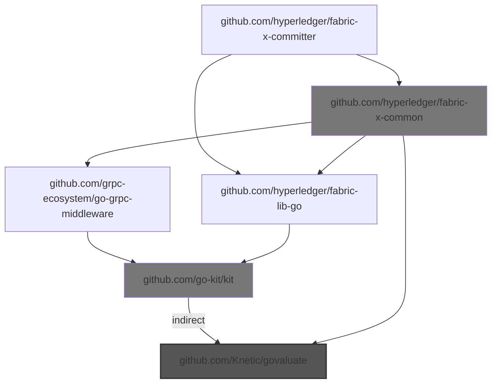
  - Choke: github.com/hyperledger/fabric-x-common

    Root to choke:
    - - `github.com/hyperledger/fabric-x-committer` -> `github.com/hyperledger/fabric-x-common`
    - - ... and 2 more

    Root from choke:
    - - `github.com/hyperledger/fabric-x-common` -> `github.com/Knetic/govaluate`
    - - ... and 2 more
  - Choke: github.com/go-kit/kit

    Root to choke:
    - - `github.com/hyperledger/fabric-x-committer` -> `github.com/hyperledger/fabric-lib-go` -> `github.com/go-kit/kit`
    - - ... and 2 more

    Root from choke:
    - - `github.com/go-kit/kit` *(indirect)* -> `github.com/Knetic/govaluate`
    - - ... and 2 more
  - 🎯 Blamed: `github.com/hyperledger/fabric-lib-go`

    - `github.com/hyperledger/fabric-lib-go` -> `github.com/go-kit/kit` *(indirect)* -> `github.com/Knetic/govaluate`

  - 🎯 Blamed: `github.com/hyperledger/fabric-x-common`

    - `github.com/hyperledger/fabric-x-common` -> `github.com/Knetic/govaluate`
    - ... and 2 more

- **📦 github.com/beorn7/perks**

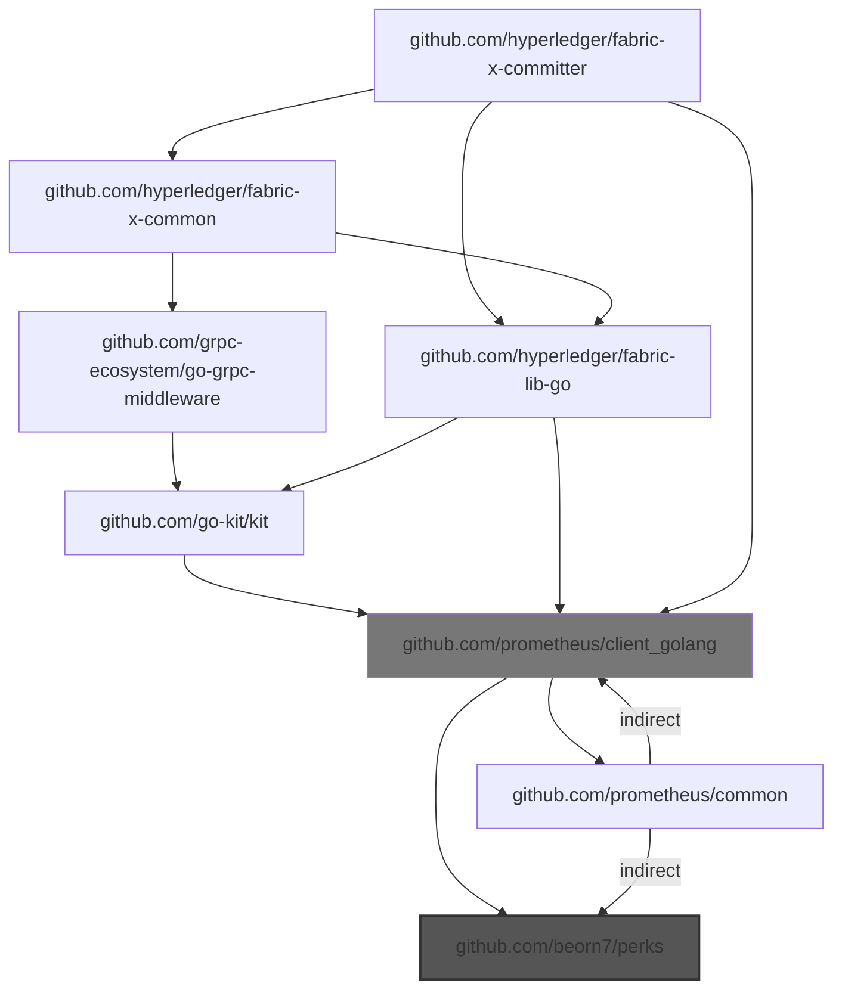
  - Choke: github.com/prometheus/client_golang

    Root to choke:
    - - `github.com/hyperledger/fabric-x-committer` -> `github.com/prometheus/client_golang`
    - - ... and 17 more

    Root from choke:
    - - `github.com/prometheus/client_golang` -> `github.com/beorn7/perks`
    - - ... and 17 more
  - 🎯 Blamed: `github.com/hyperledger/fabric-lib-go`

    - `github.com/hyperledger/fabric-lib-go` -> `github.com/prometheus/client_golang` -> `github.com/beorn7/perks`
    - ... and 5 more

  - 🎯 Blamed: `github.com/hyperledger/fabric-x-common`

    - `github.com/hyperledger/fabric-x-common` -> `github.com/hyperledger/fabric-lib-go` -> `github.com/prometheus/client_golang` -> `github.com/beorn7/perks`
    - ... and 8 more

  - 🎯 Blamed: `github.com/prometheus/client_golang`

    - `github.com/prometheus/client_golang` -> `github.com/beorn7/perks`
    - ... and 2 more

- **📦 github.com/davecgh/go-spew**

```mermaid
graph TD
    cloud.google.com/go --> github.com/googleapis/gax-go/v2
    cloud.google.com/go --> go.opentelemetry.io/otel
    cloud.google.com/go --> go.opentelemetry.io/otel/sdk
    cloud.google.com/go --> go.opentelemetry.io/otel/trace
    cloud.google.com/go --> google.golang.org/api
    cloud.google.com/go --> google.golang.org/grpc
    cloud.google.com/go -->|indirect| github.com/cncf/xds/go
    cloud.google.com/go/auth --> github.com/google/s2a-go
    cloud.google.com/go/auth --> github.com/googleapis/gax-go/v2
    cloud.google.com/go/auth --> go.opentelemetry.io/contrib/instrumentation/google.golang.org/grpc/otelgrpc
    cloud.google.com/go/auth --> go.opentelemetry.io/contrib/instrumentation/net/http/otelhttp
    cloud.google.com/go/auth --> go.opentelemetry.io/otel
    cloud.google.com/go/auth --> go.opentelemetry.io/otel/sdk
    cloud.google.com/go/auth --> go.opentelemetry.io/otel/trace
    cloud.google.com/go/auth --> google.golang.org/grpc
    cloud.google.com/go/auth/oauth2adapt --> cloud.google.com/go/auth
    cloud.google.com/go/iam --> cloud.google.com/go
    cloud.google.com/go/iam --> cloud.google.com/go/longrunning
    cloud.google.com/go/iam --> github.com/googleapis/gax-go/v2
    cloud.google.com/go/iam --> google.golang.org/api
    cloud.google.com/go/iam --> google.golang.org/genproto
    cloud.google.com/go/iam --> google.golang.org/genproto/googleapis/api
    cloud.google.com/go/iam --> google.golang.org/grpc
    cloud.google.com/go/longrunning --> cloud.google.com/go
    cloud.google.com/go/longrunning --> github.com/googleapis/gax-go/v2
    cloud.google.com/go/longrunning --> google.golang.org/api
    cloud.google.com/go/longrunning --> google.golang.org/genproto
    cloud.google.com/go/longrunning --> google.golang.org/genproto/googleapis/api
    cloud.google.com/go/longrunning --> google.golang.org/grpc
    github.com/GoogleCloudPlatform/opentelemetry-operations-go/detectors/gcp --> github.com/stretchr/testify
    github.com/IBM/idemix --> github.com/IBM/idemix/bccsp/schemes/aries
    github.com/IBM/idemix --> github.com/IBM/idemix/bccsp/schemes/weak-bb
    github.com/IBM/idemix --> github.com/IBM/idemix/bccsp/types
    github.com/IBM/idemix --> github.com/IBM/mathlib
    github.com/IBM/idemix --> github.com/alecthomas/kingpin/v2
    github.com/IBM/idemix --> github.com/hyperledger/aries-bbs-go
    github.com/IBM/idemix --> github.com/hyperledger/fabric-protos-go-apiv2
    github.com/IBM/idemix --> github.com/onsi/ginkgo/v2
    github.com/IBM/idemix --> github.com/onsi/gomega
    github.com/IBM/idemix --> github.com/stretchr/testify
    github.com/IBM/idemix --> github.com/sykesm/zap-logfmt
    github.com/IBM/idemix --> go.uber.org/zap
    github.com/IBM/idemix --> google.golang.org/grpc
    github.com/IBM/idemix -->|indirect| github.com/go-task/slim-sprig
    github.com/IBM/idemix/bccsp/schemes/aries --> github.com/IBM/idemix/bccsp/schemes/weak-bb
    github.com/IBM/idemix/bccsp/schemes/aries --> github.com/IBM/idemix/bccsp/types
    github.com/IBM/idemix/bccsp/schemes/aries --> github.com/IBM/mathlib
    github.com/IBM/idemix/bccsp/schemes/aries --> github.com/hyperledger/aries-bbs-go
    github.com/IBM/idemix/bccsp/schemes/aries --> github.com/stretchr/testify
    github.com/IBM/idemix/bccsp/schemes/weak-bb --> github.com/IBM/mathlib
    github.com/IBM/idemix/bccsp/types --> github.com/IBM/mathlib
    github.com/IBM/mathlib --> github.com/consensys/gnark-crypto
    github.com/IBM/mathlib --> github.com/stretchr/testify
    github.com/Kunde21/markdownfmt/v3 --> github.com/stretchr/testify
    github.com/Microsoft/go-winio --> github.com/sirupsen/logrus
    github.com/alecthomas/kingpin/v2 --> github.com/alecthomas/units
    github.com/alecthomas/kingpin/v2 --> github.com/stretchr/testify
    github.com/alecthomas/units --> github.com/stretchr/testify
    github.com/btcsuite/btcutil --> github.com/davecgh/go-spew
    github.com/bufbuild/protocompile --> github.com/stretchr/testify
    github.com/chigopher/pathlib --> github.com/stretchr/testify
    github.com/cncf/xds/go --> google.golang.org/genproto/googleapis/api
    github.com/cncf/xds/go --> google.golang.org/grpc
    github.com/cockroachdb/errors --> github.com/getsentry/sentry-go
    github.com/cockroachdb/errors --> github.com/gogo/status
    github.com/cockroachdb/errors --> github.com/stretchr/testify
    github.com/cockroachdb/errors --> google.golang.org/grpc
    github.com/consensys/gnark-crypto --> github.com/stretchr/testify
    github.com/containerd/errdefs/pkg --> google.golang.org/grpc
    github.com/containerd/log --> github.com/sirupsen/logrus
    github.com/docker/go-connections --> github.com/Microsoft/go-winio
    github.com/envoyproxy/go-control-plane --> github.com/envoyproxy/go-control-plane/envoy
    github.com/envoyproxy/go-control-plane --> github.com/envoyproxy/go-control-plane/ratelimit
    github.com/envoyproxy/go-control-plane --> github.com/stretchr/testify
    github.com/envoyproxy/go-control-plane --> go.uber.org/goleak
    github.com/envoyproxy/go-control-plane --> google.golang.org/grpc
    github.com/envoyproxy/go-control-plane -->|indirect| google.golang.org/genproto/googleapis/api
    github.com/envoyproxy/go-control-plane/envoy --> github.com/cncf/xds/go
    github.com/envoyproxy/go-control-plane/envoy --> github.com/envoyproxy/go-control-plane
    github.com/envoyproxy/go-control-plane/envoy --> github.com/planetscale/vtprotobuf
    github.com/envoyproxy/go-control-plane/envoy --> go.opentelemetry.io/proto/otlp
    github.com/envoyproxy/go-control-plane/envoy --> google.golang.org/genproto/googleapis/api
    github.com/envoyproxy/go-control-plane/envoy --> google.golang.org/grpc
    github.com/envoyproxy/go-control-plane/ratelimit --> github.com/envoyproxy/go-control-plane/envoy
    github.com/envoyproxy/go-control-plane/ratelimit --> google.golang.org/grpc
    github.com/envoyproxy/go-control-plane/ratelimit -->|indirect| github.com/cncf/xds/go
    github.com/fsouza/go-dockerclient --> github.com/Microsoft/go-winio
    github.com/fsouza/go-dockerclient --> github.com/moby/go-archive
    github.com/fsouza/go-dockerclient --> github.com/moby/moby/client
    github.com/gavv/httpexpect/v2 --> github.com/sanity-io/litter
    github.com/gavv/httpexpect/v2 --> github.com/stretchr/testify
    github.com/gavv/httpexpect/v2 --> github.com/xeipuuv/gojsonschema
    github.com/gavv/httpexpect/v2 -->|indirect| github.com/onsi/ginkgo
    github.com/gavv/httpexpect/v2 -->|indirect| github.com/onsi/gomega
    github.com/gavv/httpexpect/v2 -->|indirect| github.com/sergi/go-diff
    github.com/getsentry/sentry-go --> github.com/stretchr/testify
    github.com/getsentry/sentry-go --> go.uber.org/goleak
    github.com/go-kit/kit --> github.com/prometheus/client_golang
    github.com/go-kit/kit --> github.com/sirupsen/logrus
    github.com/go-kit/kit --> go.uber.org/zap
    github.com/go-kit/kit --> google.golang.org/grpc
    github.com/go-kit/kit -->|indirect| go.uber.org/atomic
    github.com/go-kit/kit -->|indirect| google.golang.org/genproto
    github.com/go-playground/validator/v10 --> github.com/leodido/go-urn
    github.com/go-task/slim-sprig --> github.com/stretchr/testify
    github.com/go-task/slim-sprig/v3 --> github.com/stretchr/testify
    github.com/gogo/status --> google.golang.org/genproto
    github.com/gogo/status --> google.golang.org/grpc
    github.com/google/s2a-go --> google.golang.org/api
    github.com/google/s2a-go --> google.golang.org/grpc
    github.com/googleapis/api-linter/v2 --> cloud.google.com/go/iam
    github.com/googleapis/api-linter/v2 --> cloud.google.com/go/longrunning
    github.com/googleapis/api-linter/v2 --> github.com/bufbuild/protocompile
    github.com/googleapis/api-linter/v2 --> github.com/stoewer/go-strcase
    github.com/googleapis/api-linter/v2 --> google.golang.org/genproto
    github.com/googleapis/api-linter/v2 --> google.golang.org/genproto/googleapis/api
    github.com/googleapis/gax-go/v2 --> go.opentelemetry.io/otel
    github.com/googleapis/gax-go/v2 --> go.opentelemetry.io/otel/metric
    github.com/googleapis/gax-go/v2 --> go.opentelemetry.io/otel/sdk/metric
    github.com/googleapis/gax-go/v2 --> google.golang.org/api
    github.com/googleapis/gax-go/v2 --> google.golang.org/genproto
    github.com/googleapis/gax-go/v2 --> google.golang.org/genproto/googleapis/api
    github.com/googleapis/gax-go/v2 --> google.golang.org/grpc
    github.com/grpc-ecosystem/go-grpc-middleware --> github.com/go-kit/kit
    github.com/grpc-ecosystem/go-grpc-middleware --> github.com/sirupsen/logrus
    github.com/grpc-ecosystem/go-grpc-middleware --> github.com/stretchr/testify
    github.com/grpc-ecosystem/go-grpc-middleware --> go.uber.org/zap
    github.com/grpc-ecosystem/go-grpc-middleware --> google.golang.org/grpc
    github.com/grpc-ecosystem/grpc-gateway/v2 --> google.golang.org/genproto/googleapis/api
    github.com/grpc-ecosystem/grpc-gateway/v2 --> google.golang.org/grpc
    github.com/hashicorp/hcl --> github.com/davecgh/go-spew
    github.com/hyperledger-labs/SmartBFT --> github.com/stretchr/testify
    github.com/hyperledger-labs/SmartBFT --> go.uber.org/zap
    github.com/hyperledger/aries-bbs-go --> github.com/IBM/mathlib
    github.com/hyperledger/aries-bbs-go --> github.com/btcsuite/btcutil
    github.com/hyperledger/aries-bbs-go --> github.com/stretchr/testify
    github.com/hyperledger/fabric-lib-go --> github.com/go-kit/kit
    github.com/hyperledger/fabric-lib-go --> github.com/onsi/ginkgo/v2
    github.com/hyperledger/fabric-lib-go --> github.com/onsi/gomega
    github.com/hyperledger/fabric-lib-go --> github.com/prometheus/client_golang
    github.com/hyperledger/fabric-lib-go --> github.com/spf13/viper
    github.com/hyperledger/fabric-lib-go --> github.com/stretchr/testify
    github.com/hyperledger/fabric-lib-go --> github.com/sykesm/zap-logfmt
    github.com/hyperledger/fabric-lib-go --> go.uber.org/zap
    github.com/hyperledger/fabric-lib-go --> google.golang.org/grpc
    github.com/hyperledger/fabric-lib-go -->|indirect| github.com/hashicorp/hcl
    github.com/hyperledger/fabric-lib-go -->|indirect| github.com/spf13/jwalterweatherman
    github.com/hyperledger/fabric-protos-go-apiv2 --> google.golang.org/grpc
    github.com/hyperledger/fabric-x-committer --> github.com/cockroachdb/errors
    github.com/hyperledger/fabric-x-committer --> github.com/consensys/gnark-crypto
    github.com/hyperledger/fabric-x-committer --> github.com/docker/go-connections
    github.com/hyperledger/fabric-x-committer --> github.com/fsouza/go-dockerclient
    github.com/hyperledger/fabric-x-committer --> github.com/gavv/httpexpect/v2
    github.com/hyperledger/fabric-x-committer --> github.com/go-playground/validator/v10
    github.com/hyperledger/fabric-x-committer --> github.com/go-task/slim-sprig/v3
    github.com/hyperledger/fabric-x-committer --> github.com/grpc-ecosystem/grpc-gateway/v2
    github.com/hyperledger/fabric-x-committer --> github.com/hyperledger/fabric-lib-go
    github.com/hyperledger/fabric-x-committer --> github.com/hyperledger/fabric-protos-go-apiv2
    github.com/hyperledger/fabric-x-committer --> github.com/hyperledger/fabric-x-common
    github.com/hyperledger/fabric-x-committer --> github.com/jackc/puddle/v2
    github.com/hyperledger/fabric-x-committer --> github.com/prometheus/client_golang
    github.com/hyperledger/fabric-x-committer --> github.com/spf13/viper
    github.com/hyperledger/fabric-x-committer --> github.com/stretchr/testify
    github.com/hyperledger/fabric-x-committer --> github.com/yugabyte/pgx/v5
    github.com/hyperledger/fabric-x-committer --> go.uber.org/mock
    github.com/hyperledger/fabric-x-committer --> go.uber.org/zap
    github.com/hyperledger/fabric-x-committer --> google.golang.org/genproto/googleapis/api
    github.com/hyperledger/fabric-x-committer --> google.golang.org/grpc
    github.com/hyperledger/fabric-x-committer -->|indirect| github.com/jackc/pgx/v5
    github.com/hyperledger/fabric-x-committer -->|indirect| go.opentelemetry.io/otel/exporters/otlp/otlptrace/otlptracehttp
    github.com/hyperledger/fabric-x-committer -->|tool| github.com/Kunde21/markdownfmt/v3
    github.com/hyperledger/fabric-x-committer -->|tool| github.com/googleapis/api-linter/v2
    github.com/hyperledger/fabric-x-committer -->|tool| google.golang.org/grpc/cmd/protoc-gen-go-grpc
    github.com/hyperledger/fabric-x-common --> github.com/IBM/idemix
    github.com/hyperledger/fabric-x-common --> github.com/alecthomas/kingpin/v2
    github.com/hyperledger/fabric-x-common --> github.com/cockroachdb/errors
    github.com/hyperledger/fabric-x-common --> github.com/davecgh/go-spew
    github.com/hyperledger/fabric-x-common --> github.com/grpc-ecosystem/go-grpc-middleware
    github.com/hyperledger/fabric-x-common --> github.com/hyperledger-labs/SmartBFT
    github.com/hyperledger/fabric-x-common --> github.com/hyperledger/fabric-lib-go
    github.com/hyperledger/fabric-x-common --> github.com/hyperledger/fabric-protos-go-apiv2
    github.com/hyperledger/fabric-x-common --> github.com/onsi/ginkgo/v2
    github.com/hyperledger/fabric-x-common --> github.com/onsi/gomega
    github.com/hyperledger/fabric-x-common --> github.com/spf13/viper
    github.com/hyperledger/fabric-x-common --> github.com/stretchr/testify
    github.com/hyperledger/fabric-x-common --> github.com/syndtr/goleveldb
    github.com/hyperledger/fabric-x-common --> go.uber.org/zap
    github.com/hyperledger/fabric-x-common --> google.golang.org/grpc
    github.com/hyperledger/fabric-x-common -->|tool| github.com/googleapis/api-linter/v2
    github.com/hyperledger/fabric-x-common -->|tool| github.com/maxbrunsfeld/counterfeiter/v6
    github.com/hyperledger/fabric-x-common -->|tool| github.com/vektra/mockery/v2
    github.com/hyperledger/fabric-x-common -->|tool| google.golang.org/grpc/cmd/protoc-gen-go-grpc
    github.com/jackc/pgpassfile --> github.com/stretchr/testify
    github.com/jackc/pgservicefile --> github.com/stretchr/testify
    github.com/jackc/pgx/v5 --> github.com/jackc/pgpassfile
    github.com/jackc/pgx/v5 --> github.com/jackc/pgservicefile
    github.com/jackc/pgx/v5 --> github.com/jackc/puddle/v2
    github.com/jackc/pgx/v5 --> github.com/stretchr/testify
    github.com/jackc/puddle/v2 --> github.com/stretchr/testify
    github.com/json-iterator/go --> github.com/davecgh/go-spew
    github.com/json-iterator/go --> github.com/stretchr/testify
    github.com/leodido/go-urn --> github.com/stretchr/testify
    github.com/maxbrunsfeld/counterfeiter/v6 --> github.com/onsi/gomega
    github.com/moby/go-archive --> github.com/containerd/log
    github.com/moby/moby/client --> github.com/Microsoft/go-winio
    github.com/moby/moby/client --> github.com/containerd/errdefs/pkg
    github.com/moby/moby/client --> github.com/docker/go-connections
    github.com/moby/moby/client --> go.opentelemetry.io/contrib/instrumentation/net/http/otelhttp
    github.com/moby/moby/client --> go.opentelemetry.io/otel/trace
    github.com/onsi/ginkgo --> github.com/go-task/slim-sprig
    github.com/onsi/ginkgo --> github.com/onsi/gomega
    github.com/onsi/ginkgo/v2 --> github.com/go-task/slim-sprig/v3
    github.com/onsi/ginkgo/v2 --> github.com/onsi/gomega
    github.com/onsi/gomega --> github.com/onsi/ginkgo/v2
    github.com/planetscale/vtprotobuf --> github.com/stretchr/testify
    github.com/planetscale/vtprotobuf --> google.golang.org/grpc
    github.com/prometheus/client_golang --> github.com/json-iterator/go
    github.com/prometheus/client_golang --> github.com/prometheus/common
    github.com/prometheus/client_golang --> go.uber.org/goleak
    github.com/prometheus/common --> github.com/alecthomas/kingpin/v2
    github.com/prometheus/common --> github.com/stretchr/testify
    github.com/prometheus/common -->|indirect| github.com/prometheus/client_golang
    github.com/sanity-io/litter --> github.com/stretchr/testify
    github.com/sergi/go-diff --> github.com/stretchr/testify
    github.com/sirupsen/logrus --> github.com/stretchr/testify
    github.com/sourcegraph/conc --> github.com/stretchr/testify
    github.com/spf13/jwalterweatherman --> github.com/stretchr/testify
    github.com/spf13/viper --> github.com/stretchr/testify
    github.com/spf13/viper --> github.com/subosito/gotenv
    github.com/spf13/viper -->|indirect| github.com/sourcegraph/conc
    github.com/spiffe/go-spiffe/v2 --> github.com/Microsoft/go-winio
    github.com/spiffe/go-spiffe/v2 --> github.com/stretchr/testify
    github.com/spiffe/go-spiffe/v2 --> google.golang.org/grpc
    github.com/stoewer/go-strcase --> github.com/stretchr/testify
    github.com/stretchr/objx --> github.com/stretchr/testify
    github.com/stretchr/testify --> github.com/davecgh/go-spew
    github.com/stretchr/testify --> github.com/stretchr/objx
    github.com/subosito/gotenv --> github.com/stretchr/testify
    github.com/sykesm/zap-logfmt --> github.com/stretchr/testify
    github.com/sykesm/zap-logfmt --> go.uber.org/zap
    github.com/syndtr/goleveldb --> github.com/onsi/ginkgo
    github.com/syndtr/goleveldb --> github.com/onsi/gomega
    github.com/syndtr/goleveldb --> github.com/stretchr/testify
    github.com/vektra/mockery/v2 --> github.com/chigopher/pathlib
    github.com/vektra/mockery/v2 --> github.com/davecgh/go-spew
    github.com/vektra/mockery/v2 --> github.com/spf13/viper
    github.com/vektra/mockery/v2 --> github.com/stretchr/testify
    github.com/vektra/mockery/v2 -->|indirect| go.uber.org/multierr
    github.com/xeipuuv/gojsonschema --> github.com/stretchr/testify
    github.com/yugabyte/pgx/v5 --> github.com/jackc/pgpassfile
    github.com/yugabyte/pgx/v5 --> github.com/jackc/pgservicefile
    github.com/yugabyte/pgx/v5 --> github.com/jackc/puddle/v2
    github.com/yugabyte/pgx/v5 --> github.com/stretchr/testify
    go.opentelemetry.io/auto/sdk --> github.com/stretchr/testify
    go.opentelemetry.io/auto/sdk --> go.opentelemetry.io/otel
    go.opentelemetry.io/auto/sdk --> go.opentelemetry.io/otel/trace
    go.opentelemetry.io/contrib/detectors/gcp --> github.com/GoogleCloudPlatform/opentelemetry-operations-go/detectors/gcp
    go.opentelemetry.io/contrib/detectors/gcp --> github.com/stretchr/testify
    go.opentelemetry.io/contrib/detectors/gcp --> go.opentelemetry.io/otel
    go.opentelemetry.io/contrib/detectors/gcp --> go.opentelemetry.io/otel/sdk
    go.opentelemetry.io/contrib/instrumentation/google.golang.org/grpc/otelgrpc --> github.com/stretchr/testify
    go.opentelemetry.io/contrib/instrumentation/google.golang.org/grpc/otelgrpc --> go.opentelemetry.io/otel
    go.opentelemetry.io/contrib/instrumentation/google.golang.org/grpc/otelgrpc --> go.opentelemetry.io/otel/metric
    go.opentelemetry.io/contrib/instrumentation/google.golang.org/grpc/otelgrpc --> go.opentelemetry.io/otel/sdk
    go.opentelemetry.io/contrib/instrumentation/google.golang.org/grpc/otelgrpc --> go.opentelemetry.io/otel/trace
    go.opentelemetry.io/contrib/instrumentation/google.golang.org/grpc/otelgrpc --> google.golang.org/grpc
    go.opentelemetry.io/contrib/instrumentation/net/http/otelhttp --> github.com/stretchr/testify
    go.opentelemetry.io/contrib/instrumentation/net/http/otelhttp --> go.opentelemetry.io/otel
    go.opentelemetry.io/contrib/instrumentation/net/http/otelhttp --> go.opentelemetry.io/otel/metric
    go.opentelemetry.io/contrib/instrumentation/net/http/otelhttp --> go.opentelemetry.io/otel/sdk
    go.opentelemetry.io/contrib/instrumentation/net/http/otelhttp --> go.opentelemetry.io/otel/sdk/metric
    go.opentelemetry.io/contrib/instrumentation/net/http/otelhttp --> go.opentelemetry.io/otel/trace
    go.opentelemetry.io/otel --> github.com/stretchr/testify
    go.opentelemetry.io/otel --> go.opentelemetry.io/auto/sdk
    go.opentelemetry.io/otel --> go.opentelemetry.io/otel/metric
    go.opentelemetry.io/otel --> go.opentelemetry.io/otel/trace
    go.opentelemetry.io/otel/exporters/otlp/otlptrace --> github.com/stretchr/testify
    go.opentelemetry.io/otel/exporters/otlp/otlptrace --> go.opentelemetry.io/otel
    go.opentelemetry.io/otel/exporters/otlp/otlptrace --> go.opentelemetry.io/otel/sdk
    go.opentelemetry.io/otel/exporters/otlp/otlptrace --> go.opentelemetry.io/otel/trace
    go.opentelemetry.io/otel/exporters/otlp/otlptrace --> go.opentelemetry.io/proto/otlp
    go.opentelemetry.io/otel/exporters/otlp/otlptrace/otlptracehttp --> github.com/stretchr/testify
    go.opentelemetry.io/otel/exporters/otlp/otlptrace/otlptracehttp --> go.opentelemetry.io/otel
    go.opentelemetry.io/otel/exporters/otlp/otlptrace/otlptracehttp --> go.opentelemetry.io/otel/exporters/otlp/otlptrace
    go.opentelemetry.io/otel/exporters/otlp/otlptrace/otlptracehttp --> go.opentelemetry.io/otel/metric
    go.opentelemetry.io/otel/exporters/otlp/otlptrace/otlptracehttp --> go.opentelemetry.io/otel/sdk
    go.opentelemetry.io/otel/exporters/otlp/otlptrace/otlptracehttp --> go.opentelemetry.io/otel/sdk/metric
    go.opentelemetry.io/otel/exporters/otlp/otlptrace/otlptracehttp --> go.opentelemetry.io/otel/trace
    go.opentelemetry.io/otel/exporters/otlp/otlptrace/otlptracehttp --> go.opentelemetry.io/proto/otlp
    go.opentelemetry.io/otel/exporters/otlp/otlptrace/otlptracehttp --> google.golang.org/grpc
    go.opentelemetry.io/otel/metric --> github.com/stretchr/testify
    go.opentelemetry.io/otel/metric --> go.opentelemetry.io/otel
    go.opentelemetry.io/otel/sdk --> github.com/stretchr/testify
    go.opentelemetry.io/otel/sdk --> go.opentelemetry.io/otel
    go.opentelemetry.io/otel/sdk --> go.opentelemetry.io/otel/metric
    go.opentelemetry.io/otel/sdk --> go.opentelemetry.io/otel/sdk/metric
    go.opentelemetry.io/otel/sdk --> go.opentelemetry.io/otel/trace
    go.opentelemetry.io/otel/sdk --> go.uber.org/goleak
    go.opentelemetry.io/otel/sdk/metric --> github.com/stretchr/testify
    go.opentelemetry.io/otel/sdk/metric --> go.opentelemetry.io/otel
    go.opentelemetry.io/otel/sdk/metric --> go.opentelemetry.io/otel/metric
    go.opentelemetry.io/otel/sdk/metric --> go.opentelemetry.io/otel/sdk
    go.opentelemetry.io/otel/sdk/metric --> go.opentelemetry.io/otel/trace
    go.opentelemetry.io/otel/trace --> github.com/stretchr/testify
    go.opentelemetry.io/otel/trace --> go.opentelemetry.io/otel
    go.opentelemetry.io/proto/otlp --> github.com/grpc-ecosystem/grpc-gateway/v2
    go.opentelemetry.io/proto/otlp --> google.golang.org/grpc
    go.uber.org/atomic --> github.com/stretchr/testify
    go.uber.org/goleak --> github.com/stretchr/testify
    go.uber.org/mock --> github.com/stretchr/testify
    go.uber.org/multierr --> github.com/stretchr/testify
    go.uber.org/zap --> github.com/stretchr/testify
    go.uber.org/zap --> go.uber.org/goleak
    go.uber.org/zap --> go.uber.org/multierr
    google.golang.org/api --> cloud.google.com/go/auth
    google.golang.org/api --> cloud.google.com/go/auth/oauth2adapt
    google.golang.org/api --> github.com/google/s2a-go
    google.golang.org/api --> github.com/googleapis/gax-go/v2
    google.golang.org/api --> go.opentelemetry.io/contrib/instrumentation/google.golang.org/grpc/otelgrpc
    google.golang.org/api --> go.opentelemetry.io/contrib/instrumentation/net/http/otelhttp
    google.golang.org/api --> google.golang.org/grpc
    google.golang.org/genproto --> cloud.google.com/go/iam
    google.golang.org/genproto --> cloud.google.com/go/longrunning
    google.golang.org/genproto --> google.golang.org/genproto/googleapis/api
    google.golang.org/genproto --> google.golang.org/grpc
    google.golang.org/genproto/googleapis/api --> google.golang.org/grpc
    google.golang.org/grpc --> github.com/envoyproxy/go-control-plane
    google.golang.org/grpc --> github.com/envoyproxy/go-control-plane/envoy
    google.golang.org/grpc --> github.com/spiffe/go-spiffe/v2
    google.golang.org/grpc --> go.opentelemetry.io/contrib/detectors/gcp
    google.golang.org/grpc --> go.opentelemetry.io/otel
    google.golang.org/grpc --> go.opentelemetry.io/otel/metric
    google.golang.org/grpc --> go.opentelemetry.io/otel/sdk
    google.golang.org/grpc --> go.opentelemetry.io/otel/sdk/metric
    google.golang.org/grpc --> go.opentelemetry.io/otel/trace
    google.golang.org/grpc/cmd/protoc-gen-go-grpc --> google.golang.org/grpc
    style github.com/davecgh/go-spew fill:#555,stroke:#333,stroke-width:2px
    style github.com/stretchr/testify fill:#777
    style github.com/hyperledger/fabric-x-common fill:#777
    style github.com/json-iterator/go fill:#777
    style github.com/hashicorp/hcl fill:#777
```
  - Choke: github.com/stretchr/testify

    Root to choke:
    - - `github.com/hyperledger/fabric-x-committer` -> `github.com/stretchr/testify`
    - - ... and 144334 more

    Root from choke:
    - - `github.com/stretchr/testify` -> `github.com/davecgh/go-spew`
    - - ... and 144334 more
  - Choke: github.com/hyperledger/fabric-x-common

    Root to choke:
    - - `github.com/hyperledger/fabric-x-committer` -> `github.com/hyperledger/fabric-x-common`
    - - ... and 42185 more

    Root from choke:
    - - `github.com/hyperledger/fabric-x-common` -> `github.com/davecgh/go-spew`
    - - ... and 42185 more
  - Choke: github.com/json-iterator/go

    Root to choke:
    - - `github.com/hyperledger/fabric-x-committer` -> `github.com/prometheus/client_golang` -> `github.com/json-iterator/go`
    - - ... and 35 more

    Root from choke:
    - - `github.com/json-iterator/go` -> `github.com/davecgh/go-spew`
    - - ... and 35 more
  - Choke: github.com/hashicorp/hcl

    Root to choke:
    - - `github.com/hyperledger/fabric-x-committer` -> `github.com/hyperledger/fabric-lib-go` *(indirect)* -> `github.com/hashicorp/hcl`
    - - ... and 1 more

    Root from choke:
    - - `github.com/hashicorp/hcl` -> `github.com/davecgh/go-spew`
    - - ... and 1 more
  - 🎯 Blamed: `github.com/Kunde21/markdownfmt/v3`

    - `github.com/Kunde21/markdownfmt/v3` -> `github.com/stretchr/testify` -> `github.com/davecgh/go-spew`
    - ... and 1 more

  - 🎯 Blamed: `github.com/cockroachdb/errors`

    - `github.com/cockroachdb/errors` -> `github.com/stretchr/testify` -> `github.com/davecgh/go-spew`
    - ... and 13632 more

  - 🎯 Blamed: `github.com/consensys/gnark-crypto`

    - `github.com/consensys/gnark-crypto` -> `github.com/stretchr/testify` -> `github.com/davecgh/go-spew`
    - ... and 1 more

  - 🎯 Blamed: `github.com/docker/go-connections`

    - `github.com/docker/go-connections` -> `github.com/Microsoft/go-winio` -> `github.com/sirupsen/logrus` -> `github.com/stretchr/testify` -> `github.com/davecgh/go-spew`
    - ... and 1 more

  - 🎯 Blamed: `github.com/fsouza/go-dockerclient`

    - `github.com/fsouza/go-dockerclient` -> `github.com/Microsoft/go-winio` -> `github.com/sirupsen/logrus` -> `github.com/stretchr/testify` -> `github.com/davecgh/go-spew`
    - ... and 704 more

  - 🎯 Blamed: `github.com/gavv/httpexpect/v2`

    - `github.com/gavv/httpexpect/v2` -> `github.com/stretchr/testify` -> `github.com/davecgh/go-spew`
    - ... and 13 more

  - 🎯 Blamed: `github.com/go-playground/validator/v10`

    - `github.com/go-playground/validator/v10` -> `github.com/leodido/go-urn` -> `github.com/stretchr/testify` -> `github.com/davecgh/go-spew`
    - ... and 1 more

  - 🎯 Blamed: `github.com/go-task/slim-sprig/v3`

    - `github.com/go-task/slim-sprig/v3` -> `github.com/stretchr/testify` -> `github.com/davecgh/go-spew`
    - ... and 1 more

  - 🎯 Blamed: `github.com/googleapis/api-linter/v2`

    - `github.com/googleapis/api-linter/v2` -> `github.com/bufbuild/protocompile` -> `github.com/stretchr/testify` -> `github.com/davecgh/go-spew`
    - ... and 78534 more

  - 🎯 Blamed: `github.com/grpc-ecosystem/grpc-gateway/v2`

    - `github.com/grpc-ecosystem/grpc-gateway/v2` -> `google.golang.org/grpc` -> `github.com/envoyproxy/go-control-plane` -> `github.com/stretchr/testify` -> `github.com/davecgh/go-spew`
    - ... and 686 more

  - 🎯 Blamed: `github.com/hyperledger/fabric-lib-go`

    - `github.com/hyperledger/fabric-lib-go` *(indirect)* -> `github.com/hashicorp/hcl` -> `github.com/davecgh/go-spew`
    - ... and 4806 more

  - 🎯 Blamed: `github.com/hyperledger/fabric-protos-go-apiv2`

    - `github.com/hyperledger/fabric-protos-go-apiv2` -> `google.golang.org/grpc` -> `github.com/envoyproxy/go-control-plane` -> `github.com/stretchr/testify` -> `github.com/davecgh/go-spew`
    - ... and 388 more

  - 🎯 Blamed: `github.com/hyperledger/fabric-x-common`

    - `github.com/hyperledger/fabric-x-common` -> `github.com/davecgh/go-spew`
    - ... and 42185 more

  - 🎯 Blamed: `github.com/jackc/puddle/v2`

    - `github.com/jackc/puddle/v2` -> `github.com/stretchr/testify` -> `github.com/davecgh/go-spew`
    - ... and 1 more

  - 🎯 Blamed: `github.com/prometheus/client_golang`

    - `github.com/prometheus/client_golang` -> `github.com/json-iterator/go` -> `github.com/davecgh/go-spew`
    - ... and 15 more

  - 🎯 Blamed: `github.com/spf13/viper`

    - `github.com/spf13/viper` -> `github.com/stretchr/testify` -> `github.com/davecgh/go-spew`
    - ... and 5 more

  - 🎯 Blamed: `github.com/stretchr/testify`

    - `github.com/stretchr/testify` -> `github.com/davecgh/go-spew`
    - ... and 1 more

  - 🎯 Blamed: `github.com/yugabyte/pgx/v5`

    - `github.com/yugabyte/pgx/v5` -> `github.com/stretchr/testify` -> `github.com/davecgh/go-spew`
    - ... and 7 more

  - 🎯 Blamed: `go.uber.org/mock`

    - `go.uber.org/mock` -> `github.com/stretchr/testify` -> `github.com/davecgh/go-spew`
    - ... and 1 more

  - 🎯 Blamed: `go.uber.org/zap`

    - `go.uber.org/zap` -> `github.com/stretchr/testify` -> `github.com/davecgh/go-spew`
    - ... and 5 more

  - 🎯 Blamed: `google.golang.org/genproto/googleapis/api`

    - `google.golang.org/genproto/googleapis/api` -> `google.golang.org/grpc` -> `github.com/envoyproxy/go-control-plane` -> `github.com/stretchr/testify` -> `github.com/davecgh/go-spew`
    - ... and 388 more

  - 🎯 Blamed: `google.golang.org/grpc`

    - `google.golang.org/grpc` -> `github.com/envoyproxy/go-control-plane` -> `github.com/stretchr/testify` -> `github.com/davecgh/go-spew`
    - ... and 449 more

  - 🎯 Blamed: `google.golang.org/grpc/cmd/protoc-gen-go-grpc`

    - `google.golang.org/grpc/cmd/protoc-gen-go-grpc` -> `google.golang.org/grpc` -> `github.com/envoyproxy/go-control-plane` -> `github.com/stretchr/testify` -> `github.com/davecgh/go-spew`
    - ... and 388 more

- **📦 github.com/go-logr/stdr**

```mermaid
graph TD
    cloud.google.com/go --> github.com/googleapis/gax-go/v2
    cloud.google.com/go --> go.opentelemetry.io/otel
    cloud.google.com/go --> go.opentelemetry.io/otel/sdk
    cloud.google.com/go --> go.opentelemetry.io/otel/trace
    cloud.google.com/go --> google.golang.org/api
    cloud.google.com/go --> google.golang.org/grpc
    cloud.google.com/go -->|indirect| github.com/cncf/xds/go
    cloud.google.com/go -->|indirect| github.com/envoyproxy/go-control-plane/envoy
    cloud.google.com/go -->|indirect| github.com/planetscale/vtprotobuf
    cloud.google.com/go -->|indirect| github.com/spiffe/go-spiffe/v2
    cloud.google.com/go -->|indirect| google.golang.org/genproto/googleapis/api
    cloud.google.com/go/auth --> github.com/google/s2a-go
    cloud.google.com/go/auth --> github.com/googleapis/gax-go/v2
    cloud.google.com/go/auth --> go.opentelemetry.io/contrib/instrumentation/google.golang.org/grpc/otelgrpc
    cloud.google.com/go/auth --> go.opentelemetry.io/contrib/instrumentation/net/http/otelhttp
    cloud.google.com/go/auth --> go.opentelemetry.io/otel
    cloud.google.com/go/auth --> go.opentelemetry.io/otel/sdk
    cloud.google.com/go/auth --> go.opentelemetry.io/otel/trace
    cloud.google.com/go/auth --> google.golang.org/grpc
    cloud.google.com/go/auth/oauth2adapt --> cloud.google.com/go/auth
    cloud.google.com/go/iam --> cloud.google.com/go
    cloud.google.com/go/iam --> cloud.google.com/go/longrunning
    cloud.google.com/go/iam --> github.com/googleapis/gax-go/v2
    cloud.google.com/go/iam --> google.golang.org/api
    cloud.google.com/go/iam --> google.golang.org/genproto
    cloud.google.com/go/iam --> google.golang.org/genproto/googleapis/api
    cloud.google.com/go/iam --> google.golang.org/grpc
    cloud.google.com/go/longrunning --> cloud.google.com/go
    cloud.google.com/go/longrunning --> github.com/googleapis/gax-go/v2
    cloud.google.com/go/longrunning --> google.golang.org/api
    cloud.google.com/go/longrunning --> google.golang.org/genproto
    cloud.google.com/go/longrunning --> google.golang.org/genproto/googleapis/api
    cloud.google.com/go/longrunning --> google.golang.org/grpc
    cloud.google.com/go/longrunning -->|indirect| cloud.google.com/go/auth
    github.com/IBM/idemix --> github.com/hyperledger/fabric-protos-go-apiv2
    github.com/IBM/idemix --> google.golang.org/grpc
    github.com/cncf/xds/go --> google.golang.org/genproto/googleapis/api
    github.com/cncf/xds/go --> google.golang.org/grpc
    github.com/cockroachdb/errors --> github.com/gogo/status
    github.com/cockroachdb/errors --> google.golang.org/grpc
    github.com/cockroachdb/errors -->|indirect| google.golang.org/genproto
    github.com/containerd/errdefs/pkg --> google.golang.org/grpc
    github.com/envoyproxy/go-control-plane --> github.com/envoyproxy/go-control-plane/ratelimit
    github.com/envoyproxy/go-control-plane --> google.golang.org/grpc
    github.com/envoyproxy/go-control-plane/envoy --> github.com/cncf/xds/go
    github.com/envoyproxy/go-control-plane/envoy --> github.com/envoyproxy/go-control-plane
    github.com/envoyproxy/go-control-plane/envoy --> github.com/planetscale/vtprotobuf
    github.com/envoyproxy/go-control-plane/envoy --> go.opentelemetry.io/proto/otlp
    github.com/envoyproxy/go-control-plane/envoy --> google.golang.org/genproto/googleapis/api
    github.com/envoyproxy/go-control-plane/envoy --> google.golang.org/grpc
    github.com/envoyproxy/go-control-plane/ratelimit --> google.golang.org/grpc
    github.com/envoyproxy/go-control-plane/ratelimit -->|indirect| github.com/cncf/xds/go
    github.com/envoyproxy/go-control-plane/ratelimit -->|indirect| github.com/planetscale/vtprotobuf
    github.com/fsouza/go-dockerclient --> github.com/moby/moby/client
    github.com/go-kit/kit --> google.golang.org/grpc
    github.com/go-kit/kit -->|indirect| google.golang.org/genproto
    github.com/gogo/status --> google.golang.org/genproto
    github.com/gogo/status --> google.golang.org/grpc
    github.com/google/s2a-go --> google.golang.org/api
    github.com/google/s2a-go --> google.golang.org/grpc
    github.com/google/s2a-go -->|indirect| github.com/googleapis/gax-go/v2
    github.com/googleapis/api-linter/v2 --> cloud.google.com/go/iam
    github.com/googleapis/api-linter/v2 --> cloud.google.com/go/longrunning
    github.com/googleapis/api-linter/v2 --> google.golang.org/genproto
    github.com/googleapis/api-linter/v2 --> google.golang.org/genproto/googleapis/api
    github.com/googleapis/gax-go/v2 --> go.opentelemetry.io/otel
    github.com/googleapis/gax-go/v2 --> go.opentelemetry.io/otel/metric
    github.com/googleapis/gax-go/v2 --> go.opentelemetry.io/otel/sdk/metric
    github.com/googleapis/gax-go/v2 --> google.golang.org/api
    github.com/googleapis/gax-go/v2 --> google.golang.org/genproto
    github.com/googleapis/gax-go/v2 --> google.golang.org/genproto/googleapis/api
    github.com/googleapis/gax-go/v2 --> google.golang.org/grpc
    github.com/grpc-ecosystem/go-grpc-middleware --> github.com/go-kit/kit
    github.com/grpc-ecosystem/go-grpc-middleware --> google.golang.org/grpc
    github.com/grpc-ecosystem/grpc-gateway/v2 --> google.golang.org/genproto/googleapis/api
    github.com/grpc-ecosystem/grpc-gateway/v2 --> google.golang.org/grpc
    github.com/hyperledger/fabric-lib-go --> github.com/go-kit/kit
    github.com/hyperledger/fabric-lib-go --> google.golang.org/grpc
    github.com/hyperledger/fabric-protos-go-apiv2 --> google.golang.org/grpc
    github.com/hyperledger/fabric-x-committer --> github.com/cockroachdb/errors
    github.com/hyperledger/fabric-x-committer --> github.com/fsouza/go-dockerclient
    github.com/hyperledger/fabric-x-committer --> github.com/grpc-ecosystem/grpc-gateway/v2
    github.com/hyperledger/fabric-x-committer --> github.com/hyperledger/fabric-lib-go
    github.com/hyperledger/fabric-x-committer --> github.com/hyperledger/fabric-protos-go-apiv2
    github.com/hyperledger/fabric-x-committer --> github.com/hyperledger/fabric-x-common
    github.com/hyperledger/fabric-x-committer --> google.golang.org/genproto/googleapis/api
    github.com/hyperledger/fabric-x-committer --> google.golang.org/grpc
    github.com/hyperledger/fabric-x-committer -->|indirect| go.opentelemetry.io/otel/exporters/otlp/otlptrace/otlptracehttp
    github.com/hyperledger/fabric-x-committer -->|tool| github.com/googleapis/api-linter/v2
    github.com/hyperledger/fabric-x-committer -->|tool| google.golang.org/grpc/cmd/protoc-gen-go-grpc
    github.com/hyperledger/fabric-x-common --> github.com/IBM/idemix
    github.com/hyperledger/fabric-x-common --> github.com/cockroachdb/errors
    github.com/hyperledger/fabric-x-common --> github.com/grpc-ecosystem/go-grpc-middleware
    github.com/hyperledger/fabric-x-common --> github.com/hyperledger/fabric-lib-go
    github.com/hyperledger/fabric-x-common --> github.com/hyperledger/fabric-protos-go-apiv2
    github.com/hyperledger/fabric-x-common --> google.golang.org/grpc
    github.com/hyperledger/fabric-x-common -->|tool| github.com/googleapis/api-linter/v2
    github.com/hyperledger/fabric-x-common -->|tool| google.golang.org/grpc/cmd/protoc-gen-go-grpc
    github.com/moby/moby/client --> github.com/containerd/errdefs/pkg
    github.com/moby/moby/client --> go.opentelemetry.io/contrib/instrumentation/net/http/otelhttp
    github.com/moby/moby/client --> go.opentelemetry.io/otel/trace
    github.com/planetscale/vtprotobuf --> google.golang.org/grpc
    github.com/spiffe/go-spiffe/v2 --> google.golang.org/grpc
    go.opentelemetry.io/auto/sdk --> go.opentelemetry.io/otel
    go.opentelemetry.io/auto/sdk --> go.opentelemetry.io/otel/trace
    go.opentelemetry.io/contrib/detectors/gcp --> go.opentelemetry.io/otel
    go.opentelemetry.io/contrib/detectors/gcp --> go.opentelemetry.io/otel/sdk
    go.opentelemetry.io/contrib/detectors/gcp -->|indirect| go.opentelemetry.io/auto/sdk
    go.opentelemetry.io/contrib/detectors/gcp -->|indirect| go.opentelemetry.io/otel/metric
    go.opentelemetry.io/contrib/instrumentation/google.golang.org/grpc/otelgrpc --> go.opentelemetry.io/otel
    go.opentelemetry.io/contrib/instrumentation/google.golang.org/grpc/otelgrpc --> go.opentelemetry.io/otel/metric
    go.opentelemetry.io/contrib/instrumentation/google.golang.org/grpc/otelgrpc --> go.opentelemetry.io/otel/sdk
    go.opentelemetry.io/contrib/instrumentation/google.golang.org/grpc/otelgrpc --> go.opentelemetry.io/otel/trace
    go.opentelemetry.io/contrib/instrumentation/google.golang.org/grpc/otelgrpc --> google.golang.org/grpc
    go.opentelemetry.io/contrib/instrumentation/net/http/otelhttp --> go.opentelemetry.io/otel
    go.opentelemetry.io/contrib/instrumentation/net/http/otelhttp --> go.opentelemetry.io/otel/metric
    go.opentelemetry.io/contrib/instrumentation/net/http/otelhttp --> go.opentelemetry.io/otel/sdk
    go.opentelemetry.io/contrib/instrumentation/net/http/otelhttp --> go.opentelemetry.io/otel/sdk/metric
    go.opentelemetry.io/contrib/instrumentation/net/http/otelhttp --> go.opentelemetry.io/otel/trace
    go.opentelemetry.io/contrib/instrumentation/net/http/otelhttp -->|indirect| go.opentelemetry.io/auto/sdk
    go.opentelemetry.io/otel --> github.com/go-logr/stdr
    go.opentelemetry.io/otel --> go.opentelemetry.io/otel/metric
    go.opentelemetry.io/otel/exporters/otlp/otlptrace --> go.opentelemetry.io/otel
    go.opentelemetry.io/otel/exporters/otlp/otlptrace --> go.opentelemetry.io/otel/sdk
    go.opentelemetry.io/otel/exporters/otlp/otlptrace --> go.opentelemetry.io/otel/trace
    go.opentelemetry.io/otel/exporters/otlp/otlptrace --> go.opentelemetry.io/proto/otlp
    go.opentelemetry.io/otel/exporters/otlp/otlptrace/otlptracehttp --> go.opentelemetry.io/otel
    go.opentelemetry.io/otel/exporters/otlp/otlptrace/otlptracehttp --> go.opentelemetry.io/otel/exporters/otlp/otlptrace
    go.opentelemetry.io/otel/exporters/otlp/otlptrace/otlptracehttp --> go.opentelemetry.io/otel/metric
    go.opentelemetry.io/otel/exporters/otlp/otlptrace/otlptracehttp --> go.opentelemetry.io/otel/sdk
    go.opentelemetry.io/otel/exporters/otlp/otlptrace/otlptracehttp --> go.opentelemetry.io/otel/sdk/metric
    go.opentelemetry.io/otel/exporters/otlp/otlptrace/otlptracehttp --> go.opentelemetry.io/otel/trace
    go.opentelemetry.io/otel/exporters/otlp/otlptrace/otlptracehttp --> go.opentelemetry.io/proto/otlp
    go.opentelemetry.io/otel/exporters/otlp/otlptrace/otlptracehttp --> google.golang.org/grpc
    go.opentelemetry.io/otel/metric --> go.opentelemetry.io/otel
    go.opentelemetry.io/otel/metric -->|indirect| go.opentelemetry.io/auto/sdk
    go.opentelemetry.io/otel/metric -->|indirect| go.opentelemetry.io/otel/trace
    go.opentelemetry.io/otel/sdk --> go.opentelemetry.io/otel
    go.opentelemetry.io/otel/sdk --> go.opentelemetry.io/otel/metric
    go.opentelemetry.io/otel/sdk --> go.opentelemetry.io/otel/sdk/metric
    go.opentelemetry.io/otel/sdk --> go.opentelemetry.io/otel/trace
    go.opentelemetry.io/otel/sdk -->|indirect| go.opentelemetry.io/auto/sdk
    go.opentelemetry.io/otel/sdk/metric --> github.com/go-logr/stdr
    go.opentelemetry.io/otel/sdk/metric --> go.opentelemetry.io/otel
    go.opentelemetry.io/otel/sdk/metric --> go.opentelemetry.io/otel/metric
    go.opentelemetry.io/otel/sdk/metric --> go.opentelemetry.io/otel/sdk
    go.opentelemetry.io/otel/sdk/metric --> go.opentelemetry.io/otel/trace
    go.opentelemetry.io/otel/sdk/metric -->|indirect| go.opentelemetry.io/auto/sdk
    go.opentelemetry.io/otel/trace --> go.opentelemetry.io/otel
    go.opentelemetry.io/proto/otlp --> github.com/grpc-ecosystem/grpc-gateway/v2
    go.opentelemetry.io/proto/otlp --> google.golang.org/grpc
    go.opentelemetry.io/proto/otlp -->|indirect| google.golang.org/genproto/googleapis/api
    google.golang.org/api --> cloud.google.com/go/auth
    google.golang.org/api --> cloud.google.com/go/auth/oauth2adapt
    google.golang.org/api --> github.com/google/s2a-go
    google.golang.org/api --> github.com/googleapis/gax-go/v2
    google.golang.org/api --> go.opentelemetry.io/contrib/instrumentation/google.golang.org/grpc/otelgrpc
    google.golang.org/api --> go.opentelemetry.io/contrib/instrumentation/net/http/otelhttp
    google.golang.org/api --> google.golang.org/grpc
    google.golang.org/genproto --> cloud.google.com/go/iam
    google.golang.org/genproto --> cloud.google.com/go/longrunning
    google.golang.org/genproto --> google.golang.org/genproto/googleapis/api
    google.golang.org/genproto --> google.golang.org/grpc
    google.golang.org/genproto/googleapis/api --> google.golang.org/grpc
    google.golang.org/grpc --> go.opentelemetry.io/contrib/detectors/gcp
    google.golang.org/grpc --> go.opentelemetry.io/otel
    google.golang.org/grpc --> go.opentelemetry.io/otel/metric
    google.golang.org/grpc --> go.opentelemetry.io/otel/sdk
    google.golang.org/grpc --> go.opentelemetry.io/otel/sdk/metric
    google.golang.org/grpc --> go.opentelemetry.io/otel/trace
    google.golang.org/grpc -->|indirect| go.opentelemetry.io/auto/sdk
    google.golang.org/grpc/cmd/protoc-gen-go-grpc --> google.golang.org/grpc
    style github.com/go-logr/stdr fill:#555,stroke:#333,stroke-width:2px
    style go.opentelemetry.io/otel fill:#777
    style go.opentelemetry.io/otel/sdk/metric fill:#777
```
  - Choke: go.opentelemetry.io/otel

    Root to choke:
    - - `github.com/hyperledger/fabric-x-committer` *(indirect)* -> `go.opentelemetry.io/otel/exporters/otlp/otlptrace/otlptracehttp` -> `go.opentelemetry.io/otel`
    - - ... and 48521 more

    Root from choke:
    - - `go.opentelemetry.io/otel` -> `github.com/go-logr/stdr`
    - - ... and 48521 more
  - Choke: go.opentelemetry.io/otel/sdk/metric

    Root to choke:
    - - `github.com/hyperledger/fabric-x-committer` *(indirect)* -> `go.opentelemetry.io/otel/exporters/otlp/otlptrace/otlptracehttp` -> `go.opentelemetry.io/otel/sdk/metric`
    - - ... and 24012 more

    Root from choke:
    - - `go.opentelemetry.io/otel/sdk/metric` -> `github.com/go-logr/stdr`
    - - ... and 24012 more
  - 🎯 Blamed: `github.com/cockroachdb/errors`

    - `github.com/cockroachdb/errors` -> `google.golang.org/grpc` -> `go.opentelemetry.io/otel` -> `github.com/go-logr/stdr`
    - ... and 5700 more

  - 🎯 Blamed: `github.com/fsouza/go-dockerclient`

    - `github.com/fsouza/go-dockerclient` -> `github.com/moby/moby/client` -> `go.opentelemetry.io/contrib/instrumentation/net/http/otelhttp` -> `go.opentelemetry.io/otel` -> `github.com/go-logr/stdr`
    - ... and 133 more

  - 🎯 Blamed: `github.com/googleapis/api-linter/v2`

    - `github.com/googleapis/api-linter/v2` -> `cloud.google.com/go/iam` -> `cloud.google.com/go` -> `go.opentelemetry.io/otel` -> `github.com/go-logr/stdr`
    - ... and 30225 more

  - 🎯 Blamed: `github.com/grpc-ecosystem/grpc-gateway/v2`

    - `github.com/grpc-ecosystem/grpc-gateway/v2` -> `google.golang.org/grpc` -> `go.opentelemetry.io/otel` -> `github.com/go-logr/stdr`
    - ... and 149 more

  - 🎯 Blamed: `github.com/hyperledger/fabric-lib-go`

    - `github.com/hyperledger/fabric-lib-go` -> `google.golang.org/grpc` -> `go.opentelemetry.io/otel` -> `github.com/go-logr/stdr`
    - ... and 2146 more

  - 🎯 Blamed: `github.com/hyperledger/fabric-protos-go-apiv2`

    - `github.com/hyperledger/fabric-protos-go-apiv2` -> `google.golang.org/grpc` -> `go.opentelemetry.io/otel` -> `github.com/go-logr/stdr`
    - ... and 77 more

  - 🎯 Blamed: `github.com/hyperledger/fabric-x-common`

    - `github.com/hyperledger/fabric-x-common` -> `google.golang.org/grpc` -> `go.opentelemetry.io/otel` -> `github.com/go-logr/stdr`
    - ... and 18011 more

  - 🎯 Blamed: `google.golang.org/genproto/googleapis/api`

    - `google.golang.org/genproto/googleapis/api` -> `google.golang.org/grpc` -> `go.opentelemetry.io/otel` -> `github.com/go-logr/stdr`
    - ... and 77 more

  - 🎯 Blamed: `google.golang.org/grpc`

    - `google.golang.org/grpc` -> `go.opentelemetry.io/otel` -> `github.com/go-logr/stdr`
    - ... and 78 more

  - 🎯 Blamed: `google.golang.org/grpc/cmd/protoc-gen-go-grpc`

    - `google.golang.org/grpc/cmd/protoc-gen-go-grpc` -> `google.golang.org/grpc` -> `go.opentelemetry.io/otel` -> `github.com/go-logr/stdr`
    - ... and 77 more

- **📦 github.com/go-playground/locales**

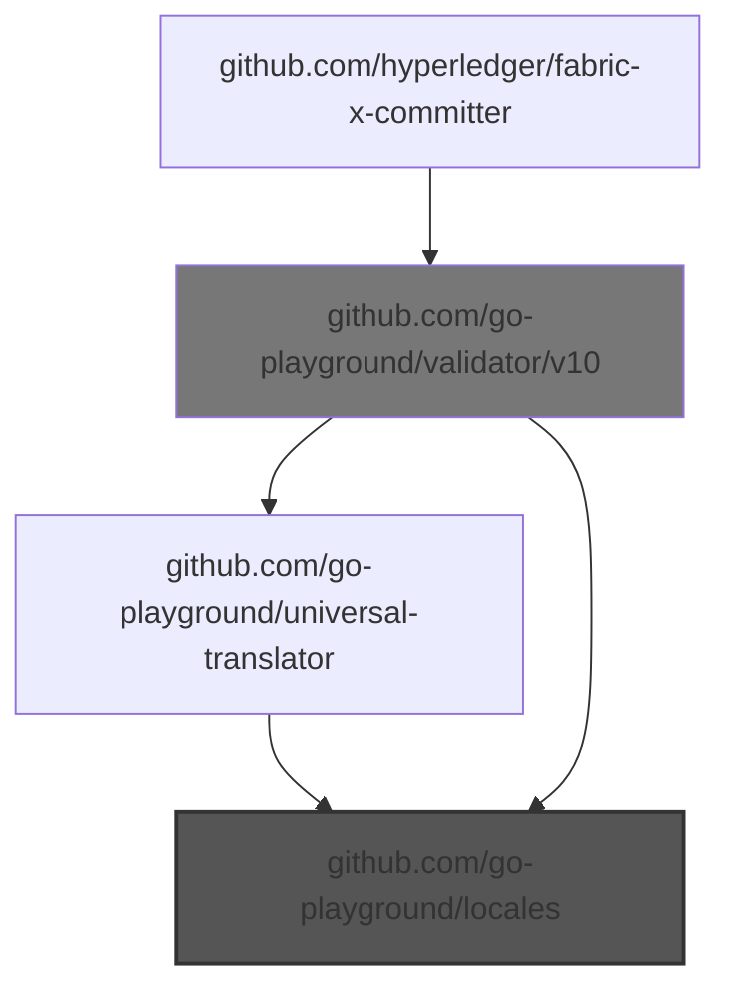
  - Choke: github.com/go-playground/validator/v10

    Root to choke:
    - - `github.com/hyperledger/fabric-x-committer` -> `github.com/go-playground/validator/v10`
    - - ... and 1 more

    Root from choke:
    - - `github.com/go-playground/validator/v10` -> `github.com/go-playground/locales`
    - - ... and 1 more
  - 🎯 Blamed: `github.com/go-playground/validator/v10`

    - `github.com/go-playground/validator/v10` -> `github.com/go-playground/locales`
    - ... and 1 more

- **📦 github.com/go-playground/universal-translator**

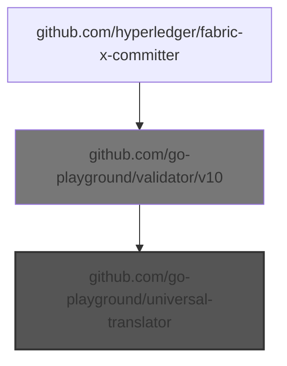
  - Choke: github.com/go-playground/validator/v10

    Root to choke:
    - - `github.com/hyperledger/fabric-x-committer` -> `github.com/go-playground/validator/v10`

    Root from choke:
    - - `github.com/go-playground/validator/v10` -> `github.com/go-playground/universal-translator`
  - 🎯 Blamed: `github.com/go-playground/validator/v10`

    - `github.com/go-playground/validator/v10` -> `github.com/go-playground/universal-translator`

- **📦 github.com/gogo/protobuf**

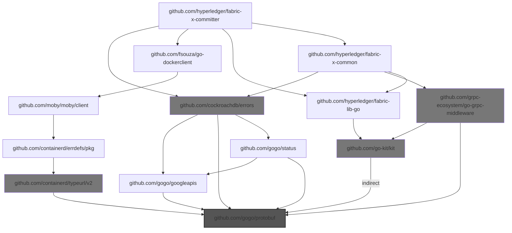
  - Choke: github.com/cockroachdb/errors

    Root to choke:
    - - `github.com/hyperledger/fabric-x-committer` -> `github.com/cockroachdb/errors`
    - - ... and 7 more

    Root from choke:
    - - `github.com/cockroachdb/errors` -> `github.com/gogo/protobuf`
    - - ... and 7 more
  - Choke: github.com/grpc-ecosystem/go-grpc-middleware

    Root to choke:
    - - `github.com/hyperledger/fabric-x-committer` -> `github.com/hyperledger/fabric-x-common` -> `github.com/grpc-ecosystem/go-grpc-middleware`
    - - ... and 1 more

    Root from choke:
    - - `github.com/grpc-ecosystem/go-grpc-middleware` -> `github.com/gogo/protobuf`
    - - ... and 1 more
  - Choke: github.com/containerd/typeurl/v2

    Root to choke:
    - - `github.com/hyperledger/fabric-x-committer` -> `github.com/fsouza/go-dockerclient` -> `github.com/moby/moby/client` -> `github.com/containerd/errdefs/pkg` -> `github.com/containerd/typeurl/v2`

    Root from choke:
    - - `github.com/containerd/typeurl/v2` -> `github.com/gogo/protobuf`
  - Choke: github.com/go-kit/kit

    Root to choke:
    - - `github.com/hyperledger/fabric-x-committer` -> `github.com/hyperledger/fabric-lib-go` -> `github.com/go-kit/kit`
    - - ... and 2 more

    Root from choke:
    - - `github.com/go-kit/kit` *(indirect)* -> `github.com/gogo/protobuf`
    - - ... and 2 more
  - 🎯 Blamed: `github.com/cockroachdb/errors`

    - `github.com/cockroachdb/errors` -> `github.com/gogo/protobuf`
    - ... and 3 more

  - 🎯 Blamed: `github.com/fsouza/go-dockerclient`

    - `github.com/fsouza/go-dockerclient` -> `github.com/moby/moby/client` -> `github.com/containerd/errdefs/pkg` -> `github.com/containerd/typeurl/v2` -> `github.com/gogo/protobuf`

  - 🎯 Blamed: `github.com/hyperledger/fabric-lib-go`

    - `github.com/hyperledger/fabric-lib-go` -> `github.com/go-kit/kit` *(indirect)* -> `github.com/gogo/protobuf`

  - 🎯 Blamed: `github.com/hyperledger/fabric-x-common`

    - `github.com/hyperledger/fabric-x-common` -> `github.com/cockroachdb/errors` -> `github.com/gogo/protobuf`
    - ... and 6 more

- **📦 github.com/jackc/pgpassfile**

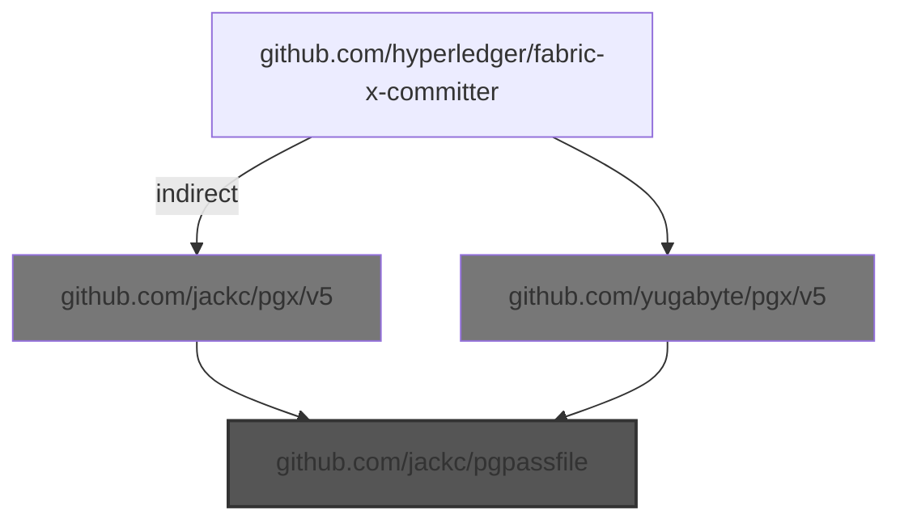
  - Choke: github.com/yugabyte/pgx/v5

    Root to choke:
    - - `github.com/hyperledger/fabric-x-committer` -> `github.com/yugabyte/pgx/v5`

    Root from choke:
    - - `github.com/yugabyte/pgx/v5` -> `github.com/jackc/pgpassfile`
  - Choke: github.com/jackc/pgx/v5

    Root to choke:
    - - `github.com/hyperledger/fabric-x-committer` *(indirect)* -> `github.com/jackc/pgx/v5`

    Root from choke:
    - - `github.com/jackc/pgx/v5` -> `github.com/jackc/pgpassfile`
  - 🎯 Blamed: `github.com/yugabyte/pgx/v5`

    - `github.com/yugabyte/pgx/v5` -> `github.com/jackc/pgpassfile`

- **📦 github.com/kilic/bls12-381**

  Root to pkg: `github.com/IBM/mathlib` -> `github.com/kilic/bls12-381`

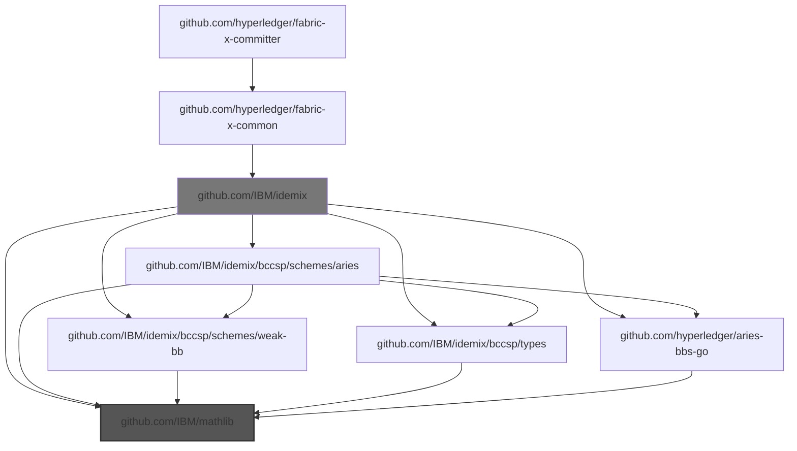
  - Choke: github.com/IBM/idemix

    Root to choke:
    - - `github.com/hyperledger/fabric-x-committer` -> `github.com/hyperledger/fabric-x-common` -> `github.com/IBM/idemix`
    - - ... and 7 more

    Root from choke:
    - - `github.com/IBM/idemix` -> `github.com/IBM/mathlib`
    - - ... and 7 more
  - 🎯 Blamed: `github.com/hyperledger/fabric-x-common`

    - `github.com/hyperledger/fabric-x-common` -> `github.com/IBM/idemix` -> `github.com/IBM/mathlib`
    - ... and 7 more

- **📦 github.com/kr/pretty**

```mermaid
graph TD
    cloud.google.com/go --> github.com/googleapis/gax-go/v2
    cloud.google.com/go --> go.opentelemetry.io/otel
    cloud.google.com/go --> go.opentelemetry.io/otel/sdk
    cloud.google.com/go --> go.opentelemetry.io/otel/trace
    cloud.google.com/go --> google.golang.org/api
    cloud.google.com/go --> google.golang.org/grpc
    cloud.google.com/go -->|indirect| github.com/cncf/xds/go
    cloud.google.com/go/auth --> github.com/google/s2a-go
    cloud.google.com/go/auth --> github.com/googleapis/gax-go/v2
    cloud.google.com/go/auth --> go.opentelemetry.io/contrib/instrumentation/google.golang.org/grpc/otelgrpc
    cloud.google.com/go/auth --> go.opentelemetry.io/contrib/instrumentation/net/http/otelhttp
    cloud.google.com/go/auth --> go.opentelemetry.io/otel
    cloud.google.com/go/auth --> go.opentelemetry.io/otel/sdk
    cloud.google.com/go/auth --> go.opentelemetry.io/otel/trace
    cloud.google.com/go/auth --> google.golang.org/grpc
    cloud.google.com/go/auth/oauth2adapt --> cloud.google.com/go/auth
    cloud.google.com/go/iam --> cloud.google.com/go
    cloud.google.com/go/iam --> cloud.google.com/go/longrunning
    cloud.google.com/go/iam --> github.com/googleapis/gax-go/v2
    cloud.google.com/go/iam --> google.golang.org/api
    cloud.google.com/go/iam --> google.golang.org/genproto
    cloud.google.com/go/iam --> google.golang.org/genproto/googleapis/api
    cloud.google.com/go/iam --> google.golang.org/grpc
    cloud.google.com/go/longrunning --> cloud.google.com/go
    cloud.google.com/go/longrunning --> github.com/googleapis/gax-go/v2
    cloud.google.com/go/longrunning --> google.golang.org/api
    cloud.google.com/go/longrunning --> google.golang.org/genproto
    cloud.google.com/go/longrunning --> google.golang.org/genproto/googleapis/api
    cloud.google.com/go/longrunning --> google.golang.org/grpc
    github.com/GoogleCloudPlatform/opentelemetry-operations-go/detectors/gcp --> github.com/stretchr/testify
    github.com/IBM/idemix --> github.com/IBM/idemix/bccsp/schemes/aries
    github.com/IBM/idemix --> github.com/IBM/idemix/bccsp/schemes/weak-bb
    github.com/IBM/idemix --> github.com/IBM/idemix/bccsp/types
    github.com/IBM/idemix --> github.com/IBM/mathlib
    github.com/IBM/idemix --> github.com/alecthomas/kingpin/v2
    github.com/IBM/idemix --> github.com/hyperledger/aries-bbs-go
    github.com/IBM/idemix --> github.com/hyperledger/fabric-protos-go-apiv2
    github.com/IBM/idemix --> github.com/onsi/ginkgo/v2
    github.com/IBM/idemix --> github.com/onsi/gomega
    github.com/IBM/idemix --> github.com/stretchr/testify
    github.com/IBM/idemix --> github.com/sykesm/zap-logfmt
    github.com/IBM/idemix --> go.uber.org/zap
    github.com/IBM/idemix --> google.golang.org/grpc
    github.com/IBM/idemix -->|indirect| github.com/go-task/slim-sprig
    github.com/IBM/idemix/bccsp/schemes/aries --> github.com/IBM/idemix/bccsp/schemes/weak-bb
    github.com/IBM/idemix/bccsp/schemes/aries --> github.com/IBM/idemix/bccsp/types
    github.com/IBM/idemix/bccsp/schemes/aries --> github.com/IBM/mathlib
    github.com/IBM/idemix/bccsp/schemes/aries --> github.com/hyperledger/aries-bbs-go
    github.com/IBM/idemix/bccsp/schemes/aries --> github.com/stretchr/testify
    github.com/IBM/idemix/bccsp/schemes/weak-bb --> github.com/IBM/mathlib
    github.com/IBM/idemix/bccsp/types --> github.com/IBM/mathlib
    github.com/IBM/mathlib --> github.com/consensys/gnark-crypto
    github.com/IBM/mathlib --> github.com/stretchr/testify
    github.com/Kunde21/markdownfmt/v3 --> github.com/stretchr/testify
    github.com/Microsoft/go-winio --> github.com/sirupsen/logrus
    github.com/alecthomas/kingpin/v2 --> github.com/alecthomas/units
    github.com/alecthomas/kingpin/v2 --> github.com/stretchr/testify
    github.com/alecthomas/units --> github.com/stretchr/testify
    github.com/bufbuild/protocompile --> github.com/stretchr/testify
    github.com/chigopher/pathlib --> github.com/stretchr/testify
    github.com/cncf/xds/go --> google.golang.org/genproto/googleapis/api
    github.com/cncf/xds/go --> google.golang.org/grpc
    github.com/cockroachdb/errors --> github.com/getsentry/sentry-go
    github.com/cockroachdb/errors --> github.com/gogo/status
    github.com/cockroachdb/errors --> github.com/kr/pretty
    github.com/cockroachdb/errors --> github.com/stretchr/testify
    github.com/cockroachdb/errors --> google.golang.org/grpc
    github.com/consensys/gnark-crypto --> github.com/stretchr/testify
    github.com/consensys/gnark-crypto --> gopkg.in/yaml.v2
    github.com/containerd/errdefs/pkg --> google.golang.org/grpc
    github.com/containerd/log --> github.com/sirupsen/logrus
    github.com/docker/go-connections --> github.com/Microsoft/go-winio
    github.com/envoyproxy/go-control-plane --> github.com/envoyproxy/go-control-plane/envoy
    github.com/envoyproxy/go-control-plane --> github.com/envoyproxy/go-control-plane/ratelimit
    github.com/envoyproxy/go-control-plane --> github.com/stretchr/testify
    github.com/envoyproxy/go-control-plane --> go.uber.org/goleak
    github.com/envoyproxy/go-control-plane --> google.golang.org/grpc
    github.com/envoyproxy/go-control-plane -->|indirect| google.golang.org/genproto/googleapis/api
    github.com/envoyproxy/go-control-plane/envoy --> github.com/cncf/xds/go
    github.com/envoyproxy/go-control-plane/envoy --> github.com/envoyproxy/go-control-plane
    github.com/envoyproxy/go-control-plane/envoy --> github.com/planetscale/vtprotobuf
    github.com/envoyproxy/go-control-plane/envoy --> go.opentelemetry.io/proto/otlp
    github.com/envoyproxy/go-control-plane/envoy --> google.golang.org/genproto/googleapis/api
    github.com/envoyproxy/go-control-plane/envoy --> google.golang.org/grpc
    github.com/envoyproxy/go-control-plane/ratelimit --> github.com/envoyproxy/go-control-plane/envoy
    github.com/envoyproxy/go-control-plane/ratelimit --> google.golang.org/grpc
    github.com/envoyproxy/go-control-plane/ratelimit -->|indirect| github.com/cncf/xds/go
    github.com/frankban/quicktest --> github.com/kr/pretty
    github.com/fsouza/go-dockerclient --> github.com/Microsoft/go-winio
    github.com/fsouza/go-dockerclient --> github.com/moby/go-archive
    github.com/fsouza/go-dockerclient --> github.com/moby/moby/client
    github.com/gavv/httpexpect/v2 --> github.com/sanity-io/litter
    github.com/gavv/httpexpect/v2 --> github.com/stretchr/testify
    github.com/gavv/httpexpect/v2 --> github.com/xeipuuv/gojsonschema
    github.com/gavv/httpexpect/v2 -->|indirect| github.com/onsi/ginkgo
    github.com/gavv/httpexpect/v2 -->|indirect| github.com/onsi/gomega
    github.com/gavv/httpexpect/v2 -->|indirect| github.com/sergi/go-diff
    github.com/gavv/httpexpect/v2 -->|indirect| gopkg.in/yaml.v2
    github.com/getsentry/sentry-go --> github.com/stretchr/testify
    github.com/getsentry/sentry-go --> go.uber.org/goleak
    github.com/go-kit/kit --> github.com/prometheus/client_golang
    github.com/go-kit/kit --> github.com/sirupsen/logrus
    github.com/go-kit/kit --> go.uber.org/zap
    github.com/go-kit/kit --> google.golang.org/grpc
    github.com/go-kit/kit -->|indirect| go.uber.org/atomic
    github.com/go-kit/kit -->|indirect| google.golang.org/genproto
    github.com/go-playground/validator/v10 --> github.com/leodido/go-urn
    github.com/go-quicktest/qt --> github.com/kr/pretty
    github.com/go-task/slim-sprig --> github.com/stretchr/testify
    github.com/go-task/slim-sprig/v3 --> github.com/stretchr/testify
    github.com/gogo/status --> google.golang.org/genproto
    github.com/gogo/status --> google.golang.org/grpc
    github.com/google/s2a-go --> google.golang.org/api
    github.com/google/s2a-go --> google.golang.org/grpc
    github.com/googleapis/api-linter/v2 --> cloud.google.com/go/iam
    github.com/googleapis/api-linter/v2 --> cloud.google.com/go/longrunning
    github.com/googleapis/api-linter/v2 --> github.com/bufbuild/protocompile
    github.com/googleapis/api-linter/v2 --> github.com/stoewer/go-strcase
    github.com/googleapis/api-linter/v2 --> google.golang.org/genproto
    github.com/googleapis/api-linter/v2 --> google.golang.org/genproto/googleapis/api
    github.com/googleapis/api-linter/v2 --> gopkg.in/yaml.v3
    github.com/googleapis/gax-go/v2 --> go.opentelemetry.io/otel
    github.com/googleapis/gax-go/v2 --> go.opentelemetry.io/otel/metric
    github.com/googleapis/gax-go/v2 --> go.opentelemetry.io/otel/sdk/metric
    github.com/googleapis/gax-go/v2 --> google.golang.org/api
    github.com/googleapis/gax-go/v2 --> google.golang.org/genproto
    github.com/googleapis/gax-go/v2 --> google.golang.org/genproto/googleapis/api
    github.com/googleapis/gax-go/v2 --> google.golang.org/grpc
    github.com/grpc-ecosystem/go-grpc-middleware --> github.com/go-kit/kit
    github.com/grpc-ecosystem/go-grpc-middleware --> github.com/sirupsen/logrus
    github.com/grpc-ecosystem/go-grpc-middleware --> github.com/stretchr/testify
    github.com/grpc-ecosystem/go-grpc-middleware --> go.uber.org/zap
    github.com/grpc-ecosystem/go-grpc-middleware --> google.golang.org/grpc
    github.com/grpc-ecosystem/grpc-gateway/v2 --> go.yaml.in/yaml/v3
    github.com/grpc-ecosystem/grpc-gateway/v2 --> google.golang.org/genproto/googleapis/api
    github.com/grpc-ecosystem/grpc-gateway/v2 --> google.golang.org/grpc
    github.com/hyperledger-labs/SmartBFT --> github.com/stretchr/testify
    github.com/hyperledger-labs/SmartBFT --> go.uber.org/zap
    github.com/hyperledger/aries-bbs-go --> github.com/IBM/mathlib
    github.com/hyperledger/aries-bbs-go --> github.com/stretchr/testify
    github.com/hyperledger/fabric-lib-go --> github.com/go-kit/kit
    github.com/hyperledger/fabric-lib-go --> github.com/onsi/ginkgo/v2
    github.com/hyperledger/fabric-lib-go --> github.com/onsi/gomega
    github.com/hyperledger/fabric-lib-go --> github.com/prometheus/client_golang
    github.com/hyperledger/fabric-lib-go --> github.com/spf13/viper
    github.com/hyperledger/fabric-lib-go --> github.com/stretchr/testify
    github.com/hyperledger/fabric-lib-go --> github.com/sykesm/zap-logfmt
    github.com/hyperledger/fabric-lib-go --> go.uber.org/zap
    github.com/hyperledger/fabric-lib-go --> google.golang.org/grpc
    github.com/hyperledger/fabric-lib-go -->|indirect| github.com/spf13/jwalterweatherman
    github.com/hyperledger/fabric-lib-go -->|indirect| gopkg.in/yaml.v2
    github.com/hyperledger/fabric-protos-go-apiv2 --> google.golang.org/grpc
    github.com/hyperledger/fabric-x-committer --> github.com/cockroachdb/errors
    github.com/hyperledger/fabric-x-committer --> github.com/consensys/gnark-crypto
    github.com/hyperledger/fabric-x-committer --> github.com/docker/go-connections
    github.com/hyperledger/fabric-x-committer --> github.com/fsouza/go-dockerclient
    github.com/hyperledger/fabric-x-committer --> github.com/gavv/httpexpect/v2
    github.com/hyperledger/fabric-x-committer --> github.com/go-playground/validator/v10
    github.com/hyperledger/fabric-x-committer --> github.com/go-task/slim-sprig/v3
    github.com/hyperledger/fabric-x-committer --> github.com/grpc-ecosystem/grpc-gateway/v2
    github.com/hyperledger/fabric-x-committer --> github.com/hyperledger/fabric-lib-go
    github.com/hyperledger/fabric-x-committer --> github.com/hyperledger/fabric-protos-go-apiv2
    github.com/hyperledger/fabric-x-committer --> github.com/hyperledger/fabric-x-common
    github.com/hyperledger/fabric-x-committer --> github.com/jackc/puddle/v2
    github.com/hyperledger/fabric-x-committer --> github.com/prometheus/client_golang
    github.com/hyperledger/fabric-x-committer --> github.com/spf13/cobra
    github.com/hyperledger/fabric-x-committer --> github.com/spf13/viper
    github.com/hyperledger/fabric-x-committer --> github.com/stretchr/testify
    github.com/hyperledger/fabric-x-committer --> github.com/yugabyte/pgx/v5
    github.com/hyperledger/fabric-x-committer --> go.uber.org/mock
    github.com/hyperledger/fabric-x-committer --> go.uber.org/zap
    github.com/hyperledger/fabric-x-committer --> go.yaml.in/yaml/v3
    github.com/hyperledger/fabric-x-committer --> google.golang.org/genproto/googleapis/api
    github.com/hyperledger/fabric-x-committer --> google.golang.org/grpc
    github.com/hyperledger/fabric-x-committer -->|indirect| github.com/jackc/pgx/v5
    github.com/hyperledger/fabric-x-committer -->|indirect| go.opentelemetry.io/otel/exporters/otlp/otlptrace/otlptracehttp
    github.com/hyperledger/fabric-x-committer -->|tool| github.com/Kunde21/markdownfmt/v3
    github.com/hyperledger/fabric-x-committer -->|tool| github.com/googleapis/api-linter/v2
    github.com/hyperledger/fabric-x-committer -->|tool| google.golang.org/grpc/cmd/protoc-gen-go-grpc
    github.com/hyperledger/fabric-x-committer -->|tool| mvdan.cc/gofumpt
    github.com/hyperledger/fabric-x-common --> github.com/IBM/idemix
    github.com/hyperledger/fabric-x-common --> github.com/alecthomas/kingpin/v2
    github.com/hyperledger/fabric-x-common --> github.com/cockroachdb/errors
    github.com/hyperledger/fabric-x-common --> github.com/grpc-ecosystem/go-grpc-middleware
    github.com/hyperledger/fabric-x-common --> github.com/hyperledger-labs/SmartBFT
    github.com/hyperledger/fabric-x-common --> github.com/hyperledger/fabric-lib-go
    github.com/hyperledger/fabric-x-common --> github.com/hyperledger/fabric-protos-go-apiv2
    github.com/hyperledger/fabric-x-common --> github.com/onsi/ginkgo/v2
    github.com/hyperledger/fabric-x-common --> github.com/onsi/gomega
    github.com/hyperledger/fabric-x-common --> github.com/spf13/viper
    github.com/hyperledger/fabric-x-common --> github.com/stretchr/testify
    github.com/hyperledger/fabric-x-common --> github.com/syndtr/goleveldb
    github.com/hyperledger/fabric-x-common --> go.uber.org/zap
    github.com/hyperledger/fabric-x-common --> go.yaml.in/yaml/v3
    github.com/hyperledger/fabric-x-common --> google.golang.org/grpc
    github.com/hyperledger/fabric-x-common -->|tool| github.com/googleapis/api-linter/v2
    github.com/hyperledger/fabric-x-common -->|tool| github.com/maxbrunsfeld/counterfeiter/v6
    github.com/hyperledger/fabric-x-common -->|tool| github.com/vektra/mockery/v2
    github.com/hyperledger/fabric-x-common -->|tool| google.golang.org/grpc/cmd/protoc-gen-go-grpc
    github.com/hyperledger/fabric-x-common -->|tool| mvdan.cc/gofumpt
    github.com/jackc/pgpassfile --> github.com/stretchr/testify
    github.com/jackc/pgservicefile --> github.com/stretchr/testify
    github.com/jackc/pgx/v5 --> github.com/jackc/pgpassfile
    github.com/jackc/pgx/v5 --> github.com/jackc/pgservicefile
    github.com/jackc/pgx/v5 --> github.com/jackc/puddle/v2
    github.com/jackc/pgx/v5 --> github.com/stretchr/testify
    github.com/jackc/puddle/v2 --> github.com/stretchr/testify
    github.com/json-iterator/go --> github.com/stretchr/testify
    github.com/leodido/go-urn --> github.com/stretchr/testify
    github.com/maxbrunsfeld/counterfeiter/v6 --> github.com/onsi/gomega
    github.com/moby/go-archive --> github.com/containerd/log
    github.com/moby/moby/client --> github.com/Microsoft/go-winio
    github.com/moby/moby/client --> github.com/containerd/errdefs/pkg
    github.com/moby/moby/client --> github.com/docker/go-connections
    github.com/moby/moby/client --> go.opentelemetry.io/contrib/instrumentation/net/http/otelhttp
    github.com/moby/moby/client --> go.opentelemetry.io/otel/trace
    github.com/onsi/ginkgo --> github.com/go-task/slim-sprig
    github.com/onsi/ginkgo --> github.com/onsi/gomega
    github.com/onsi/ginkgo/v2 --> github.com/go-task/slim-sprig/v3
    github.com/onsi/ginkgo/v2 --> github.com/onsi/gomega
    github.com/onsi/gomega --> github.com/onsi/ginkgo/v2
    github.com/onsi/gomega --> go.yaml.in/yaml/v3
    github.com/planetscale/vtprotobuf --> github.com/stretchr/testify
    github.com/planetscale/vtprotobuf --> google.golang.org/grpc
    github.com/prometheus/client_golang --> github.com/json-iterator/go
    github.com/prometheus/client_golang --> github.com/prometheus/common
    github.com/prometheus/client_golang --> go.uber.org/goleak
    github.com/prometheus/common --> github.com/alecthomas/kingpin/v2
    github.com/prometheus/common --> github.com/stretchr/testify
    github.com/prometheus/common -->|indirect| github.com/prometheus/client_golang
    github.com/sanity-io/litter --> github.com/stretchr/testify
    github.com/sergi/go-diff --> github.com/stretchr/testify
    github.com/sergi/go-diff -->|indirect| gopkg.in/yaml.v2
    github.com/sirupsen/logrus --> github.com/stretchr/testify
    github.com/sourcegraph/conc --> github.com/stretchr/testify
    github.com/spf13/cast --> github.com/frankban/quicktest
    github.com/spf13/cobra --> go.yaml.in/yaml/v3
    github.com/spf13/jwalterweatherman --> github.com/stretchr/testify
    github.com/spf13/viper --> github.com/spf13/cast
    github.com/spf13/viper --> github.com/stretchr/testify
    github.com/spf13/viper --> github.com/subosito/gotenv
    github.com/spf13/viper --> go.yaml.in/yaml/v3
    github.com/spf13/viper -->|indirect| github.com/sourcegraph/conc
    github.com/spiffe/go-spiffe/v2 --> github.com/Microsoft/go-winio
    github.com/spiffe/go-spiffe/v2 --> github.com/stretchr/testify
    github.com/spiffe/go-spiffe/v2 --> google.golang.org/grpc
    github.com/stoewer/go-strcase --> github.com/stretchr/testify
    github.com/stretchr/objx --> github.com/stretchr/testify
    github.com/stretchr/testify --> github.com/stretchr/objx
    github.com/stretchr/testify --> gopkg.in/yaml.v3
    github.com/subosito/gotenv --> github.com/stretchr/testify
    github.com/sykesm/zap-logfmt --> github.com/stretchr/testify
    github.com/sykesm/zap-logfmt --> go.uber.org/zap
    github.com/syndtr/goleveldb --> github.com/onsi/ginkgo
    github.com/syndtr/goleveldb --> github.com/onsi/gomega
    github.com/syndtr/goleveldb --> github.com/stretchr/testify
    github.com/vektra/mockery/v2 --> github.com/chigopher/pathlib
    github.com/vektra/mockery/v2 --> github.com/spf13/cobra
    github.com/vektra/mockery/v2 --> github.com/spf13/viper
    github.com/vektra/mockery/v2 --> github.com/stretchr/testify
    github.com/vektra/mockery/v2 --> gopkg.in/yaml.v3
    github.com/vektra/mockery/v2 -->|indirect| go.uber.org/multierr
    github.com/xeipuuv/gojsonschema --> github.com/stretchr/testify
    github.com/yugabyte/pgx/v5 --> github.com/jackc/pgpassfile
    github.com/yugabyte/pgx/v5 --> github.com/jackc/pgservicefile
    github.com/yugabyte/pgx/v5 --> github.com/jackc/puddle/v2
    github.com/yugabyte/pgx/v5 --> github.com/stretchr/testify
    go.opentelemetry.io/auto/sdk --> github.com/stretchr/testify
    go.opentelemetry.io/auto/sdk --> go.opentelemetry.io/otel
    go.opentelemetry.io/auto/sdk --> go.opentelemetry.io/otel/trace
    go.opentelemetry.io/contrib/detectors/gcp --> github.com/GoogleCloudPlatform/opentelemetry-operations-go/detectors/gcp
    go.opentelemetry.io/contrib/detectors/gcp --> github.com/stretchr/testify
    go.opentelemetry.io/contrib/detectors/gcp --> go.opentelemetry.io/otel
    go.opentelemetry.io/contrib/detectors/gcp --> go.opentelemetry.io/otel/sdk
    go.opentelemetry.io/contrib/instrumentation/google.golang.org/grpc/otelgrpc --> github.com/stretchr/testify
    go.opentelemetry.io/contrib/instrumentation/google.golang.org/grpc/otelgrpc --> go.opentelemetry.io/otel
    go.opentelemetry.io/contrib/instrumentation/google.golang.org/grpc/otelgrpc --> go.opentelemetry.io/otel/metric
    go.opentelemetry.io/contrib/instrumentation/google.golang.org/grpc/otelgrpc --> go.opentelemetry.io/otel/sdk
    go.opentelemetry.io/contrib/instrumentation/google.golang.org/grpc/otelgrpc --> go.opentelemetry.io/otel/trace
    go.opentelemetry.io/contrib/instrumentation/google.golang.org/grpc/otelgrpc --> google.golang.org/grpc
    go.opentelemetry.io/contrib/instrumentation/net/http/otelhttp --> github.com/stretchr/testify
    go.opentelemetry.io/contrib/instrumentation/net/http/otelhttp --> go.opentelemetry.io/otel
    go.opentelemetry.io/contrib/instrumentation/net/http/otelhttp --> go.opentelemetry.io/otel/metric
    go.opentelemetry.io/contrib/instrumentation/net/http/otelhttp --> go.opentelemetry.io/otel/sdk
    go.opentelemetry.io/contrib/instrumentation/net/http/otelhttp --> go.opentelemetry.io/otel/sdk/metric
    go.opentelemetry.io/contrib/instrumentation/net/http/otelhttp --> go.opentelemetry.io/otel/trace
    go.opentelemetry.io/otel --> github.com/stretchr/testify
    go.opentelemetry.io/otel --> go.opentelemetry.io/auto/sdk
    go.opentelemetry.io/otel --> go.opentelemetry.io/otel/metric
    go.opentelemetry.io/otel --> go.opentelemetry.io/otel/trace
    go.opentelemetry.io/otel/exporters/otlp/otlptrace --> github.com/stretchr/testify
    go.opentelemetry.io/otel/exporters/otlp/otlptrace --> go.opentelemetry.io/otel
    go.opentelemetry.io/otel/exporters/otlp/otlptrace --> go.opentelemetry.io/otel/sdk
    go.opentelemetry.io/otel/exporters/otlp/otlptrace --> go.opentelemetry.io/otel/trace
    go.opentelemetry.io/otel/exporters/otlp/otlptrace --> go.opentelemetry.io/proto/otlp
    go.opentelemetry.io/otel/exporters/otlp/otlptrace/otlptracehttp --> github.com/stretchr/testify
    go.opentelemetry.io/otel/exporters/otlp/otlptrace/otlptracehttp --> go.opentelemetry.io/otel
    go.opentelemetry.io/otel/exporters/otlp/otlptrace/otlptracehttp --> go.opentelemetry.io/otel/exporters/otlp/otlptrace
    go.opentelemetry.io/otel/exporters/otlp/otlptrace/otlptracehttp --> go.opentelemetry.io/otel/metric
    go.opentelemetry.io/otel/exporters/otlp/otlptrace/otlptracehttp --> go.opentelemetry.io/otel/sdk
    go.opentelemetry.io/otel/exporters/otlp/otlptrace/otlptracehttp --> go.opentelemetry.io/otel/sdk/metric
    go.opentelemetry.io/otel/exporters/otlp/otlptrace/otlptracehttp --> go.opentelemetry.io/otel/trace
    go.opentelemetry.io/otel/exporters/otlp/otlptrace/otlptracehttp --> go.opentelemetry.io/proto/otlp
    go.opentelemetry.io/otel/exporters/otlp/otlptrace/otlptracehttp --> google.golang.org/grpc
    go.opentelemetry.io/otel/metric --> github.com/stretchr/testify
    go.opentelemetry.io/otel/metric --> go.opentelemetry.io/otel
    go.opentelemetry.io/otel/sdk --> github.com/stretchr/testify
    go.opentelemetry.io/otel/sdk --> go.opentelemetry.io/otel
    go.opentelemetry.io/otel/sdk --> go.opentelemetry.io/otel/metric
    go.opentelemetry.io/otel/sdk --> go.opentelemetry.io/otel/sdk/metric
    go.opentelemetry.io/otel/sdk --> go.opentelemetry.io/otel/trace
    go.opentelemetry.io/otel/sdk --> go.uber.org/goleak
    go.opentelemetry.io/otel/sdk/metric --> github.com/stretchr/testify
    go.opentelemetry.io/otel/sdk/metric --> go.opentelemetry.io/otel
    go.opentelemetry.io/otel/sdk/metric --> go.opentelemetry.io/otel/metric
    go.opentelemetry.io/otel/sdk/metric --> go.opentelemetry.io/otel/sdk
    go.opentelemetry.io/otel/sdk/metric --> go.opentelemetry.io/otel/trace
    go.opentelemetry.io/otel/trace --> github.com/stretchr/testify
    go.opentelemetry.io/otel/trace --> go.opentelemetry.io/otel
    go.opentelemetry.io/proto/otlp --> github.com/grpc-ecosystem/grpc-gateway/v2
    go.opentelemetry.io/proto/otlp --> google.golang.org/grpc
    go.uber.org/atomic --> github.com/stretchr/testify
    go.uber.org/goleak --> github.com/stretchr/testify
    go.uber.org/mock --> github.com/stretchr/testify
    go.uber.org/multierr --> github.com/stretchr/testify
    go.uber.org/zap --> github.com/stretchr/testify
    go.uber.org/zap --> go.uber.org/goleak
    go.uber.org/zap --> go.uber.org/multierr
    go.uber.org/zap --> go.yaml.in/yaml/v3
    go.yaml.in/yaml/v3 --> gopkg.in/check.v1
    google.golang.org/api --> cloud.google.com/go/auth
    google.golang.org/api --> cloud.google.com/go/auth/oauth2adapt
    google.golang.org/api --> github.com/google/s2a-go
    google.golang.org/api --> github.com/googleapis/gax-go/v2
    google.golang.org/api --> go.opentelemetry.io/contrib/instrumentation/google.golang.org/grpc/otelgrpc
    google.golang.org/api --> go.opentelemetry.io/contrib/instrumentation/net/http/otelhttp
    google.golang.org/api --> google.golang.org/grpc
    google.golang.org/genproto --> cloud.google.com/go/iam
    google.golang.org/genproto --> cloud.google.com/go/longrunning
    google.golang.org/genproto --> google.golang.org/genproto/googleapis/api
    google.golang.org/genproto --> google.golang.org/grpc
    google.golang.org/genproto/googleapis/api --> google.golang.org/grpc
    google.golang.org/grpc --> github.com/envoyproxy/go-control-plane
    google.golang.org/grpc --> github.com/envoyproxy/go-control-plane/envoy
    google.golang.org/grpc --> github.com/spiffe/go-spiffe/v2
    google.golang.org/grpc --> go.opentelemetry.io/contrib/detectors/gcp
    google.golang.org/grpc --> go.opentelemetry.io/otel
    google.golang.org/grpc --> go.opentelemetry.io/otel/metric
    google.golang.org/grpc --> go.opentelemetry.io/otel/sdk
    google.golang.org/grpc --> go.opentelemetry.io/otel/sdk/metric
    google.golang.org/grpc --> go.opentelemetry.io/otel/trace
    google.golang.org/grpc/cmd/protoc-gen-go-grpc --> google.golang.org/grpc
    gopkg.in/check.v1 --> github.com/kr/pretty
    gopkg.in/yaml.v2 --> gopkg.in/check.v1
    gopkg.in/yaml.v3 --> gopkg.in/check.v1
    mvdan.cc/gofumpt --> github.com/go-quicktest/qt
    style github.com/kr/pretty fill:#555,stroke:#333,stroke-width:2px
    style github.com/cockroachdb/errors fill:#777
    style github.com/frankban/quicktest fill:#777
    style github.com/go-quicktest/qt fill:#777
    style gopkg.in/check.v1 fill:#777
```
  - Choke: github.com/cockroachdb/errors

    Root to choke:
    - - `github.com/hyperledger/fabric-x-committer` -> `github.com/cockroachdb/errors`
    - - ... and 5326 more

    Root from choke:
    - - `github.com/cockroachdb/errors` -> `github.com/kr/pretty`
    - - ... and 5326 more
  - Choke: github.com/frankban/quicktest

    Root to choke:
    - - `github.com/hyperledger/fabric-x-committer` -> `github.com/spf13/viper` -> `github.com/spf13/cast` -> `github.com/frankban/quicktest`
    - - ... and 4 more

    Root from choke:
    - - `github.com/frankban/quicktest` -> `github.com/kr/pretty`
    - - ... and 4 more
  - Choke: github.com/go-quicktest/qt

    Root to choke:
    - - `github.com/hyperledger/fabric-x-committer` *(tool)* -> `mvdan.cc/gofumpt` -> `github.com/go-quicktest/qt`
    - - ... and 1 more

    Root from choke:
    - - `github.com/go-quicktest/qt` -> `github.com/kr/pretty`
    - - ... and 1 more
  - Choke: gopkg.in/check.v1

    Root to choke:
    - - `github.com/hyperledger/fabric-x-committer` -> `go.yaml.in/yaml/v3` -> `gopkg.in/check.v1`
    - - ... and 45358 more

    Root from choke:
    - - `gopkg.in/check.v1` -> `github.com/kr/pretty`
    - - ... and 45358 more
  - 🎯 Blamed: `github.com/Kunde21/markdownfmt/v3`

    - `github.com/Kunde21/markdownfmt/v3` -> `github.com/stretchr/testify` -> `gopkg.in/yaml.v3` -> `gopkg.in/check.v1` -> `github.com/kr/pretty`
    - ... and 1 more

  - 🎯 Blamed: `github.com/cockroachdb/errors`

    - `github.com/cockroachdb/errors` -> `github.com/kr/pretty`
    - ... and 4038 more

  - 🎯 Blamed: `github.com/consensys/gnark-crypto`

    - `github.com/consensys/gnark-crypto` -> `gopkg.in/yaml.v2` -> `gopkg.in/check.v1` -> `github.com/kr/pretty`
    - ... and 2 more

  - 🎯 Blamed: `github.com/docker/go-connections`

    - `github.com/docker/go-connections` -> `github.com/Microsoft/go-winio` -> `github.com/sirupsen/logrus` -> `github.com/stretchr/testify` -> `gopkg.in/yaml.v3` -> `gopkg.in/check.v1` -> `github.com/kr/pretty`
    - ... and 1 more

  - 🎯 Blamed: `github.com/fsouza/go-dockerclient`

    - `github.com/fsouza/go-dockerclient` -> `github.com/Microsoft/go-winio` -> `github.com/sirupsen/logrus` -> `github.com/stretchr/testify` -> `gopkg.in/yaml.v3` -> `gopkg.in/check.v1` -> `github.com/kr/pretty`
    - ... and 435 more

  - 🎯 Blamed: `github.com/gavv/httpexpect/v2`

    - `github.com/gavv/httpexpect/v2` *(indirect)* -> `gopkg.in/yaml.v2` -> `gopkg.in/check.v1` -> `github.com/kr/pretty`
    - ... and 19 more

  - 🎯 Blamed: `github.com/go-playground/validator/v10`

    - `github.com/go-playground/validator/v10` -> `github.com/leodido/go-urn` -> `github.com/stretchr/testify` -> `gopkg.in/yaml.v3` -> `gopkg.in/check.v1` -> `github.com/kr/pretty`
    - ... and 1 more

  - 🎯 Blamed: `github.com/go-task/slim-sprig/v3`

    - `github.com/go-task/slim-sprig/v3` -> `github.com/stretchr/testify` -> `gopkg.in/yaml.v3` -> `gopkg.in/check.v1` -> `github.com/kr/pretty`
    - ... and 1 more

  - 🎯 Blamed: `github.com/googleapis/api-linter/v2`

    - `github.com/googleapis/api-linter/v2` -> `gopkg.in/yaml.v3` -> `gopkg.in/check.v1` -> `github.com/kr/pretty`
    - ... and 24261 more

  - 🎯 Blamed: `github.com/grpc-ecosystem/grpc-gateway/v2`

    - `github.com/grpc-ecosystem/grpc-gateway/v2` -> `go.yaml.in/yaml/v3` -> `gopkg.in/check.v1` -> `github.com/kr/pretty`
    - ... and 338 more

  - 🎯 Blamed: `github.com/hyperledger/fabric-lib-go`

    - `github.com/hyperledger/fabric-lib-go` *(indirect)* -> `gopkg.in/yaml.v2` -> `gopkg.in/check.v1` -> `github.com/kr/pretty`
    - ... and 1507 more

  - 🎯 Blamed: `github.com/hyperledger/fabric-protos-go-apiv2`

    - `github.com/hyperledger/fabric-protos-go-apiv2` -> `google.golang.org/grpc` -> `github.com/envoyproxy/go-control-plane` -> `github.com/stretchr/testify` -> `gopkg.in/yaml.v3` -> `gopkg.in/check.v1` -> `github.com/kr/pretty`
    - ... and 215 more

  - 🎯 Blamed: `github.com/hyperledger/fabric-x-common`

    - `github.com/hyperledger/fabric-x-common` -> `github.com/cockroachdb/errors` -> `github.com/kr/pretty`
    - ... and 12719 more

  - 🎯 Blamed: `github.com/jackc/puddle/v2`

    - `github.com/jackc/puddle/v2` -> `github.com/stretchr/testify` -> `gopkg.in/yaml.v3` -> `gopkg.in/check.v1` -> `github.com/kr/pretty`
    - ... and 1 more

  - 🎯 Blamed: `github.com/prometheus/client_golang`

    - `github.com/prometheus/client_golang` -> `github.com/json-iterator/go` -> `github.com/stretchr/testify` -> `gopkg.in/yaml.v3` -> `gopkg.in/check.v1` -> `github.com/kr/pretty`
    - ... and 14 more

  - 🎯 Blamed: `github.com/spf13/cobra`

    - `github.com/spf13/cobra` -> `go.yaml.in/yaml/v3` -> `gopkg.in/check.v1` -> `github.com/kr/pretty`

  - 🎯 Blamed: `github.com/spf13/viper`

    - `github.com/spf13/viper` -> `github.com/spf13/cast` -> `github.com/frankban/quicktest` -> `github.com/kr/pretty`
    - ... and 7 more

  - 🎯 Blamed: `github.com/stretchr/testify`

    - `github.com/stretchr/testify` -> `gopkg.in/yaml.v3` -> `gopkg.in/check.v1` -> `github.com/kr/pretty`
    - ... and 1 more

  - 🎯 Blamed: `github.com/yugabyte/pgx/v5`

    - `github.com/yugabyte/pgx/v5` -> `github.com/stretchr/testify` -> `gopkg.in/yaml.v3` -> `gopkg.in/check.v1` -> `github.com/kr/pretty`
    - ... and 7 more

  - 🎯 Blamed: `go.uber.org/mock`

    - `go.uber.org/mock` -> `github.com/stretchr/testify` -> `gopkg.in/yaml.v3` -> `gopkg.in/check.v1` -> `github.com/kr/pretty`
    - ... and 1 more

  - 🎯 Blamed: `go.uber.org/zap`

    - `go.uber.org/zap` -> `go.yaml.in/yaml/v3` -> `gopkg.in/check.v1` -> `github.com/kr/pretty`
    - ... and 6 more

  - 🎯 Blamed: `go.yaml.in/yaml/v3`

    - `go.yaml.in/yaml/v3` -> `gopkg.in/check.v1` -> `github.com/kr/pretty`

  - 🎯 Blamed: `google.golang.org/genproto/googleapis/api`

    - `google.golang.org/genproto/googleapis/api` -> `google.golang.org/grpc` -> `github.com/envoyproxy/go-control-plane` -> `github.com/stretchr/testify` -> `gopkg.in/yaml.v3` -> `gopkg.in/check.v1` -> `github.com/kr/pretty`
    - ... and 215 more

  - 🎯 Blamed: `google.golang.org/grpc`

    - `google.golang.org/grpc` -> `github.com/envoyproxy/go-control-plane` -> `github.com/stretchr/testify` -> `gopkg.in/yaml.v3` -> `gopkg.in/check.v1` -> `github.com/kr/pretty`
    - ... and 319 more

  - 🎯 Blamed: `google.golang.org/grpc/cmd/protoc-gen-go-grpc`

    - `google.golang.org/grpc/cmd/protoc-gen-go-grpc` -> `google.golang.org/grpc` -> `github.com/envoyproxy/go-control-plane` -> `github.com/stretchr/testify` -> `gopkg.in/yaml.v3` -> `gopkg.in/check.v1` -> `github.com/kr/pretty`
    - ... and 215 more

  - 🎯 Blamed: `mvdan.cc/gofumpt`

    - `mvdan.cc/gofumpt` -> `github.com/go-quicktest/qt` -> `github.com/kr/pretty`

- **📦 github.com/kr/text**

  Root to pkg: `github.com/kr/pretty` -> `github.com/kr/text`

```mermaid
graph TD
    cloud.google.com/go --> github.com/googleapis/gax-go/v2
    cloud.google.com/go --> go.opentelemetry.io/otel
    cloud.google.com/go --> go.opentelemetry.io/otel/sdk
    cloud.google.com/go --> go.opentelemetry.io/otel/trace
    cloud.google.com/go --> google.golang.org/api
    cloud.google.com/go --> google.golang.org/grpc
    cloud.google.com/go -->|indirect| github.com/cncf/xds/go
    cloud.google.com/go/auth --> github.com/google/s2a-go
    cloud.google.com/go/auth --> github.com/googleapis/gax-go/v2
    cloud.google.com/go/auth --> go.opentelemetry.io/contrib/instrumentation/google.golang.org/grpc/otelgrpc
    cloud.google.com/go/auth --> go.opentelemetry.io/contrib/instrumentation/net/http/otelhttp
    cloud.google.com/go/auth --> go.opentelemetry.io/otel
    cloud.google.com/go/auth --> go.opentelemetry.io/otel/sdk
    cloud.google.com/go/auth --> go.opentelemetry.io/otel/trace
    cloud.google.com/go/auth --> google.golang.org/grpc
    cloud.google.com/go/auth/oauth2adapt --> cloud.google.com/go/auth
    cloud.google.com/go/iam --> cloud.google.com/go
    cloud.google.com/go/iam --> cloud.google.com/go/longrunning
    cloud.google.com/go/iam --> github.com/googleapis/gax-go/v2
    cloud.google.com/go/iam --> google.golang.org/api
    cloud.google.com/go/iam --> google.golang.org/genproto
    cloud.google.com/go/iam --> google.golang.org/genproto/googleapis/api
    cloud.google.com/go/iam --> google.golang.org/grpc
    cloud.google.com/go/longrunning --> cloud.google.com/go
    cloud.google.com/go/longrunning --> github.com/googleapis/gax-go/v2
    cloud.google.com/go/longrunning --> google.golang.org/api
    cloud.google.com/go/longrunning --> google.golang.org/genproto
    cloud.google.com/go/longrunning --> google.golang.org/genproto/googleapis/api
    cloud.google.com/go/longrunning --> google.golang.org/grpc
    github.com/GoogleCloudPlatform/opentelemetry-operations-go/detectors/gcp --> github.com/stretchr/testify
    github.com/IBM/idemix --> github.com/IBM/idemix/bccsp/schemes/aries
    github.com/IBM/idemix --> github.com/IBM/idemix/bccsp/schemes/weak-bb
    github.com/IBM/idemix --> github.com/IBM/idemix/bccsp/types
    github.com/IBM/idemix --> github.com/IBM/mathlib
    github.com/IBM/idemix --> github.com/alecthomas/kingpin/v2
    github.com/IBM/idemix --> github.com/hyperledger/aries-bbs-go
    github.com/IBM/idemix --> github.com/hyperledger/fabric-protos-go-apiv2
    github.com/IBM/idemix --> github.com/onsi/ginkgo/v2
    github.com/IBM/idemix --> github.com/onsi/gomega
    github.com/IBM/idemix --> github.com/stretchr/testify
    github.com/IBM/idemix --> github.com/sykesm/zap-logfmt
    github.com/IBM/idemix --> go.uber.org/zap
    github.com/IBM/idemix --> google.golang.org/grpc
    github.com/IBM/idemix -->|indirect| github.com/go-task/slim-sprig
    github.com/IBM/idemix/bccsp/schemes/aries --> github.com/IBM/idemix/bccsp/schemes/weak-bb
    github.com/IBM/idemix/bccsp/schemes/aries --> github.com/IBM/idemix/bccsp/types
    github.com/IBM/idemix/bccsp/schemes/aries --> github.com/IBM/mathlib
    github.com/IBM/idemix/bccsp/schemes/aries --> github.com/hyperledger/aries-bbs-go
    github.com/IBM/idemix/bccsp/schemes/aries --> github.com/stretchr/testify
    github.com/IBM/idemix/bccsp/schemes/weak-bb --> github.com/IBM/mathlib
    github.com/IBM/idemix/bccsp/types --> github.com/IBM/mathlib
    github.com/IBM/mathlib --> github.com/consensys/gnark-crypto
    github.com/IBM/mathlib --> github.com/stretchr/testify
    github.com/Kunde21/markdownfmt/v3 --> github.com/stretchr/testify
    github.com/Microsoft/go-winio --> github.com/sirupsen/logrus
    github.com/alecthomas/kingpin/v2 --> github.com/alecthomas/units
    github.com/alecthomas/kingpin/v2 --> github.com/stretchr/testify
    github.com/alecthomas/units --> github.com/stretchr/testify
    github.com/bufbuild/protocompile --> github.com/stretchr/testify
    github.com/chigopher/pathlib --> github.com/stretchr/testify
    github.com/cncf/xds/go --> google.golang.org/genproto/googleapis/api
    github.com/cncf/xds/go --> google.golang.org/grpc
    github.com/cockroachdb/errors --> github.com/getsentry/sentry-go
    github.com/cockroachdb/errors --> github.com/gogo/status
    github.com/cockroachdb/errors --> github.com/kr/pretty
    github.com/cockroachdb/errors --> github.com/stretchr/testify
    github.com/cockroachdb/errors --> google.golang.org/grpc
    github.com/consensys/gnark-crypto --> github.com/stretchr/testify
    github.com/consensys/gnark-crypto --> gopkg.in/yaml.v2
    github.com/containerd/errdefs/pkg --> google.golang.org/grpc
    github.com/containerd/log --> github.com/sirupsen/logrus
    github.com/docker/go-connections --> github.com/Microsoft/go-winio
    github.com/envoyproxy/go-control-plane --> github.com/envoyproxy/go-control-plane/envoy
    github.com/envoyproxy/go-control-plane --> github.com/envoyproxy/go-control-plane/ratelimit
    github.com/envoyproxy/go-control-plane --> github.com/stretchr/testify
    github.com/envoyproxy/go-control-plane --> go.uber.org/goleak
    github.com/envoyproxy/go-control-plane --> google.golang.org/grpc
    github.com/envoyproxy/go-control-plane -->|indirect| google.golang.org/genproto/googleapis/api
    github.com/envoyproxy/go-control-plane/envoy --> github.com/cncf/xds/go
    github.com/envoyproxy/go-control-plane/envoy --> github.com/envoyproxy/go-control-plane
    github.com/envoyproxy/go-control-plane/envoy --> github.com/planetscale/vtprotobuf
    github.com/envoyproxy/go-control-plane/envoy --> go.opentelemetry.io/proto/otlp
    github.com/envoyproxy/go-control-plane/envoy --> google.golang.org/genproto/googleapis/api
    github.com/envoyproxy/go-control-plane/envoy --> google.golang.org/grpc
    github.com/envoyproxy/go-control-plane/ratelimit --> github.com/envoyproxy/go-control-plane/envoy
    github.com/envoyproxy/go-control-plane/ratelimit --> google.golang.org/grpc
    github.com/envoyproxy/go-control-plane/ratelimit -->|indirect| github.com/cncf/xds/go
    github.com/frankban/quicktest --> github.com/kr/pretty
    github.com/fsouza/go-dockerclient --> github.com/Microsoft/go-winio
    github.com/fsouza/go-dockerclient --> github.com/moby/go-archive
    github.com/fsouza/go-dockerclient --> github.com/moby/moby/client
    github.com/gavv/httpexpect/v2 --> github.com/sanity-io/litter
    github.com/gavv/httpexpect/v2 --> github.com/stretchr/testify
    github.com/gavv/httpexpect/v2 --> github.com/xeipuuv/gojsonschema
    github.com/gavv/httpexpect/v2 -->|indirect| github.com/onsi/ginkgo
    github.com/gavv/httpexpect/v2 -->|indirect| github.com/onsi/gomega
    github.com/gavv/httpexpect/v2 -->|indirect| github.com/sergi/go-diff
    github.com/gavv/httpexpect/v2 -->|indirect| gopkg.in/yaml.v2
    github.com/getsentry/sentry-go --> github.com/stretchr/testify
    github.com/getsentry/sentry-go --> go.uber.org/goleak
    github.com/go-kit/kit --> github.com/prometheus/client_golang
    github.com/go-kit/kit --> github.com/sirupsen/logrus
    github.com/go-kit/kit --> go.uber.org/zap
    github.com/go-kit/kit --> google.golang.org/grpc
    github.com/go-kit/kit -->|indirect| go.uber.org/atomic
    github.com/go-kit/kit -->|indirect| google.golang.org/genproto
    github.com/go-playground/validator/v10 --> github.com/leodido/go-urn
    github.com/go-quicktest/qt --> github.com/kr/pretty
    github.com/go-task/slim-sprig --> github.com/stretchr/testify
    github.com/go-task/slim-sprig/v3 --> github.com/stretchr/testify
    github.com/gogo/status --> google.golang.org/genproto
    github.com/gogo/status --> google.golang.org/grpc
    github.com/google/s2a-go --> google.golang.org/api
    github.com/google/s2a-go --> google.golang.org/grpc
    github.com/googleapis/api-linter/v2 --> cloud.google.com/go/iam
    github.com/googleapis/api-linter/v2 --> cloud.google.com/go/longrunning
    github.com/googleapis/api-linter/v2 --> github.com/bufbuild/protocompile
    github.com/googleapis/api-linter/v2 --> github.com/stoewer/go-strcase
    github.com/googleapis/api-linter/v2 --> google.golang.org/genproto
    github.com/googleapis/api-linter/v2 --> google.golang.org/genproto/googleapis/api
    github.com/googleapis/api-linter/v2 --> gopkg.in/yaml.v3
    github.com/googleapis/gax-go/v2 --> go.opentelemetry.io/otel
    github.com/googleapis/gax-go/v2 --> go.opentelemetry.io/otel/metric
    github.com/googleapis/gax-go/v2 --> go.opentelemetry.io/otel/sdk/metric
    github.com/googleapis/gax-go/v2 --> google.golang.org/api
    github.com/googleapis/gax-go/v2 --> google.golang.org/genproto
    github.com/googleapis/gax-go/v2 --> google.golang.org/genproto/googleapis/api
    github.com/googleapis/gax-go/v2 --> google.golang.org/grpc
    github.com/grpc-ecosystem/go-grpc-middleware --> github.com/go-kit/kit
    github.com/grpc-ecosystem/go-grpc-middleware --> github.com/sirupsen/logrus
    github.com/grpc-ecosystem/go-grpc-middleware --> github.com/stretchr/testify
    github.com/grpc-ecosystem/go-grpc-middleware --> go.uber.org/zap
    github.com/grpc-ecosystem/go-grpc-middleware --> google.golang.org/grpc
    github.com/grpc-ecosystem/grpc-gateway/v2 --> go.yaml.in/yaml/v3
    github.com/grpc-ecosystem/grpc-gateway/v2 --> google.golang.org/genproto/googleapis/api
    github.com/grpc-ecosystem/grpc-gateway/v2 --> google.golang.org/grpc
    github.com/hyperledger-labs/SmartBFT --> github.com/stretchr/testify
    github.com/hyperledger-labs/SmartBFT --> go.uber.org/zap
    github.com/hyperledger/aries-bbs-go --> github.com/IBM/mathlib
    github.com/hyperledger/aries-bbs-go --> github.com/stretchr/testify
    github.com/hyperledger/fabric-lib-go --> github.com/go-kit/kit
    github.com/hyperledger/fabric-lib-go --> github.com/onsi/ginkgo/v2
    github.com/hyperledger/fabric-lib-go --> github.com/onsi/gomega
    github.com/hyperledger/fabric-lib-go --> github.com/prometheus/client_golang
    github.com/hyperledger/fabric-lib-go --> github.com/spf13/viper
    github.com/hyperledger/fabric-lib-go --> github.com/stretchr/testify
    github.com/hyperledger/fabric-lib-go --> github.com/sykesm/zap-logfmt
    github.com/hyperledger/fabric-lib-go --> go.uber.org/zap
    github.com/hyperledger/fabric-lib-go --> google.golang.org/grpc
    github.com/hyperledger/fabric-lib-go -->|indirect| github.com/spf13/jwalterweatherman
    github.com/hyperledger/fabric-lib-go -->|indirect| gopkg.in/yaml.v2
    github.com/hyperledger/fabric-protos-go-apiv2 --> google.golang.org/grpc
    github.com/hyperledger/fabric-x-committer --> github.com/cockroachdb/errors
    github.com/hyperledger/fabric-x-committer --> github.com/consensys/gnark-crypto
    github.com/hyperledger/fabric-x-committer --> github.com/docker/go-connections
    github.com/hyperledger/fabric-x-committer --> github.com/fsouza/go-dockerclient
    github.com/hyperledger/fabric-x-committer --> github.com/gavv/httpexpect/v2
    github.com/hyperledger/fabric-x-committer --> github.com/go-playground/validator/v10
    github.com/hyperledger/fabric-x-committer --> github.com/go-task/slim-sprig/v3
    github.com/hyperledger/fabric-x-committer --> github.com/grpc-ecosystem/grpc-gateway/v2
    github.com/hyperledger/fabric-x-committer --> github.com/hyperledger/fabric-lib-go
    github.com/hyperledger/fabric-x-committer --> github.com/hyperledger/fabric-protos-go-apiv2
    github.com/hyperledger/fabric-x-committer --> github.com/hyperledger/fabric-x-common
    github.com/hyperledger/fabric-x-committer --> github.com/jackc/puddle/v2
    github.com/hyperledger/fabric-x-committer --> github.com/prometheus/client_golang
    github.com/hyperledger/fabric-x-committer --> github.com/spf13/cobra
    github.com/hyperledger/fabric-x-committer --> github.com/spf13/viper
    github.com/hyperledger/fabric-x-committer --> github.com/stretchr/testify
    github.com/hyperledger/fabric-x-committer --> github.com/yugabyte/pgx/v5
    github.com/hyperledger/fabric-x-committer --> go.uber.org/mock
    github.com/hyperledger/fabric-x-committer --> go.uber.org/zap
    github.com/hyperledger/fabric-x-committer --> go.yaml.in/yaml/v3
    github.com/hyperledger/fabric-x-committer --> google.golang.org/genproto/googleapis/api
    github.com/hyperledger/fabric-x-committer --> google.golang.org/grpc
    github.com/hyperledger/fabric-x-committer -->|indirect| github.com/jackc/pgx/v5
    github.com/hyperledger/fabric-x-committer -->|indirect| go.opentelemetry.io/otel/exporters/otlp/otlptrace/otlptracehttp
    github.com/hyperledger/fabric-x-committer -->|tool| github.com/Kunde21/markdownfmt/v3
    github.com/hyperledger/fabric-x-committer -->|tool| github.com/googleapis/api-linter/v2
    github.com/hyperledger/fabric-x-committer -->|tool| google.golang.org/grpc/cmd/protoc-gen-go-grpc
    github.com/hyperledger/fabric-x-committer -->|tool| mvdan.cc/gofumpt
    github.com/hyperledger/fabric-x-common --> github.com/IBM/idemix
    github.com/hyperledger/fabric-x-common --> github.com/alecthomas/kingpin/v2
    github.com/hyperledger/fabric-x-common --> github.com/cockroachdb/errors
    github.com/hyperledger/fabric-x-common --> github.com/grpc-ecosystem/go-grpc-middleware
    github.com/hyperledger/fabric-x-common --> github.com/hyperledger-labs/SmartBFT
    github.com/hyperledger/fabric-x-common --> github.com/hyperledger/fabric-lib-go
    github.com/hyperledger/fabric-x-common --> github.com/hyperledger/fabric-protos-go-apiv2
    github.com/hyperledger/fabric-x-common --> github.com/onsi/ginkgo/v2
    github.com/hyperledger/fabric-x-common --> github.com/onsi/gomega
    github.com/hyperledger/fabric-x-common --> github.com/spf13/viper
    github.com/hyperledger/fabric-x-common --> github.com/stretchr/testify
    github.com/hyperledger/fabric-x-common --> github.com/syndtr/goleveldb
    github.com/hyperledger/fabric-x-common --> go.uber.org/zap
    github.com/hyperledger/fabric-x-common --> go.yaml.in/yaml/v3
    github.com/hyperledger/fabric-x-common --> google.golang.org/grpc
    github.com/hyperledger/fabric-x-common -->|tool| github.com/googleapis/api-linter/v2
    github.com/hyperledger/fabric-x-common -->|tool| github.com/maxbrunsfeld/counterfeiter/v6
    github.com/hyperledger/fabric-x-common -->|tool| github.com/vektra/mockery/v2
    github.com/hyperledger/fabric-x-common -->|tool| google.golang.org/grpc/cmd/protoc-gen-go-grpc
    github.com/hyperledger/fabric-x-common -->|tool| mvdan.cc/gofumpt
    github.com/jackc/pgpassfile --> github.com/stretchr/testify
    github.com/jackc/pgservicefile --> github.com/stretchr/testify
    github.com/jackc/pgx/v5 --> github.com/jackc/pgpassfile
    github.com/jackc/pgx/v5 --> github.com/jackc/pgservicefile
    github.com/jackc/pgx/v5 --> github.com/jackc/puddle/v2
    github.com/jackc/pgx/v5 --> github.com/stretchr/testify
    github.com/jackc/puddle/v2 --> github.com/stretchr/testify
    github.com/json-iterator/go --> github.com/stretchr/testify
    github.com/leodido/go-urn --> github.com/stretchr/testify
    github.com/maxbrunsfeld/counterfeiter/v6 --> github.com/onsi/gomega
    github.com/moby/go-archive --> github.com/containerd/log
    github.com/moby/moby/client --> github.com/Microsoft/go-winio
    github.com/moby/moby/client --> github.com/containerd/errdefs/pkg
    github.com/moby/moby/client --> github.com/docker/go-connections
    github.com/moby/moby/client --> go.opentelemetry.io/contrib/instrumentation/net/http/otelhttp
    github.com/moby/moby/client --> go.opentelemetry.io/otel/trace
    github.com/onsi/ginkgo --> github.com/go-task/slim-sprig
    github.com/onsi/ginkgo --> github.com/onsi/gomega
    github.com/onsi/ginkgo/v2 --> github.com/go-task/slim-sprig/v3
    github.com/onsi/ginkgo/v2 --> github.com/onsi/gomega
    github.com/onsi/gomega --> github.com/onsi/ginkgo/v2
    github.com/onsi/gomega --> go.yaml.in/yaml/v3
    github.com/planetscale/vtprotobuf --> github.com/stretchr/testify
    github.com/planetscale/vtprotobuf --> google.golang.org/grpc
    github.com/prometheus/client_golang --> github.com/json-iterator/go
    github.com/prometheus/client_golang --> github.com/prometheus/common
    github.com/prometheus/client_golang --> go.uber.org/goleak
    github.com/prometheus/common --> github.com/alecthomas/kingpin/v2
    github.com/prometheus/common --> github.com/stretchr/testify
    github.com/prometheus/common -->|indirect| github.com/prometheus/client_golang
    github.com/sanity-io/litter --> github.com/stretchr/testify
    github.com/sergi/go-diff --> github.com/stretchr/testify
    github.com/sergi/go-diff -->|indirect| gopkg.in/yaml.v2
    github.com/sirupsen/logrus --> github.com/stretchr/testify
    github.com/sourcegraph/conc --> github.com/stretchr/testify
    github.com/spf13/cast --> github.com/frankban/quicktest
    github.com/spf13/cobra --> go.yaml.in/yaml/v3
    github.com/spf13/jwalterweatherman --> github.com/stretchr/testify
    github.com/spf13/viper --> github.com/spf13/cast
    github.com/spf13/viper --> github.com/stretchr/testify
    github.com/spf13/viper --> github.com/subosito/gotenv
    github.com/spf13/viper --> go.yaml.in/yaml/v3
    github.com/spf13/viper -->|indirect| github.com/sourcegraph/conc
    github.com/spiffe/go-spiffe/v2 --> github.com/Microsoft/go-winio
    github.com/spiffe/go-spiffe/v2 --> github.com/stretchr/testify
    github.com/spiffe/go-spiffe/v2 --> google.golang.org/grpc
    github.com/stoewer/go-strcase --> github.com/stretchr/testify
    github.com/stretchr/objx --> github.com/stretchr/testify
    github.com/stretchr/testify --> github.com/stretchr/objx
    github.com/stretchr/testify --> gopkg.in/yaml.v3
    github.com/subosito/gotenv --> github.com/stretchr/testify
    github.com/sykesm/zap-logfmt --> github.com/stretchr/testify
    github.com/sykesm/zap-logfmt --> go.uber.org/zap
    github.com/syndtr/goleveldb --> github.com/onsi/ginkgo
    github.com/syndtr/goleveldb --> github.com/onsi/gomega
    github.com/syndtr/goleveldb --> github.com/stretchr/testify
    github.com/vektra/mockery/v2 --> github.com/chigopher/pathlib
    github.com/vektra/mockery/v2 --> github.com/spf13/cobra
    github.com/vektra/mockery/v2 --> github.com/spf13/viper
    github.com/vektra/mockery/v2 --> github.com/stretchr/testify
    github.com/vektra/mockery/v2 --> gopkg.in/yaml.v3
    github.com/vektra/mockery/v2 -->|indirect| go.uber.org/multierr
    github.com/xeipuuv/gojsonschema --> github.com/stretchr/testify
    github.com/yugabyte/pgx/v5 --> github.com/jackc/pgpassfile
    github.com/yugabyte/pgx/v5 --> github.com/jackc/pgservicefile
    github.com/yugabyte/pgx/v5 --> github.com/jackc/puddle/v2
    github.com/yugabyte/pgx/v5 --> github.com/stretchr/testify
    go.opentelemetry.io/auto/sdk --> github.com/stretchr/testify
    go.opentelemetry.io/auto/sdk --> go.opentelemetry.io/otel
    go.opentelemetry.io/auto/sdk --> go.opentelemetry.io/otel/trace
    go.opentelemetry.io/contrib/detectors/gcp --> github.com/GoogleCloudPlatform/opentelemetry-operations-go/detectors/gcp
    go.opentelemetry.io/contrib/detectors/gcp --> github.com/stretchr/testify
    go.opentelemetry.io/contrib/detectors/gcp --> go.opentelemetry.io/otel
    go.opentelemetry.io/contrib/detectors/gcp --> go.opentelemetry.io/otel/sdk
    go.opentelemetry.io/contrib/instrumentation/google.golang.org/grpc/otelgrpc --> github.com/stretchr/testify
    go.opentelemetry.io/contrib/instrumentation/google.golang.org/grpc/otelgrpc --> go.opentelemetry.io/otel
    go.opentelemetry.io/contrib/instrumentation/google.golang.org/grpc/otelgrpc --> go.opentelemetry.io/otel/metric
    go.opentelemetry.io/contrib/instrumentation/google.golang.org/grpc/otelgrpc --> go.opentelemetry.io/otel/sdk
    go.opentelemetry.io/contrib/instrumentation/google.golang.org/grpc/otelgrpc --> go.opentelemetry.io/otel/trace
    go.opentelemetry.io/contrib/instrumentation/google.golang.org/grpc/otelgrpc --> google.golang.org/grpc
    go.opentelemetry.io/contrib/instrumentation/net/http/otelhttp --> github.com/stretchr/testify
    go.opentelemetry.io/contrib/instrumentation/net/http/otelhttp --> go.opentelemetry.io/otel
    go.opentelemetry.io/contrib/instrumentation/net/http/otelhttp --> go.opentelemetry.io/otel/metric
    go.opentelemetry.io/contrib/instrumentation/net/http/otelhttp --> go.opentelemetry.io/otel/sdk
    go.opentelemetry.io/contrib/instrumentation/net/http/otelhttp --> go.opentelemetry.io/otel/sdk/metric
    go.opentelemetry.io/contrib/instrumentation/net/http/otelhttp --> go.opentelemetry.io/otel/trace
    go.opentelemetry.io/otel --> github.com/stretchr/testify
    go.opentelemetry.io/otel --> go.opentelemetry.io/auto/sdk
    go.opentelemetry.io/otel --> go.opentelemetry.io/otel/metric
    go.opentelemetry.io/otel --> go.opentelemetry.io/otel/trace
    go.opentelemetry.io/otel/exporters/otlp/otlptrace --> github.com/stretchr/testify
    go.opentelemetry.io/otel/exporters/otlp/otlptrace --> go.opentelemetry.io/otel
    go.opentelemetry.io/otel/exporters/otlp/otlptrace --> go.opentelemetry.io/otel/sdk
    go.opentelemetry.io/otel/exporters/otlp/otlptrace --> go.opentelemetry.io/otel/trace
    go.opentelemetry.io/otel/exporters/otlp/otlptrace --> go.opentelemetry.io/proto/otlp
    go.opentelemetry.io/otel/exporters/otlp/otlptrace/otlptracehttp --> github.com/stretchr/testify
    go.opentelemetry.io/otel/exporters/otlp/otlptrace/otlptracehttp --> go.opentelemetry.io/otel
    go.opentelemetry.io/otel/exporters/otlp/otlptrace/otlptracehttp --> go.opentelemetry.io/otel/exporters/otlp/otlptrace
    go.opentelemetry.io/otel/exporters/otlp/otlptrace/otlptracehttp --> go.opentelemetry.io/otel/metric
    go.opentelemetry.io/otel/exporters/otlp/otlptrace/otlptracehttp --> go.opentelemetry.io/otel/sdk
    go.opentelemetry.io/otel/exporters/otlp/otlptrace/otlptracehttp --> go.opentelemetry.io/otel/sdk/metric
    go.opentelemetry.io/otel/exporters/otlp/otlptrace/otlptracehttp --> go.opentelemetry.io/otel/trace
    go.opentelemetry.io/otel/exporters/otlp/otlptrace/otlptracehttp --> go.opentelemetry.io/proto/otlp
    go.opentelemetry.io/otel/exporters/otlp/otlptrace/otlptracehttp --> google.golang.org/grpc
    go.opentelemetry.io/otel/metric --> github.com/stretchr/testify
    go.opentelemetry.io/otel/metric --> go.opentelemetry.io/otel
    go.opentelemetry.io/otel/sdk --> github.com/stretchr/testify
    go.opentelemetry.io/otel/sdk --> go.opentelemetry.io/otel
    go.opentelemetry.io/otel/sdk --> go.opentelemetry.io/otel/metric
    go.opentelemetry.io/otel/sdk --> go.opentelemetry.io/otel/sdk/metric
    go.opentelemetry.io/otel/sdk --> go.opentelemetry.io/otel/trace
    go.opentelemetry.io/otel/sdk --> go.uber.org/goleak
    go.opentelemetry.io/otel/sdk/metric --> github.com/stretchr/testify
    go.opentelemetry.io/otel/sdk/metric --> go.opentelemetry.io/otel
    go.opentelemetry.io/otel/sdk/metric --> go.opentelemetry.io/otel/metric
    go.opentelemetry.io/otel/sdk/metric --> go.opentelemetry.io/otel/sdk
    go.opentelemetry.io/otel/sdk/metric --> go.opentelemetry.io/otel/trace
    go.opentelemetry.io/otel/trace --> github.com/stretchr/testify
    go.opentelemetry.io/otel/trace --> go.opentelemetry.io/otel
    go.opentelemetry.io/proto/otlp --> github.com/grpc-ecosystem/grpc-gateway/v2
    go.opentelemetry.io/proto/otlp --> google.golang.org/grpc
    go.uber.org/atomic --> github.com/stretchr/testify
    go.uber.org/goleak --> github.com/stretchr/testify
    go.uber.org/mock --> github.com/stretchr/testify
    go.uber.org/multierr --> github.com/stretchr/testify
    go.uber.org/zap --> github.com/stretchr/testify
    go.uber.org/zap --> go.uber.org/goleak
    go.uber.org/zap --> go.uber.org/multierr
    go.uber.org/zap --> go.yaml.in/yaml/v3
    go.yaml.in/yaml/v3 --> gopkg.in/check.v1
    google.golang.org/api --> cloud.google.com/go/auth
    google.golang.org/api --> cloud.google.com/go/auth/oauth2adapt
    google.golang.org/api --> github.com/google/s2a-go
    google.golang.org/api --> github.com/googleapis/gax-go/v2
    google.golang.org/api --> go.opentelemetry.io/contrib/instrumentation/google.golang.org/grpc/otelgrpc
    google.golang.org/api --> go.opentelemetry.io/contrib/instrumentation/net/http/otelhttp
    google.golang.org/api --> google.golang.org/grpc
    google.golang.org/genproto --> cloud.google.com/go/iam
    google.golang.org/genproto --> cloud.google.com/go/longrunning
    google.golang.org/genproto --> google.golang.org/genproto/googleapis/api
    google.golang.org/genproto --> google.golang.org/grpc
    google.golang.org/genproto/googleapis/api --> google.golang.org/grpc
    google.golang.org/grpc --> github.com/envoyproxy/go-control-plane
    google.golang.org/grpc --> github.com/envoyproxy/go-control-plane/envoy
    google.golang.org/grpc --> github.com/spiffe/go-spiffe/v2
    google.golang.org/grpc --> go.opentelemetry.io/contrib/detectors/gcp
    google.golang.org/grpc --> go.opentelemetry.io/otel
    google.golang.org/grpc --> go.opentelemetry.io/otel/metric
    google.golang.org/grpc --> go.opentelemetry.io/otel/sdk
    google.golang.org/grpc --> go.opentelemetry.io/otel/sdk/metric
    google.golang.org/grpc --> go.opentelemetry.io/otel/trace
    google.golang.org/grpc/cmd/protoc-gen-go-grpc --> google.golang.org/grpc
    gopkg.in/check.v1 --> github.com/kr/pretty
    gopkg.in/yaml.v2 --> gopkg.in/check.v1
    gopkg.in/yaml.v3 --> gopkg.in/check.v1
    mvdan.cc/gofumpt --> github.com/go-quicktest/qt
    style github.com/kr/pretty fill:#555,stroke:#333,stroke-width:2px
    style github.com/cockroachdb/errors fill:#777
    style github.com/frankban/quicktest fill:#777
    style github.com/go-quicktest/qt fill:#777
    style gopkg.in/check.v1 fill:#777
```
  - Choke: github.com/cockroachdb/errors

    Root to choke:
    - - `github.com/hyperledger/fabric-x-committer` -> `github.com/cockroachdb/errors`
    - - ... and 5326 more

    Root from choke:
    - - `github.com/cockroachdb/errors` -> `github.com/kr/pretty`
    - - ... and 5326 more
  - Choke: github.com/frankban/quicktest

    Root to choke:
    - - `github.com/hyperledger/fabric-x-committer` -> `github.com/spf13/viper` -> `github.com/spf13/cast` -> `github.com/frankban/quicktest`
    - - ... and 4 more

    Root from choke:
    - - `github.com/frankban/quicktest` -> `github.com/kr/pretty`
    - - ... and 4 more
  - Choke: github.com/go-quicktest/qt

    Root to choke:
    - - `github.com/hyperledger/fabric-x-committer` *(tool)* -> `mvdan.cc/gofumpt` -> `github.com/go-quicktest/qt`
    - - ... and 1 more

    Root from choke:
    - - `github.com/go-quicktest/qt` -> `github.com/kr/pretty`
    - - ... and 1 more
  - Choke: gopkg.in/check.v1

    Root to choke:
    - - `github.com/hyperledger/fabric-x-committer` -> `go.yaml.in/yaml/v3` -> `gopkg.in/check.v1`
    - - ... and 45358 more

    Root from choke:
    - - `gopkg.in/check.v1` -> `github.com/kr/pretty`
    - - ... and 45358 more
  - 🎯 Blamed: `github.com/Kunde21/markdownfmt/v3`

    - `github.com/Kunde21/markdownfmt/v3` -> `github.com/stretchr/testify` -> `gopkg.in/yaml.v3` -> `gopkg.in/check.v1` -> `github.com/kr/pretty`
    - ... and 1 more

  - 🎯 Blamed: `github.com/cockroachdb/errors`

    - `github.com/cockroachdb/errors` -> `github.com/kr/pretty`
    - ... and 4038 more

  - 🎯 Blamed: `github.com/consensys/gnark-crypto`

    - `github.com/consensys/gnark-crypto` -> `gopkg.in/yaml.v2` -> `gopkg.in/check.v1` -> `github.com/kr/pretty`
    - ... and 2 more

  - 🎯 Blamed: `github.com/docker/go-connections`

    - `github.com/docker/go-connections` -> `github.com/Microsoft/go-winio` -> `github.com/sirupsen/logrus` -> `github.com/stretchr/testify` -> `gopkg.in/yaml.v3` -> `gopkg.in/check.v1` -> `github.com/kr/pretty`
    - ... and 1 more

  - 🎯 Blamed: `github.com/fsouza/go-dockerclient`

    - `github.com/fsouza/go-dockerclient` -> `github.com/Microsoft/go-winio` -> `github.com/sirupsen/logrus` -> `github.com/stretchr/testify` -> `gopkg.in/yaml.v3` -> `gopkg.in/check.v1` -> `github.com/kr/pretty`
    - ... and 435 more

  - 🎯 Blamed: `github.com/gavv/httpexpect/v2`

    - `github.com/gavv/httpexpect/v2` *(indirect)* -> `gopkg.in/yaml.v2` -> `gopkg.in/check.v1` -> `github.com/kr/pretty`
    - ... and 19 more

  - 🎯 Blamed: `github.com/go-playground/validator/v10`

    - `github.com/go-playground/validator/v10` -> `github.com/leodido/go-urn` -> `github.com/stretchr/testify` -> `gopkg.in/yaml.v3` -> `gopkg.in/check.v1` -> `github.com/kr/pretty`
    - ... and 1 more

  - 🎯 Blamed: `github.com/go-task/slim-sprig/v3`

    - `github.com/go-task/slim-sprig/v3` -> `github.com/stretchr/testify` -> `gopkg.in/yaml.v3` -> `gopkg.in/check.v1` -> `github.com/kr/pretty`
    - ... and 1 more

  - 🎯 Blamed: `github.com/googleapis/api-linter/v2`

    - `github.com/googleapis/api-linter/v2` -> `gopkg.in/yaml.v3` -> `gopkg.in/check.v1` -> `github.com/kr/pretty`
    - ... and 24261 more

  - 🎯 Blamed: `github.com/grpc-ecosystem/grpc-gateway/v2`

    - `github.com/grpc-ecosystem/grpc-gateway/v2` -> `go.yaml.in/yaml/v3` -> `gopkg.in/check.v1` -> `github.com/kr/pretty`
    - ... and 338 more

  - 🎯 Blamed: `github.com/hyperledger/fabric-lib-go`

    - `github.com/hyperledger/fabric-lib-go` *(indirect)* -> `gopkg.in/yaml.v2` -> `gopkg.in/check.v1` -> `github.com/kr/pretty`
    - ... and 1507 more

  - 🎯 Blamed: `github.com/hyperledger/fabric-protos-go-apiv2`

    - `github.com/hyperledger/fabric-protos-go-apiv2` -> `google.golang.org/grpc` -> `github.com/envoyproxy/go-control-plane` -> `github.com/stretchr/testify` -> `gopkg.in/yaml.v3` -> `gopkg.in/check.v1` -> `github.com/kr/pretty`
    - ... and 215 more

  - 🎯 Blamed: `github.com/hyperledger/fabric-x-common`

    - `github.com/hyperledger/fabric-x-common` -> `github.com/cockroachdb/errors` -> `github.com/kr/pretty`
    - ... and 12719 more

  - 🎯 Blamed: `github.com/jackc/puddle/v2`

    - `github.com/jackc/puddle/v2` -> `github.com/stretchr/testify` -> `gopkg.in/yaml.v3` -> `gopkg.in/check.v1` -> `github.com/kr/pretty`
    - ... and 1 more

  - 🎯 Blamed: `github.com/prometheus/client_golang`

    - `github.com/prometheus/client_golang` -> `github.com/json-iterator/go` -> `github.com/stretchr/testify` -> `gopkg.in/yaml.v3` -> `gopkg.in/check.v1` -> `github.com/kr/pretty`
    - ... and 14 more

  - 🎯 Blamed: `github.com/spf13/cobra`

    - `github.com/spf13/cobra` -> `go.yaml.in/yaml/v3` -> `gopkg.in/check.v1` -> `github.com/kr/pretty`

  - 🎯 Blamed: `github.com/spf13/viper`

    - `github.com/spf13/viper` -> `github.com/spf13/cast` -> `github.com/frankban/quicktest` -> `github.com/kr/pretty`
    - ... and 7 more

  - 🎯 Blamed: `github.com/stretchr/testify`

    - `github.com/stretchr/testify` -> `gopkg.in/yaml.v3` -> `gopkg.in/check.v1` -> `github.com/kr/pretty`
    - ... and 1 more

  - 🎯 Blamed: `github.com/yugabyte/pgx/v5`

    - `github.com/yugabyte/pgx/v5` -> `github.com/stretchr/testify` -> `gopkg.in/yaml.v3` -> `gopkg.in/check.v1` -> `github.com/kr/pretty`
    - ... and 7 more

  - 🎯 Blamed: `go.uber.org/mock`

    - `go.uber.org/mock` -> `github.com/stretchr/testify` -> `gopkg.in/yaml.v3` -> `gopkg.in/check.v1` -> `github.com/kr/pretty`
    - ... and 1 more

  - 🎯 Blamed: `go.uber.org/zap`

    - `go.uber.org/zap` -> `go.yaml.in/yaml/v3` -> `gopkg.in/check.v1` -> `github.com/kr/pretty`
    - ... and 6 more

  - 🎯 Blamed: `go.yaml.in/yaml/v3`

    - `go.yaml.in/yaml/v3` -> `gopkg.in/check.v1` -> `github.com/kr/pretty`

  - 🎯 Blamed: `google.golang.org/genproto/googleapis/api`

    - `google.golang.org/genproto/googleapis/api` -> `google.golang.org/grpc` -> `github.com/envoyproxy/go-control-plane` -> `github.com/stretchr/testify` -> `gopkg.in/yaml.v3` -> `gopkg.in/check.v1` -> `github.com/kr/pretty`
    - ... and 215 more

  - 🎯 Blamed: `google.golang.org/grpc`

    - `google.golang.org/grpc` -> `github.com/envoyproxy/go-control-plane` -> `github.com/stretchr/testify` -> `gopkg.in/yaml.v3` -> `gopkg.in/check.v1` -> `github.com/kr/pretty`
    - ... and 319 more

  - 🎯 Blamed: `google.golang.org/grpc/cmd/protoc-gen-go-grpc`

    - `google.golang.org/grpc/cmd/protoc-gen-go-grpc` -> `google.golang.org/grpc` -> `github.com/envoyproxy/go-control-plane` -> `github.com/stretchr/testify` -> `gopkg.in/yaml.v3` -> `gopkg.in/check.v1` -> `github.com/kr/pretty`
    - ... and 215 more

  - 🎯 Blamed: `mvdan.cc/gofumpt`

    - `mvdan.cc/gofumpt` -> `github.com/go-quicktest/qt` -> `github.com/kr/pretty`

- **📦 github.com/mitchellh/mapstructure**

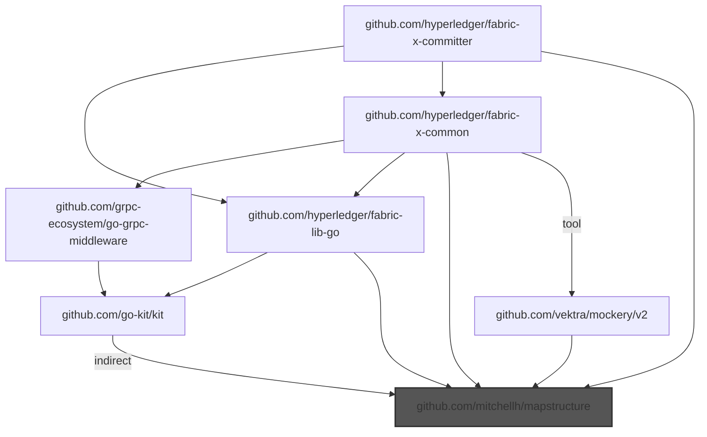
  - 🎯 Blamed: `github.com/hyperledger/fabric-lib-go`

    - `github.com/hyperledger/fabric-lib-go` -> `github.com/mitchellh/mapstructure`
    - ... and 1 more

  - 🎯 Blamed: `github.com/hyperledger/fabric-x-common`

    - `github.com/hyperledger/fabric-x-common` -> `github.com/mitchellh/mapstructure`
    - ... and 4 more

  - 🎯 Blamed: `github.com/mitchellh/mapstructure`

    - `github.com/mitchellh/mapstructure`

- **📦 github.com/munnerz/goautoneg**

  Root to pkg: `github.com/prometheus/client_golang` -> `github.com/prometheus/common` -> `github.com/munnerz/goautoneg`

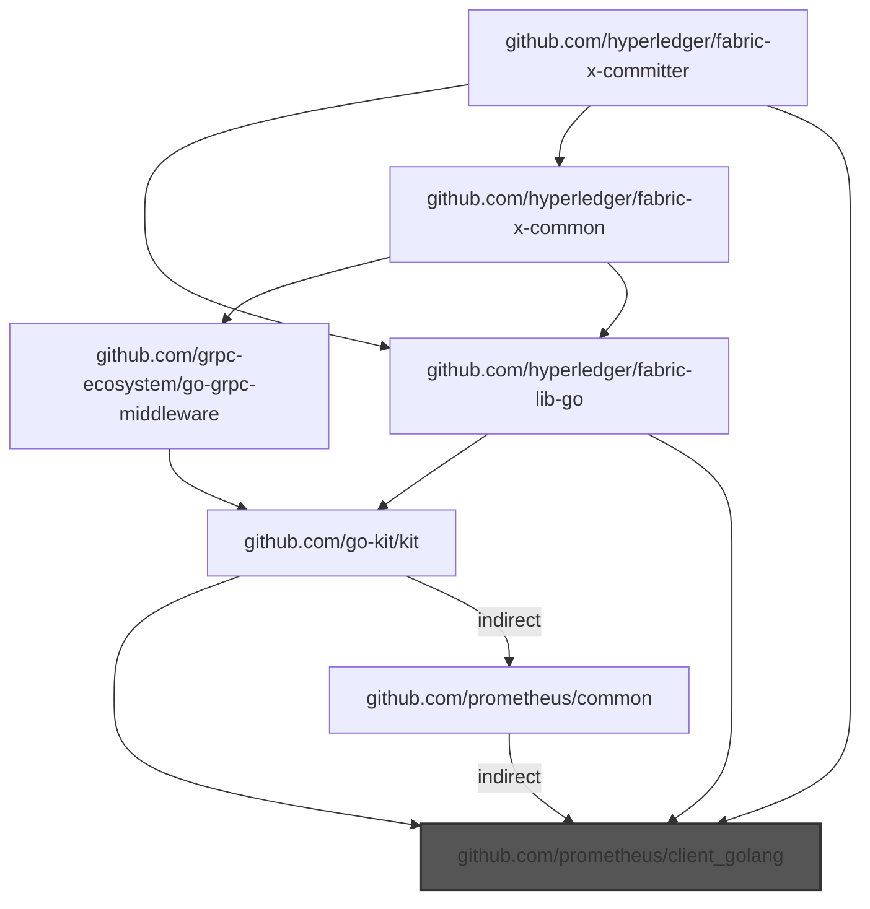
  - 🎯 Blamed: `github.com/hyperledger/fabric-lib-go`

    - `github.com/hyperledger/fabric-lib-go` -> `github.com/prometheus/client_golang`
    - ... and 2 more

  - 🎯 Blamed: `github.com/hyperledger/fabric-x-common`

    - `github.com/hyperledger/fabric-x-common` -> `github.com/hyperledger/fabric-lib-go` -> `github.com/prometheus/client_golang`
    - ... and 4 more

  - 🎯 Blamed: `github.com/prometheus/client_golang`

    - `github.com/prometheus/client_golang`

- **📦 github.com/pmezard/go-difflib**

```mermaid
graph TD
    cloud.google.com/go --> github.com/googleapis/gax-go/v2
    cloud.google.com/go --> go.opentelemetry.io/otel
    cloud.google.com/go --> go.opentelemetry.io/otel/sdk
    cloud.google.com/go --> go.opentelemetry.io/otel/trace
    cloud.google.com/go --> google.golang.org/api
    cloud.google.com/go --> google.golang.org/grpc
    cloud.google.com/go -->|indirect| github.com/cncf/xds/go
    cloud.google.com/go/auth --> github.com/google/s2a-go
    cloud.google.com/go/auth --> github.com/googleapis/gax-go/v2
    cloud.google.com/go/auth --> go.opentelemetry.io/contrib/instrumentation/google.golang.org/grpc/otelgrpc
    cloud.google.com/go/auth --> go.opentelemetry.io/contrib/instrumentation/net/http/otelhttp
    cloud.google.com/go/auth --> go.opentelemetry.io/otel
    cloud.google.com/go/auth --> go.opentelemetry.io/otel/sdk
    cloud.google.com/go/auth --> go.opentelemetry.io/otel/trace
    cloud.google.com/go/auth --> google.golang.org/grpc
    cloud.google.com/go/auth/oauth2adapt --> cloud.google.com/go/auth
    cloud.google.com/go/iam --> cloud.google.com/go
    cloud.google.com/go/iam --> cloud.google.com/go/longrunning
    cloud.google.com/go/iam --> github.com/googleapis/gax-go/v2
    cloud.google.com/go/iam --> google.golang.org/api
    cloud.google.com/go/iam --> google.golang.org/genproto
    cloud.google.com/go/iam --> google.golang.org/genproto/googleapis/api
    cloud.google.com/go/iam --> google.golang.org/grpc
    cloud.google.com/go/longrunning --> cloud.google.com/go
    cloud.google.com/go/longrunning --> github.com/googleapis/gax-go/v2
    cloud.google.com/go/longrunning --> google.golang.org/api
    cloud.google.com/go/longrunning --> google.golang.org/genproto
    cloud.google.com/go/longrunning --> google.golang.org/genproto/googleapis/api
    cloud.google.com/go/longrunning --> google.golang.org/grpc
    github.com/GoogleCloudPlatform/opentelemetry-operations-go/detectors/gcp --> github.com/stretchr/testify
    github.com/IBM/idemix --> github.com/IBM/idemix/bccsp/schemes/aries
    github.com/IBM/idemix --> github.com/IBM/idemix/bccsp/schemes/weak-bb
    github.com/IBM/idemix --> github.com/IBM/idemix/bccsp/types
    github.com/IBM/idemix --> github.com/IBM/mathlib
    github.com/IBM/idemix --> github.com/alecthomas/kingpin/v2
    github.com/IBM/idemix --> github.com/hyperledger/aries-bbs-go
    github.com/IBM/idemix --> github.com/hyperledger/fabric-protos-go-apiv2
    github.com/IBM/idemix --> github.com/onsi/ginkgo/v2
    github.com/IBM/idemix --> github.com/onsi/gomega
    github.com/IBM/idemix --> github.com/stretchr/testify
    github.com/IBM/idemix --> github.com/sykesm/zap-logfmt
    github.com/IBM/idemix --> go.uber.org/zap
    github.com/IBM/idemix --> google.golang.org/grpc
    github.com/IBM/idemix -->|indirect| github.com/go-task/slim-sprig
    github.com/IBM/idemix/bccsp/schemes/aries --> github.com/IBM/idemix/bccsp/schemes/weak-bb
    github.com/IBM/idemix/bccsp/schemes/aries --> github.com/IBM/idemix/bccsp/types
    github.com/IBM/idemix/bccsp/schemes/aries --> github.com/IBM/mathlib
    github.com/IBM/idemix/bccsp/schemes/aries --> github.com/hyperledger/aries-bbs-go
    github.com/IBM/idemix/bccsp/schemes/aries --> github.com/stretchr/testify
    github.com/IBM/idemix/bccsp/schemes/weak-bb --> github.com/IBM/mathlib
    github.com/IBM/idemix/bccsp/types --> github.com/IBM/mathlib
    github.com/IBM/mathlib --> github.com/consensys/gnark-crypto
    github.com/IBM/mathlib --> github.com/stretchr/testify
    github.com/Kunde21/markdownfmt/v3 --> github.com/stretchr/testify
    github.com/Microsoft/go-winio --> github.com/sirupsen/logrus
    github.com/alecthomas/kingpin/v2 --> github.com/alecthomas/units
    github.com/alecthomas/kingpin/v2 --> github.com/stretchr/testify
    github.com/alecthomas/units --> github.com/stretchr/testify
    github.com/bufbuild/protocompile --> github.com/stretchr/testify
    github.com/chigopher/pathlib --> github.com/stretchr/testify
    github.com/cncf/xds/go --> google.golang.org/genproto/googleapis/api
    github.com/cncf/xds/go --> google.golang.org/grpc
    github.com/cockroachdb/datadriven --> github.com/pmezard/go-difflib
    github.com/cockroachdb/errors --> github.com/cockroachdb/datadriven
    github.com/cockroachdb/errors --> github.com/getsentry/sentry-go
    github.com/cockroachdb/errors --> github.com/gogo/status
    github.com/cockroachdb/errors --> github.com/stretchr/testify
    github.com/cockroachdb/errors --> google.golang.org/grpc
    github.com/consensys/gnark-crypto --> github.com/stretchr/testify
    github.com/containerd/errdefs/pkg --> google.golang.org/grpc
    github.com/containerd/log --> github.com/sirupsen/logrus
    github.com/docker/go-connections --> github.com/Microsoft/go-winio
    github.com/envoyproxy/go-control-plane --> github.com/envoyproxy/go-control-plane/envoy
    github.com/envoyproxy/go-control-plane --> github.com/envoyproxy/go-control-plane/ratelimit
    github.com/envoyproxy/go-control-plane --> github.com/stretchr/testify
    github.com/envoyproxy/go-control-plane --> go.uber.org/goleak
    github.com/envoyproxy/go-control-plane --> google.golang.org/grpc
    github.com/envoyproxy/go-control-plane -->|indirect| google.golang.org/genproto/googleapis/api
    github.com/envoyproxy/go-control-plane/envoy --> github.com/cncf/xds/go
    github.com/envoyproxy/go-control-plane/envoy --> github.com/envoyproxy/go-control-plane
    github.com/envoyproxy/go-control-plane/envoy --> github.com/planetscale/vtprotobuf
    github.com/envoyproxy/go-control-plane/envoy --> go.opentelemetry.io/proto/otlp
    github.com/envoyproxy/go-control-plane/envoy --> google.golang.org/genproto/googleapis/api
    github.com/envoyproxy/go-control-plane/envoy --> google.golang.org/grpc
    github.com/envoyproxy/go-control-plane/ratelimit --> github.com/envoyproxy/go-control-plane/envoy
    github.com/envoyproxy/go-control-plane/ratelimit --> google.golang.org/grpc
    github.com/envoyproxy/go-control-plane/ratelimit -->|indirect| github.com/cncf/xds/go
    github.com/fsouza/go-dockerclient --> github.com/Microsoft/go-winio
    github.com/fsouza/go-dockerclient --> github.com/moby/go-archive
    github.com/fsouza/go-dockerclient --> github.com/moby/moby/client
    github.com/gavv/httpexpect/v2 --> github.com/sanity-io/litter
    github.com/gavv/httpexpect/v2 --> github.com/stretchr/testify
    github.com/gavv/httpexpect/v2 --> github.com/xeipuuv/gojsonschema
    github.com/gavv/httpexpect/v2 -->|indirect| github.com/onsi/ginkgo
    github.com/gavv/httpexpect/v2 -->|indirect| github.com/onsi/gomega
    github.com/gavv/httpexpect/v2 -->|indirect| github.com/sergi/go-diff
    github.com/getsentry/sentry-go --> github.com/stretchr/testify
    github.com/getsentry/sentry-go --> go.uber.org/goleak
    github.com/go-kit/kit --> github.com/prometheus/client_golang
    github.com/go-kit/kit --> github.com/sirupsen/logrus
    github.com/go-kit/kit --> go.uber.org/zap
    github.com/go-kit/kit --> google.golang.org/grpc
    github.com/go-kit/kit -->|indirect| go.uber.org/atomic
    github.com/go-kit/kit -->|indirect| google.golang.org/genproto
    github.com/go-playground/validator/v10 --> github.com/leodido/go-urn
    github.com/go-task/slim-sprig --> github.com/stretchr/testify
    github.com/go-task/slim-sprig/v3 --> github.com/stretchr/testify
    github.com/gogo/status --> google.golang.org/genproto
    github.com/gogo/status --> google.golang.org/grpc
    github.com/google/s2a-go --> google.golang.org/api
    github.com/google/s2a-go --> google.golang.org/grpc
    github.com/googleapis/api-linter/v2 --> cloud.google.com/go/iam
    github.com/googleapis/api-linter/v2 --> cloud.google.com/go/longrunning
    github.com/googleapis/api-linter/v2 --> github.com/bufbuild/protocompile
    github.com/googleapis/api-linter/v2 --> github.com/stoewer/go-strcase
    github.com/googleapis/api-linter/v2 --> google.golang.org/genproto
    github.com/googleapis/api-linter/v2 --> google.golang.org/genproto/googleapis/api
    github.com/googleapis/gax-go/v2 --> go.opentelemetry.io/otel
    github.com/googleapis/gax-go/v2 --> go.opentelemetry.io/otel/metric
    github.com/googleapis/gax-go/v2 --> go.opentelemetry.io/otel/sdk/metric
    github.com/googleapis/gax-go/v2 --> google.golang.org/api
    github.com/googleapis/gax-go/v2 --> google.golang.org/genproto
    github.com/googleapis/gax-go/v2 --> google.golang.org/genproto/googleapis/api
    github.com/googleapis/gax-go/v2 --> google.golang.org/grpc
    github.com/grpc-ecosystem/go-grpc-middleware --> github.com/go-kit/kit
    github.com/grpc-ecosystem/go-grpc-middleware --> github.com/sirupsen/logrus
    github.com/grpc-ecosystem/go-grpc-middleware --> github.com/stretchr/testify
    github.com/grpc-ecosystem/go-grpc-middleware --> go.uber.org/zap
    github.com/grpc-ecosystem/go-grpc-middleware --> google.golang.org/grpc
    github.com/grpc-ecosystem/grpc-gateway/v2 --> google.golang.org/genproto/googleapis/api
    github.com/grpc-ecosystem/grpc-gateway/v2 --> google.golang.org/grpc
    github.com/hyperledger-labs/SmartBFT --> github.com/stretchr/testify
    github.com/hyperledger-labs/SmartBFT --> go.uber.org/zap
    github.com/hyperledger/aries-bbs-go --> github.com/IBM/mathlib
    github.com/hyperledger/aries-bbs-go --> github.com/stretchr/testify
    github.com/hyperledger/fabric-lib-go --> github.com/go-kit/kit
    github.com/hyperledger/fabric-lib-go --> github.com/onsi/ginkgo/v2
    github.com/hyperledger/fabric-lib-go --> github.com/onsi/gomega
    github.com/hyperledger/fabric-lib-go --> github.com/prometheus/client_golang
    github.com/hyperledger/fabric-lib-go --> github.com/spf13/viper
    github.com/hyperledger/fabric-lib-go --> github.com/stretchr/testify
    github.com/hyperledger/fabric-lib-go --> github.com/sykesm/zap-logfmt
    github.com/hyperledger/fabric-lib-go --> go.uber.org/zap
    github.com/hyperledger/fabric-lib-go --> google.golang.org/grpc
    github.com/hyperledger/fabric-lib-go -->|indirect| github.com/spf13/jwalterweatherman
    github.com/hyperledger/fabric-protos-go-apiv2 --> google.golang.org/grpc
    github.com/hyperledger/fabric-x-committer --> github.com/cockroachdb/errors
    github.com/hyperledger/fabric-x-committer --> github.com/consensys/gnark-crypto
    github.com/hyperledger/fabric-x-committer --> github.com/docker/go-connections
    github.com/hyperledger/fabric-x-committer --> github.com/fsouza/go-dockerclient
    github.com/hyperledger/fabric-x-committer --> github.com/gavv/httpexpect/v2
    github.com/hyperledger/fabric-x-committer --> github.com/go-playground/validator/v10
    github.com/hyperledger/fabric-x-committer --> github.com/go-task/slim-sprig/v3
    github.com/hyperledger/fabric-x-committer --> github.com/grpc-ecosystem/grpc-gateway/v2
    github.com/hyperledger/fabric-x-committer --> github.com/hyperledger/fabric-lib-go
    github.com/hyperledger/fabric-x-committer --> github.com/hyperledger/fabric-protos-go-apiv2
    github.com/hyperledger/fabric-x-committer --> github.com/hyperledger/fabric-x-common
    github.com/hyperledger/fabric-x-committer --> github.com/jackc/puddle/v2
    github.com/hyperledger/fabric-x-committer --> github.com/prometheus/client_golang
    github.com/hyperledger/fabric-x-committer --> github.com/spf13/viper
    github.com/hyperledger/fabric-x-committer --> github.com/stretchr/testify
    github.com/hyperledger/fabric-x-committer --> github.com/yugabyte/pgx/v5
    github.com/hyperledger/fabric-x-committer --> go.uber.org/mock
    github.com/hyperledger/fabric-x-committer --> go.uber.org/zap
    github.com/hyperledger/fabric-x-committer --> google.golang.org/genproto/googleapis/api
    github.com/hyperledger/fabric-x-committer --> google.golang.org/grpc
    github.com/hyperledger/fabric-x-committer -->|indirect| github.com/jackc/pgx/v5
    github.com/hyperledger/fabric-x-committer -->|indirect| go.opentelemetry.io/otel/exporters/otlp/otlptrace/otlptracehttp
    github.com/hyperledger/fabric-x-committer -->|tool| github.com/Kunde21/markdownfmt/v3
    github.com/hyperledger/fabric-x-committer -->|tool| github.com/googleapis/api-linter/v2
    github.com/hyperledger/fabric-x-committer -->|tool| google.golang.org/grpc/cmd/protoc-gen-go-grpc
    github.com/hyperledger/fabric-x-common --> github.com/IBM/idemix
    github.com/hyperledger/fabric-x-common --> github.com/alecthomas/kingpin/v2
    github.com/hyperledger/fabric-x-common --> github.com/cockroachdb/errors
    github.com/hyperledger/fabric-x-common --> github.com/grpc-ecosystem/go-grpc-middleware
    github.com/hyperledger/fabric-x-common --> github.com/hyperledger-labs/SmartBFT
    github.com/hyperledger/fabric-x-common --> github.com/hyperledger/fabric-lib-go
    github.com/hyperledger/fabric-x-common --> github.com/hyperledger/fabric-protos-go-apiv2
    github.com/hyperledger/fabric-x-common --> github.com/onsi/ginkgo/v2
    github.com/hyperledger/fabric-x-common --> github.com/onsi/gomega
    github.com/hyperledger/fabric-x-common --> github.com/spf13/viper
    github.com/hyperledger/fabric-x-common --> github.com/stretchr/testify
    github.com/hyperledger/fabric-x-common --> github.com/syndtr/goleveldb
    github.com/hyperledger/fabric-x-common --> go.uber.org/zap
    github.com/hyperledger/fabric-x-common --> google.golang.org/grpc
    github.com/hyperledger/fabric-x-common -->|tool| github.com/googleapis/api-linter/v2
    github.com/hyperledger/fabric-x-common -->|tool| github.com/maxbrunsfeld/counterfeiter/v6
    github.com/hyperledger/fabric-x-common -->|tool| github.com/vektra/mockery/v2
    github.com/hyperledger/fabric-x-common -->|tool| google.golang.org/grpc/cmd/protoc-gen-go-grpc
    github.com/jackc/pgpassfile --> github.com/stretchr/testify
    github.com/jackc/pgservicefile --> github.com/stretchr/testify
    github.com/jackc/pgx/v5 --> github.com/jackc/pgpassfile
    github.com/jackc/pgx/v5 --> github.com/jackc/pgservicefile
    github.com/jackc/pgx/v5 --> github.com/jackc/puddle/v2
    github.com/jackc/pgx/v5 --> github.com/stretchr/testify
    github.com/jackc/puddle/v2 --> github.com/stretchr/testify
    github.com/json-iterator/go --> github.com/stretchr/testify
    github.com/leodido/go-urn --> github.com/stretchr/testify
    github.com/maxbrunsfeld/counterfeiter/v6 --> github.com/onsi/gomega
    github.com/moby/go-archive --> github.com/containerd/log
    github.com/moby/moby/client --> github.com/Microsoft/go-winio
    github.com/moby/moby/client --> github.com/containerd/errdefs/pkg
    github.com/moby/moby/client --> github.com/docker/go-connections
    github.com/moby/moby/client --> go.opentelemetry.io/contrib/instrumentation/net/http/otelhttp
    github.com/moby/moby/client --> go.opentelemetry.io/otel/trace
    github.com/onsi/ginkgo --> github.com/go-task/slim-sprig
    github.com/onsi/ginkgo --> github.com/onsi/gomega
    github.com/onsi/ginkgo/v2 --> github.com/go-task/slim-sprig/v3
    github.com/onsi/ginkgo/v2 --> github.com/onsi/gomega
    github.com/onsi/gomega --> github.com/onsi/ginkgo/v2
    github.com/planetscale/vtprotobuf --> github.com/stretchr/testify
    github.com/planetscale/vtprotobuf --> google.golang.org/grpc
    github.com/prometheus/client_golang --> github.com/json-iterator/go
    github.com/prometheus/client_golang --> github.com/prometheus/common
    github.com/prometheus/client_golang --> go.uber.org/goleak
    github.com/prometheus/common --> github.com/alecthomas/kingpin/v2
    github.com/prometheus/common --> github.com/stretchr/testify
    github.com/prometheus/common -->|indirect| github.com/prometheus/client_golang
    github.com/sanity-io/litter --> github.com/stretchr/testify
    github.com/sergi/go-diff --> github.com/stretchr/testify
    github.com/sirupsen/logrus --> github.com/stretchr/testify
    github.com/sourcegraph/conc --> github.com/stretchr/testify
    github.com/spf13/jwalterweatherman --> github.com/stretchr/testify
    github.com/spf13/viper --> github.com/stretchr/testify
    github.com/spf13/viper --> github.com/subosito/gotenv
    github.com/spf13/viper -->|indirect| github.com/sourcegraph/conc
    github.com/spiffe/go-spiffe/v2 --> github.com/Microsoft/go-winio
    github.com/spiffe/go-spiffe/v2 --> github.com/stretchr/testify
    github.com/spiffe/go-spiffe/v2 --> google.golang.org/grpc
    github.com/stoewer/go-strcase --> github.com/stretchr/testify
    github.com/stretchr/objx --> github.com/stretchr/testify
    github.com/stretchr/testify --> github.com/pmezard/go-difflib
    github.com/stretchr/testify --> github.com/stretchr/objx
    github.com/subosito/gotenv --> github.com/stretchr/testify
    github.com/sykesm/zap-logfmt --> github.com/stretchr/testify
    github.com/sykesm/zap-logfmt --> go.uber.org/zap
    github.com/syndtr/goleveldb --> github.com/onsi/ginkgo
    github.com/syndtr/goleveldb --> github.com/onsi/gomega
    github.com/syndtr/goleveldb --> github.com/stretchr/testify
    github.com/vektra/mockery/v2 --> github.com/chigopher/pathlib
    github.com/vektra/mockery/v2 --> github.com/spf13/viper
    github.com/vektra/mockery/v2 --> github.com/stretchr/testify
    github.com/vektra/mockery/v2 -->|indirect| go.uber.org/multierr
    github.com/xeipuuv/gojsonschema --> github.com/stretchr/testify
    github.com/yugabyte/pgx/v5 --> github.com/jackc/pgpassfile
    github.com/yugabyte/pgx/v5 --> github.com/jackc/pgservicefile
    github.com/yugabyte/pgx/v5 --> github.com/jackc/puddle/v2
    github.com/yugabyte/pgx/v5 --> github.com/stretchr/testify
    go.opentelemetry.io/auto/sdk --> github.com/stretchr/testify
    go.opentelemetry.io/auto/sdk --> go.opentelemetry.io/otel
    go.opentelemetry.io/auto/sdk --> go.opentelemetry.io/otel/trace
    go.opentelemetry.io/contrib/detectors/gcp --> github.com/GoogleCloudPlatform/opentelemetry-operations-go/detectors/gcp
    go.opentelemetry.io/contrib/detectors/gcp --> github.com/stretchr/testify
    go.opentelemetry.io/contrib/detectors/gcp --> go.opentelemetry.io/otel
    go.opentelemetry.io/contrib/detectors/gcp --> go.opentelemetry.io/otel/sdk
    go.opentelemetry.io/contrib/instrumentation/google.golang.org/grpc/otelgrpc --> github.com/stretchr/testify
    go.opentelemetry.io/contrib/instrumentation/google.golang.org/grpc/otelgrpc --> go.opentelemetry.io/otel
    go.opentelemetry.io/contrib/instrumentation/google.golang.org/grpc/otelgrpc --> go.opentelemetry.io/otel/metric
    go.opentelemetry.io/contrib/instrumentation/google.golang.org/grpc/otelgrpc --> go.opentelemetry.io/otel/sdk
    go.opentelemetry.io/contrib/instrumentation/google.golang.org/grpc/otelgrpc --> go.opentelemetry.io/otel/trace
    go.opentelemetry.io/contrib/instrumentation/google.golang.org/grpc/otelgrpc --> google.golang.org/grpc
    go.opentelemetry.io/contrib/instrumentation/net/http/otelhttp --> github.com/stretchr/testify
    go.opentelemetry.io/contrib/instrumentation/net/http/otelhttp --> go.opentelemetry.io/otel
    go.opentelemetry.io/contrib/instrumentation/net/http/otelhttp --> go.opentelemetry.io/otel/metric
    go.opentelemetry.io/contrib/instrumentation/net/http/otelhttp --> go.opentelemetry.io/otel/sdk
    go.opentelemetry.io/contrib/instrumentation/net/http/otelhttp --> go.opentelemetry.io/otel/sdk/metric
    go.opentelemetry.io/contrib/instrumentation/net/http/otelhttp --> go.opentelemetry.io/otel/trace
    go.opentelemetry.io/otel --> github.com/stretchr/testify
    go.opentelemetry.io/otel --> go.opentelemetry.io/auto/sdk
    go.opentelemetry.io/otel --> go.opentelemetry.io/otel/metric
    go.opentelemetry.io/otel --> go.opentelemetry.io/otel/trace
    go.opentelemetry.io/otel/exporters/otlp/otlptrace --> github.com/stretchr/testify
    go.opentelemetry.io/otel/exporters/otlp/otlptrace --> go.opentelemetry.io/otel
    go.opentelemetry.io/otel/exporters/otlp/otlptrace --> go.opentelemetry.io/otel/sdk
    go.opentelemetry.io/otel/exporters/otlp/otlptrace --> go.opentelemetry.io/otel/trace
    go.opentelemetry.io/otel/exporters/otlp/otlptrace --> go.opentelemetry.io/proto/otlp
    go.opentelemetry.io/otel/exporters/otlp/otlptrace/otlptracehttp --> github.com/stretchr/testify
    go.opentelemetry.io/otel/exporters/otlp/otlptrace/otlptracehttp --> go.opentelemetry.io/otel
    go.opentelemetry.io/otel/exporters/otlp/otlptrace/otlptracehttp --> go.opentelemetry.io/otel/exporters/otlp/otlptrace
    go.opentelemetry.io/otel/exporters/otlp/otlptrace/otlptracehttp --> go.opentelemetry.io/otel/metric
    go.opentelemetry.io/otel/exporters/otlp/otlptrace/otlptracehttp --> go.opentelemetry.io/otel/sdk
    go.opentelemetry.io/otel/exporters/otlp/otlptrace/otlptracehttp --> go.opentelemetry.io/otel/sdk/metric
    go.opentelemetry.io/otel/exporters/otlp/otlptrace/otlptracehttp --> go.opentelemetry.io/otel/trace
    go.opentelemetry.io/otel/exporters/otlp/otlptrace/otlptracehttp --> go.opentelemetry.io/proto/otlp
    go.opentelemetry.io/otel/exporters/otlp/otlptrace/otlptracehttp --> google.golang.org/grpc
    go.opentelemetry.io/otel/metric --> github.com/stretchr/testify
    go.opentelemetry.io/otel/metric --> go.opentelemetry.io/otel
    go.opentelemetry.io/otel/sdk --> github.com/stretchr/testify
    go.opentelemetry.io/otel/sdk --> go.opentelemetry.io/otel
    go.opentelemetry.io/otel/sdk --> go.opentelemetry.io/otel/metric
    go.opentelemetry.io/otel/sdk --> go.opentelemetry.io/otel/sdk/metric
    go.opentelemetry.io/otel/sdk --> go.opentelemetry.io/otel/trace
    go.opentelemetry.io/otel/sdk --> go.uber.org/goleak
    go.opentelemetry.io/otel/sdk/metric --> github.com/stretchr/testify
    go.opentelemetry.io/otel/sdk/metric --> go.opentelemetry.io/otel
    go.opentelemetry.io/otel/sdk/metric --> go.opentelemetry.io/otel/metric
    go.opentelemetry.io/otel/sdk/metric --> go.opentelemetry.io/otel/sdk
    go.opentelemetry.io/otel/sdk/metric --> go.opentelemetry.io/otel/trace
    go.opentelemetry.io/otel/trace --> github.com/stretchr/testify
    go.opentelemetry.io/otel/trace --> go.opentelemetry.io/otel
    go.opentelemetry.io/proto/otlp --> github.com/grpc-ecosystem/grpc-gateway/v2
    go.opentelemetry.io/proto/otlp --> google.golang.org/grpc
    go.uber.org/atomic --> github.com/stretchr/testify
    go.uber.org/goleak --> github.com/stretchr/testify
    go.uber.org/mock --> github.com/stretchr/testify
    go.uber.org/multierr --> github.com/stretchr/testify
    go.uber.org/zap --> github.com/stretchr/testify
    go.uber.org/zap --> go.uber.org/goleak
    go.uber.org/zap --> go.uber.org/multierr
    gonum.org/v1/gonum -->|indirect| github.com/pmezard/go-difflib
    google.golang.org/api --> cloud.google.com/go/auth
    google.golang.org/api --> cloud.google.com/go/auth/oauth2adapt
    google.golang.org/api --> github.com/google/s2a-go
    google.golang.org/api --> github.com/googleapis/gax-go/v2
    google.golang.org/api --> go.opentelemetry.io/contrib/instrumentation/google.golang.org/grpc/otelgrpc
    google.golang.org/api --> go.opentelemetry.io/contrib/instrumentation/net/http/otelhttp
    google.golang.org/api --> google.golang.org/grpc
    google.golang.org/genproto --> cloud.google.com/go/iam
    google.golang.org/genproto --> cloud.google.com/go/longrunning
    google.golang.org/genproto --> google.golang.org/genproto/googleapis/api
    google.golang.org/genproto --> google.golang.org/grpc
    google.golang.org/genproto/googleapis/api --> google.golang.org/grpc
    google.golang.org/grpc --> github.com/envoyproxy/go-control-plane
    google.golang.org/grpc --> github.com/envoyproxy/go-control-plane/envoy
    google.golang.org/grpc --> github.com/spiffe/go-spiffe/v2
    google.golang.org/grpc --> go.opentelemetry.io/contrib/detectors/gcp
    google.golang.org/grpc --> go.opentelemetry.io/otel
    google.golang.org/grpc --> go.opentelemetry.io/otel/metric
    google.golang.org/grpc --> go.opentelemetry.io/otel/sdk
    google.golang.org/grpc --> go.opentelemetry.io/otel/sdk/metric
    google.golang.org/grpc --> go.opentelemetry.io/otel/trace
    google.golang.org/grpc --> gonum.org/v1/gonum
    google.golang.org/grpc/cmd/protoc-gen-go-grpc --> google.golang.org/grpc
    style github.com/pmezard/go-difflib fill:#555,stroke:#333,stroke-width:2px
    style github.com/stretchr/testify fill:#777
    style gonum.org/v1/gonum fill:#777
    style github.com/cockroachdb/datadriven fill:#777
```
  - Choke: github.com/stretchr/testify

    Root to choke:
    - - `github.com/hyperledger/fabric-x-committer` -> `github.com/stretchr/testify`
    - - ... and 145573 more

    Root from choke:
    - - `github.com/stretchr/testify` -> `github.com/pmezard/go-difflib`
    - - ... and 145573 more
  - Choke: gonum.org/v1/gonum

    Root to choke:
    - - `github.com/hyperledger/fabric-x-committer` -> `google.golang.org/grpc` -> `gonum.org/v1/gonum`
    - - ... and 2108 more

    Root from choke:
    - - `gonum.org/v1/gonum` *(indirect)* -> `github.com/pmezard/go-difflib`
    - - ... and 2108 more
  - Choke: github.com/cockroachdb/datadriven

    Root to choke:
    - - `github.com/hyperledger/fabric-x-committer` -> `github.com/cockroachdb/errors` -> `github.com/cockroachdb/datadriven`
    - - ... and 1 more

    Root from choke:
    - - `github.com/cockroachdb/datadriven` -> `github.com/pmezard/go-difflib`
    - - ... and 1 more
  - 🎯 Blamed: `github.com/Kunde21/markdownfmt/v3`

    - `github.com/Kunde21/markdownfmt/v3` -> `github.com/stretchr/testify` -> `github.com/pmezard/go-difflib`
    - ... and 1 more

  - 🎯 Blamed: `github.com/cockroachdb/errors`

    - `github.com/cockroachdb/errors` -> `github.com/cockroachdb/datadriven` -> `github.com/pmezard/go-difflib`
    - ... and 13949 more

  - 🎯 Blamed: `github.com/consensys/gnark-crypto`

    - `github.com/consensys/gnark-crypto` -> `github.com/stretchr/testify` -> `github.com/pmezard/go-difflib`
    - ... and 1 more

  - 🎯 Blamed: `github.com/docker/go-connections`

    - `github.com/docker/go-connections` -> `github.com/Microsoft/go-winio` -> `github.com/sirupsen/logrus` -> `github.com/stretchr/testify` -> `github.com/pmezard/go-difflib`
    - ... and 1 more

  - 🎯 Blamed: `github.com/fsouza/go-dockerclient`

    - `github.com/fsouza/go-dockerclient` -> `github.com/Microsoft/go-winio` -> `github.com/sirupsen/logrus` -> `github.com/stretchr/testify` -> `github.com/pmezard/go-difflib`
    - ... and 717 more

  - 🎯 Blamed: `github.com/gavv/httpexpect/v2`

    - `github.com/gavv/httpexpect/v2` -> `github.com/stretchr/testify` -> `github.com/pmezard/go-difflib`
    - ... and 13 more

  - 🎯 Blamed: `github.com/go-playground/validator/v10`

    - `github.com/go-playground/validator/v10` -> `github.com/leodido/go-urn` -> `github.com/stretchr/testify` -> `github.com/pmezard/go-difflib`
    - ... and 1 more

  - 🎯 Blamed: `github.com/go-task/slim-sprig/v3`

    - `github.com/go-task/slim-sprig/v3` -> `github.com/stretchr/testify` -> `github.com/pmezard/go-difflib`
    - ... and 1 more

  - 🎯 Blamed: `github.com/googleapis/api-linter/v2`

    - `github.com/googleapis/api-linter/v2` -> `github.com/bufbuild/protocompile` -> `github.com/stretchr/testify` -> `github.com/pmezard/go-difflib`
    - ... and 80369 more

  - 🎯 Blamed: `github.com/grpc-ecosystem/grpc-gateway/v2`

    - `github.com/grpc-ecosystem/grpc-gateway/v2` -> `google.golang.org/grpc` -> `gonum.org/v1/gonum` *(indirect)* -> `github.com/pmezard/go-difflib`
    - ... and 688 more

  - 🎯 Blamed: `github.com/hyperledger/fabric-lib-go`

    - `github.com/hyperledger/fabric-lib-go` -> `github.com/stretchr/testify` -> `github.com/pmezard/go-difflib`
    - ... and 4909 more

  - 🎯 Blamed: `github.com/hyperledger/fabric-protos-go-apiv2`

    - `github.com/hyperledger/fabric-protos-go-apiv2` -> `google.golang.org/grpc` -> `gonum.org/v1/gonum` *(indirect)* -> `github.com/pmezard/go-difflib`
    - ... and 389 more

  - 🎯 Blamed: `github.com/hyperledger/fabric-x-common`

    - `github.com/hyperledger/fabric-x-common` -> `github.com/stretchr/testify` -> `github.com/pmezard/go-difflib`
    - ... and 43238 more

  - 🎯 Blamed: `github.com/jackc/puddle/v2`

    - `github.com/jackc/puddle/v2` -> `github.com/stretchr/testify` -> `github.com/pmezard/go-difflib`
    - ... and 1 more

  - 🎯 Blamed: `github.com/prometheus/client_golang`

    - `github.com/prometheus/client_golang` -> `github.com/json-iterator/go` -> `github.com/stretchr/testify` -> `github.com/pmezard/go-difflib`
    - ... and 13 more

  - 🎯 Blamed: `github.com/spf13/viper`

    - `github.com/spf13/viper` -> `github.com/stretchr/testify` -> `github.com/pmezard/go-difflib`
    - ... and 5 more

  - 🎯 Blamed: `github.com/stretchr/testify`

    - `github.com/stretchr/testify` -> `github.com/pmezard/go-difflib`
    - ... and 1 more

  - 🎯 Blamed: `github.com/yugabyte/pgx/v5`

    - `github.com/yugabyte/pgx/v5` -> `github.com/stretchr/testify` -> `github.com/pmezard/go-difflib`
    - ... and 7 more

  - 🎯 Blamed: `go.uber.org/mock`

    - `go.uber.org/mock` -> `github.com/stretchr/testify` -> `github.com/pmezard/go-difflib`
    - ... and 1 more

  - 🎯 Blamed: `go.uber.org/zap`

    - `go.uber.org/zap` -> `github.com/stretchr/testify` -> `github.com/pmezard/go-difflib`
    - ... and 5 more

  - 🎯 Blamed: `google.golang.org/genproto/googleapis/api`

    - `google.golang.org/genproto/googleapis/api` -> `google.golang.org/grpc` -> `gonum.org/v1/gonum` *(indirect)* -> `github.com/pmezard/go-difflib`
    - ... and 389 more

  - 🎯 Blamed: `google.golang.org/grpc`

    - `google.golang.org/grpc` -> `gonum.org/v1/gonum` *(indirect)* -> `github.com/pmezard/go-difflib`
    - ... and 450 more

  - 🎯 Blamed: `google.golang.org/grpc/cmd/protoc-gen-go-grpc`

    - `google.golang.org/grpc/cmd/protoc-gen-go-grpc` -> `google.golang.org/grpc` -> `gonum.org/v1/gonum` *(indirect)* -> `github.com/pmezard/go-difflib`
    - ... and 389 more

- **📦 github.com/sykesm/zap-logfmt**

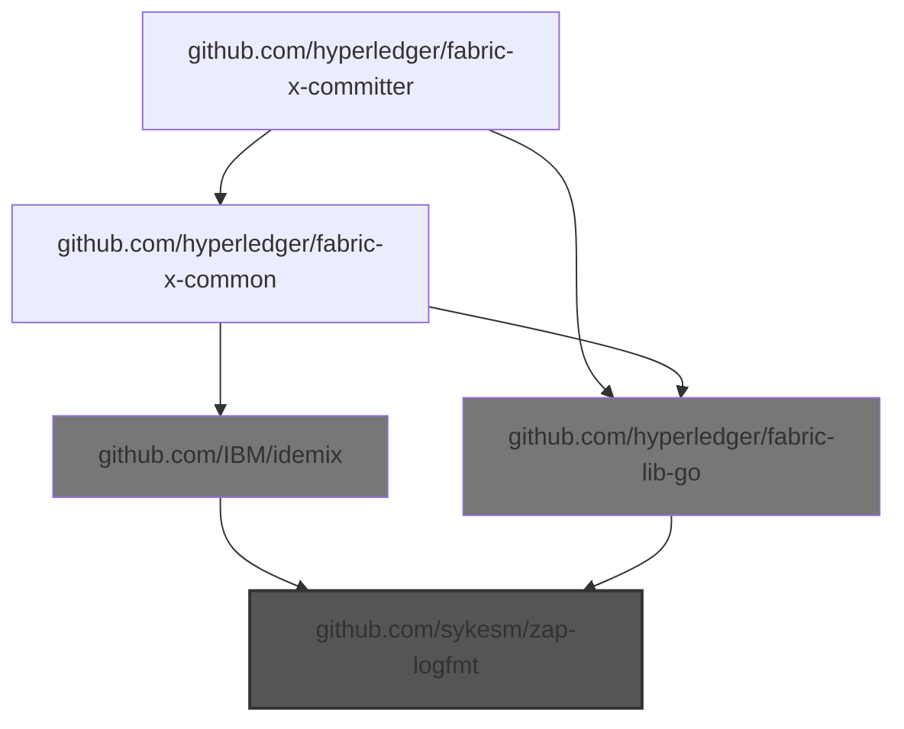
  - Choke: github.com/hyperledger/fabric-lib-go

    Root to choke:
    - - `github.com/hyperledger/fabric-x-committer` -> `github.com/hyperledger/fabric-lib-go`
    - - ... and 1 more

    Root from choke:
    - - `github.com/hyperledger/fabric-lib-go` -> `github.com/sykesm/zap-logfmt`
    - - ... and 1 more
  - Choke: github.com/IBM/idemix

    Root to choke:
    - - `github.com/hyperledger/fabric-x-committer` -> `github.com/hyperledger/fabric-x-common` -> `github.com/IBM/idemix`

    Root from choke:
    - - `github.com/IBM/idemix` -> `github.com/sykesm/zap-logfmt`
  - 🎯 Blamed: `github.com/hyperledger/fabric-lib-go`

    - `github.com/hyperledger/fabric-lib-go` -> `github.com/sykesm/zap-logfmt`

  - 🎯 Blamed: `github.com/hyperledger/fabric-x-common`

    - `github.com/hyperledger/fabric-x-common` -> `github.com/IBM/idemix` -> `github.com/sykesm/zap-logfmt`
    - ... and 1 more

- **📦 github.com/xeipuuv/gojsonpointer**

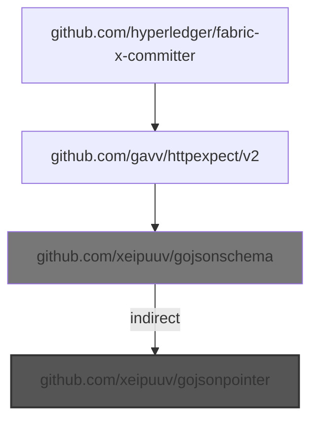
  - Choke: github.com/xeipuuv/gojsonschema

    Root to choke:
    - - `github.com/hyperledger/fabric-x-committer` -> `github.com/gavv/httpexpect/v2` -> `github.com/xeipuuv/gojsonschema`

    Root from choke:
    - - `github.com/xeipuuv/gojsonschema` *(indirect)* -> `github.com/xeipuuv/gojsonpointer`
  - 🎯 Blamed: `github.com/gavv/httpexpect/v2`

    - `github.com/gavv/httpexpect/v2` -> `github.com/xeipuuv/gojsonschema` *(indirect)* -> `github.com/xeipuuv/gojsonpointer`

- **📦 github.com/xeipuuv/gojsonreference**

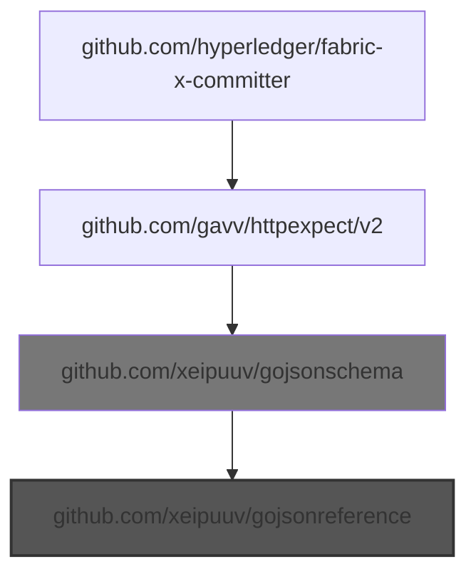
  - Choke: github.com/xeipuuv/gojsonschema

    Root to choke:
    - - `github.com/hyperledger/fabric-x-committer` -> `github.com/gavv/httpexpect/v2` -> `github.com/xeipuuv/gojsonschema`

    Root from choke:
    - - `github.com/xeipuuv/gojsonschema` -> `github.com/xeipuuv/gojsonreference`
  - 🎯 Blamed: `github.com/gavv/httpexpect/v2`

    - `github.com/gavv/httpexpect/v2` -> `github.com/xeipuuv/gojsonschema` -> `github.com/xeipuuv/gojsonreference`

- **📦 github.com/xeipuuv/gojsonschema**

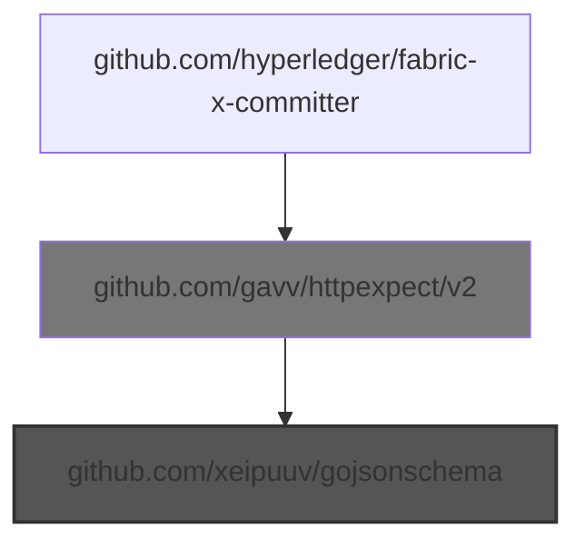
  - Choke: github.com/gavv/httpexpect/v2

    Root to choke:
    - - `github.com/hyperledger/fabric-x-committer` -> `github.com/gavv/httpexpect/v2`

    Root from choke:
    - - `github.com/gavv/httpexpect/v2` -> `github.com/xeipuuv/gojsonschema`
  - 🎯 Blamed: `github.com/gavv/httpexpect/v2`

    - `github.com/gavv/httpexpect/v2` -> `github.com/xeipuuv/gojsonschema`

---

## ⚠️ DIRECT UNMAINTAINED IMPORTS (2 found)

- **📦 github.com/mitchellh/mapstructure**

  **📝 Imported in your code at:**

  - `cmd/config/config_decoder.go:19`
  - `loadgen/workload/distributions_test.go:16`

- **📦 github.com/prometheus/client_golang**

  **📝 Imported in your code at:**

  - `loadgen/metrics/metrics.go:13`
  - `service/coordinator/dependencygraph/metrics.go:10`
  - `service/coordinator/metrics.go:10`
  - ... and 13 more location(s)

---

## 🎯 BLAME POINT: `github.com/cockroachdb/errors`
Responsible for 4 unmaintained import(s)

- **⚠️  Unmaintained imports:**

  - **📦 github.com/go-logr/stdr**
    - `github.com/cockroachdb/errors` -> `github.com/gogo/status` -> `google.golang.org/genproto` -> `cloud.google.com/go/iam` -> `cloud.google.com/go` -> `go.opentelemetry.io/otel` -> `github.com/go-logr/stdr`
    - `github.com/cockroachdb/errors` -> `github.com/gogo/status` -> `google.golang.org/genproto` -> `cloud.google.com/go/iam` -> `github.com/googleapis/gax-go/v2` -> `go.opentelemetry.io/otel` -> `github.com/go-logr/stdr`
    - ... and 2421 more

  - **📦 github.com/gogo/protobuf**
    - `github.com/cockroachdb/errors` -> `github.com/gogo/protobuf`
    - `github.com/cockroachdb/errors` -> `github.com/gogo/googleapis` -> `github.com/gogo/protobuf`
    - ... and 2 more

  - **📦 github.com/kr/pretty**
    - `github.com/cockroachdb/errors` -> `github.com/kr/pretty`

  - **📦 github.com/pmezard/go-difflib**
    - `github.com/cockroachdb/errors` -> `github.com/cockroachdb/datadriven` -> `github.com/pmezard/go-difflib`

- **📝 Imported in your code at:**

  - `cmd/committer/config.go:10`
  - `cmd/committer/healthcheck_cmd_test.go:13`
  - `cmd/committer/start_cmd.go:13`
  - ... and 84 more location(s)

---

## 🎯 BLAME POINT: `github.com/consensys/gnark-crypto`
Responsible for 1 unmaintained import(s)

- **⚠️  Unmaintained imports:**

  - **📦 github.com/kr/pretty**
    - `github.com/consensys/gnark-crypto` -> `gopkg.in/yaml.v2` -> `gopkg.in/check.v1` -> `github.com/kr/pretty`

- **📝 Imported in your code at:**

  - `utils/signature/verify_bls.go:11`
  - `utils/signature/verify_schemes_test.go:20`
  - `utils/testsig/digest_signer.go:16`
  - ... and 3 more location(s)

---

## 🎯 BLAME POINT: `github.com/fsouza/go-dockerclient`
Responsible for 2 unmaintained import(s)

- **⚠️  Unmaintained imports:**

  - **📦 github.com/go-logr/stdr**
    - `github.com/fsouza/go-dockerclient` -> `github.com/moby/moby/client` -> `go.opentelemetry.io/contrib/instrumentation/net/http/otelhttp` -> `go.opentelemetry.io/otel` -> `github.com/go-logr/stdr`
    - `github.com/fsouza/go-dockerclient` -> `github.com/moby/moby/client` -> `go.opentelemetry.io/contrib/instrumentation/net/http/otelhttp` -> `go.opentelemetry.io/otel/sdk/metric` -> `github.com/go-logr/stdr`
    - ... and 54 more

  - **📦 github.com/gogo/protobuf**
    - `github.com/fsouza/go-dockerclient` -> `github.com/moby/moby/client` -> `github.com/containerd/errdefs/pkg` -> `github.com/containerd/typeurl/v2` -> `github.com/gogo/protobuf`

- **📝 Imported in your code at:**

  - `integration/runner/cluster_controllers_test.go:14`
  - `utils/test/docker.go:13`
  - `utils/testdb/container.go:22`
  - ... and 1 more location(s)

---

## 🎯 BLAME POINT: `github.com/gavv/httpexpect/v2`
Responsible for 4 unmaintained import(s)

- **⚠️  Unmaintained imports:**

  - **📦 github.com/kr/pretty**
    - `github.com/gavv/httpexpect/v2` *(indirect)* -> `gopkg.in/yaml.v2` -> `gopkg.in/check.v1` -> `github.com/kr/pretty`
    - `github.com/gavv/httpexpect/v2` *(indirect)* -> `github.com/sergi/go-diff` *(indirect)* -> `gopkg.in/yaml.v2` -> `gopkg.in/check.v1` -> `github.com/kr/pretty`

  - **📦 github.com/xeipuuv/gojsonpointer**
    - `github.com/gavv/httpexpect/v2` -> `github.com/xeipuuv/gojsonschema` *(indirect)* -> `github.com/xeipuuv/gojsonpointer`

  - **📦 github.com/xeipuuv/gojsonreference**
    - `github.com/gavv/httpexpect/v2` -> `github.com/xeipuuv/gojsonschema` -> `github.com/xeipuuv/gojsonreference`

  - **📦 github.com/xeipuuv/gojsonschema**
    - `github.com/gavv/httpexpect/v2` -> `github.com/xeipuuv/gojsonschema`

- **📝 Imported in your code at:**

  - `loadgen/client_test.go:19`

---

## 🎯 BLAME POINT: `github.com/go-playground/validator/v10`
Responsible for 2 unmaintained import(s)

- **⚠️  Unmaintained imports:**

  - **📦 github.com/go-playground/locales**
    - `github.com/go-playground/validator/v10` -> `github.com/go-playground/locales`
    - `github.com/go-playground/validator/v10` -> `github.com/go-playground/universal-translator` -> `github.com/go-playground/locales`

  - **📦 github.com/go-playground/universal-translator**
    - `github.com/go-playground/validator/v10` -> `github.com/go-playground/universal-translator`

- **📝 Imported in your code at:**

  - `cmd/config/app_config.go:18`

---

## 🎯 BLAME POINT: `github.com/googleapis/api-linter/v2` (tool)
Responsible for 2 unmaintained import(s)

- **⚠️  Unmaintained imports:**

  - **📦 github.com/go-logr/stdr**
    - `github.com/googleapis/api-linter/v2` -> `cloud.google.com/go/iam` -> `cloud.google.com/go` -> `go.opentelemetry.io/otel` -> `github.com/go-logr/stdr`
    - `github.com/googleapis/api-linter/v2` -> `cloud.google.com/go/iam` -> `github.com/googleapis/gax-go/v2` -> `go.opentelemetry.io/otel` -> `github.com/go-logr/stdr`
    - ... and 11749 more

  - **📦 github.com/kr/pretty**
    - `github.com/googleapis/api-linter/v2` -> `gopkg.in/yaml.v3` -> `gopkg.in/check.v1` -> `github.com/kr/pretty`

- *(Import location not found in code)*

---

## 🎯 BLAME POINT: `github.com/hyperledger/fabric-lib-go`
Responsible for 6 unmaintained import(s)

- **⚠️  Unmaintained imports:**

  - **📦 github.com/Knetic/govaluate**
    - `github.com/hyperledger/fabric-lib-go` -> `github.com/go-kit/kit` *(indirect)* -> `github.com/Knetic/govaluate`

  - **📦 github.com/davecgh/go-spew**
    - `github.com/hyperledger/fabric-lib-go` *(indirect)* -> `github.com/hashicorp/hcl` -> `github.com/davecgh/go-spew`

  - **📦 github.com/go-logr/stdr**
    - `github.com/hyperledger/fabric-lib-go` -> `github.com/go-kit/kit` *(indirect)* -> `google.golang.org/genproto` -> `cloud.google.com/go/iam` -> `cloud.google.com/go` -> `go.opentelemetry.io/otel` -> `github.com/go-logr/stdr`
    - `github.com/hyperledger/fabric-lib-go` -> `github.com/go-kit/kit` *(indirect)* -> `google.golang.org/genproto` -> `cloud.google.com/go/iam` -> `github.com/googleapis/gax-go/v2` -> `go.opentelemetry.io/otel` -> `github.com/go-logr/stdr`
    - ... and 946 more

  - **📦 github.com/gogo/protobuf**
    - `github.com/hyperledger/fabric-lib-go` -> `github.com/go-kit/kit` *(indirect)* -> `github.com/gogo/protobuf`

  - **📦 github.com/kr/pretty**
    - `github.com/hyperledger/fabric-lib-go` *(indirect)* -> `gopkg.in/yaml.v2` -> `gopkg.in/check.v1` -> `github.com/kr/pretty`

  - **📦 github.com/sykesm/zap-logfmt**
    - `github.com/hyperledger/fabric-lib-go` -> `github.com/sykesm/zap-logfmt`

- **📝 Imported in your code at:**

  - `cmd/cliutil/test_exports.go:18`
  - `cmd/config/app_config.go:19`
  - `cmd/config/app_config_test.go:16`
  - ... and 40 more location(s)

---

## 🎯 BLAME POINT: `github.com/hyperledger/fabric-x-common`
Responsible for 7 unmaintained import(s)

- **⚠️  Unmaintained imports:**

  - **📦 github.com/IBM/mathlib**
    - `github.com/hyperledger/fabric-x-common` -> `github.com/IBM/idemix` -> `github.com/IBM/mathlib`
    - `github.com/hyperledger/fabric-x-common` -> `github.com/IBM/idemix` -> `github.com/IBM/idemix/bccsp/schemes/aries` -> `github.com/IBM/mathlib`
    - ... and 6 more

  - **📦 github.com/Knetic/govaluate**
    - `github.com/hyperledger/fabric-x-common` -> `github.com/Knetic/govaluate`
    - `github.com/hyperledger/fabric-x-common` -> `github.com/grpc-ecosystem/go-grpc-middleware` -> `github.com/go-kit/kit` *(indirect)* -> `github.com/Knetic/govaluate`

  - **📦 github.com/davecgh/go-spew**
    - `github.com/hyperledger/fabric-x-common` -> `github.com/davecgh/go-spew`
    - `github.com/hyperledger/fabric-x-common` *(tool)* -> `github.com/vektra/mockery/v2` -> `github.com/davecgh/go-spew`
    - ... and 2 more

  - **📦 github.com/go-logr/stdr**
    - `github.com/hyperledger/fabric-x-common` -> `github.com/grpc-ecosystem/go-grpc-middleware` -> `github.com/go-kit/kit` *(indirect)* -> `google.golang.org/genproto` -> `cloud.google.com/go/iam` -> `cloud.google.com/go` -> `go.opentelemetry.io/otel` -> `github.com/go-logr/stdr`
    - `github.com/hyperledger/fabric-x-common` -> `github.com/grpc-ecosystem/go-grpc-middleware` -> `github.com/go-kit/kit` *(indirect)* -> `google.golang.org/genproto` -> `cloud.google.com/go/iam` -> `github.com/googleapis/gax-go/v2` -> `go.opentelemetry.io/otel` -> `github.com/go-logr/stdr`
    - ... and 946 more

  - **📦 github.com/gogo/protobuf**
    - `github.com/hyperledger/fabric-x-common` -> `github.com/grpc-ecosystem/go-grpc-middleware` -> `github.com/gogo/protobuf`
    - `github.com/hyperledger/fabric-x-common` -> `github.com/grpc-ecosystem/go-grpc-middleware` -> `github.com/go-kit/kit` *(indirect)* -> `github.com/gogo/protobuf`

  - **📦 github.com/kr/pretty**
    - `github.com/hyperledger/fabric-x-common` *(tool)* -> `github.com/vektra/mockery/v2` -> `gopkg.in/yaml.v3` -> `gopkg.in/check.v1` -> `github.com/kr/pretty`

  - **📦 github.com/sykesm/zap-logfmt**
    - `github.com/hyperledger/fabric-x-common` -> `github.com/IBM/idemix` -> `github.com/sykesm/zap-logfmt`

- **📝 Imported in your code at:**

  - `api/servicepb/common.pb.go:15`
  - `api/servicepb/common.pb.go:16`
  - `api/servicepb/coordinator.pb.go:15`
  - ... and 265 more location(s)

---

## 🎯 BLAME POINT: `github.com/prometheus/client_golang`
Responsible for 3 unmaintained import(s)

- **⚠️  Unmaintained imports:**

  - **📦 github.com/beorn7/perks**
    - `github.com/prometheus/client_golang` -> `github.com/beorn7/perks`
    - `github.com/prometheus/client_golang` -> `github.com/prometheus/common` *(indirect)* -> `github.com/beorn7/perks`

  - **📦 github.com/davecgh/go-spew**
    - `github.com/prometheus/client_golang` -> `github.com/json-iterator/go` -> `github.com/davecgh/go-spew`

  - **📦 github.com/prometheus/client_golang**
    - `github.com/prometheus/client_golang`

- **📝 Imported in your code at:**

  - `loadgen/metrics/metrics.go:13`
  - `service/coordinator/dependencygraph/metrics.go:10`
  - `service/coordinator/metrics.go:10`
  - ... and 13 more location(s)

---

## 🎯 BLAME POINT: `github.com/spf13/viper`
Responsible for 1 unmaintained import(s)

- **⚠️  Unmaintained imports:**

  - **📦 github.com/kr/pretty**
    - `github.com/spf13/viper` -> `github.com/spf13/cast` -> `github.com/frankban/quicktest` -> `github.com/kr/pretty`

- **📝 Imported in your code at:**

  - `cmd/config/app_config.go:20`
  - `cmd/config/config_decoder.go:20`
  - `cmd/config/config_decoder_test.go:15`
  - ... and 2 more location(s)

---

## 🎯 BLAME POINT: `github.com/stretchr/testify`
Responsible for 3 unmaintained import(s)

- **⚠️  Unmaintained imports:**

  - **📦 github.com/davecgh/go-spew**
    - `github.com/stretchr/testify` -> `github.com/davecgh/go-spew`

  - **📦 github.com/kr/pretty**
    - `github.com/stretchr/testify` -> `gopkg.in/yaml.v3` -> `gopkg.in/check.v1` -> `github.com/kr/pretty`

  - **📦 github.com/pmezard/go-difflib**
    - `github.com/stretchr/testify` -> `github.com/pmezard/go-difflib`

- **📝 Imported in your code at:**

  - `api/servicepb/height_test.go:12`
  - `cmd/cliutil/test_exports.go:21`
  - `cmd/cliutil/test_exports.go:22`
  - ... and 151 more location(s)

---

## 🎯 BLAME POINT: `github.com/yugabyte/pgx/v5`
Responsible for 1 unmaintained import(s)

- **⚠️  Unmaintained imports:**

  - **📦 github.com/jackc/pgpassfile**
    - `github.com/yugabyte/pgx/v5` -> `github.com/jackc/pgpassfile`

- **📝 Imported in your code at:**

  - `service/query/batcher.go:16`
  - `service/query/batcher.go:17`
  - `service/query/query.go:18`
  - ... and 10 more location(s)

---

## 🎯 BLAME POINT: `go.yaml.in/yaml/v3`
Responsible for 1 unmaintained import(s)

- **⚠️  Unmaintained imports:**

  - **📦 github.com/kr/pretty**
    - `go.yaml.in/yaml/v3` -> `gopkg.in/check.v1` -> `github.com/kr/pretty`

- **📝 Imported in your code at:**

  - `loadgen/workload/distributions_test.go:19`

---

## 🎯 BLAME POINT: `google.golang.org/grpc`
Responsible for 2 unmaintained import(s)

- **⚠️  Unmaintained imports:**

  - **📦 github.com/go-logr/stdr**
    - `google.golang.org/grpc` -> `go.opentelemetry.io/otel` -> `github.com/go-logr/stdr`
    - `google.golang.org/grpc` -> `go.opentelemetry.io/otel/sdk/metric` -> `github.com/go-logr/stdr`
    - ... and 77 more

  - **📦 github.com/pmezard/go-difflib**
    - `google.golang.org/grpc` -> `gonum.org/v1/gonum` *(indirect)* -> `github.com/pmezard/go-difflib`

- **📝 Imported in your code at:**

  - `api/servicepb/coordinator_grpc.pb.go:17`
  - `api/servicepb/coordinator_grpc.pb.go:18`
  - `api/servicepb/coordinator_grpc.pb.go:19`
  - ... and 97 more location(s)

---

## 🎯 BLAME POINT: `mvdan.cc/gofumpt` (tool)
Responsible for 1 unmaintained import(s)

- **⚠️  Unmaintained imports:**

  - **📦 github.com/kr/pretty**
    - `mvdan.cc/gofumpt` -> `github.com/go-quicktest/qt` -> `github.com/kr/pretty`

- *(Import location not found in code)*

---

## NOT IN GO.MOD (17 found)

- `github.com/KyleBanks/depth`
- `github.com/benbjohnson/clock`
- `github.com/davidlazar/go-crypto`
- `github.com/dgryski/go-rendezvous`
- `github.com/ghodss/yaml`
- `github.com/hyperledger-aries/aries-bbs-go`
- `github.com/hyperledger-labs/jsonld-vc-bbs-go`
- `github.com/jackpal/go-nat-pmp`
- `github.com/josharian/intern`
- `github.com/marten-seemann/tcp`
- `github.com/mikioh/tcpinfo`
- `github.com/mikioh/tcpopt`
- `github.com/minio/sha256-simd`
- `github.com/pbnjay/memory`
- `github.com/remyoudompheng/bigfft`
- `github.com/spaolacci/murmur3`
- `github.com/whyrusleeping/go-keyspace`

---

## SUMMARY

**Total unmaintained imports analyzed:** 35
- In go.mod: 18
- Direct unmaintained imports (this repo to blame): 2
- Indirect unmaintained imports grouped by 15 external blame point(s)
- Not in go.mod: 17

