# Unmaintained Imports Report

- **📦 github.com/Knetic/govaluate**

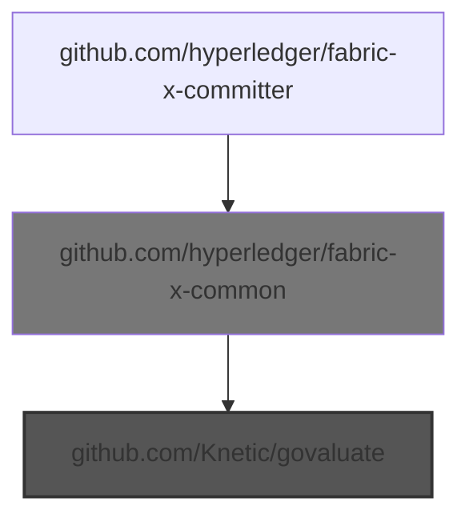
  - Choke: github.com/hyperledger/fabric-x-common

    Root to choke:
    - - `github.com/hyperledger/fabric-x-committer` -> `github.com/hyperledger/fabric-x-common`

    Root from choke:
    - - `github.com/hyperledger/fabric-x-common` -> `github.com/Knetic/govaluate`
  - 🎯 Blamed: `github.com/hyperledger/fabric-x-common`

    - `github.com/hyperledger/fabric-x-common` -> `github.com/Knetic/govaluate`

- **📦 github.com/beorn7/perks**

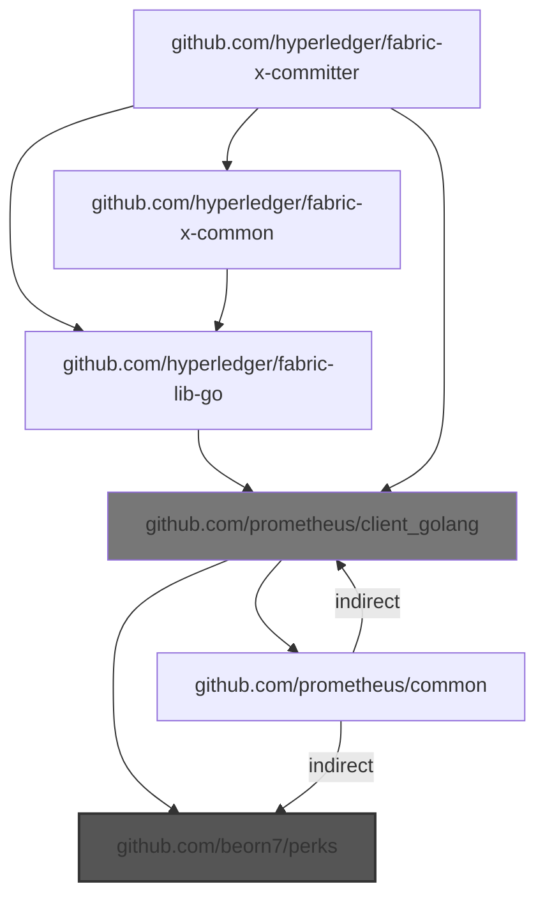
  - Choke: github.com/prometheus/client_golang

    Root to choke:
    - - `github.com/hyperledger/fabric-x-committer` -> `github.com/prometheus/client_golang`
    - - ... and 8 more

    Root from choke:
    - - `github.com/prometheus/client_golang` -> `github.com/beorn7/perks`
    - - ... and 8 more
  - 🎯 Blamed: `github.com/hyperledger/fabric-lib-go`

    - `github.com/hyperledger/fabric-lib-go` -> `github.com/prometheus/client_golang` -> `github.com/beorn7/perks`
    - ... and 2 more

  - 🎯 Blamed: `github.com/hyperledger/fabric-x-common`

    - `github.com/hyperledger/fabric-x-common` -> `github.com/hyperledger/fabric-lib-go` -> `github.com/prometheus/client_golang` -> `github.com/beorn7/perks`
    - ... and 2 more

  - 🎯 Blamed: `github.com/prometheus/client_golang`

    - `github.com/prometheus/client_golang` -> `github.com/beorn7/perks`
    - ... and 2 more

- **📦 github.com/davecgh/go-spew**

```mermaid
graph TD
    bitbucket.org/creachadair/stringset --> honnef.co/go/tools
    cloud.google.com/go/longrunning --> google.golang.org/genproto/googleapis/api
    cloud.google.com/go/longrunning --> google.golang.org/grpc
    cloud.google.com/go/longrunning -->|indirect| go.opentelemetry.io/contrib/instrumentation/net/http/otelhttp
    github.com/IBM/idemix --> github.com/IBM/idemix/bccsp/schemes/aries
    github.com/IBM/idemix --> github.com/IBM/idemix/bccsp/schemes/weak-bb
    github.com/IBM/idemix --> github.com/IBM/idemix/bccsp/types
    github.com/IBM/idemix --> github.com/IBM/mathlib
    github.com/IBM/idemix --> github.com/hyperledger/aries-bbs-go
    github.com/IBM/idemix --> github.com/hyperledger/fabric-protos-go-apiv2
    github.com/IBM/idemix --> github.com/onsi/ginkgo/v2
    github.com/IBM/idemix --> github.com/onsi/gomega
    github.com/IBM/idemix --> github.com/stretchr/testify
    github.com/IBM/idemix --> github.com/sykesm/zap-logfmt
    github.com/IBM/idemix --> go.uber.org/zap
    github.com/IBM/idemix --> google.golang.org/grpc
    github.com/IBM/idemix/bccsp/schemes/aries --> github.com/IBM/idemix/bccsp/schemes/weak-bb
    github.com/IBM/idemix/bccsp/schemes/aries --> github.com/IBM/idemix/bccsp/types
    github.com/IBM/idemix/bccsp/schemes/aries --> github.com/IBM/mathlib
    github.com/IBM/idemix/bccsp/schemes/aries --> github.com/hyperledger/aries-bbs-go
    github.com/IBM/idemix/bccsp/schemes/aries --> github.com/stretchr/testify
    github.com/IBM/idemix/bccsp/schemes/weak-bb --> github.com/IBM/mathlib
    github.com/IBM/idemix/bccsp/types --> github.com/IBM/mathlib
    github.com/IBM/mathlib --> github.com/consensys/gnark-crypto
    github.com/IBM/mathlib --> github.com/stretchr/testify
    github.com/Kunde21/markdownfmt/v3 --> github.com/pkg/diff
    github.com/Kunde21/markdownfmt/v3 --> github.com/stretchr/testify
    github.com/Microsoft/go-winio --> github.com/sirupsen/logrus
    github.com/bitfield/gotestdox --> github.com/rogpeppe/go-internal
    github.com/bufbuild/protocompile --> github.com/stretchr/testify
    github.com/cockroachdb/errors --> github.com/getsentry/sentry-go
    github.com/cockroachdb/errors --> github.com/kr/pretty
    github.com/cockroachdb/errors --> github.com/stretchr/testify
    github.com/cockroachdb/errors --> google.golang.org/grpc
    github.com/consensys/gnark-crypto --> github.com/stretchr/testify
    github.com/consensys/gnark-crypto -->|indirect| github.com/kr/pretty
    github.com/containerd/errdefs/pkg --> google.golang.org/grpc
    github.com/containerd/log --> github.com/sirupsen/logrus
    github.com/docker/docker --> github.com/Microsoft/go-winio
    github.com/docker/docker --> go.opentelemetry.io/contrib/instrumentation/net/http/otelhttp
    github.com/docker/docker --> go.opentelemetry.io/otel/exporters/otlp/otlptrace/otlptracehttp
    github.com/docker/docker --> go.opentelemetry.io/otel/trace
    github.com/docker/go-connections --> github.com/Microsoft/go-winio
    github.com/fsouza/go-dockerclient --> github.com/Microsoft/go-winio
    github.com/fsouza/go-dockerclient --> github.com/moby/go-archive
    github.com/fsouza/go-dockerclient --> github.com/moby/moby/client
    github.com/gavv/httpexpect/v2 --> github.com/sanity-io/litter
    github.com/gavv/httpexpect/v2 --> github.com/stretchr/testify
    github.com/gavv/httpexpect/v2 --> github.com/xeipuuv/gojsonschema
    github.com/gavv/httpexpect/v2 --> moul.io/http2curl/v2
    github.com/gavv/httpexpect/v2 -->|indirect| github.com/onsi/ginkgo
    github.com/gavv/httpexpect/v2 -->|indirect| github.com/onsi/gomega
    github.com/getsentry/sentry-go --> github.com/stretchr/testify
    github.com/getsentry/sentry-go -->|indirect| github.com/kr/pretty
    github.com/getsentry/sentry-go -->|indirect| github.com/rogpeppe/go-internal
    github.com/go-playground/validator/v10 --> github.com/leodido/go-urn
    github.com/go-task/slim-sprig --> github.com/stretchr/testify
    github.com/go-task/slim-sprig/v3 --> github.com/stretchr/testify
    github.com/googleapis/api-linter/v2 --> bitbucket.org/creachadair/stringset
    github.com/googleapis/api-linter/v2 --> cloud.google.com/go/longrunning
    github.com/googleapis/api-linter/v2 --> github.com/bufbuild/protocompile
    github.com/googleapis/api-linter/v2 --> github.com/stoewer/go-strcase
    github.com/googleapis/api-linter/v2 --> google.golang.org/genproto/googleapis/api
    github.com/grpc-ecosystem/grpc-gateway/v2 --> google.golang.org/genproto/googleapis/api
    github.com/grpc-ecosystem/grpc-gateway/v2 --> google.golang.org/grpc
    github.com/hyperledger-labs/SmartBFT --> github.com/stretchr/testify
    github.com/hyperledger-labs/SmartBFT --> go.uber.org/zap
    github.com/hyperledger/aries-bbs-go --> github.com/IBM/mathlib
    github.com/hyperledger/aries-bbs-go --> github.com/stretchr/testify
    github.com/hyperledger/fabric-lib-go --> github.com/onsi/ginkgo/v2
    github.com/hyperledger/fabric-lib-go --> github.com/onsi/gomega
    github.com/hyperledger/fabric-lib-go --> github.com/prometheus/client_golang
    github.com/hyperledger/fabric-lib-go --> github.com/spf13/viper
    github.com/hyperledger/fabric-lib-go --> github.com/stretchr/testify
    github.com/hyperledger/fabric-lib-go --> github.com/sykesm/zap-logfmt
    github.com/hyperledger/fabric-lib-go --> go.uber.org/zap
    github.com/hyperledger/fabric-lib-go --> google.golang.org/grpc
    github.com/hyperledger/fabric-lib-go -->|indirect| github.com/go-task/slim-sprig/v3
    github.com/hyperledger/fabric-protos-go-apiv2 --> google.golang.org/grpc
    github.com/hyperledger/fabric-x-committer --> github.com/cockroachdb/errors
    github.com/hyperledger/fabric-x-committer --> github.com/consensys/gnark-crypto
    github.com/hyperledger/fabric-x-committer --> github.com/docker/docker
    github.com/hyperledger/fabric-x-committer --> github.com/docker/go-connections
    github.com/hyperledger/fabric-x-committer --> github.com/fsouza/go-dockerclient
    github.com/hyperledger/fabric-x-committer --> github.com/gavv/httpexpect/v2
    github.com/hyperledger/fabric-x-committer --> github.com/go-playground/validator/v10
    github.com/hyperledger/fabric-x-committer --> github.com/go-task/slim-sprig/v3
    github.com/hyperledger/fabric-x-committer --> github.com/grpc-ecosystem/grpc-gateway/v2
    github.com/hyperledger/fabric-x-committer --> github.com/hyperledger/fabric-lib-go
    github.com/hyperledger/fabric-x-committer --> github.com/hyperledger/fabric-protos-go-apiv2
    github.com/hyperledger/fabric-x-committer --> github.com/hyperledger/fabric-x-common
    github.com/hyperledger/fabric-x-committer --> github.com/jackc/puddle/v2
    github.com/hyperledger/fabric-x-committer --> github.com/prometheus/client_golang
    github.com/hyperledger/fabric-x-committer --> github.com/spf13/viper
    github.com/hyperledger/fabric-x-committer --> github.com/stretchr/testify
    github.com/hyperledger/fabric-x-committer --> github.com/yugabyte/pgx/v5
    github.com/hyperledger/fabric-x-committer --> go.uber.org/mock
    github.com/hyperledger/fabric-x-committer --> go.uber.org/zap
    github.com/hyperledger/fabric-x-committer --> google.golang.org/genproto/googleapis/api
    github.com/hyperledger/fabric-x-committer --> google.golang.org/grpc
    github.com/hyperledger/fabric-x-committer -->|tool| github.com/Kunde21/markdownfmt/v3
    github.com/hyperledger/fabric-x-committer -->|tool| github.com/googleapis/api-linter/v2
    github.com/hyperledger/fabric-x-committer -->|tool| google.golang.org/grpc/cmd/protoc-gen-go-grpc
    github.com/hyperledger/fabric-x-committer -->|tool| gotest.tools/gotestsum
    github.com/hyperledger/fabric-x-committer -->|tool| mvdan.cc/gofumpt
    github.com/hyperledger/fabric-x-common --> github.com/IBM/idemix
    github.com/hyperledger/fabric-x-common --> github.com/cockroachdb/errors
    github.com/hyperledger/fabric-x-common --> github.com/davecgh/go-spew
    github.com/hyperledger/fabric-x-common --> github.com/hyperledger-labs/SmartBFT
    github.com/hyperledger/fabric-x-common --> github.com/hyperledger/fabric-lib-go
    github.com/hyperledger/fabric-x-common --> github.com/hyperledger/fabric-protos-go-apiv2
    github.com/hyperledger/fabric-x-common --> github.com/onsi/ginkgo/v2
    github.com/hyperledger/fabric-x-common --> github.com/onsi/gomega
    github.com/hyperledger/fabric-x-common --> github.com/spf13/viper
    github.com/hyperledger/fabric-x-common --> github.com/stretchr/testify
    github.com/hyperledger/fabric-x-common --> github.com/syndtr/goleveldb
    github.com/hyperledger/fabric-x-common --> go.uber.org/zap
    github.com/hyperledger/fabric-x-common --> google.golang.org/grpc
    github.com/hyperledger/fabric-x-common -->|tool| github.com/googleapis/api-linter/v2
    github.com/hyperledger/fabric-x-common -->|tool| google.golang.org/grpc/cmd/protoc-gen-go-grpc
    github.com/hyperledger/fabric-x-common -->|tool| gotest.tools/gotestsum
    github.com/hyperledger/fabric-x-common -->|tool| mvdan.cc/gofumpt
    github.com/jackc/pgpassfile --> github.com/stretchr/testify
    github.com/jackc/pgservicefile --> github.com/stretchr/testify
    github.com/jackc/pgx/v5 --> github.com/jackc/pgpassfile
    github.com/jackc/pgx/v5 --> github.com/jackc/pgservicefile
    github.com/jackc/pgx/v5 --> github.com/jackc/puddle/v2
    github.com/jackc/pgx/v5 --> github.com/stretchr/testify
    github.com/jackc/pgx/v5 -->|indirect| github.com/kr/pretty
    github.com/jackc/puddle/v2 --> github.com/stretchr/testify
    github.com/kr/pretty --> github.com/rogpeppe/go-internal
    github.com/leodido/go-urn --> github.com/stretchr/testify
    github.com/moby/go-archive --> github.com/containerd/log
    github.com/moby/moby/client --> github.com/Microsoft/go-winio
    github.com/moby/moby/client --> github.com/containerd/errdefs/pkg
    github.com/moby/moby/client --> github.com/docker/go-connections
    github.com/moby/moby/client --> go.opentelemetry.io/contrib/instrumentation/net/http/otelhttp
    github.com/moby/moby/client --> go.opentelemetry.io/otel/trace
    github.com/onsi/ginkgo --> github.com/go-task/slim-sprig
    github.com/onsi/ginkgo --> github.com/onsi/gomega
    github.com/onsi/ginkgo/v2 --> github.com/go-task/slim-sprig
    github.com/onsi/ginkgo/v2 --> github.com/onsi/gomega
    github.com/onsi/gomega --> github.com/onsi/ginkgo
    github.com/onsi/gomega --> github.com/onsi/ginkgo/v2
    github.com/pkg/diff --> github.com/sergi/go-diff
    github.com/pkg/diff --> github.com/stretchr/testify
    github.com/prometheus/client_golang --> github.com/prometheus/common
    github.com/prometheus/client_golang -->|indirect| github.com/kr/pretty
    github.com/prometheus/common --> github.com/stretchr/testify
    github.com/prometheus/common -->|indirect| github.com/prometheus/client_golang
    github.com/prometheus/common -->|indirect| github.com/rogpeppe/go-internal
    github.com/rogpeppe/go-internal --> github.com/pkg/diff
    github.com/sanity-io/litter --> github.com/stretchr/testify
    github.com/sergi/go-diff --> github.com/stretchr/testify
    github.com/sergi/go-diff -->|indirect| github.com/kr/pretty
    github.com/sirupsen/logrus --> github.com/stretchr/testify
    github.com/spf13/cast -->|indirect| github.com/kr/pretty
    github.com/spf13/cast -->|indirect| github.com/rogpeppe/go-internal
    github.com/spf13/viper --> github.com/spf13/cast
    github.com/spf13/viper --> github.com/stretchr/testify
    github.com/spf13/viper --> github.com/subosito/gotenv
    github.com/stoewer/go-strcase --> github.com/stretchr/testify
    github.com/stretchr/objx --> github.com/stretchr/testify
    github.com/stretchr/testify --> github.com/davecgh/go-spew
    github.com/stretchr/testify --> github.com/stretchr/objx
    github.com/subosito/gotenv --> github.com/stretchr/testify
    github.com/sykesm/zap-logfmt --> github.com/stretchr/testify
    github.com/sykesm/zap-logfmt --> go.uber.org/zap
    github.com/syndtr/goleveldb --> github.com/onsi/ginkgo
    github.com/syndtr/goleveldb --> github.com/onsi/gomega
    github.com/syndtr/goleveldb --> github.com/stretchr/testify
    github.com/tailscale/depaware --> github.com/pkg/diff
    github.com/xeipuuv/gojsonschema --> github.com/stretchr/testify
    github.com/yugabyte/pgx/v5 --> github.com/jackc/pgpassfile
    github.com/yugabyte/pgx/v5 --> github.com/jackc/pgservicefile
    github.com/yugabyte/pgx/v5 --> github.com/jackc/pgx/v5
    github.com/yugabyte/pgx/v5 --> github.com/jackc/puddle/v2
    github.com/yugabyte/pgx/v5 --> github.com/stretchr/testify
    go.opentelemetry.io/auto/sdk --> github.com/stretchr/testify
    go.opentelemetry.io/auto/sdk --> go.opentelemetry.io/otel
    go.opentelemetry.io/auto/sdk --> go.opentelemetry.io/otel/trace
    go.opentelemetry.io/auto/sdk -->|indirect| github.com/kr/pretty
    go.opentelemetry.io/auto/sdk -->|indirect| github.com/rogpeppe/go-internal
    go.opentelemetry.io/contrib/instrumentation/net/http/otelhttp --> github.com/stretchr/testify
    go.opentelemetry.io/contrib/instrumentation/net/http/otelhttp --> go.opentelemetry.io/otel
    go.opentelemetry.io/contrib/instrumentation/net/http/otelhttp --> go.opentelemetry.io/otel/metric
    go.opentelemetry.io/contrib/instrumentation/net/http/otelhttp --> go.opentelemetry.io/otel/trace
    go.opentelemetry.io/otel --> github.com/stretchr/testify
    go.opentelemetry.io/otel --> go.opentelemetry.io/auto/sdk
    go.opentelemetry.io/otel --> go.opentelemetry.io/otel/metric
    go.opentelemetry.io/otel --> go.opentelemetry.io/otel/trace
    go.opentelemetry.io/otel/exporters/otlp/otlptrace/otlptracehttp --> github.com/stretchr/testify
    go.opentelemetry.io/otel/exporters/otlp/otlptrace/otlptracehttp --> go.opentelemetry.io/otel
    go.opentelemetry.io/otel/exporters/otlp/otlptrace/otlptracehttp --> go.opentelemetry.io/otel/metric
    go.opentelemetry.io/otel/exporters/otlp/otlptrace/otlptracehttp --> go.opentelemetry.io/otel/trace
    go.opentelemetry.io/otel/exporters/otlp/otlptrace/otlptracehttp --> google.golang.org/grpc
    go.opentelemetry.io/otel/exporters/otlp/otlptrace/otlptracehttp -->|indirect| github.com/grpc-ecosystem/grpc-gateway/v2
    go.opentelemetry.io/otel/exporters/otlp/otlptrace/otlptracehttp -->|indirect| google.golang.org/genproto/googleapis/api
    go.opentelemetry.io/otel/metric --> github.com/stretchr/testify
    go.opentelemetry.io/otel/metric --> go.opentelemetry.io/otel
    go.opentelemetry.io/otel/metric -->|indirect| go.opentelemetry.io/auto/sdk
    go.opentelemetry.io/otel/trace --> github.com/stretchr/testify
    go.opentelemetry.io/otel/trace --> go.opentelemetry.io/otel
    go.uber.org/atomic --> github.com/stretchr/testify
    go.uber.org/mock --> github.com/stretchr/testify
    go.uber.org/multierr --> github.com/stretchr/testify
    go.uber.org/multierr --> go.uber.org/atomic
    go.uber.org/multierr --> honnef.co/go/tools
    go.uber.org/zap --> github.com/stretchr/testify
    go.uber.org/zap --> go.uber.org/atomic
    go.uber.org/zap --> go.uber.org/multierr
    google.golang.org/genproto/googleapis/api --> google.golang.org/grpc
    google.golang.org/grpc --> go.opentelemetry.io/otel
    google.golang.org/grpc --> go.opentelemetry.io/otel/metric
    google.golang.org/grpc --> go.opentelemetry.io/otel/trace
    google.golang.org/grpc/cmd/protoc-gen-go-grpc --> google.golang.org/grpc
    gotest.tools/gotestsum --> github.com/bitfield/gotestdox
    honnef.co/go/tools --> github.com/rogpeppe/go-internal
    moul.io/http2curl/v2 --> github.com/tailscale/depaware
    mvdan.cc/gofumpt --> github.com/rogpeppe/go-internal
    mvdan.cc/gofumpt -->|indirect| github.com/kr/pretty
    style github.com/davecgh/go-spew fill:#555,stroke:#333,stroke-width:2px
    style github.com/stretchr/testify fill:#777
    style github.com/hyperledger/fabric-x-common fill:#777
```
  - Choke: github.com/stretchr/testify

    Root to choke:
    - - `github.com/hyperledger/fabric-x-committer` -> `github.com/stretchr/testify`
    - - ... and 2649 more

    Root from choke:
    - - `github.com/stretchr/testify` -> `github.com/davecgh/go-spew`
    - - ... and 2649 more
  - Choke: github.com/hyperledger/fabric-x-common

    Root to choke:
    - - `github.com/hyperledger/fabric-x-committer` -> `github.com/hyperledger/fabric-x-common`
    - - ... and 926 more

    Root from choke:
    - - `github.com/hyperledger/fabric-x-common` -> `github.com/davecgh/go-spew`
    - - ... and 926 more
  - 🎯 Blamed: `github.com/Kunde21/markdownfmt/v3`

    - `github.com/Kunde21/markdownfmt/v3` -> `github.com/stretchr/testify` -> `github.com/davecgh/go-spew`
    - ... and 7 more

  - 🎯 Blamed: `github.com/cockroachdb/errors`

    - `github.com/cockroachdb/errors` -> `github.com/stretchr/testify` -> `github.com/davecgh/go-spew`
    - ... and 89 more

  - 🎯 Blamed: `github.com/consensys/gnark-crypto`

    - `github.com/consensys/gnark-crypto` -> `github.com/stretchr/testify` -> `github.com/davecgh/go-spew`
    - ... and 5 more

  - 🎯 Blamed: `github.com/docker/docker`

    - `github.com/docker/docker` -> `go.opentelemetry.io/contrib/instrumentation/net/http/otelhttp` -> `github.com/stretchr/testify` -> `github.com/davecgh/go-spew`
    - ... and 438 more

  - 🎯 Blamed: `github.com/docker/go-connections`

    - `github.com/docker/go-connections` -> `github.com/Microsoft/go-winio` -> `github.com/sirupsen/logrus` -> `github.com/stretchr/testify` -> `github.com/davecgh/go-spew`
    - ... and 1 more

  - 🎯 Blamed: `github.com/fsouza/go-dockerclient`

    - `github.com/fsouza/go-dockerclient` -> `github.com/Microsoft/go-winio` -> `github.com/sirupsen/logrus` -> `github.com/stretchr/testify` -> `github.com/davecgh/go-spew`
    - ... and 204 more

  - 🎯 Blamed: `github.com/gavv/httpexpect/v2`

    - `github.com/gavv/httpexpect/v2` -> `github.com/stretchr/testify` -> `github.com/davecgh/go-spew`
    - ... and 19 more

  - 🎯 Blamed: `github.com/go-playground/validator/v10`

    - `github.com/go-playground/validator/v10` -> `github.com/leodido/go-urn` -> `github.com/stretchr/testify` -> `github.com/davecgh/go-spew`
    - ... and 1 more

  - 🎯 Blamed: `github.com/go-task/slim-sprig/v3`

    - `github.com/go-task/slim-sprig/v3` -> `github.com/stretchr/testify` -> `github.com/davecgh/go-spew`
    - ... and 1 more

  - 🎯 Blamed: `github.com/googleapis/api-linter/v2`

    - `github.com/googleapis/api-linter/v2` -> `github.com/bufbuild/protocompile` -> `github.com/stretchr/testify` -> `github.com/davecgh/go-spew`
    - ... and 286 more

  - 🎯 Blamed: `github.com/grpc-ecosystem/grpc-gateway/v2`

    - `github.com/grpc-ecosystem/grpc-gateway/v2` -> `google.golang.org/grpc` -> `go.opentelemetry.io/otel` -> `github.com/stretchr/testify` -> `github.com/davecgh/go-spew`
    - ... and 135 more

  - 🎯 Blamed: `github.com/hyperledger/fabric-lib-go`

    - `github.com/hyperledger/fabric-lib-go` -> `github.com/stretchr/testify` -> `github.com/davecgh/go-spew`
    - ... and 135 more

  - 🎯 Blamed: `github.com/hyperledger/fabric-protos-go-apiv2`

    - `github.com/hyperledger/fabric-protos-go-apiv2` -> `google.golang.org/grpc` -> `go.opentelemetry.io/otel` -> `github.com/stretchr/testify` -> `github.com/davecgh/go-spew`
    - ... and 73 more

  - 🎯 Blamed: `github.com/hyperledger/fabric-x-common`

    - `github.com/hyperledger/fabric-x-common` -> `github.com/davecgh/go-spew`
    - ... and 926 more

  - 🎯 Blamed: `github.com/jackc/puddle/v2`

    - `github.com/jackc/puddle/v2` -> `github.com/stretchr/testify` -> `github.com/davecgh/go-spew`
    - ... and 1 more

  - 🎯 Blamed: `github.com/prometheus/client_golang`

    - `github.com/prometheus/client_golang` -> `github.com/prometheus/common` -> `github.com/stretchr/testify` -> `github.com/davecgh/go-spew`
    - ... and 13 more

  - 🎯 Blamed: `github.com/spf13/viper`

    - `github.com/spf13/viper` -> `github.com/stretchr/testify` -> `github.com/davecgh/go-spew`
    - ... and 11 more

  - 🎯 Blamed: `github.com/stretchr/testify`

    - `github.com/stretchr/testify` -> `github.com/davecgh/go-spew`
    - ... and 1 more

  - 🎯 Blamed: `github.com/yugabyte/pgx/v5`

    - `github.com/yugabyte/pgx/v5` -> `github.com/stretchr/testify` -> `github.com/davecgh/go-spew`
    - ... and 19 more

  - 🎯 Blamed: `go.uber.org/mock`

    - `go.uber.org/mock` -> `github.com/stretchr/testify` -> `github.com/davecgh/go-spew`
    - ... and 1 more

  - 🎯 Blamed: `go.uber.org/zap`

    - `go.uber.org/zap` -> `github.com/stretchr/testify` -> `github.com/davecgh/go-spew`
    - ... and 11 more

  - 🎯 Blamed: `google.golang.org/genproto/googleapis/api`

    - `google.golang.org/genproto/googleapis/api` -> `google.golang.org/grpc` -> `go.opentelemetry.io/otel` -> `github.com/stretchr/testify` -> `github.com/davecgh/go-spew`
    - ... and 73 more

  - 🎯 Blamed: `google.golang.org/grpc`

    - `google.golang.org/grpc` -> `go.opentelemetry.io/otel` -> `github.com/stretchr/testify` -> `github.com/davecgh/go-spew`
    - ... and 92 more

  - 🎯 Blamed: `google.golang.org/grpc/cmd/protoc-gen-go-grpc`

    - `google.golang.org/grpc/cmd/protoc-gen-go-grpc` -> `google.golang.org/grpc` -> `go.opentelemetry.io/otel` -> `github.com/stretchr/testify` -> `github.com/davecgh/go-spew`
    - ... and 73 more

  - 🎯 Blamed: `gotest.tools/gotestsum`

    - `gotest.tools/gotestsum` -> `github.com/bitfield/gotestdox` -> `github.com/rogpeppe/go-internal` -> `github.com/pkg/diff` -> `github.com/stretchr/testify` -> `github.com/davecgh/go-spew`
    - ... and 3 more

  - 🎯 Blamed: `mvdan.cc/gofumpt`

    - `mvdan.cc/gofumpt` -> `github.com/rogpeppe/go-internal` -> `github.com/pkg/diff` -> `github.com/stretchr/testify` -> `github.com/davecgh/go-spew`
    - ... and 7 more

- **📦 github.com/go-logr/stdr**

  Root to pkg: `go.opentelemetry.io/otel` -> `github.com/go-logr/stdr`

```mermaid
graph TD
    cloud.google.com/go/longrunning --> google.golang.org/genproto/googleapis/api
    cloud.google.com/go/longrunning --> google.golang.org/grpc
    cloud.google.com/go/longrunning -->|indirect| go.opentelemetry.io/contrib/instrumentation/net/http/otelhttp
    github.com/IBM/idemix --> github.com/hyperledger/fabric-protos-go-apiv2
    github.com/IBM/idemix --> google.golang.org/grpc
    github.com/cockroachdb/errors --> google.golang.org/grpc
    github.com/containerd/errdefs/pkg --> google.golang.org/grpc
    github.com/docker/docker --> go.opentelemetry.io/contrib/instrumentation/net/http/otelhttp
    github.com/docker/docker --> go.opentelemetry.io/otel/exporters/otlp/otlptrace/otlptracehttp
    github.com/docker/docker --> go.opentelemetry.io/otel/trace
    github.com/fsouza/go-dockerclient --> github.com/moby/moby/client
    github.com/googleapis/api-linter/v2 --> cloud.google.com/go/longrunning
    github.com/googleapis/api-linter/v2 --> google.golang.org/genproto/googleapis/api
    github.com/grpc-ecosystem/grpc-gateway/v2 --> google.golang.org/genproto/googleapis/api
    github.com/grpc-ecosystem/grpc-gateway/v2 --> google.golang.org/grpc
    github.com/hyperledger/fabric-lib-go --> google.golang.org/grpc
    github.com/hyperledger/fabric-protos-go-apiv2 --> google.golang.org/grpc
    github.com/hyperledger/fabric-x-committer --> github.com/cockroachdb/errors
    github.com/hyperledger/fabric-x-committer --> github.com/docker/docker
    github.com/hyperledger/fabric-x-committer --> github.com/fsouza/go-dockerclient
    github.com/hyperledger/fabric-x-committer --> github.com/grpc-ecosystem/grpc-gateway/v2
    github.com/hyperledger/fabric-x-committer --> github.com/hyperledger/fabric-lib-go
    github.com/hyperledger/fabric-x-committer --> github.com/hyperledger/fabric-protos-go-apiv2
    github.com/hyperledger/fabric-x-committer --> github.com/hyperledger/fabric-x-common
    github.com/hyperledger/fabric-x-committer --> google.golang.org/genproto/googleapis/api
    github.com/hyperledger/fabric-x-committer --> google.golang.org/grpc
    github.com/hyperledger/fabric-x-committer -->|tool| github.com/googleapis/api-linter/v2
    github.com/hyperledger/fabric-x-committer -->|tool| google.golang.org/grpc/cmd/protoc-gen-go-grpc
    github.com/hyperledger/fabric-x-common --> github.com/IBM/idemix
    github.com/hyperledger/fabric-x-common --> github.com/cockroachdb/errors
    github.com/hyperledger/fabric-x-common --> github.com/hyperledger/fabric-lib-go
    github.com/hyperledger/fabric-x-common --> github.com/hyperledger/fabric-protos-go-apiv2
    github.com/hyperledger/fabric-x-common --> google.golang.org/grpc
    github.com/hyperledger/fabric-x-common -->|tool| github.com/googleapis/api-linter/v2
    github.com/hyperledger/fabric-x-common -->|tool| google.golang.org/grpc/cmd/protoc-gen-go-grpc
    github.com/moby/moby/client --> github.com/containerd/errdefs/pkg
    github.com/moby/moby/client --> go.opentelemetry.io/contrib/instrumentation/net/http/otelhttp
    github.com/moby/moby/client --> go.opentelemetry.io/otel/trace
    go.opentelemetry.io/auto/sdk --> go.opentelemetry.io/otel
    go.opentelemetry.io/auto/sdk --> go.opentelemetry.io/otel/trace
    go.opentelemetry.io/contrib/instrumentation/net/http/otelhttp --> go.opentelemetry.io/otel
    go.opentelemetry.io/contrib/instrumentation/net/http/otelhttp --> go.opentelemetry.io/otel/metric
    go.opentelemetry.io/contrib/instrumentation/net/http/otelhttp --> go.opentelemetry.io/otel/trace
    go.opentelemetry.io/otel/exporters/otlp/otlptrace/otlptracehttp --> go.opentelemetry.io/otel
    go.opentelemetry.io/otel/exporters/otlp/otlptrace/otlptracehttp --> go.opentelemetry.io/otel/metric
    go.opentelemetry.io/otel/exporters/otlp/otlptrace/otlptracehttp --> go.opentelemetry.io/otel/trace
    go.opentelemetry.io/otel/exporters/otlp/otlptrace/otlptracehttp --> google.golang.org/grpc
    go.opentelemetry.io/otel/exporters/otlp/otlptrace/otlptracehttp -->|indirect| github.com/grpc-ecosystem/grpc-gateway/v2
    go.opentelemetry.io/otel/exporters/otlp/otlptrace/otlptracehttp -->|indirect| google.golang.org/genproto/googleapis/api
    go.opentelemetry.io/otel/metric --> go.opentelemetry.io/otel
    go.opentelemetry.io/otel/metric -->|indirect| go.opentelemetry.io/auto/sdk
    go.opentelemetry.io/otel/metric -->|indirect| go.opentelemetry.io/otel/trace
    go.opentelemetry.io/otel/trace --> go.opentelemetry.io/otel
    google.golang.org/genproto/googleapis/api --> google.golang.org/grpc
    google.golang.org/grpc --> go.opentelemetry.io/otel
    google.golang.org/grpc --> go.opentelemetry.io/otel/metric
    google.golang.org/grpc --> go.opentelemetry.io/otel/trace
    google.golang.org/grpc/cmd/protoc-gen-go-grpc --> google.golang.org/grpc
    style go.opentelemetry.io/otel fill:#555,stroke:#333,stroke-width:2px
    style go.opentelemetry.io/otel/trace fill:#777
    style go.opentelemetry.io/contrib/instrumentation/net/http/otelhttp fill:#777
    style go.opentelemetry.io/otel/exporters/otlp/otlptrace/otlptracehttp fill:#777
    style google.golang.org/grpc fill:#777
```
  - Choke: go.opentelemetry.io/otel/trace

    Root to choke:
    - - `github.com/hyperledger/fabric-x-committer` -> `github.com/docker/docker` -> `go.opentelemetry.io/otel/trace`
    - - ... and 94 more

    Root from choke:
    - - `go.opentelemetry.io/otel/trace` -> `go.opentelemetry.io/otel`
    - - ... and 94 more
  - Choke: go.opentelemetry.io/contrib/instrumentation/net/http/otelhttp

    Root to choke:
    - - `github.com/hyperledger/fabric-x-committer` -> `github.com/docker/docker` -> `go.opentelemetry.io/contrib/instrumentation/net/http/otelhttp`
    - - ... and 23 more

    Root from choke:
    - - `go.opentelemetry.io/contrib/instrumentation/net/http/otelhttp` -> `go.opentelemetry.io/otel`
    - - ... and 23 more
  - Choke: go.opentelemetry.io/otel/exporters/otlp/otlptrace/otlptracehttp

    Root to choke:
    - - `github.com/hyperledger/fabric-x-committer` -> `github.com/docker/docker` -> `go.opentelemetry.io/otel/exporters/otlp/otlptrace/otlptracehttp`
    - - ... and 29 more

    Root from choke:
    - - `go.opentelemetry.io/otel/exporters/otlp/otlptrace/otlptracehttp` -> `go.opentelemetry.io/otel`
    - - ... and 29 more
  - Choke: google.golang.org/grpc

    Root to choke:
    - - `github.com/hyperledger/fabric-x-committer` -> `google.golang.org/grpc`
    - - ... and 155 more

    Root from choke:
    - - `google.golang.org/grpc` -> `go.opentelemetry.io/otel`
    - - ... and 155 more
  - 🎯 Blamed: `github.com/cockroachdb/errors`

    - `github.com/cockroachdb/errors` -> `google.golang.org/grpc` -> `go.opentelemetry.io/otel`
    - ... and 5 more

  - 🎯 Blamed: `github.com/docker/docker`

    - `github.com/docker/docker` -> `go.opentelemetry.io/contrib/instrumentation/net/http/otelhttp` -> `go.opentelemetry.io/otel`
    - ... and 36 more

  - 🎯 Blamed: `github.com/fsouza/go-dockerclient`

    - `github.com/fsouza/go-dockerclient` -> `github.com/moby/moby/client` -> `go.opentelemetry.io/contrib/instrumentation/net/http/otelhttp` -> `go.opentelemetry.io/otel`
    - ... and 12 more

  - 🎯 Blamed: `github.com/googleapis/api-linter/v2`

    - `github.com/googleapis/api-linter/v2` -> `cloud.google.com/go/longrunning` *(indirect)* -> `go.opentelemetry.io/contrib/instrumentation/net/http/otelhttp` -> `go.opentelemetry.io/otel`
    - ... and 23 more

  - 🎯 Blamed: `github.com/grpc-ecosystem/grpc-gateway/v2`

    - `github.com/grpc-ecosystem/grpc-gateway/v2` -> `google.golang.org/grpc` -> `go.opentelemetry.io/otel`
    - ... and 11 more

  - 🎯 Blamed: `github.com/hyperledger/fabric-lib-go`

    - `github.com/hyperledger/fabric-lib-go` -> `google.golang.org/grpc` -> `go.opentelemetry.io/otel`
    - ... and 5 more

  - 🎯 Blamed: `github.com/hyperledger/fabric-protos-go-apiv2`

    - `github.com/hyperledger/fabric-protos-go-apiv2` -> `google.golang.org/grpc` -> `go.opentelemetry.io/otel`
    - ... and 5 more

  - 🎯 Blamed: `github.com/hyperledger/fabric-x-common`

    - `github.com/hyperledger/fabric-x-common` -> `google.golang.org/grpc` -> `go.opentelemetry.io/otel`
    - ... and 65 more

  - 🎯 Blamed: `google.golang.org/genproto/googleapis/api`

    - `google.golang.org/genproto/googleapis/api` -> `google.golang.org/grpc` -> `go.opentelemetry.io/otel`
    - ... and 5 more

  - 🎯 Blamed: `google.golang.org/grpc`

    - `google.golang.org/grpc` -> `go.opentelemetry.io/otel`
    - ... and 5 more

  - 🎯 Blamed: `google.golang.org/grpc/cmd/protoc-gen-go-grpc`

    - `google.golang.org/grpc/cmd/protoc-gen-go-grpc` -> `google.golang.org/grpc` -> `go.opentelemetry.io/otel`
    - ... and 5 more

- **📦 github.com/go-playground/locales**

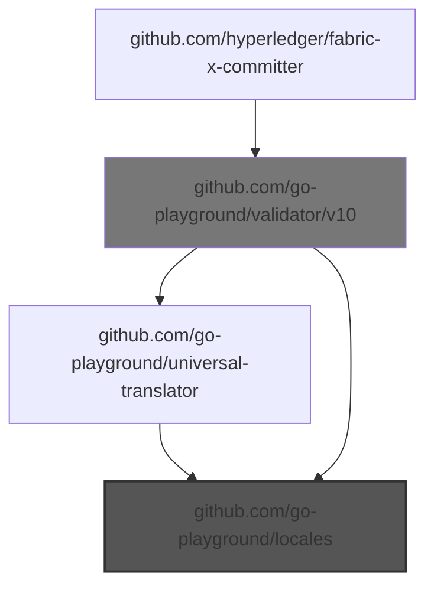
  - Choke: github.com/go-playground/validator/v10

    Root to choke:
    - - `github.com/hyperledger/fabric-x-committer` -> `github.com/go-playground/validator/v10`
    - - ... and 1 more

    Root from choke:
    - - `github.com/go-playground/validator/v10` -> `github.com/go-playground/locales`
    - - ... and 1 more
  - 🎯 Blamed: `github.com/go-playground/validator/v10`

    - `github.com/go-playground/validator/v10` -> `github.com/go-playground/locales`
    - ... and 1 more

- **📦 github.com/go-playground/universal-translator**

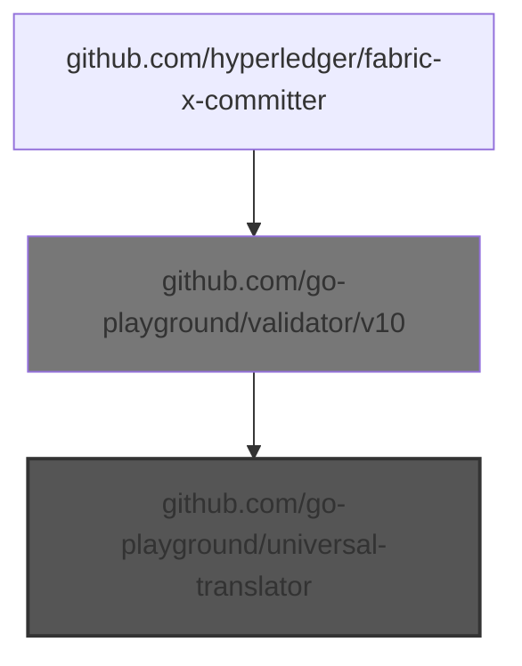
  - Choke: github.com/go-playground/validator/v10

    Root to choke:
    - - `github.com/hyperledger/fabric-x-committer` -> `github.com/go-playground/validator/v10`

    Root from choke:
    - - `github.com/go-playground/validator/v10` -> `github.com/go-playground/universal-translator`
  - 🎯 Blamed: `github.com/go-playground/validator/v10`

    - `github.com/go-playground/validator/v10` -> `github.com/go-playground/universal-translator`

- **📦 github.com/gogo/protobuf**

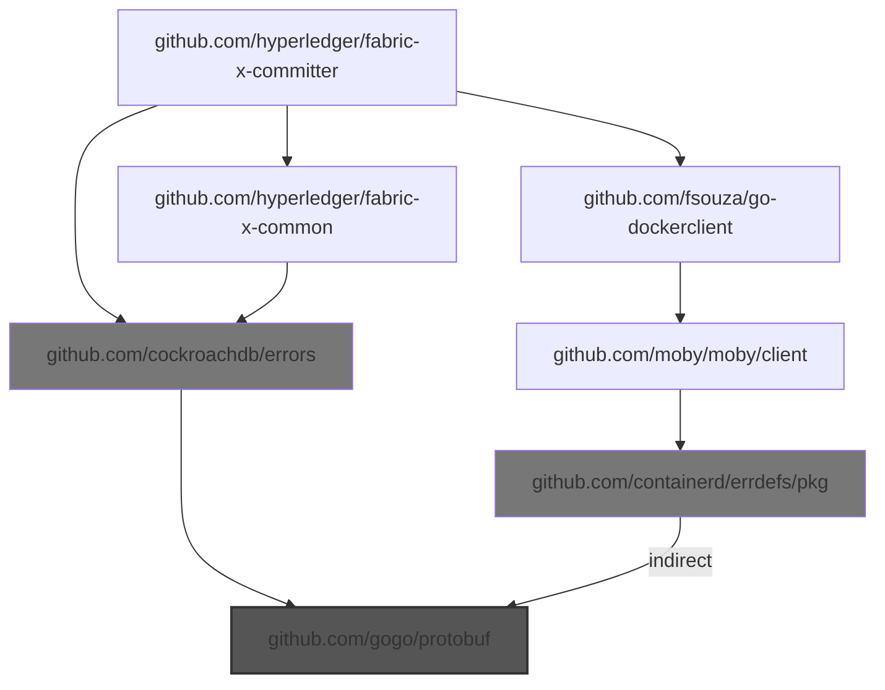
  - Choke: github.com/cockroachdb/errors

    Root to choke:
    - - `github.com/hyperledger/fabric-x-committer` -> `github.com/cockroachdb/errors`
    - - ... and 1 more

    Root from choke:
    - - `github.com/cockroachdb/errors` -> `github.com/gogo/protobuf`
    - - ... and 1 more
  - Choke: github.com/containerd/errdefs/pkg

    Root to choke:
    - - `github.com/hyperledger/fabric-x-committer` -> `github.com/fsouza/go-dockerclient` -> `github.com/moby/moby/client` -> `github.com/containerd/errdefs/pkg`

    Root from choke:
    - - `github.com/containerd/errdefs/pkg` *(indirect)* -> `github.com/gogo/protobuf`
  - 🎯 Blamed: `github.com/cockroachdb/errors`

    - `github.com/cockroachdb/errors` -> `github.com/gogo/protobuf`

  - 🎯 Blamed: `github.com/fsouza/go-dockerclient`

    - `github.com/fsouza/go-dockerclient` -> `github.com/moby/moby/client` -> `github.com/containerd/errdefs/pkg` *(indirect)* -> `github.com/gogo/protobuf`

  - 🎯 Blamed: `github.com/hyperledger/fabric-x-common`

    - `github.com/hyperledger/fabric-x-common` -> `github.com/cockroachdb/errors` -> `github.com/gogo/protobuf`

- **📦 github.com/jackc/pgpassfile**

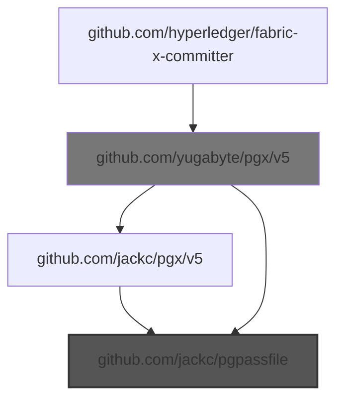
  - Choke: github.com/yugabyte/pgx/v5

    Root to choke:
    - - `github.com/hyperledger/fabric-x-committer` -> `github.com/yugabyte/pgx/v5`
    - - ... and 1 more

    Root from choke:
    - - `github.com/yugabyte/pgx/v5` -> `github.com/jackc/pgpassfile`
    - - ... and 1 more
  - 🎯 Blamed: `github.com/yugabyte/pgx/v5`

    - `github.com/yugabyte/pgx/v5` -> `github.com/jackc/pgpassfile`
    - ... and 1 more

- **📦 github.com/kilic/bls12-381**

  Root to pkg: `github.com/IBM/mathlib` -> `github.com/kilic/bls12-381`

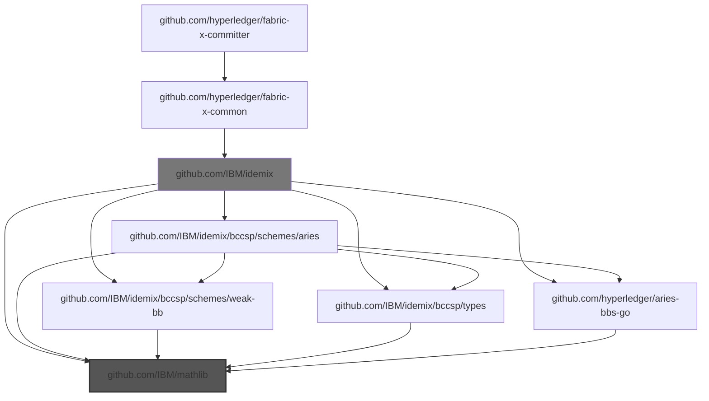
  - Choke: github.com/IBM/idemix

    Root to choke:
    - - `github.com/hyperledger/fabric-x-committer` -> `github.com/hyperledger/fabric-x-common` -> `github.com/IBM/idemix`
    - - ... and 7 more

    Root from choke:
    - - `github.com/IBM/idemix` -> `github.com/IBM/mathlib`
    - - ... and 7 more
  - 🎯 Blamed: `github.com/hyperledger/fabric-x-common`

    - `github.com/hyperledger/fabric-x-common` -> `github.com/IBM/idemix` -> `github.com/IBM/mathlib`
    - ... and 7 more

- **📦 github.com/kr/pretty**

```mermaid
graph TD
    bitbucket.org/creachadair/stringset --> honnef.co/go/tools
    cloud.google.com/go/longrunning --> google.golang.org/genproto/googleapis/api
    cloud.google.com/go/longrunning --> google.golang.org/grpc
    cloud.google.com/go/longrunning -->|indirect| go.opentelemetry.io/contrib/instrumentation/net/http/otelhttp
    github.com/IBM/idemix --> github.com/IBM/idemix/bccsp/schemes/aries
    github.com/IBM/idemix --> github.com/IBM/idemix/bccsp/schemes/weak-bb
    github.com/IBM/idemix --> github.com/IBM/idemix/bccsp/types
    github.com/IBM/idemix --> github.com/IBM/mathlib
    github.com/IBM/idemix --> github.com/hyperledger/aries-bbs-go
    github.com/IBM/idemix --> github.com/hyperledger/fabric-protos-go-apiv2
    github.com/IBM/idemix --> github.com/sykesm/zap-logfmt
    github.com/IBM/idemix --> go.uber.org/zap
    github.com/IBM/idemix --> google.golang.org/grpc
    github.com/IBM/idemix/bccsp/schemes/aries --> github.com/IBM/idemix/bccsp/schemes/weak-bb
    github.com/IBM/idemix/bccsp/schemes/aries --> github.com/IBM/idemix/bccsp/types
    github.com/IBM/idemix/bccsp/schemes/aries --> github.com/IBM/mathlib
    github.com/IBM/idemix/bccsp/schemes/aries --> github.com/hyperledger/aries-bbs-go
    github.com/IBM/idemix/bccsp/schemes/weak-bb --> github.com/IBM/mathlib
    github.com/IBM/idemix/bccsp/types --> github.com/IBM/mathlib
    github.com/IBM/mathlib --> github.com/consensys/gnark-crypto
    github.com/IBM/mathlib -->|indirect| github.com/rogpeppe/go-internal
    github.com/Kunde21/markdownfmt/v3 --> github.com/pkg/diff
    github.com/bitfield/gotestdox --> github.com/rogpeppe/go-internal
    github.com/cockroachdb/errors --> github.com/getsentry/sentry-go
    github.com/cockroachdb/errors --> github.com/kr/pretty
    github.com/cockroachdb/errors --> google.golang.org/grpc
    github.com/consensys/gnark-crypto -->|indirect| github.com/kr/pretty
    github.com/containerd/errdefs/pkg --> google.golang.org/grpc
    github.com/docker/docker --> go.opentelemetry.io/contrib/instrumentation/net/http/otelhttp
    github.com/docker/docker --> go.opentelemetry.io/otel/exporters/otlp/otlptrace/otlptracehttp
    github.com/docker/docker --> go.opentelemetry.io/otel/trace
    github.com/fsouza/go-dockerclient --> github.com/moby/moby/client
    github.com/gavv/httpexpect/v2 --> moul.io/http2curl/v2
    github.com/getsentry/sentry-go -->|indirect| github.com/kr/pretty
    github.com/getsentry/sentry-go -->|indirect| github.com/rogpeppe/go-internal
    github.com/googleapis/api-linter/v2 --> bitbucket.org/creachadair/stringset
    github.com/googleapis/api-linter/v2 --> cloud.google.com/go/longrunning
    github.com/googleapis/api-linter/v2 --> google.golang.org/genproto/googleapis/api
    github.com/grpc-ecosystem/grpc-gateway/v2 --> google.golang.org/genproto/googleapis/api
    github.com/grpc-ecosystem/grpc-gateway/v2 --> google.golang.org/grpc
    github.com/hyperledger-labs/SmartBFT --> go.uber.org/zap
    github.com/hyperledger/aries-bbs-go --> github.com/IBM/mathlib
    github.com/hyperledger/fabric-lib-go --> github.com/prometheus/client_golang
    github.com/hyperledger/fabric-lib-go --> github.com/spf13/viper
    github.com/hyperledger/fabric-lib-go --> github.com/sykesm/zap-logfmt
    github.com/hyperledger/fabric-lib-go --> go.uber.org/zap
    github.com/hyperledger/fabric-lib-go --> google.golang.org/grpc
    github.com/hyperledger/fabric-protos-go-apiv2 --> google.golang.org/grpc
    github.com/hyperledger/fabric-x-committer --> github.com/cockroachdb/errors
    github.com/hyperledger/fabric-x-committer --> github.com/consensys/gnark-crypto
    github.com/hyperledger/fabric-x-committer --> github.com/docker/docker
    github.com/hyperledger/fabric-x-committer --> github.com/fsouza/go-dockerclient
    github.com/hyperledger/fabric-x-committer --> github.com/gavv/httpexpect/v2
    github.com/hyperledger/fabric-x-committer --> github.com/grpc-ecosystem/grpc-gateway/v2
    github.com/hyperledger/fabric-x-committer --> github.com/hyperledger/fabric-lib-go
    github.com/hyperledger/fabric-x-committer --> github.com/hyperledger/fabric-protos-go-apiv2
    github.com/hyperledger/fabric-x-committer --> github.com/hyperledger/fabric-x-common
    github.com/hyperledger/fabric-x-committer --> github.com/prometheus/client_golang
    github.com/hyperledger/fabric-x-committer --> github.com/spf13/viper
    github.com/hyperledger/fabric-x-committer --> github.com/yugabyte/pgx/v5
    github.com/hyperledger/fabric-x-committer --> go.uber.org/zap
    github.com/hyperledger/fabric-x-committer --> google.golang.org/genproto/googleapis/api
    github.com/hyperledger/fabric-x-committer --> google.golang.org/grpc
    github.com/hyperledger/fabric-x-committer -->|tool| github.com/Kunde21/markdownfmt/v3
    github.com/hyperledger/fabric-x-committer -->|tool| github.com/googleapis/api-linter/v2
    github.com/hyperledger/fabric-x-committer -->|tool| google.golang.org/grpc/cmd/protoc-gen-go-grpc
    github.com/hyperledger/fabric-x-committer -->|tool| gotest.tools/gotestsum
    github.com/hyperledger/fabric-x-committer -->|tool| mvdan.cc/gofumpt
    github.com/hyperledger/fabric-x-common --> github.com/IBM/idemix
    github.com/hyperledger/fabric-x-common --> github.com/cockroachdb/errors
    github.com/hyperledger/fabric-x-common --> github.com/hyperledger-labs/SmartBFT
    github.com/hyperledger/fabric-x-common --> github.com/hyperledger/fabric-lib-go
    github.com/hyperledger/fabric-x-common --> github.com/hyperledger/fabric-protos-go-apiv2
    github.com/hyperledger/fabric-x-common --> github.com/spf13/viper
    github.com/hyperledger/fabric-x-common --> go.uber.org/zap
    github.com/hyperledger/fabric-x-common --> google.golang.org/grpc
    github.com/hyperledger/fabric-x-common -->|tool| github.com/googleapis/api-linter/v2
    github.com/hyperledger/fabric-x-common -->|tool| google.golang.org/grpc/cmd/protoc-gen-go-grpc
    github.com/hyperledger/fabric-x-common -->|tool| gotest.tools/gotestsum
    github.com/hyperledger/fabric-x-common -->|tool| mvdan.cc/gofumpt
    github.com/jackc/pgx/v5 -->|indirect| github.com/kr/pretty
    github.com/moby/moby/client --> github.com/containerd/errdefs/pkg
    github.com/moby/moby/client --> go.opentelemetry.io/contrib/instrumentation/net/http/otelhttp
    github.com/moby/moby/client --> go.opentelemetry.io/otel/trace
    github.com/pkg/diff --> github.com/sergi/go-diff
    github.com/prometheus/client_golang --> github.com/prometheus/common
    github.com/prometheus/common -->|indirect| github.com/prometheus/client_golang
    github.com/prometheus/common -->|indirect| github.com/rogpeppe/go-internal
    github.com/rogpeppe/go-internal --> github.com/pkg/diff
    github.com/rogpeppe/go-internal --> gopkg.in/errgo.v2
    github.com/sergi/go-diff -->|indirect| github.com/kr/pretty
    github.com/spf13/cast -->|indirect| github.com/kr/pretty
    github.com/spf13/cast -->|indirect| github.com/rogpeppe/go-internal
    github.com/spf13/viper --> github.com/spf13/cast
    github.com/sykesm/zap-logfmt --> go.uber.org/zap
    github.com/tailscale/depaware --> github.com/pkg/diff
    github.com/yugabyte/pgx/v5 --> github.com/jackc/pgx/v5
    go.opentelemetry.io/auto/sdk -->|indirect| github.com/kr/pretty
    go.opentelemetry.io/auto/sdk -->|indirect| github.com/rogpeppe/go-internal
    go.opentelemetry.io/contrib/instrumentation/net/http/otelhttp --> go.opentelemetry.io/otel
    go.opentelemetry.io/contrib/instrumentation/net/http/otelhttp --> go.opentelemetry.io/otel/metric
    go.opentelemetry.io/contrib/instrumentation/net/http/otelhttp --> go.opentelemetry.io/otel/trace
    go.opentelemetry.io/otel --> go.opentelemetry.io/auto/sdk
    go.opentelemetry.io/otel --> go.opentelemetry.io/otel/metric
    go.opentelemetry.io/otel/exporters/otlp/otlptrace/otlptracehttp --> go.opentelemetry.io/otel
    go.opentelemetry.io/otel/exporters/otlp/otlptrace/otlptracehttp --> go.opentelemetry.io/otel/metric
    go.opentelemetry.io/otel/exporters/otlp/otlptrace/otlptracehttp --> go.opentelemetry.io/otel/trace
    go.opentelemetry.io/otel/exporters/otlp/otlptrace/otlptracehttp --> google.golang.org/grpc
    go.opentelemetry.io/otel/exporters/otlp/otlptrace/otlptracehttp -->|indirect| github.com/grpc-ecosystem/grpc-gateway/v2
    go.opentelemetry.io/otel/exporters/otlp/otlptrace/otlptracehttp -->|indirect| google.golang.org/genproto/googleapis/api
    go.opentelemetry.io/otel/metric --> go.opentelemetry.io/otel
    go.opentelemetry.io/otel/metric -->|indirect| go.opentelemetry.io/otel/trace
    go.opentelemetry.io/otel/trace --> go.opentelemetry.io/otel
    go.uber.org/multierr --> honnef.co/go/tools
    go.uber.org/zap --> go.uber.org/multierr
    google.golang.org/genproto/googleapis/api --> google.golang.org/grpc
    google.golang.org/grpc --> go.opentelemetry.io/otel
    google.golang.org/grpc --> go.opentelemetry.io/otel/metric
    google.golang.org/grpc --> go.opentelemetry.io/otel/trace
    google.golang.org/grpc/cmd/protoc-gen-go-grpc --> google.golang.org/grpc
    gopkg.in/errgo.v2 -->|indirect| github.com/kr/pretty
    gotest.tools/gotestsum --> github.com/bitfield/gotestdox
    honnef.co/go/tools --> github.com/rogpeppe/go-internal
    moul.io/http2curl/v2 --> github.com/tailscale/depaware
    mvdan.cc/gofumpt --> github.com/rogpeppe/go-internal
    style github.com/kr/pretty fill:#555,stroke:#333,stroke-width:2px
    style github.com/spf13/cast fill:#777
    style go.opentelemetry.io/auto/sdk fill:#777
    style github.com/sergi/go-diff fill:#777
    style github.com/jackc/pgx/v5 fill:#777
    style gopkg.in/errgo.v2 fill:#777
    style github.com/consensys/gnark-crypto fill:#777
    style github.com/cockroachdb/errors fill:#777
```
  - Choke: github.com/spf13/cast

    Root to choke:
    - - `github.com/hyperledger/fabric-x-committer` -> `github.com/spf13/viper` -> `github.com/spf13/cast`
    - - ... and 11 more

    Root from choke:
    - - `github.com/spf13/cast` *(indirect)* -> `github.com/kr/pretty`
    - - ... and 11 more
  - Choke: go.opentelemetry.io/auto/sdk

    Root to choke:
    - - `github.com/hyperledger/fabric-x-committer` -> `google.golang.org/grpc` -> `go.opentelemetry.io/otel` -> `go.opentelemetry.io/auto/sdk`
    - - ... and 458 more

    Root from choke:
    - - `go.opentelemetry.io/auto/sdk` *(indirect)* -> `github.com/kr/pretty`
    - - ... and 458 more
  - Choke: github.com/sergi/go-diff

    Root to choke:
    - - `github.com/hyperledger/fabric-x-committer` *(tool)* -> `github.com/Kunde21/markdownfmt/v3` -> `github.com/pkg/diff` -> `github.com/sergi/go-diff`
    - - ... and 145 more

    Root from choke:
    - - `github.com/sergi/go-diff` *(indirect)* -> `github.com/kr/pretty`
    - - ... and 145 more
  - Choke: github.com/jackc/pgx/v5

    Root to choke:
    - - `github.com/hyperledger/fabric-x-committer` -> `github.com/yugabyte/pgx/v5` -> `github.com/jackc/pgx/v5`

    Root from choke:
    - - `github.com/jackc/pgx/v5` *(indirect)* -> `github.com/kr/pretty`
  - Choke: gopkg.in/errgo.v2

    Root to choke:
    - - `github.com/hyperledger/fabric-x-committer` *(tool)* -> `mvdan.cc/gofumpt` -> `github.com/rogpeppe/go-internal` -> `gopkg.in/errgo.v2`
    - - ... and 190 more

    Root from choke:
    - - `gopkg.in/errgo.v2` *(indirect)* -> `github.com/kr/pretty`
    - - ... and 190 more
  - Choke: github.com/consensys/gnark-crypto

    Root to choke:
    - - `github.com/hyperledger/fabric-x-committer` -> `github.com/consensys/gnark-crypto`
    - - ... and 8 more

    Root from choke:
    - - `github.com/consensys/gnark-crypto` *(indirect)* -> `github.com/kr/pretty`
    - - ... and 8 more
  - Choke: github.com/cockroachdb/errors

    Root to choke:
    - - `github.com/hyperledger/fabric-x-committer` -> `github.com/cockroachdb/errors`
    - - ... and 38 more

    Root from choke:
    - - `github.com/cockroachdb/errors` -> `github.com/kr/pretty`
    - - ... and 38 more
  - 🎯 Blamed: `github.com/Kunde21/markdownfmt/v3`

    - `github.com/Kunde21/markdownfmt/v3` -> `github.com/pkg/diff` -> `github.com/sergi/go-diff` *(indirect)* -> `github.com/kr/pretty`

  - 🎯 Blamed: `github.com/cockroachdb/errors`

    - `github.com/cockroachdb/errors` -> `github.com/kr/pretty`
    - ... and 20 more

  - 🎯 Blamed: `github.com/consensys/gnark-crypto`

    - `github.com/consensys/gnark-crypto` *(indirect)* -> `github.com/kr/pretty`

  - 🎯 Blamed: `github.com/docker/docker`

    - `github.com/docker/docker` -> `go.opentelemetry.io/contrib/instrumentation/net/http/otelhttp` -> `go.opentelemetry.io/otel` -> `go.opentelemetry.io/auto/sdk` *(indirect)* -> `github.com/kr/pretty`
    - ... and 91 more

  - 🎯 Blamed: `github.com/fsouza/go-dockerclient`

    - `github.com/fsouza/go-dockerclient` -> `github.com/moby/moby/client` -> `go.opentelemetry.io/contrib/instrumentation/net/http/otelhttp` -> `go.opentelemetry.io/otel` -> `go.opentelemetry.io/auto/sdk` *(indirect)* -> `github.com/kr/pretty`
    - ... and 38 more

  - 🎯 Blamed: `github.com/gavv/httpexpect/v2`

    - `github.com/gavv/httpexpect/v2` -> `moul.io/http2curl/v2` -> `github.com/tailscale/depaware` -> `github.com/pkg/diff` -> `github.com/sergi/go-diff` *(indirect)* -> `github.com/kr/pretty`

  - 🎯 Blamed: `github.com/googleapis/api-linter/v2`

    - `github.com/googleapis/api-linter/v2` -> `bitbucket.org/creachadair/stringset` -> `honnef.co/go/tools` -> `github.com/rogpeppe/go-internal` -> `gopkg.in/errgo.v2` *(indirect)* -> `github.com/kr/pretty`
    - ... and 59 more

  - 🎯 Blamed: `github.com/grpc-ecosystem/grpc-gateway/v2`

    - `github.com/grpc-ecosystem/grpc-gateway/v2` -> `google.golang.org/grpc` -> `go.opentelemetry.io/otel` -> `go.opentelemetry.io/auto/sdk` *(indirect)* -> `github.com/kr/pretty`
    - ... and 27 more

  - 🎯 Blamed: `github.com/hyperledger/fabric-lib-go`

    - `github.com/hyperledger/fabric-lib-go` -> `github.com/spf13/viper` -> `github.com/spf13/cast` *(indirect)* -> `github.com/kr/pretty`
    - ... and 25 more

  - 🎯 Blamed: `github.com/hyperledger/fabric-protos-go-apiv2`

    - `github.com/hyperledger/fabric-protos-go-apiv2` -> `google.golang.org/grpc` -> `go.opentelemetry.io/otel` -> `go.opentelemetry.io/auto/sdk` *(indirect)* -> `github.com/kr/pretty`
    - ... and 15 more

  - 🎯 Blamed: `github.com/hyperledger/fabric-x-common`

    - `github.com/hyperledger/fabric-x-common` -> `github.com/cockroachdb/errors` -> `github.com/kr/pretty`
    - ... and 196 more

  - 🎯 Blamed: `github.com/prometheus/client_golang`

    - `github.com/prometheus/client_golang` -> `github.com/prometheus/common` *(indirect)* -> `github.com/rogpeppe/go-internal` -> `gopkg.in/errgo.v2` *(indirect)* -> `github.com/kr/pretty`
    - ... and 2 more

  - 🎯 Blamed: `github.com/spf13/viper`

    - `github.com/spf13/viper` -> `github.com/spf13/cast` *(indirect)* -> `github.com/kr/pretty`
    - ... and 2 more

  - 🎯 Blamed: `github.com/yugabyte/pgx/v5`

    - `github.com/yugabyte/pgx/v5` -> `github.com/jackc/pgx/v5` *(indirect)* -> `github.com/kr/pretty`

  - 🎯 Blamed: `go.uber.org/zap`

    - `go.uber.org/zap` -> `go.uber.org/multierr` -> `honnef.co/go/tools` -> `github.com/rogpeppe/go-internal` -> `gopkg.in/errgo.v2` *(indirect)* -> `github.com/kr/pretty`
    - ... and 1 more

  - 🎯 Blamed: `google.golang.org/genproto/googleapis/api`

    - `google.golang.org/genproto/googleapis/api` -> `google.golang.org/grpc` -> `go.opentelemetry.io/otel` -> `go.opentelemetry.io/auto/sdk` *(indirect)* -> `github.com/kr/pretty`
    - ... and 15 more

  - 🎯 Blamed: `google.golang.org/grpc`

    - `google.golang.org/grpc` -> `go.opentelemetry.io/otel` -> `go.opentelemetry.io/auto/sdk` *(indirect)* -> `github.com/kr/pretty`
    - ... and 17 more

  - 🎯 Blamed: `google.golang.org/grpc/cmd/protoc-gen-go-grpc`

    - `google.golang.org/grpc/cmd/protoc-gen-go-grpc` -> `google.golang.org/grpc` -> `go.opentelemetry.io/otel` -> `go.opentelemetry.io/auto/sdk` *(indirect)* -> `github.com/kr/pretty`
    - ... and 15 more

  - 🎯 Blamed: `gotest.tools/gotestsum`

    - `gotest.tools/gotestsum` -> `github.com/bitfield/gotestdox` -> `github.com/rogpeppe/go-internal` -> `gopkg.in/errgo.v2` *(indirect)* -> `github.com/kr/pretty`
    - ... and 1 more

  - 🎯 Blamed: `mvdan.cc/gofumpt`

    - `mvdan.cc/gofumpt` -> `github.com/rogpeppe/go-internal` -> `gopkg.in/errgo.v2` *(indirect)* -> `github.com/kr/pretty`
    - ... and 1 more

- **📦 github.com/kr/text**

```mermaid
graph TD
    bitbucket.org/creachadair/stringset --> honnef.co/go/tools
    cloud.google.com/go/longrunning --> google.golang.org/genproto/googleapis/api
    cloud.google.com/go/longrunning --> google.golang.org/grpc
    cloud.google.com/go/longrunning -->|indirect| go.opentelemetry.io/contrib/instrumentation/net/http/otelhttp
    github.com/IBM/idemix --> github.com/IBM/idemix/bccsp/schemes/aries
    github.com/IBM/idemix --> github.com/IBM/idemix/bccsp/schemes/weak-bb
    github.com/IBM/idemix --> github.com/IBM/idemix/bccsp/types
    github.com/IBM/idemix --> github.com/IBM/mathlib
    github.com/IBM/idemix --> github.com/hyperledger/aries-bbs-go
    github.com/IBM/idemix --> github.com/hyperledger/fabric-protos-go-apiv2
    github.com/IBM/idemix --> github.com/sykesm/zap-logfmt
    github.com/IBM/idemix --> go.uber.org/zap
    github.com/IBM/idemix --> google.golang.org/grpc
    github.com/IBM/idemix/bccsp/schemes/aries --> github.com/IBM/idemix/bccsp/schemes/weak-bb
    github.com/IBM/idemix/bccsp/schemes/aries --> github.com/IBM/idemix/bccsp/types
    github.com/IBM/idemix/bccsp/schemes/aries --> github.com/IBM/mathlib
    github.com/IBM/idemix/bccsp/schemes/aries --> github.com/hyperledger/aries-bbs-go
    github.com/IBM/idemix/bccsp/schemes/weak-bb --> github.com/IBM/mathlib
    github.com/IBM/idemix/bccsp/types --> github.com/IBM/mathlib
    github.com/IBM/mathlib --> github.com/consensys/gnark-crypto
    github.com/IBM/mathlib -->|indirect| github.com/rogpeppe/go-internal
    github.com/Kunde21/markdownfmt/v3 --> github.com/pkg/diff
    github.com/bitfield/gotestdox --> github.com/rogpeppe/go-internal
    github.com/cockroachdb/errors --> github.com/getsentry/sentry-go
    github.com/cockroachdb/errors --> github.com/kr/pretty
    github.com/cockroachdb/errors --> google.golang.org/grpc
    github.com/consensys/gnark-crypto -->|indirect| github.com/kr/pretty
    github.com/containerd/errdefs/pkg --> google.golang.org/grpc
    github.com/docker/docker --> go.opentelemetry.io/contrib/instrumentation/net/http/otelhttp
    github.com/docker/docker --> go.opentelemetry.io/otel/exporters/otlp/otlptrace/otlptracehttp
    github.com/docker/docker --> go.opentelemetry.io/otel/trace
    github.com/fsouza/go-dockerclient --> github.com/moby/moby/client
    github.com/gavv/httpexpect/v2 --> moul.io/http2curl/v2
    github.com/getsentry/sentry-go -->|indirect| github.com/kr/pretty
    github.com/getsentry/sentry-go -->|indirect| github.com/rogpeppe/go-internal
    github.com/googleapis/api-linter/v2 --> bitbucket.org/creachadair/stringset
    github.com/googleapis/api-linter/v2 --> cloud.google.com/go/longrunning
    github.com/googleapis/api-linter/v2 --> google.golang.org/genproto/googleapis/api
    github.com/grpc-ecosystem/grpc-gateway/v2 --> google.golang.org/genproto/googleapis/api
    github.com/grpc-ecosystem/grpc-gateway/v2 --> google.golang.org/grpc
    github.com/hyperledger-labs/SmartBFT --> go.uber.org/zap
    github.com/hyperledger/aries-bbs-go --> github.com/IBM/mathlib
    github.com/hyperledger/fabric-lib-go --> github.com/prometheus/client_golang
    github.com/hyperledger/fabric-lib-go --> github.com/spf13/viper
    github.com/hyperledger/fabric-lib-go --> github.com/sykesm/zap-logfmt
    github.com/hyperledger/fabric-lib-go --> go.uber.org/zap
    github.com/hyperledger/fabric-lib-go --> google.golang.org/grpc
    github.com/hyperledger/fabric-protos-go-apiv2 --> google.golang.org/grpc
    github.com/hyperledger/fabric-x-committer --> github.com/cockroachdb/errors
    github.com/hyperledger/fabric-x-committer --> github.com/consensys/gnark-crypto
    github.com/hyperledger/fabric-x-committer --> github.com/docker/docker
    github.com/hyperledger/fabric-x-committer --> github.com/fsouza/go-dockerclient
    github.com/hyperledger/fabric-x-committer --> github.com/gavv/httpexpect/v2
    github.com/hyperledger/fabric-x-committer --> github.com/grpc-ecosystem/grpc-gateway/v2
    github.com/hyperledger/fabric-x-committer --> github.com/hyperledger/fabric-lib-go
    github.com/hyperledger/fabric-x-committer --> github.com/hyperledger/fabric-protos-go-apiv2
    github.com/hyperledger/fabric-x-committer --> github.com/hyperledger/fabric-x-common
    github.com/hyperledger/fabric-x-committer --> github.com/prometheus/client_golang
    github.com/hyperledger/fabric-x-committer --> github.com/spf13/viper
    github.com/hyperledger/fabric-x-committer --> github.com/yugabyte/pgx/v5
    github.com/hyperledger/fabric-x-committer --> go.uber.org/zap
    github.com/hyperledger/fabric-x-committer --> google.golang.org/genproto/googleapis/api
    github.com/hyperledger/fabric-x-committer --> google.golang.org/grpc
    github.com/hyperledger/fabric-x-committer -->|tool| github.com/Kunde21/markdownfmt/v3
    github.com/hyperledger/fabric-x-committer -->|tool| github.com/googleapis/api-linter/v2
    github.com/hyperledger/fabric-x-committer -->|tool| google.golang.org/grpc/cmd/protoc-gen-go-grpc
    github.com/hyperledger/fabric-x-committer -->|tool| gotest.tools/gotestsum
    github.com/hyperledger/fabric-x-committer -->|tool| mvdan.cc/gofumpt
    github.com/hyperledger/fabric-x-common --> github.com/IBM/idemix
    github.com/hyperledger/fabric-x-common --> github.com/cockroachdb/errors
    github.com/hyperledger/fabric-x-common --> github.com/hyperledger-labs/SmartBFT
    github.com/hyperledger/fabric-x-common --> github.com/hyperledger/fabric-lib-go
    github.com/hyperledger/fabric-x-common --> github.com/hyperledger/fabric-protos-go-apiv2
    github.com/hyperledger/fabric-x-common --> github.com/spf13/viper
    github.com/hyperledger/fabric-x-common --> go.uber.org/zap
    github.com/hyperledger/fabric-x-common --> google.golang.org/grpc
    github.com/hyperledger/fabric-x-common -->|tool| github.com/googleapis/api-linter/v2
    github.com/hyperledger/fabric-x-common -->|tool| google.golang.org/grpc/cmd/protoc-gen-go-grpc
    github.com/hyperledger/fabric-x-common -->|tool| gotest.tools/gotestsum
    github.com/hyperledger/fabric-x-common -->|tool| mvdan.cc/gofumpt
    github.com/jackc/pgx/v5 -->|indirect| github.com/kr/pretty
    github.com/kr/pretty --> github.com/kr/text
    github.com/moby/moby/client --> github.com/containerd/errdefs/pkg
    github.com/moby/moby/client --> go.opentelemetry.io/contrib/instrumentation/net/http/otelhttp
    github.com/moby/moby/client --> go.opentelemetry.io/otel/trace
    github.com/pkg/diff --> github.com/sergi/go-diff
    github.com/prometheus/client_golang --> github.com/prometheus/common
    github.com/prometheus/common -->|indirect| github.com/prometheus/client_golang
    github.com/prometheus/common -->|indirect| github.com/rogpeppe/go-internal
    github.com/rogpeppe/go-internal --> github.com/pkg/diff
    github.com/rogpeppe/go-internal --> gopkg.in/errgo.v2
    github.com/sergi/go-diff -->|indirect| github.com/kr/pretty
    github.com/spf13/cast -->|indirect| github.com/kr/pretty
    github.com/spf13/cast -->|indirect| github.com/kr/text
    github.com/spf13/cast -->|indirect| github.com/rogpeppe/go-internal
    github.com/spf13/viper --> github.com/spf13/cast
    github.com/sykesm/zap-logfmt --> go.uber.org/zap
    github.com/tailscale/depaware --> github.com/pkg/diff
    github.com/yugabyte/pgx/v5 --> github.com/jackc/pgx/v5
    go.opentelemetry.io/auto/sdk --> go.opentelemetry.io/otel
    go.opentelemetry.io/auto/sdk --> go.opentelemetry.io/otel/trace
    go.opentelemetry.io/auto/sdk -->|indirect| github.com/kr/pretty
    go.opentelemetry.io/auto/sdk -->|indirect| github.com/rogpeppe/go-internal
    go.opentelemetry.io/contrib/instrumentation/net/http/otelhttp --> go.opentelemetry.io/otel
    go.opentelemetry.io/contrib/instrumentation/net/http/otelhttp --> go.opentelemetry.io/otel/metric
    go.opentelemetry.io/contrib/instrumentation/net/http/otelhttp --> go.opentelemetry.io/otel/trace
    go.opentelemetry.io/otel --> go.opentelemetry.io/auto/sdk
    go.opentelemetry.io/otel --> go.opentelemetry.io/otel/metric
    go.opentelemetry.io/otel/exporters/otlp/otlptrace/otlptracehttp --> go.opentelemetry.io/otel
    go.opentelemetry.io/otel/exporters/otlp/otlptrace/otlptracehttp --> go.opentelemetry.io/otel/metric
    go.opentelemetry.io/otel/exporters/otlp/otlptrace/otlptracehttp --> go.opentelemetry.io/otel/trace
    go.opentelemetry.io/otel/exporters/otlp/otlptrace/otlptracehttp --> google.golang.org/grpc
    go.opentelemetry.io/otel/exporters/otlp/otlptrace/otlptracehttp -->|indirect| github.com/grpc-ecosystem/grpc-gateway/v2
    go.opentelemetry.io/otel/exporters/otlp/otlptrace/otlptracehttp -->|indirect| google.golang.org/genproto/googleapis/api
    go.opentelemetry.io/otel/metric --> go.opentelemetry.io/otel
    go.opentelemetry.io/otel/metric -->|indirect| go.opentelemetry.io/auto/sdk
    go.opentelemetry.io/otel/metric -->|indirect| go.opentelemetry.io/otel/trace
    go.opentelemetry.io/otel/trace --> go.opentelemetry.io/otel
    go.uber.org/multierr --> honnef.co/go/tools
    go.uber.org/zap --> go.uber.org/multierr
    google.golang.org/genproto/googleapis/api --> google.golang.org/grpc
    google.golang.org/grpc --> go.opentelemetry.io/otel
    google.golang.org/grpc --> go.opentelemetry.io/otel/metric
    google.golang.org/grpc --> go.opentelemetry.io/otel/trace
    google.golang.org/grpc -->|indirect| go.opentelemetry.io/auto/sdk
    google.golang.org/grpc/cmd/protoc-gen-go-grpc --> google.golang.org/grpc
    gopkg.in/errgo.v2 -->|indirect| github.com/kr/pretty
    gotest.tools/gotestsum --> github.com/bitfield/gotestdox
    honnef.co/go/tools --> github.com/rogpeppe/go-internal
    moul.io/http2curl/v2 --> github.com/tailscale/depaware
    mvdan.cc/gofumpt --> github.com/rogpeppe/go-internal
    style github.com/kr/text fill:#555,stroke:#333,stroke-width:2px
    style github.com/spf13/cast fill:#777
    style github.com/kr/pretty fill:#777
```
  - Choke: github.com/spf13/cast

    Root to choke:
    - - `github.com/hyperledger/fabric-x-committer` -> `github.com/spf13/viper` -> `github.com/spf13/cast`
    - - ... and 15 more

    Root from choke:
    - - `github.com/spf13/cast` *(indirect)* -> `github.com/kr/text`
    - - ... and 15 more
  - Choke: github.com/kr/pretty

    Root to choke:
    - - `github.com/hyperledger/fabric-x-committer` -> `github.com/cockroachdb/errors` -> `github.com/kr/pretty`
    - - ... and 695 more

    Root from choke:
    - - `github.com/kr/pretty` -> `github.com/kr/text`
    - - ... and 695 more
  - 🎯 Blamed: `github.com/Kunde21/markdownfmt/v3`

    - `github.com/Kunde21/markdownfmt/v3` -> `github.com/pkg/diff` -> `github.com/sergi/go-diff` *(indirect)* -> `github.com/kr/pretty` -> `github.com/kr/text`

  - 🎯 Blamed: `github.com/cockroachdb/errors`

    - `github.com/cockroachdb/errors` -> `github.com/kr/pretty` -> `github.com/kr/text`
    - ... and 24 more

  - 🎯 Blamed: `github.com/consensys/gnark-crypto`

    - `github.com/consensys/gnark-crypto` *(indirect)* -> `github.com/kr/pretty` -> `github.com/kr/text`

  - 🎯 Blamed: `github.com/docker/docker`

    - `github.com/docker/docker` -> `go.opentelemetry.io/contrib/instrumentation/net/http/otelhttp` -> `go.opentelemetry.io/otel` -> `go.opentelemetry.io/auto/sdk` *(indirect)* -> `github.com/kr/pretty` -> `github.com/kr/text`
    - ... and 122 more

  - 🎯 Blamed: `github.com/fsouza/go-dockerclient`

    - `github.com/fsouza/go-dockerclient` -> `github.com/moby/moby/client` -> `go.opentelemetry.io/contrib/instrumentation/net/http/otelhttp` -> `go.opentelemetry.io/otel` -> `go.opentelemetry.io/auto/sdk` *(indirect)* -> `github.com/kr/pretty` -> `github.com/kr/text`
    - ... and 47 more

  - 🎯 Blamed: `github.com/gavv/httpexpect/v2`

    - `github.com/gavv/httpexpect/v2` -> `moul.io/http2curl/v2` -> `github.com/tailscale/depaware` -> `github.com/pkg/diff` -> `github.com/sergi/go-diff` *(indirect)* -> `github.com/kr/pretty` -> `github.com/kr/text`

  - 🎯 Blamed: `github.com/googleapis/api-linter/v2`

    - `github.com/googleapis/api-linter/v2` -> `bitbucket.org/creachadair/stringset` -> `honnef.co/go/tools` -> `github.com/rogpeppe/go-internal` -> `gopkg.in/errgo.v2` *(indirect)* -> `github.com/kr/pretty` -> `github.com/kr/text`
    - ... and 82 more

  - 🎯 Blamed: `github.com/grpc-ecosystem/grpc-gateway/v2`

    - `github.com/grpc-ecosystem/grpc-gateway/v2` -> `google.golang.org/grpc` -> `go.opentelemetry.io/otel` -> `go.opentelemetry.io/auto/sdk` *(indirect)* -> `github.com/kr/pretty` -> `github.com/kr/text`
    - ... and 37 more

  - 🎯 Blamed: `github.com/hyperledger/fabric-lib-go`

    - `github.com/hyperledger/fabric-lib-go` -> `github.com/spf13/viper` -> `github.com/spf13/cast` *(indirect)* -> `github.com/kr/text`
    - ... and 30 more

  - 🎯 Blamed: `github.com/hyperledger/fabric-protos-go-apiv2`

    - `github.com/hyperledger/fabric-protos-go-apiv2` -> `google.golang.org/grpc` -> `go.opentelemetry.io/otel` -> `go.opentelemetry.io/auto/sdk` *(indirect)* -> `github.com/kr/pretty` -> `github.com/kr/text`
    - ... and 19 more

  - 🎯 Blamed: `github.com/hyperledger/fabric-x-common`

    - `github.com/hyperledger/fabric-x-common` -> `github.com/cockroachdb/errors` -> `github.com/kr/pretty` -> `github.com/kr/text`
    - ... and 249 more

  - 🎯 Blamed: `github.com/prometheus/client_golang`

    - `github.com/prometheus/client_golang` -> `github.com/prometheus/common` *(indirect)* -> `github.com/rogpeppe/go-internal` -> `gopkg.in/errgo.v2` *(indirect)* -> `github.com/kr/pretty` -> `github.com/kr/text`
    - ... and 2 more

  - 🎯 Blamed: `github.com/spf13/viper`

    - `github.com/spf13/viper` -> `github.com/spf13/cast` *(indirect)* -> `github.com/kr/text`
    - ... and 3 more

  - 🎯 Blamed: `github.com/yugabyte/pgx/v5`

    - `github.com/yugabyte/pgx/v5` -> `github.com/jackc/pgx/v5` *(indirect)* -> `github.com/kr/pretty` -> `github.com/kr/text`

  - 🎯 Blamed: `go.uber.org/zap`

    - `go.uber.org/zap` -> `go.uber.org/multierr` -> `honnef.co/go/tools` -> `github.com/rogpeppe/go-internal` -> `gopkg.in/errgo.v2` *(indirect)* -> `github.com/kr/pretty` -> `github.com/kr/text`
    - ... and 1 more

  - 🎯 Blamed: `google.golang.org/genproto/googleapis/api`

    - `google.golang.org/genproto/googleapis/api` -> `google.golang.org/grpc` -> `go.opentelemetry.io/otel` -> `go.opentelemetry.io/auto/sdk` *(indirect)* -> `github.com/kr/pretty` -> `github.com/kr/text`
    - ... and 19 more

  - 🎯 Blamed: `google.golang.org/grpc`

    - `google.golang.org/grpc` -> `go.opentelemetry.io/otel` -> `go.opentelemetry.io/auto/sdk` *(indirect)* -> `github.com/kr/pretty` -> `github.com/kr/text`
    - ... and 24 more

  - 🎯 Blamed: `google.golang.org/grpc/cmd/protoc-gen-go-grpc`

    - `google.golang.org/grpc/cmd/protoc-gen-go-grpc` -> `google.golang.org/grpc` -> `go.opentelemetry.io/otel` -> `go.opentelemetry.io/auto/sdk` *(indirect)* -> `github.com/kr/pretty` -> `github.com/kr/text`
    - ... and 19 more

  - 🎯 Blamed: `gotest.tools/gotestsum`

    - `gotest.tools/gotestsum` -> `github.com/bitfield/gotestdox` -> `github.com/rogpeppe/go-internal` -> `gopkg.in/errgo.v2` *(indirect)* -> `github.com/kr/pretty` -> `github.com/kr/text`
    - ... and 1 more

  - 🎯 Blamed: `mvdan.cc/gofumpt`

    - `mvdan.cc/gofumpt` -> `github.com/rogpeppe/go-internal` -> `gopkg.in/errgo.v2` *(indirect)* -> `github.com/kr/pretty` -> `github.com/kr/text`
    - ... and 1 more

- **📦 github.com/mitchellh/mapstructure**

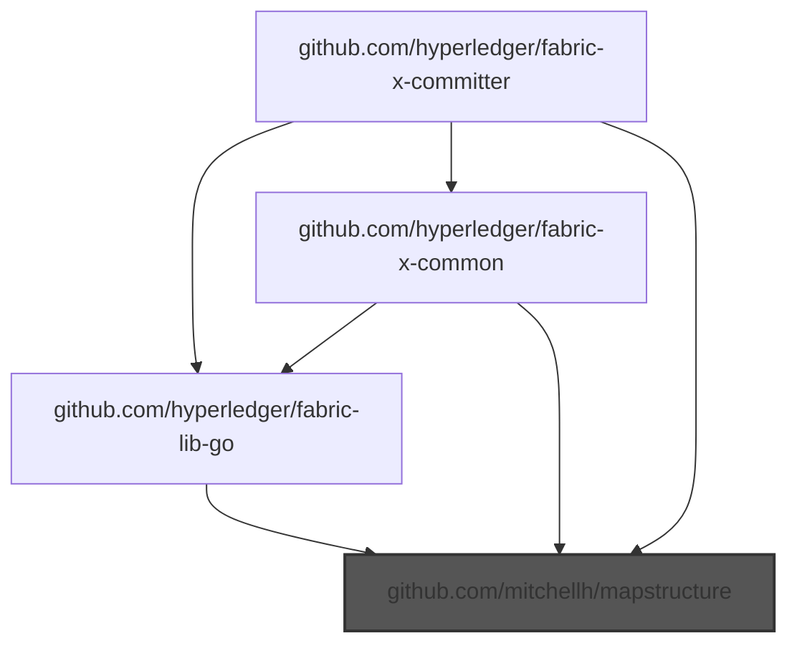
  - 🎯 Blamed: `github.com/hyperledger/fabric-lib-go`

    - `github.com/hyperledger/fabric-lib-go` -> `github.com/mitchellh/mapstructure`

  - 🎯 Blamed: `github.com/hyperledger/fabric-x-common`

    - `github.com/hyperledger/fabric-x-common` -> `github.com/mitchellh/mapstructure`
    - ... and 1 more

  - 🎯 Blamed: `github.com/mitchellh/mapstructure`

    - `github.com/mitchellh/mapstructure`

- **📦 github.com/munnerz/goautoneg**

  Root to pkg: `github.com/prometheus/client_golang` -> `github.com/prometheus/common` -> `github.com/munnerz/goautoneg`

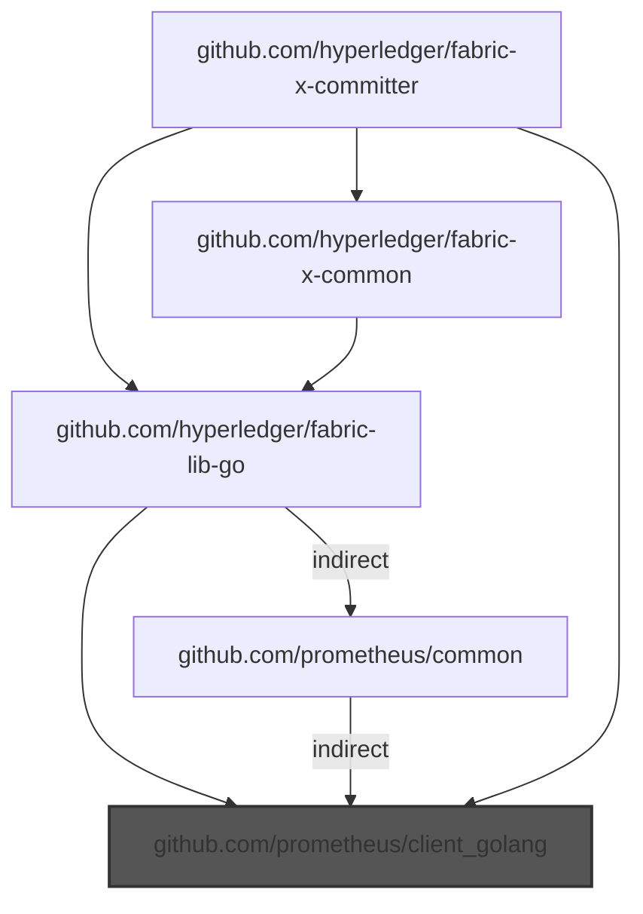
  - 🎯 Blamed: `github.com/hyperledger/fabric-lib-go`

    - `github.com/hyperledger/fabric-lib-go` -> `github.com/prometheus/client_golang`
    - ... and 1 more

  - 🎯 Blamed: `github.com/hyperledger/fabric-x-common`

    - `github.com/hyperledger/fabric-x-common` -> `github.com/hyperledger/fabric-lib-go` -> `github.com/prometheus/client_golang`
    - ... and 1 more

  - 🎯 Blamed: `github.com/prometheus/client_golang`

    - `github.com/prometheus/client_golang`

- **📦 github.com/pmezard/go-difflib**

  Root to pkg: `github.com/stretchr/testify` -> `github.com/pmezard/go-difflib`

```mermaid
graph TD
    bitbucket.org/creachadair/stringset --> honnef.co/go/tools
    cloud.google.com/go/longrunning --> google.golang.org/genproto/googleapis/api
    cloud.google.com/go/longrunning --> google.golang.org/grpc
    cloud.google.com/go/longrunning -->|indirect| go.opentelemetry.io/contrib/instrumentation/net/http/otelhttp
    github.com/IBM/idemix --> github.com/IBM/idemix/bccsp/schemes/aries
    github.com/IBM/idemix --> github.com/IBM/idemix/bccsp/schemes/weak-bb
    github.com/IBM/idemix --> github.com/IBM/idemix/bccsp/types
    github.com/IBM/idemix --> github.com/IBM/mathlib
    github.com/IBM/idemix --> github.com/hyperledger/aries-bbs-go
    github.com/IBM/idemix --> github.com/hyperledger/fabric-protos-go-apiv2
    github.com/IBM/idemix --> github.com/onsi/ginkgo/v2
    github.com/IBM/idemix --> github.com/onsi/gomega
    github.com/IBM/idemix --> github.com/stretchr/testify
    github.com/IBM/idemix --> github.com/sykesm/zap-logfmt
    github.com/IBM/idemix --> go.uber.org/zap
    github.com/IBM/idemix --> google.golang.org/grpc
    github.com/IBM/idemix/bccsp/schemes/aries --> github.com/IBM/idemix/bccsp/schemes/weak-bb
    github.com/IBM/idemix/bccsp/schemes/aries --> github.com/IBM/idemix/bccsp/types
    github.com/IBM/idemix/bccsp/schemes/aries --> github.com/IBM/mathlib
    github.com/IBM/idemix/bccsp/schemes/aries --> github.com/hyperledger/aries-bbs-go
    github.com/IBM/idemix/bccsp/schemes/aries --> github.com/stretchr/testify
    github.com/IBM/idemix/bccsp/schemes/weak-bb --> github.com/IBM/mathlib
    github.com/IBM/idemix/bccsp/types --> github.com/IBM/mathlib
    github.com/IBM/mathlib --> github.com/consensys/gnark-crypto
    github.com/IBM/mathlib --> github.com/stretchr/testify
    github.com/Kunde21/markdownfmt/v3 --> github.com/pkg/diff
    github.com/Kunde21/markdownfmt/v3 --> github.com/stretchr/testify
    github.com/Microsoft/go-winio --> github.com/sirupsen/logrus
    github.com/bitfield/gotestdox --> github.com/rogpeppe/go-internal
    github.com/bufbuild/protocompile --> github.com/stretchr/testify
    github.com/cockroachdb/errors --> github.com/getsentry/sentry-go
    github.com/cockroachdb/errors --> github.com/kr/pretty
    github.com/cockroachdb/errors --> github.com/stretchr/testify
    github.com/cockroachdb/errors --> google.golang.org/grpc
    github.com/consensys/gnark-crypto --> github.com/stretchr/testify
    github.com/consensys/gnark-crypto -->|indirect| github.com/kr/pretty
    github.com/containerd/errdefs/pkg --> google.golang.org/grpc
    github.com/containerd/log --> github.com/sirupsen/logrus
    github.com/docker/docker --> github.com/Microsoft/go-winio
    github.com/docker/docker --> go.opentelemetry.io/contrib/instrumentation/net/http/otelhttp
    github.com/docker/docker --> go.opentelemetry.io/otel/exporters/otlp/otlptrace/otlptracehttp
    github.com/docker/docker --> go.opentelemetry.io/otel/trace
    github.com/docker/go-connections --> github.com/Microsoft/go-winio
    github.com/fsouza/go-dockerclient --> github.com/Microsoft/go-winio
    github.com/fsouza/go-dockerclient --> github.com/moby/go-archive
    github.com/fsouza/go-dockerclient --> github.com/moby/moby/client
    github.com/gavv/httpexpect/v2 --> github.com/sanity-io/litter
    github.com/gavv/httpexpect/v2 --> github.com/stretchr/testify
    github.com/gavv/httpexpect/v2 --> github.com/xeipuuv/gojsonschema
    github.com/gavv/httpexpect/v2 --> moul.io/http2curl/v2
    github.com/gavv/httpexpect/v2 -->|indirect| github.com/onsi/ginkgo
    github.com/gavv/httpexpect/v2 -->|indirect| github.com/onsi/gomega
    github.com/getsentry/sentry-go --> github.com/stretchr/testify
    github.com/getsentry/sentry-go -->|indirect| github.com/kr/pretty
    github.com/getsentry/sentry-go -->|indirect| github.com/rogpeppe/go-internal
    github.com/go-playground/validator/v10 --> github.com/leodido/go-urn
    github.com/go-task/slim-sprig --> github.com/stretchr/testify
    github.com/go-task/slim-sprig/v3 --> github.com/stretchr/testify
    github.com/googleapis/api-linter/v2 --> bitbucket.org/creachadair/stringset
    github.com/googleapis/api-linter/v2 --> cloud.google.com/go/longrunning
    github.com/googleapis/api-linter/v2 --> github.com/bufbuild/protocompile
    github.com/googleapis/api-linter/v2 --> github.com/stoewer/go-strcase
    github.com/googleapis/api-linter/v2 --> google.golang.org/genproto/googleapis/api
    github.com/grpc-ecosystem/grpc-gateway/v2 --> google.golang.org/genproto/googleapis/api
    github.com/grpc-ecosystem/grpc-gateway/v2 --> google.golang.org/grpc
    github.com/hyperledger-labs/SmartBFT --> github.com/stretchr/testify
    github.com/hyperledger-labs/SmartBFT --> go.uber.org/zap
    github.com/hyperledger-labs/SmartBFT -->|indirect| github.com/stretchr/objx
    github.com/hyperledger/aries-bbs-go --> github.com/IBM/mathlib
    github.com/hyperledger/aries-bbs-go --> github.com/stretchr/testify
    github.com/hyperledger/fabric-lib-go --> github.com/onsi/ginkgo/v2
    github.com/hyperledger/fabric-lib-go --> github.com/onsi/gomega
    github.com/hyperledger/fabric-lib-go --> github.com/prometheus/client_golang
    github.com/hyperledger/fabric-lib-go --> github.com/spf13/viper
    github.com/hyperledger/fabric-lib-go --> github.com/stretchr/testify
    github.com/hyperledger/fabric-lib-go --> github.com/sykesm/zap-logfmt
    github.com/hyperledger/fabric-lib-go --> go.uber.org/zap
    github.com/hyperledger/fabric-lib-go --> google.golang.org/grpc
    github.com/hyperledger/fabric-lib-go -->|indirect| github.com/go-task/slim-sprig/v3
    github.com/hyperledger/fabric-protos-go-apiv2 --> google.golang.org/grpc
    github.com/hyperledger/fabric-x-committer --> github.com/cockroachdb/errors
    github.com/hyperledger/fabric-x-committer --> github.com/consensys/gnark-crypto
    github.com/hyperledger/fabric-x-committer --> github.com/docker/docker
    github.com/hyperledger/fabric-x-committer --> github.com/docker/go-connections
    github.com/hyperledger/fabric-x-committer --> github.com/fsouza/go-dockerclient
    github.com/hyperledger/fabric-x-committer --> github.com/gavv/httpexpect/v2
    github.com/hyperledger/fabric-x-committer --> github.com/go-playground/validator/v10
    github.com/hyperledger/fabric-x-committer --> github.com/go-task/slim-sprig/v3
    github.com/hyperledger/fabric-x-committer --> github.com/grpc-ecosystem/grpc-gateway/v2
    github.com/hyperledger/fabric-x-committer --> github.com/hyperledger/fabric-lib-go
    github.com/hyperledger/fabric-x-committer --> github.com/hyperledger/fabric-protos-go-apiv2
    github.com/hyperledger/fabric-x-committer --> github.com/hyperledger/fabric-x-common
    github.com/hyperledger/fabric-x-committer --> github.com/jackc/puddle/v2
    github.com/hyperledger/fabric-x-committer --> github.com/prometheus/client_golang
    github.com/hyperledger/fabric-x-committer --> github.com/spf13/viper
    github.com/hyperledger/fabric-x-committer --> github.com/stretchr/testify
    github.com/hyperledger/fabric-x-committer --> github.com/yugabyte/pgx/v5
    github.com/hyperledger/fabric-x-committer --> go.uber.org/mock
    github.com/hyperledger/fabric-x-committer --> go.uber.org/zap
    github.com/hyperledger/fabric-x-committer --> google.golang.org/genproto/googleapis/api
    github.com/hyperledger/fabric-x-committer --> google.golang.org/grpc
    github.com/hyperledger/fabric-x-committer -->|tool| github.com/Kunde21/markdownfmt/v3
    github.com/hyperledger/fabric-x-committer -->|tool| github.com/googleapis/api-linter/v2
    github.com/hyperledger/fabric-x-committer -->|tool| google.golang.org/grpc/cmd/protoc-gen-go-grpc
    github.com/hyperledger/fabric-x-committer -->|tool| gotest.tools/gotestsum
    github.com/hyperledger/fabric-x-committer -->|tool| mvdan.cc/gofumpt
    github.com/hyperledger/fabric-x-common --> github.com/IBM/idemix
    github.com/hyperledger/fabric-x-common --> github.com/cockroachdb/errors
    github.com/hyperledger/fabric-x-common --> github.com/hyperledger-labs/SmartBFT
    github.com/hyperledger/fabric-x-common --> github.com/hyperledger/fabric-lib-go
    github.com/hyperledger/fabric-x-common --> github.com/hyperledger/fabric-protos-go-apiv2
    github.com/hyperledger/fabric-x-common --> github.com/onsi/ginkgo/v2
    github.com/hyperledger/fabric-x-common --> github.com/onsi/gomega
    github.com/hyperledger/fabric-x-common --> github.com/spf13/viper
    github.com/hyperledger/fabric-x-common --> github.com/stretchr/testify
    github.com/hyperledger/fabric-x-common --> github.com/syndtr/goleveldb
    github.com/hyperledger/fabric-x-common --> go.uber.org/zap
    github.com/hyperledger/fabric-x-common --> google.golang.org/grpc
    github.com/hyperledger/fabric-x-common -->|tool| github.com/googleapis/api-linter/v2
    github.com/hyperledger/fabric-x-common -->|tool| google.golang.org/grpc/cmd/protoc-gen-go-grpc
    github.com/hyperledger/fabric-x-common -->|tool| gotest.tools/gotestsum
    github.com/hyperledger/fabric-x-common -->|tool| mvdan.cc/gofumpt
    github.com/jackc/pgpassfile --> github.com/stretchr/testify
    github.com/jackc/pgservicefile --> github.com/stretchr/testify
    github.com/jackc/pgx/v5 --> github.com/jackc/pgpassfile
    github.com/jackc/pgx/v5 --> github.com/jackc/pgservicefile
    github.com/jackc/pgx/v5 --> github.com/jackc/puddle/v2
    github.com/jackc/pgx/v5 --> github.com/stretchr/testify
    github.com/jackc/pgx/v5 -->|indirect| github.com/kr/pretty
    github.com/jackc/puddle/v2 --> github.com/stretchr/testify
    github.com/kr/pretty --> github.com/rogpeppe/go-internal
    github.com/leodido/go-urn --> github.com/stretchr/testify
    github.com/moby/go-archive --> github.com/containerd/log
    github.com/moby/moby/client --> github.com/Microsoft/go-winio
    github.com/moby/moby/client --> github.com/containerd/errdefs/pkg
    github.com/moby/moby/client --> github.com/docker/go-connections
    github.com/moby/moby/client --> go.opentelemetry.io/contrib/instrumentation/net/http/otelhttp
    github.com/moby/moby/client --> go.opentelemetry.io/otel/trace
    github.com/onsi/ginkgo --> github.com/go-task/slim-sprig
    github.com/onsi/ginkgo --> github.com/onsi/gomega
    github.com/onsi/ginkgo/v2 --> github.com/go-task/slim-sprig
    github.com/onsi/ginkgo/v2 --> github.com/onsi/gomega
    github.com/onsi/gomega --> github.com/onsi/ginkgo
    github.com/onsi/gomega --> github.com/onsi/ginkgo/v2
    github.com/pkg/diff --> github.com/sergi/go-diff
    github.com/pkg/diff --> github.com/stretchr/testify
    github.com/prometheus/client_golang --> github.com/prometheus/common
    github.com/prometheus/client_golang -->|indirect| github.com/kr/pretty
    github.com/prometheus/common --> github.com/stretchr/testify
    github.com/prometheus/common -->|indirect| github.com/prometheus/client_golang
    github.com/prometheus/common -->|indirect| github.com/rogpeppe/go-internal
    github.com/rogpeppe/go-internal --> github.com/pkg/diff
    github.com/sanity-io/litter --> github.com/stretchr/testify
    github.com/sergi/go-diff --> github.com/stretchr/testify
    github.com/sergi/go-diff -->|indirect| github.com/kr/pretty
    github.com/sirupsen/logrus --> github.com/stretchr/testify
    github.com/spf13/cast -->|indirect| github.com/kr/pretty
    github.com/spf13/cast -->|indirect| github.com/rogpeppe/go-internal
    github.com/spf13/viper --> github.com/spf13/cast
    github.com/spf13/viper --> github.com/stretchr/testify
    github.com/spf13/viper --> github.com/subosito/gotenv
    github.com/stoewer/go-strcase --> github.com/stretchr/testify
    github.com/stretchr/objx --> github.com/stretchr/testify
    github.com/subosito/gotenv --> github.com/stretchr/testify
    github.com/sykesm/zap-logfmt --> github.com/stretchr/testify
    github.com/sykesm/zap-logfmt --> go.uber.org/zap
    github.com/syndtr/goleveldb --> github.com/onsi/ginkgo
    github.com/syndtr/goleveldb --> github.com/onsi/gomega
    github.com/syndtr/goleveldb --> github.com/stretchr/testify
    github.com/tailscale/depaware --> github.com/pkg/diff
    github.com/xeipuuv/gojsonschema --> github.com/stretchr/testify
    github.com/yugabyte/pgx/v5 --> github.com/jackc/pgpassfile
    github.com/yugabyte/pgx/v5 --> github.com/jackc/pgservicefile
    github.com/yugabyte/pgx/v5 --> github.com/jackc/pgx/v5
    github.com/yugabyte/pgx/v5 --> github.com/jackc/puddle/v2
    github.com/yugabyte/pgx/v5 --> github.com/stretchr/testify
    go.opentelemetry.io/auto/sdk --> github.com/stretchr/testify
    go.opentelemetry.io/auto/sdk --> go.opentelemetry.io/otel
    go.opentelemetry.io/auto/sdk --> go.opentelemetry.io/otel/trace
    go.opentelemetry.io/auto/sdk -->|indirect| github.com/kr/pretty
    go.opentelemetry.io/auto/sdk -->|indirect| github.com/rogpeppe/go-internal
    go.opentelemetry.io/contrib/instrumentation/net/http/otelhttp --> github.com/stretchr/testify
    go.opentelemetry.io/contrib/instrumentation/net/http/otelhttp --> go.opentelemetry.io/otel
    go.opentelemetry.io/contrib/instrumentation/net/http/otelhttp --> go.opentelemetry.io/otel/metric
    go.opentelemetry.io/contrib/instrumentation/net/http/otelhttp --> go.opentelemetry.io/otel/trace
    go.opentelemetry.io/otel --> github.com/stretchr/testify
    go.opentelemetry.io/otel --> go.opentelemetry.io/auto/sdk
    go.opentelemetry.io/otel --> go.opentelemetry.io/otel/metric
    go.opentelemetry.io/otel --> go.opentelemetry.io/otel/trace
    go.opentelemetry.io/otel/exporters/otlp/otlptrace/otlptracehttp --> github.com/stretchr/testify
    go.opentelemetry.io/otel/exporters/otlp/otlptrace/otlptracehttp --> go.opentelemetry.io/otel
    go.opentelemetry.io/otel/exporters/otlp/otlptrace/otlptracehttp --> go.opentelemetry.io/otel/metric
    go.opentelemetry.io/otel/exporters/otlp/otlptrace/otlptracehttp --> go.opentelemetry.io/otel/trace
    go.opentelemetry.io/otel/exporters/otlp/otlptrace/otlptracehttp --> google.golang.org/grpc
    go.opentelemetry.io/otel/exporters/otlp/otlptrace/otlptracehttp -->|indirect| github.com/grpc-ecosystem/grpc-gateway/v2
    go.opentelemetry.io/otel/exporters/otlp/otlptrace/otlptracehttp -->|indirect| google.golang.org/genproto/googleapis/api
    go.opentelemetry.io/otel/metric --> github.com/stretchr/testify
    go.opentelemetry.io/otel/metric --> go.opentelemetry.io/otel
    go.opentelemetry.io/otel/trace --> github.com/stretchr/testify
    go.opentelemetry.io/otel/trace --> go.opentelemetry.io/otel
    go.uber.org/atomic --> github.com/stretchr/testify
    go.uber.org/mock --> github.com/stretchr/testify
    go.uber.org/multierr --> github.com/stretchr/testify
    go.uber.org/multierr --> go.uber.org/atomic
    go.uber.org/multierr --> honnef.co/go/tools
    go.uber.org/zap --> github.com/stretchr/testify
    go.uber.org/zap --> go.uber.org/atomic
    go.uber.org/zap --> go.uber.org/multierr
    google.golang.org/genproto/googleapis/api --> google.golang.org/grpc
    google.golang.org/grpc --> go.opentelemetry.io/otel
    google.golang.org/grpc --> go.opentelemetry.io/otel/metric
    google.golang.org/grpc --> go.opentelemetry.io/otel/trace
    google.golang.org/grpc/cmd/protoc-gen-go-grpc --> google.golang.org/grpc
    gotest.tools/gotestsum --> github.com/bitfield/gotestdox
    honnef.co/go/tools --> github.com/rogpeppe/go-internal
    moul.io/http2curl/v2 --> github.com/tailscale/depaware
    mvdan.cc/gofumpt --> github.com/rogpeppe/go-internal
    mvdan.cc/gofumpt -->|indirect| github.com/kr/pretty
    style github.com/stretchr/testify fill:#555,stroke:#333,stroke-width:2px
```
  - 🎯 Blamed: `github.com/Kunde21/markdownfmt/v3`

    - `github.com/Kunde21/markdownfmt/v3` -> `github.com/stretchr/testify`
    - ... and 3 more

  - 🎯 Blamed: `github.com/cockroachdb/errors`

    - `github.com/cockroachdb/errors` -> `github.com/stretchr/testify`
    - ... and 52 more

  - 🎯 Blamed: `github.com/consensys/gnark-crypto`

    - `github.com/consensys/gnark-crypto` -> `github.com/stretchr/testify`
    - ... and 2 more

  - 🎯 Blamed: `github.com/docker/docker`

    - `github.com/docker/docker` -> `go.opentelemetry.io/contrib/instrumentation/net/http/otelhttp` -> `github.com/stretchr/testify`
    - ... and 272 more

  - 🎯 Blamed: `github.com/docker/go-connections`

    - `github.com/docker/go-connections` -> `github.com/Microsoft/go-winio` -> `github.com/sirupsen/logrus` -> `github.com/stretchr/testify`

  - 🎯 Blamed: `github.com/fsouza/go-dockerclient`

    - `github.com/fsouza/go-dockerclient` -> `github.com/Microsoft/go-winio` -> `github.com/sirupsen/logrus` -> `github.com/stretchr/testify`
    - ... and 119 more

  - 🎯 Blamed: `github.com/gavv/httpexpect/v2`

    - `github.com/gavv/httpexpect/v2` -> `github.com/stretchr/testify`
    - ... and 9 more

  - 🎯 Blamed: `github.com/go-playground/validator/v10`

    - `github.com/go-playground/validator/v10` -> `github.com/leodido/go-urn` -> `github.com/stretchr/testify`

  - 🎯 Blamed: `github.com/go-task/slim-sprig/v3`

    - `github.com/go-task/slim-sprig/v3` -> `github.com/stretchr/testify`

  - 🎯 Blamed: `github.com/googleapis/api-linter/v2`

    - `github.com/googleapis/api-linter/v2` -> `github.com/bufbuild/protocompile` -> `github.com/stretchr/testify`
    - ... and 176 more

  - 🎯 Blamed: `github.com/grpc-ecosystem/grpc-gateway/v2`

    - `github.com/grpc-ecosystem/grpc-gateway/v2` -> `google.golang.org/grpc` -> `go.opentelemetry.io/otel` -> `github.com/stretchr/testify`
    - ... and 83 more

  - 🎯 Blamed: `github.com/hyperledger/fabric-lib-go`

    - `github.com/hyperledger/fabric-lib-go` -> `github.com/stretchr/testify`
    - ... and 76 more

  - 🎯 Blamed: `github.com/hyperledger/fabric-protos-go-apiv2`

    - `github.com/hyperledger/fabric-protos-go-apiv2` -> `google.golang.org/grpc` -> `go.opentelemetry.io/otel` -> `github.com/stretchr/testify`
    - ... and 44 more

  - 🎯 Blamed: `github.com/hyperledger/fabric-x-common`

    - `github.com/hyperledger/fabric-x-common` -> `github.com/stretchr/testify`
    - ... and 567 more

  - 🎯 Blamed: `github.com/jackc/puddle/v2`

    - `github.com/jackc/puddle/v2` -> `github.com/stretchr/testify`

  - 🎯 Blamed: `github.com/prometheus/client_golang`

    - `github.com/prometheus/client_golang` -> `github.com/prometheus/common` -> `github.com/stretchr/testify`
    - ... and 6 more

  - 🎯 Blamed: `github.com/spf13/viper`

    - `github.com/spf13/viper` -> `github.com/stretchr/testify`
    - ... and 5 more

  - 🎯 Blamed: `github.com/stretchr/testify`

    - `github.com/stretchr/testify`

  - 🎯 Blamed: `github.com/yugabyte/pgx/v5`

    - `github.com/yugabyte/pgx/v5` -> `github.com/stretchr/testify`
    - ... and 9 more

  - 🎯 Blamed: `go.uber.org/mock`

    - `go.uber.org/mock` -> `github.com/stretchr/testify`

  - 🎯 Blamed: `go.uber.org/zap`

    - `go.uber.org/zap` -> `github.com/stretchr/testify`
    - ... and 5 more

  - 🎯 Blamed: `google.golang.org/genproto/googleapis/api`

    - `google.golang.org/genproto/googleapis/api` -> `google.golang.org/grpc` -> `go.opentelemetry.io/otel` -> `github.com/stretchr/testify`
    - ... and 44 more

  - 🎯 Blamed: `google.golang.org/grpc`

    - `google.golang.org/grpc` -> `go.opentelemetry.io/otel` -> `github.com/stretchr/testify`
    - ... and 52 more

  - 🎯 Blamed: `google.golang.org/grpc/cmd/protoc-gen-go-grpc`

    - `google.golang.org/grpc/cmd/protoc-gen-go-grpc` -> `google.golang.org/grpc` -> `go.opentelemetry.io/otel` -> `github.com/stretchr/testify`
    - ... and 44 more

  - 🎯 Blamed: `gotest.tools/gotestsum`

    - `gotest.tools/gotestsum` -> `github.com/bitfield/gotestdox` -> `github.com/rogpeppe/go-internal` -> `github.com/pkg/diff` -> `github.com/stretchr/testify`
    - ... and 1 more

  - 🎯 Blamed: `mvdan.cc/gofumpt`

    - `mvdan.cc/gofumpt` -> `github.com/rogpeppe/go-internal` -> `github.com/pkg/diff` -> `github.com/stretchr/testify`
    - ... and 3 more

- **📦 github.com/sykesm/zap-logfmt**

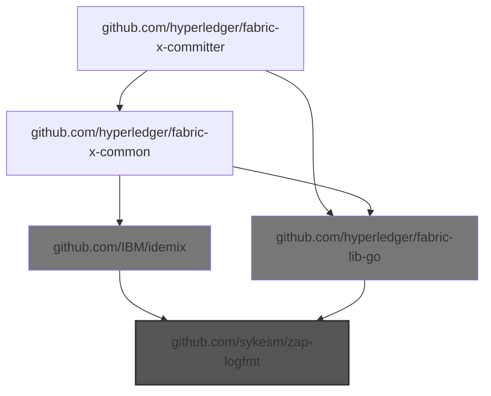
  - Choke: github.com/IBM/idemix

    Root to choke:
    - - `github.com/hyperledger/fabric-x-committer` -> `github.com/hyperledger/fabric-x-common` -> `github.com/IBM/idemix`

    Root from choke:
    - - `github.com/IBM/idemix` -> `github.com/sykesm/zap-logfmt`
  - Choke: github.com/hyperledger/fabric-lib-go

    Root to choke:
    - - `github.com/hyperledger/fabric-x-committer` -> `github.com/hyperledger/fabric-lib-go`
    - - ... and 1 more

    Root from choke:
    - - `github.com/hyperledger/fabric-lib-go` -> `github.com/sykesm/zap-logfmt`
    - - ... and 1 more
  - 🎯 Blamed: `github.com/hyperledger/fabric-lib-go`

    - `github.com/hyperledger/fabric-lib-go` -> `github.com/sykesm/zap-logfmt`

  - 🎯 Blamed: `github.com/hyperledger/fabric-x-common`

    - `github.com/hyperledger/fabric-x-common` -> `github.com/IBM/idemix` -> `github.com/sykesm/zap-logfmt`
    - ... and 1 more

- **📦 github.com/xeipuuv/gojsonpointer**

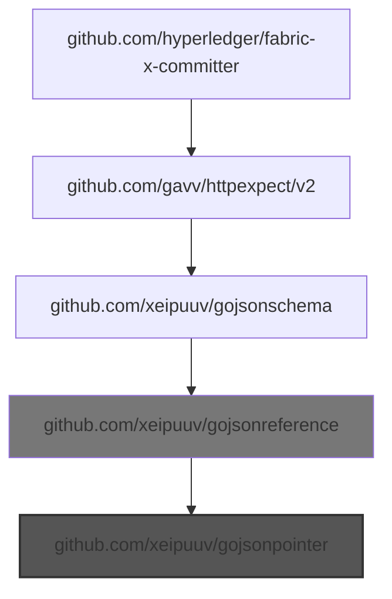
  - Choke: github.com/xeipuuv/gojsonreference

    Root to choke:
    - - `github.com/hyperledger/fabric-x-committer` -> `github.com/gavv/httpexpect/v2` -> `github.com/xeipuuv/gojsonschema` -> `github.com/xeipuuv/gojsonreference`

    Root from choke:
    - - `github.com/xeipuuv/gojsonreference` -> `github.com/xeipuuv/gojsonpointer`
  - 🎯 Blamed: `github.com/gavv/httpexpect/v2`

    - `github.com/gavv/httpexpect/v2` -> `github.com/xeipuuv/gojsonschema` -> `github.com/xeipuuv/gojsonreference` -> `github.com/xeipuuv/gojsonpointer`

- **📦 github.com/xeipuuv/gojsonreference**

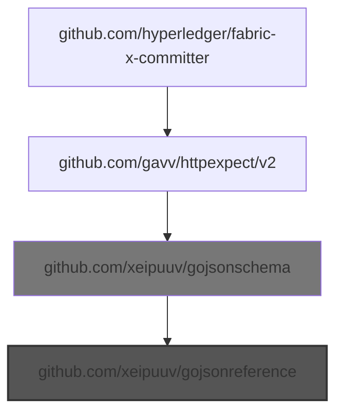
  - Choke: github.com/xeipuuv/gojsonschema

    Root to choke:
    - - `github.com/hyperledger/fabric-x-committer` -> `github.com/gavv/httpexpect/v2` -> `github.com/xeipuuv/gojsonschema`

    Root from choke:
    - - `github.com/xeipuuv/gojsonschema` -> `github.com/xeipuuv/gojsonreference`
  - 🎯 Blamed: `github.com/gavv/httpexpect/v2`

    - `github.com/gavv/httpexpect/v2` -> `github.com/xeipuuv/gojsonschema` -> `github.com/xeipuuv/gojsonreference`

- **📦 github.com/xeipuuv/gojsonschema**

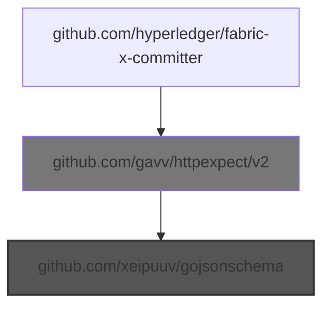
  - Choke: github.com/gavv/httpexpect/v2

    Root to choke:
    - - `github.com/hyperledger/fabric-x-committer` -> `github.com/gavv/httpexpect/v2`

    Root from choke:
    - - `github.com/gavv/httpexpect/v2` -> `github.com/xeipuuv/gojsonschema`
  - 🎯 Blamed: `github.com/gavv/httpexpect/v2`

    - `github.com/gavv/httpexpect/v2` -> `github.com/xeipuuv/gojsonschema`

---

## ⚠️ DIRECT UNMAINTAINED IMPORTS (3 found)

- **📦 github.com/mitchellh/mapstructure**

  **📝 Imported in your code at:**

  - `cmd/config/config_decoder.go:19`
  - `loadgen/workload/distributions_test.go:16`

- **📦 github.com/prometheus/client_golang**

  **📝 Imported in your code at:**

  - `loadgen/metrics/metrics.go:13`
  - `service/coordinator/dependencygraph/metrics.go:10`
  - `service/coordinator/metrics.go:10`
  - ... and 13 more location(s)

- **📦 github.com/stretchr/testify**

  **📝 Imported in your code at:**

  - `api/servicepb/height_test.go:12`
  - `cmd/cliutil/test_exports.go:21`
  - `cmd/cliutil/test_exports.go:22`
  - ... and 151 more location(s)

---

## 🎯 BLAME POINT: `github.com/Kunde21/markdownfmt/v3` (tool)
Responsible for 2 unmaintained import(s)

- **⚠️  Unmaintained imports:**

  - **📦 github.com/kr/pretty**
    - `github.com/Kunde21/markdownfmt/v3` -> `github.com/pkg/diff` -> `github.com/sergi/go-diff` *(indirect)* -> `github.com/kr/pretty`

  - **📦 github.com/kr/text**
    - `github.com/Kunde21/markdownfmt/v3` -> `github.com/pkg/diff` -> `github.com/sergi/go-diff` *(indirect)* -> `github.com/kr/pretty` -> `github.com/kr/text`

- *(Import location not found in code)*

---

## 🎯 BLAME POINT: `github.com/cockroachdb/errors`
Responsible for 3 unmaintained import(s)

- **⚠️  Unmaintained imports:**

  - **📦 github.com/gogo/protobuf**
    - `github.com/cockroachdb/errors` -> `github.com/gogo/protobuf`

  - **📦 github.com/kr/pretty**
    - `github.com/cockroachdb/errors` -> `github.com/kr/pretty`
    - `github.com/cockroachdb/errors` -> `github.com/getsentry/sentry-go` *(indirect)* -> `github.com/kr/pretty`
    - ... and 2 more

  - **📦 github.com/kr/text**
    - `github.com/cockroachdb/errors` -> `github.com/kr/pretty` -> `github.com/kr/text`
    - `github.com/cockroachdb/errors` -> `github.com/getsentry/sentry-go` *(indirect)* -> `github.com/kr/pretty` -> `github.com/kr/text`
    - ... and 2 more

- **📝 Imported in your code at:**

  - `cmd/committer/config.go:10`
  - `cmd/committer/healthcheck_cmd_test.go:13`
  - `cmd/committer/start_cmd.go:13`
  - ... and 84 more location(s)

---

## 🎯 BLAME POINT: `github.com/consensys/gnark-crypto`
Responsible for 2 unmaintained import(s)

- **⚠️  Unmaintained imports:**

  - **📦 github.com/kr/pretty**
    - `github.com/consensys/gnark-crypto` *(indirect)* -> `github.com/kr/pretty`

  - **📦 github.com/kr/text**
    - `github.com/consensys/gnark-crypto` *(indirect)* -> `github.com/kr/pretty` -> `github.com/kr/text`

- **📝 Imported in your code at:**

  - `utils/signature/verify_bls.go:11`
  - `utils/signature/verify_schemes_test.go:20`
  - `utils/testsig/digest_signer.go:16`
  - ... and 3 more location(s)

---

## 🎯 BLAME POINT: `github.com/docker/docker`
Responsible for 3 unmaintained import(s)

- **⚠️  Unmaintained imports:**

  - **📦 github.com/kr/pretty**
    - `github.com/docker/docker` -> `go.opentelemetry.io/contrib/instrumentation/net/http/otelhttp` -> `go.opentelemetry.io/otel` -> `go.opentelemetry.io/auto/sdk` *(indirect)* -> `github.com/kr/pretty`
    - `github.com/docker/docker` -> `go.opentelemetry.io/otel/exporters/otlp/otlptrace/otlptracehttp` -> `go.opentelemetry.io/otel` -> `go.opentelemetry.io/auto/sdk` *(indirect)* -> `github.com/kr/pretty`
    - ... and 40 more

  - **📦 github.com/kr/text**
    - `github.com/docker/docker` -> `go.opentelemetry.io/contrib/instrumentation/net/http/otelhttp` -> `go.opentelemetry.io/otel` -> `go.opentelemetry.io/auto/sdk` *(indirect)* -> `github.com/kr/pretty` -> `github.com/kr/text`
    - `github.com/docker/docker` -> `go.opentelemetry.io/otel/exporters/otlp/otlptrace/otlptracehttp` -> `go.opentelemetry.io/otel` -> `go.opentelemetry.io/auto/sdk` *(indirect)* -> `github.com/kr/pretty` -> `github.com/kr/text`
    - ... and 53 more

  - **📦 go.opentelemetry.io/otel**
    - `github.com/docker/docker` -> `go.opentelemetry.io/contrib/instrumentation/net/http/otelhttp` -> `go.opentelemetry.io/otel`
    - `github.com/docker/docker` -> `go.opentelemetry.io/otel/exporters/otlp/otlptrace/otlptracehttp` -> `go.opentelemetry.io/otel`
    - ... and 11 more

- **📝 Imported in your code at:**

  - `docker/test/common.go:22`
  - `docker/test/common.go:23`
  - `docker/test/container_release_image_test.go:17`
  - ... and 1 more location(s)

---

## 🎯 BLAME POINT: `github.com/fsouza/go-dockerclient`
Responsible for 4 unmaintained import(s)

- **⚠️  Unmaintained imports:**

  - **📦 github.com/gogo/protobuf**
    - `github.com/fsouza/go-dockerclient` -> `github.com/moby/moby/client` -> `github.com/containerd/errdefs/pkg` *(indirect)* -> `github.com/gogo/protobuf`

  - **📦 github.com/kr/pretty**
    - `github.com/fsouza/go-dockerclient` -> `github.com/moby/moby/client` -> `go.opentelemetry.io/contrib/instrumentation/net/http/otelhttp` -> `go.opentelemetry.io/otel` -> `go.opentelemetry.io/auto/sdk` *(indirect)* -> `github.com/kr/pretty`
    - `github.com/fsouza/go-dockerclient` -> `github.com/moby/moby/client` -> `go.opentelemetry.io/otel/trace` -> `go.opentelemetry.io/otel` -> `go.opentelemetry.io/auto/sdk` *(indirect)* -> `github.com/kr/pretty`
    - ... and 21 more

  - **📦 github.com/kr/text**
    - `github.com/fsouza/go-dockerclient` -> `github.com/moby/moby/client` -> `go.opentelemetry.io/contrib/instrumentation/net/http/otelhttp` -> `go.opentelemetry.io/otel` -> `go.opentelemetry.io/auto/sdk` *(indirect)* -> `github.com/kr/pretty` -> `github.com/kr/text`
    - `github.com/fsouza/go-dockerclient` -> `github.com/moby/moby/client` -> `go.opentelemetry.io/otel/trace` -> `go.opentelemetry.io/otel` -> `go.opentelemetry.io/auto/sdk` *(indirect)* -> `github.com/kr/pretty` -> `github.com/kr/text`
    - ... and 26 more

  - **📦 go.opentelemetry.io/otel**
    - `github.com/fsouza/go-dockerclient` -> `github.com/moby/moby/client` -> `go.opentelemetry.io/contrib/instrumentation/net/http/otelhttp` -> `go.opentelemetry.io/otel`
    - `github.com/fsouza/go-dockerclient` -> `github.com/moby/moby/client` -> `go.opentelemetry.io/otel/trace` -> `go.opentelemetry.io/otel`
    - ... and 5 more

- **📝 Imported in your code at:**

  - `integration/runner/cluster_controllers_test.go:14`
  - `utils/test/docker.go:13`
  - `utils/testdb/container.go:22`
  - ... and 1 more location(s)

---

## 🎯 BLAME POINT: `github.com/gavv/httpexpect/v2`
Responsible for 5 unmaintained import(s)

- **⚠️  Unmaintained imports:**

  - **📦 github.com/kr/pretty**
    - `github.com/gavv/httpexpect/v2` -> `moul.io/http2curl/v2` -> `github.com/tailscale/depaware` -> `github.com/pkg/diff` -> `github.com/sergi/go-diff` *(indirect)* -> `github.com/kr/pretty`

  - **📦 github.com/kr/text**
    - `github.com/gavv/httpexpect/v2` -> `moul.io/http2curl/v2` -> `github.com/tailscale/depaware` -> `github.com/pkg/diff` -> `github.com/sergi/go-diff` *(indirect)* -> `github.com/kr/pretty` -> `github.com/kr/text`

  - **📦 github.com/xeipuuv/gojsonpointer**
    - `github.com/gavv/httpexpect/v2` -> `github.com/xeipuuv/gojsonschema` -> `github.com/xeipuuv/gojsonreference` -> `github.com/xeipuuv/gojsonpointer`

  - **📦 github.com/xeipuuv/gojsonreference**
    - `github.com/gavv/httpexpect/v2` -> `github.com/xeipuuv/gojsonschema` -> `github.com/xeipuuv/gojsonreference`

  - **📦 github.com/xeipuuv/gojsonschema**
    - `github.com/gavv/httpexpect/v2` -> `github.com/xeipuuv/gojsonschema`

- **📝 Imported in your code at:**

  - `loadgen/client_test.go:19`

---

## 🎯 BLAME POINT: `github.com/go-playground/validator/v10`
Responsible for 2 unmaintained import(s)

- **⚠️  Unmaintained imports:**

  - **📦 github.com/go-playground/locales**
    - `github.com/go-playground/validator/v10` -> `github.com/go-playground/locales`
    - `github.com/go-playground/validator/v10` -> `github.com/go-playground/universal-translator` -> `github.com/go-playground/locales`

  - **📦 github.com/go-playground/universal-translator**
    - `github.com/go-playground/validator/v10` -> `github.com/go-playground/universal-translator`

- **📝 Imported in your code at:**

  - `cmd/config/app_config.go:18`

---

## 🎯 BLAME POINT: `github.com/googleapis/api-linter/v2` (tool)
Responsible for 3 unmaintained import(s)

- **⚠️  Unmaintained imports:**

  - **📦 github.com/kr/pretty**
    - `github.com/googleapis/api-linter/v2` -> `bitbucket.org/creachadair/stringset` -> `honnef.co/go/tools` -> `github.com/rogpeppe/go-internal` -> `gopkg.in/errgo.v2` *(indirect)* -> `github.com/kr/pretty`
    - `github.com/googleapis/api-linter/v2` -> `cloud.google.com/go/longrunning` *(indirect)* -> `go.opentelemetry.io/contrib/instrumentation/net/http/otelhttp` -> `go.opentelemetry.io/otel` -> `go.opentelemetry.io/auto/sdk` *(indirect)* -> `github.com/kr/pretty`
    - ... and 16 more

  - **📦 github.com/kr/text**
    - `github.com/googleapis/api-linter/v2` -> `bitbucket.org/creachadair/stringset` -> `honnef.co/go/tools` -> `github.com/rogpeppe/go-internal` -> `gopkg.in/errgo.v2` *(indirect)* -> `github.com/kr/pretty` -> `github.com/kr/text`
    - `github.com/googleapis/api-linter/v2` -> `cloud.google.com/go/longrunning` *(indirect)* -> `go.opentelemetry.io/contrib/instrumentation/net/http/otelhttp` -> `go.opentelemetry.io/otel` -> `go.opentelemetry.io/auto/sdk` *(indirect)* -> `github.com/kr/pretty` -> `github.com/kr/text`
    - ... and 20 more

  - **📦 go.opentelemetry.io/otel**
    - `github.com/googleapis/api-linter/v2` -> `cloud.google.com/go/longrunning` *(indirect)* -> `go.opentelemetry.io/contrib/instrumentation/net/http/otelhttp` -> `go.opentelemetry.io/otel`
    - `github.com/googleapis/api-linter/v2` -> `cloud.google.com/go/longrunning` *(indirect)* -> `go.opentelemetry.io/contrib/instrumentation/net/http/otelhttp` -> `go.opentelemetry.io/otel/metric` -> `go.opentelemetry.io/otel`
    - ... and 4 more

- *(Import location not found in code)*

---

## 🎯 BLAME POINT: `github.com/hyperledger/fabric-lib-go`
Responsible for 1 unmaintained import(s)

- **⚠️  Unmaintained imports:**

  - **📦 github.com/sykesm/zap-logfmt**
    - `github.com/hyperledger/fabric-lib-go` -> `github.com/sykesm/zap-logfmt`

- **📝 Imported in your code at:**

  - `cmd/cliutil/test_exports.go:18`
  - `cmd/config/app_config.go:19`
  - `cmd/config/app_config_test.go:16`
  - ... and 40 more location(s)

---

## 🎯 BLAME POINT: `github.com/hyperledger/fabric-x-common`
Responsible for 6 unmaintained import(s)

- **⚠️  Unmaintained imports:**

  - **📦 github.com/IBM/mathlib**
    - `github.com/hyperledger/fabric-x-common` -> `github.com/IBM/idemix` -> `github.com/IBM/mathlib`
    - `github.com/hyperledger/fabric-x-common` -> `github.com/IBM/idemix` -> `github.com/IBM/idemix/bccsp/schemes/aries` -> `github.com/IBM/mathlib`
    - ... and 6 more

  - **📦 github.com/Knetic/govaluate**
    - `github.com/hyperledger/fabric-x-common` -> `github.com/Knetic/govaluate`

  - **📦 github.com/davecgh/go-spew**
    - `github.com/hyperledger/fabric-x-common` -> `github.com/davecgh/go-spew`

  - **📦 github.com/kr/pretty**
    - `github.com/hyperledger/fabric-x-common` -> `github.com/IBM/idemix` -> `github.com/IBM/mathlib` *(indirect)* -> `github.com/rogpeppe/go-internal` -> `gopkg.in/errgo.v2` *(indirect)* -> `github.com/kr/pretty`
    - `github.com/hyperledger/fabric-x-common` -> `github.com/IBM/idemix` -> `github.com/IBM/idemix/bccsp/schemes/aries` -> `github.com/IBM/mathlib` *(indirect)* -> `github.com/rogpeppe/go-internal` -> `gopkg.in/errgo.v2` *(indirect)* -> `github.com/kr/pretty`
    - ... and 14 more

  - **📦 github.com/kr/text**
    - `github.com/hyperledger/fabric-x-common` -> `github.com/IBM/idemix` -> `github.com/IBM/mathlib` *(indirect)* -> `github.com/rogpeppe/go-internal` -> `gopkg.in/errgo.v2` *(indirect)* -> `github.com/kr/pretty` -> `github.com/kr/text`
    - `github.com/hyperledger/fabric-x-common` -> `github.com/IBM/idemix` -> `github.com/IBM/idemix/bccsp/schemes/aries` -> `github.com/IBM/mathlib` *(indirect)* -> `github.com/rogpeppe/go-internal` -> `gopkg.in/errgo.v2` *(indirect)* -> `github.com/kr/pretty` -> `github.com/kr/text`
    - ... and 14 more

  - **📦 github.com/sykesm/zap-logfmt**
    - `github.com/hyperledger/fabric-x-common` -> `github.com/IBM/idemix` -> `github.com/sykesm/zap-logfmt`

- **📝 Imported in your code at:**

  - `api/servicepb/common.pb.go:15`
  - `api/servicepb/common.pb.go:16`
  - `api/servicepb/coordinator.pb.go:15`
  - ... and 265 more location(s)

---

## 🎯 BLAME POINT: `github.com/prometheus/client_golang`
Responsible for 4 unmaintained import(s)

- **⚠️  Unmaintained imports:**

  - **📦 github.com/beorn7/perks**
    - `github.com/prometheus/client_golang` -> `github.com/beorn7/perks`
    - `github.com/prometheus/client_golang` -> `github.com/prometheus/common` *(indirect)* -> `github.com/beorn7/perks`

  - **📦 github.com/kr/pretty**
    - `github.com/prometheus/client_golang` -> `github.com/prometheus/common` *(indirect)* -> `github.com/rogpeppe/go-internal` -> `gopkg.in/errgo.v2` *(indirect)* -> `github.com/kr/pretty`
    - `github.com/prometheus/client_golang` -> `github.com/prometheus/common` *(indirect)* -> `github.com/rogpeppe/go-internal` -> `github.com/pkg/diff` -> `github.com/sergi/go-diff` *(indirect)* -> `github.com/kr/pretty`

  - **📦 github.com/kr/text**
    - `github.com/prometheus/client_golang` -> `github.com/prometheus/common` *(indirect)* -> `github.com/rogpeppe/go-internal` -> `gopkg.in/errgo.v2` *(indirect)* -> `github.com/kr/pretty` -> `github.com/kr/text`
    - `github.com/prometheus/client_golang` -> `github.com/prometheus/common` *(indirect)* -> `github.com/rogpeppe/go-internal` -> `github.com/pkg/diff` -> `github.com/sergi/go-diff` *(indirect)* -> `github.com/kr/pretty` -> `github.com/kr/text`

  - **📦 github.com/prometheus/client_golang**
    - `github.com/prometheus/client_golang`

- **📝 Imported in your code at:**

  - `loadgen/metrics/metrics.go:13`
  - `service/coordinator/dependencygraph/metrics.go:10`
  - `service/coordinator/metrics.go:10`
  - ... and 13 more location(s)

---

## 🎯 BLAME POINT: `github.com/spf13/viper`
Responsible for 2 unmaintained import(s)

- **⚠️  Unmaintained imports:**

  - **📦 github.com/kr/pretty**
    - `github.com/spf13/viper` -> `github.com/spf13/cast` *(indirect)* -> `github.com/kr/pretty`
    - `github.com/spf13/viper` -> `github.com/spf13/cast` *(indirect)* -> `github.com/rogpeppe/go-internal` -> `gopkg.in/errgo.v2` *(indirect)* -> `github.com/kr/pretty`
    - ... and 1 more

  - **📦 github.com/kr/text**
    - `github.com/spf13/viper` -> `github.com/spf13/cast` *(indirect)* -> `github.com/kr/text`
    - `github.com/spf13/viper` -> `github.com/spf13/cast` *(indirect)* -> `github.com/kr/pretty` -> `github.com/kr/text`
    - ... and 2 more

- **📝 Imported in your code at:**

  - `cmd/config/app_config.go:20`
  - `cmd/config/config_decoder.go:20`
  - `cmd/config/config_decoder_test.go:15`
  - ... and 2 more location(s)

---

## 🎯 BLAME POINT: `github.com/stretchr/testify`
Responsible for 2 unmaintained import(s)

- **⚠️  Unmaintained imports:**

  - **📦 github.com/davecgh/go-spew**
    - `github.com/stretchr/testify` -> `github.com/davecgh/go-spew`

  - **📦 github.com/stretchr/testify**
    - `github.com/stretchr/testify`

- **📝 Imported in your code at:**

  - `api/servicepb/height_test.go:12`
  - `cmd/cliutil/test_exports.go:21`
  - `cmd/cliutil/test_exports.go:22`
  - ... and 151 more location(s)

---

## 🎯 BLAME POINT: `github.com/yugabyte/pgx/v5`
Responsible for 3 unmaintained import(s)

- **⚠️  Unmaintained imports:**

  - **📦 github.com/jackc/pgpassfile**
    - `github.com/yugabyte/pgx/v5` -> `github.com/jackc/pgpassfile`
    - `github.com/yugabyte/pgx/v5` -> `github.com/jackc/pgx/v5` -> `github.com/jackc/pgpassfile`

  - **📦 github.com/kr/pretty**
    - `github.com/yugabyte/pgx/v5` -> `github.com/jackc/pgx/v5` *(indirect)* -> `github.com/kr/pretty`

  - **📦 github.com/kr/text**
    - `github.com/yugabyte/pgx/v5` -> `github.com/jackc/pgx/v5` *(indirect)* -> `github.com/kr/pretty` -> `github.com/kr/text`

- **📝 Imported in your code at:**

  - `service/query/batcher.go:16`
  - `service/query/batcher.go:17`
  - `service/query/query.go:18`
  - ... and 10 more location(s)

---

## 🎯 BLAME POINT: `go.uber.org/zap`
Responsible for 2 unmaintained import(s)

- **⚠️  Unmaintained imports:**

  - **📦 github.com/kr/pretty**
    - `go.uber.org/zap` -> `go.uber.org/multierr` -> `honnef.co/go/tools` -> `github.com/rogpeppe/go-internal` -> `gopkg.in/errgo.v2` *(indirect)* -> `github.com/kr/pretty`
    - `go.uber.org/zap` -> `go.uber.org/multierr` -> `honnef.co/go/tools` -> `github.com/rogpeppe/go-internal` -> `github.com/pkg/diff` -> `github.com/sergi/go-diff` *(indirect)* -> `github.com/kr/pretty`

  - **📦 github.com/kr/text**
    - `go.uber.org/zap` -> `go.uber.org/multierr` -> `honnef.co/go/tools` -> `github.com/rogpeppe/go-internal` -> `gopkg.in/errgo.v2` *(indirect)* -> `github.com/kr/pretty` -> `github.com/kr/text`
    - `go.uber.org/zap` -> `go.uber.org/multierr` -> `honnef.co/go/tools` -> `github.com/rogpeppe/go-internal` -> `github.com/pkg/diff` -> `github.com/sergi/go-diff` *(indirect)* -> `github.com/kr/pretty` -> `github.com/kr/text`

- **📝 Imported in your code at:**

  - `service/sidecar/mapping.go:18`
  - `service/vc/validator.go:15`
  - `utils/retry/executor.go:16`

---

## 🎯 BLAME POINT: `google.golang.org/grpc`
Responsible for 3 unmaintained import(s)

- **⚠️  Unmaintained imports:**

  - **📦 github.com/kr/pretty**
    - `google.golang.org/grpc` -> `go.opentelemetry.io/otel` -> `go.opentelemetry.io/auto/sdk` *(indirect)* -> `github.com/kr/pretty`
    - `google.golang.org/grpc` -> `go.opentelemetry.io/otel/metric` -> `go.opentelemetry.io/otel` -> `go.opentelemetry.io/auto/sdk` *(indirect)* -> `github.com/kr/pretty`
    - ... and 16 more

  - **📦 github.com/kr/text**
    - `google.golang.org/grpc` -> `go.opentelemetry.io/otel` -> `go.opentelemetry.io/auto/sdk` *(indirect)* -> `github.com/kr/pretty` -> `github.com/kr/text`
    - `google.golang.org/grpc` -> `go.opentelemetry.io/otel/metric` -> `go.opentelemetry.io/otel` -> `go.opentelemetry.io/auto/sdk` *(indirect)* -> `github.com/kr/pretty` -> `github.com/kr/text`
    - ... and 23 more

  - **📦 go.opentelemetry.io/otel**
    - `google.golang.org/grpc` -> `go.opentelemetry.io/otel`
    - `google.golang.org/grpc` -> `go.opentelemetry.io/otel/metric` -> `go.opentelemetry.io/otel`
    - ... and 4 more

- **📝 Imported in your code at:**

  - `api/servicepb/coordinator_grpc.pb.go:17`
  - `api/servicepb/coordinator_grpc.pb.go:18`
  - `api/servicepb/coordinator_grpc.pb.go:19`
  - ... and 97 more location(s)

---

## 🎯 BLAME POINT: `gotest.tools/gotestsum` (tool)
Responsible for 2 unmaintained import(s)

- **⚠️  Unmaintained imports:**

  - **📦 github.com/kr/pretty**
    - `gotest.tools/gotestsum` -> `github.com/bitfield/gotestdox` -> `github.com/rogpeppe/go-internal` -> `gopkg.in/errgo.v2` *(indirect)* -> `github.com/kr/pretty`
    - `gotest.tools/gotestsum` -> `github.com/bitfield/gotestdox` -> `github.com/rogpeppe/go-internal` -> `github.com/pkg/diff` -> `github.com/sergi/go-diff` *(indirect)* -> `github.com/kr/pretty`

  - **📦 github.com/kr/text**
    - `gotest.tools/gotestsum` -> `github.com/bitfield/gotestdox` -> `github.com/rogpeppe/go-internal` -> `gopkg.in/errgo.v2` *(indirect)* -> `github.com/kr/pretty` -> `github.com/kr/text`
    - `gotest.tools/gotestsum` -> `github.com/bitfield/gotestdox` -> `github.com/rogpeppe/go-internal` -> `github.com/pkg/diff` -> `github.com/sergi/go-diff` *(indirect)* -> `github.com/kr/pretty` -> `github.com/kr/text`

- *(Import location not found in code)*

---

## 🎯 BLAME POINT: `mvdan.cc/gofumpt` (tool)
Responsible for 2 unmaintained import(s)

- **⚠️  Unmaintained imports:**

  - **📦 github.com/kr/pretty**
    - `mvdan.cc/gofumpt` -> `github.com/rogpeppe/go-internal` -> `gopkg.in/errgo.v2` *(indirect)* -> `github.com/kr/pretty`
    - `mvdan.cc/gofumpt` -> `github.com/rogpeppe/go-internal` -> `github.com/pkg/diff` -> `github.com/sergi/go-diff` *(indirect)* -> `github.com/kr/pretty`

  - **📦 github.com/kr/text**
    - `mvdan.cc/gofumpt` -> `github.com/rogpeppe/go-internal` -> `gopkg.in/errgo.v2` *(indirect)* -> `github.com/kr/pretty` -> `github.com/kr/text`
    - `mvdan.cc/gofumpt` -> `github.com/rogpeppe/go-internal` -> `github.com/pkg/diff` -> `github.com/sergi/go-diff` *(indirect)* -> `github.com/kr/pretty` -> `github.com/kr/text`

- *(Import location not found in code)*

---

## NOT IN GO.MOD (17 found)

- `github.com/KyleBanks/depth`
- `github.com/benbjohnson/clock`
- `github.com/davidlazar/go-crypto`
- `github.com/dgryski/go-rendezvous`
- `github.com/ghodss/yaml`
- `github.com/hyperledger-aries/aries-bbs-go`
- `github.com/hyperledger-labs/jsonld-vc-bbs-go`
- `github.com/jackpal/go-nat-pmp`
- `github.com/josharian/intern`
- `github.com/marten-seemann/tcp`
- `github.com/mikioh/tcpinfo`
- `github.com/mikioh/tcpopt`
- `github.com/minio/sha256-simd`
- `github.com/pbnjay/memory`
- `github.com/remyoudompheng/bigfft`
- `github.com/spaolacci/murmur3`
- `github.com/whyrusleeping/go-keyspace`

---

## SUMMARY

**Total unmaintained imports analyzed:** 35
- In go.mod: 18
- Direct unmaintained imports (this repo to blame): 3
- Indirect unmaintained imports grouped by 18 external blame point(s)
- Not in go.mod: 17

