<!--
Copyright IBM Corp. All Rights Reserved.

SPDX-License-Identifier: Apache-2.0
-->
# Coordinator Architecture and Block Diagram Guide

1. [Overview](#1-overview)
2. [How to Read This Document](#2-how-to-read-this-document)
3. [High-Level Block Diagram](#3-high-level-block-diagram)
4. [Coordinator Internal Block Diagram](#4-coordinator-internal-block-diagram)
5. [Dependency Graph Construction](#5-dependency-graph-construction)
   - [5.1 Why the Graph Is Split into Local and Global Stages](#51-why-the-graph-is-split-into-local-and-global-stages)
   - [5.2 Transaction Node Model](#52-transaction-node-model)
   - [5.3 Dependency Types](#53-dependency-types)
   - [5.4 Worked Examples](#54-worked-examples)
   - [5.5 How Transactions Become Free Again](#55-how-transactions-become-free-again)
6. [Failure and Recovery](#6-failure-and-recovery)
7. [Code Map](#7-code-map)

## 1. Overview

Coordinator service is runtime orchestrator for block processing inside committer pipeline. It accepts blocks from Sidecar, builds and maintains dependency graph for in-flight transactions, dispatches dependency-free work to Verifier services, forwards all transactions to Validator-Committer services, and returns final transaction status to Sidecar.

Coordinator does **not** perform signature verification or database commit itself. Instead, it decides **when** transaction can move forward and **where** transaction should go next.

Main responsibilities:

- receive streamed blocks from Sidecar
- split valid transactions into dependency-graph batches
- send dependency-free work to Verifier pool
- forward verified and prelim-invalid transactions to Validator-Committer pool
- feed final status back into dependency graph and back to Sidecar
- track namespace/config updates so future verification requests use fresh policy state

## 2. How to Read This Document

Start with high-level block diagram if you need system shape. Then read internal coordinator block diagram to understand main components and five internal channels. Then read dependency graph examples to see why coordinator releases transactions in waves instead of strict block order.

If you want implementation entry points after building mental model, jump to [Code Map](#7-code-map). For configuration fields, gRPC API surface, and existing service overview, also see [`docs/coordinator.md`](./coordinator.md).

## 3. High-Level Block Diagram

At highest level, coordinator sits between Sidecar and two downstream service pools. Sidecar streams blocks in and receives transaction status back. Verifier services check signatures and structure. Validator-Committer services perform final validation, commit, status lookup, recovery reads, and policy/config recovery through state DB access.

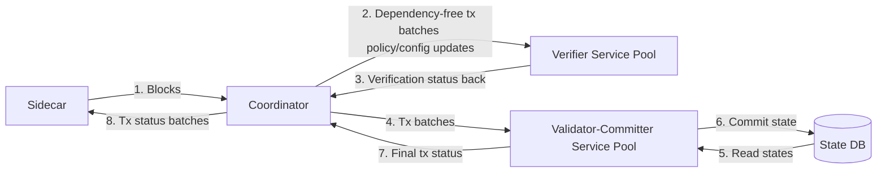

Numbers show typical end-to-end flow through coordinator at high level:

1. **Sidecar → Coordinator:** Sidecar sends blocks over `BlockProcessing`.
2. **Coordinator → Verifier:** Coordinator sends dependency-free transaction batches plus pending policy/config deltas.
3. **Verifier → Coordinator:** Verifier services return verification status.
4. **Coordinator → Validator-Committer:** Coordinator sends transaction batches for final validation and commit.
5. **Validator-Committer → State DB:** Validator-Committer writes commit results.
6. **State DB → Validator-Committer:** Validator-Committer reads persisted status and recovery state.
7. **Validator-Committer → Coordinator:** Validator-Committer sends final transaction status back.
8. **Coordinator → Sidecar:** Coordinator returns `TxStatusBatch` messages.

## 4. Coordinator Internal Block Diagram

Inside coordinator, control is split across five main components:

- `Service` owns external gRPC surface and stream lifecycle.
- `dependencygraph.Manager` decides which transactions are free to run.
- `signatureVerifierManager` talks to Verifier service pool.
- `validatorCommitterManager` talks to Validator-Committer pool and sends final results to two consumers.
- `policyManager` stores latest namespace/config state for future verifier requests.

Runtime path mostly moves forward. Two external pools sit outside coordinator: `signatureVerifierManager` talks to Verifier service pool, and `validatorCommitterManager` talks to Validator-Committer service pool. `Service` also sends rejected transactions directly to `validatorCommitterManager`, bypassing dependency-graph path.

Two feedback loops matter most:

1. final status flows from Validator-Committer manager back to dependency graph so blocked dependents can be released
2. committed namespace/config changes flow into policy manager so later verifier requests carry fresh policy/config deltas

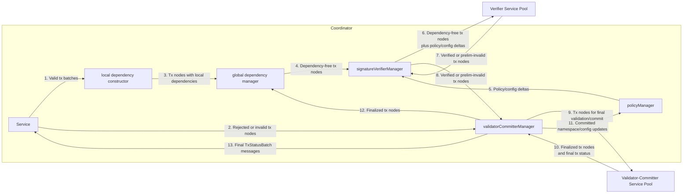

### Channel walkthrough

| Channel | Producer | Consumer | Meaning |
|---|---|---|---|
| `coordinatorToDepGraphTxs` | `Service` | dependency graph manager | Valid transactions received from Sidecar, chunked into batches for dependency construction |
| `depGraphToSigVerifierFreeTxs` | global dependency manager | signature verifier manager | Transactions with no remaining dependencies |
| `sigVerifierToVCServiceValidatedTxs` | signature verifier manager | validator-committer manager | Transactions after signature/structural verification; prelim-invalid transactions still continue |
| `vcServiceToDepGraphValidatedTxs` | validator-committer manager | global dependency manager | Finalized transaction nodes used to remove edges and free dependents |
| `vcServiceToCoordinatorTxStatus` | validator-committer manager | `Service` | Final `TxStatusBatch` messages returned to Sidecar |

Component ownership in plain terms:

- `Service` handles stream send/receive and counts waiting transactions.
- local dependency constructor computes **within-batch** dependencies in parallel.
- global dependency manager merges local results with already waiting transactions and tracks release of dependents.
- signature verifier manager retries verifier streams and requeues in-flight transactions on failure.
- validator-committer manager retries VC streams, fans status out to two destinations, and updates policy manager before dependents advance.
- policy manager versions namespace/config state and hands verifier managers only deltas they have not seen yet.

## 5. Dependency Graph Construction

Dependency graph is coordinator feature that unlocks parallelism without losing deterministic outcomes. Later transactions may have to wait for earlier transactions if both touch same logical key or same namespace lifecycle state.

### 5.1 Why the Graph Is Split into Local and Global Stages

Coordinator splits dependency work into two stages because it needs both throughput and ordering discipline.

**Local stage** (`local_dependency_constructor.go`):

- receives one transaction batch at time
- computes dependencies **inside that batch only**
- runs multiple workers in parallel
- preserves output order using batch IDs and condition-variable gating, so global stage still sees batches in original order

**Global stage** (`global_dependency_manager.go`):

- receives locally processed batches in original order
- detects dependencies against transactions already waiting from earlier batches
- merges new read/write index data into global detector
- emits only transactions with zero remaining dependencies
- removes completed transactions and releases newly free dependents

Short version:

- local stage = fast within-batch preprocessing
- global stage = authoritative waiting graph across all in-flight transactions

### 5.2 Transaction Node Model

Coordinator does not track raw transactions directly in graph. It wraps each transaction in `TransactionNode`.

Each node carries:

- transaction reference and namespace payload (`Tx`)
- endorsements needed by verifier stage
- `dependsOnTxs`: coarse-grained set of earlier transactions that must finish first
- `dependentTxs`: reverse edges used when freeing blocked transactions
- extracted read/write key sets for dependency detection

Coordinator intentionally tracks **coarse-grained dependency edges** instead of labeling each stored edge as read-write, write-read, or write-write. That keeps graph logic simpler. Fine-grained type still matters conceptually for humans, but runtime release logic only needs to know whether dependency still exists.

Read/write extraction rules matter:

- read-only keys go into read set
- blind writes go into write-only set
- read-write operations go into read-write set
- normal transactions also implicitly read namespace lifecycle key from meta-namespace so namespace policy/config changes serialize correctly with regular namespace traffic

That last rule prevents namespace lifecycle transaction from racing with ordinary state updates in same namespace.

### 5.3 Dependency Types

| Type | Meaning | Example | Why it matters |
|---|---|---|---|
| read-write | later transaction reads key written by earlier transaction | `T1` writes `ns1:a`, `T2` reads `ns1:a` | `T2` may have read stale value if `T1` commits, so `T2` must wait |
| write-read | later transaction writes key read by earlier transaction | `T1` reads `ns1:a`, `T2` writes `ns1:a` | preserves block-order semantics so later write does not jump ahead of earlier read |
| write-write | both transactions write same key | `T1` writes `ns1:a`, `T2` writes `ns1:a` | prevents later write from overtaking earlier write |

Important direction rule:

- edge always points from earlier transaction to later transaction (execution order)
- because execution flows forward in stream/block order, graph stays acyclic
- transaction with zero in-degree (no incoming edges) is dependency-free and can execute

### 5.4 Worked Examples

#### Example 1: Independent transactions

| Tx | Reads | Writes |
|---|---|---|
| `T1` | `ns1:a` | `ns1:x` |
| `T2` | `ns1:b` | `ns1:c` |

No shared keys. No namespace-lifecycle interaction. Both transactions have zero in-degree and are dependency-free immediately.

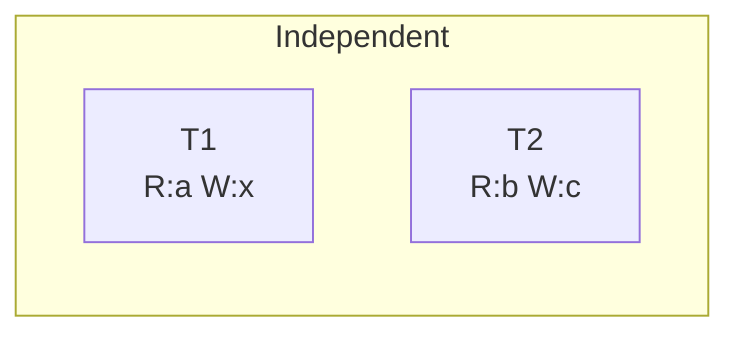

Result:

- `T1` and `T2` can both move to Verifier stage immediately
- dependency graph does not need to serialize them

#### Example 2: Later read depends on earlier write

| Tx | Reads | Writes |
|---|---|---|
| `T1` | - | `ns1:a` |
| `T2` | `ns1:a` | - |

`T2` has read-write dependency on `T1`. Dependency arrow points from `T1` (older) to `T2` (newer), showing execution order.

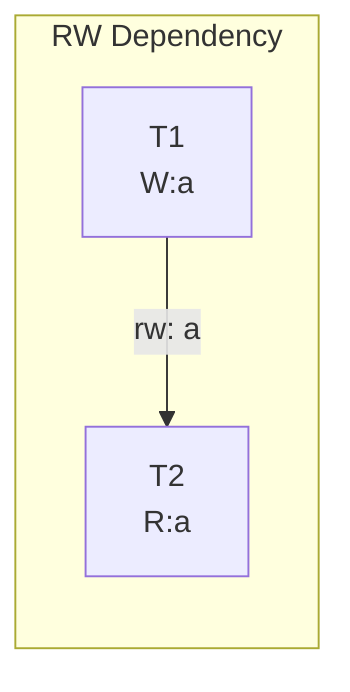

- `T1`: zero in-degree → **dependency-free**
- `T2`: in-degree 1 → **waiting**

Result:

- `T1` is free first
- `T2` waits in graph
- after VC finalizes `T1`, graph removes edge and `T2` becomes free

#### Example 3: Two writes to same key across different batches

Suppose first batch already contains `T1`, and second batch later introduces `T2`.

| Tx | Batch | Reads | Writes |
|---|---|---|---|
| `T1` | `B1` | - | `ns1:a` |
| `T2` | `B2` | - | `ns1:a` |

`T2` has write-write dependency on `T1`, even though they arrived in different batches. Dependency arrow points from `T1` (older) to `T2` (newer), showing execution order.

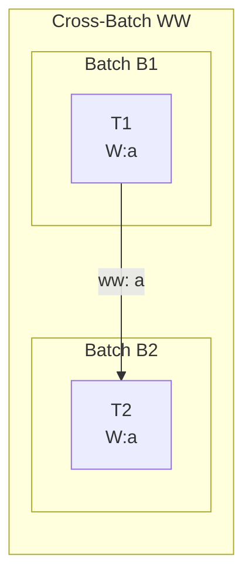

- `T1`: zero in-degree → **dependency-free**
- `T2`: in-degree 1 → **waiting**

Result:

- local stage alone cannot resolve this because transactions are in different batches
- global stage detects dependency using waiting transaction index
- `T2` stays blocked until `T1` is finalized

#### Example 4: Namespace lifecycle transaction must serialize with normal traffic

Suppose `T1` updates regular state in `ns1`, `T2` changes namespace policy/config for `ns1`, and `T3` is a later normal transaction in `ns1`.

| Tx | Reads | Writes |
|---|---|---|
| `T1` | implicit meta read for `ns1` | `ns1:asset1` |
| `T2` | meta/config data | namespace lifecycle update for `ns1` |
| `T3` | implicit meta read for `ns1` | `ns1:asset2` |

Coordinator treats normal transactions as reading namespace lifecycle key in meta-namespace. This creates ordering edges: `T1` → `T2` → `T3`.

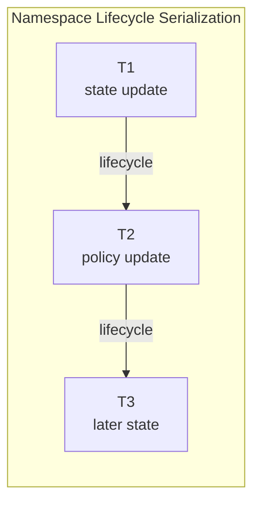

- `T1`: zero in-degree → **dependency-free**
- `T2`: in-degree 1 (depends on `T1`) → **waiting**
- `T3`: in-degree 1 (depends on `T2`) → **waiting**

Result:

- lifecycle update cannot jump ahead of already waiting normal transaction in same namespace
- later normal transactions cannot verify against stale policy state
- once `T2` commits, policy manager updates before newly freed dependents move forward

#### Example 5: Two blocks, two transactions each, mixed `rw` / `wr` / `ww` dependencies

Suppose coordinator receives two blocks in order, with two transactions per block.

| Tx | Block | Reads | Writes |
|---|---|---|---|
| `B1T1` | `Block 1` | `ns1:a` | `ns1:b` |
| `B1T2` | `Block 1` | `ns1:b` | `ns1:c` |
| `B2T1` | `Block 2` | `ns1:c` | `ns1:a` |
| `B2T2` | `Block 2` | `ns1:a`, `ns1:c` | `ns1:b` |

Derived dependencies (arrows show execution order from older to newer):

- `B1T1 -> B1T2` is **rw** on `ns1:b` because `B1T1` writes `b`, then `B1T2` reads `b`
- `B1T2 -> B2T1` is **rw** on `ns1:c` because `B1T2` writes `c`, then `B2T1` reads `c`
- `B1T1 -> B2T1` is **wr** on `ns1:a` because `B1T1` reads `a`, then `B2T1` writes `a`
- `B1T1 -> B2T2` is **ww** on `ns1:b` because both write `b`
- `B1T2 -> B2T2` is **rw** on `ns1:c` because `B1T2` writes `c`, then `B2T2` reads `c`
- `B2T1 -> B2T2` is **rw** on `ns1:a` because `B2T1` writes `a`, then `B2T2` reads `a`

Initial dependency graph:

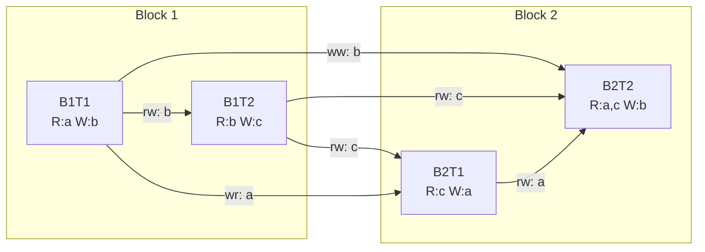

What coordinator does with this graph:

- `B1T1` has zero in-degree (no incoming edges), so it is free first
- `B1T2` waits for `B1T1`
- `B2T1` waits for both `B1T1` and `B1T2`
- `B2T2` waits for `B1T1`, `B1T2`, and `B2T1`

Important runtime rule:

- **Verifier completion alone does not free dependents**
- graph updates only after **Validator-Committer returns final status** for transaction node

Graph update sequence after VC finalization:

1. **`B1T1` finalized**
   - remove node `B1T1` from dependency detector
   - remove edges `B1T1 -> B1T2`, `B1T1 -> B2T1`, `B1T1 -> B2T2`
   - `B1T2` now has zero remaining dependencies, so coordinator emits `B1T2`
   - `B2T1` still waits on `B1T2`
   - `B2T2` still waits on `B1T2` and `B2T1`

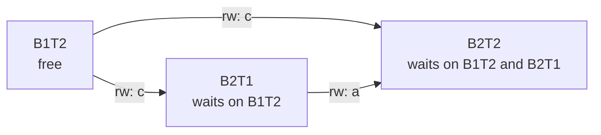

1. **`B1T2` finalized**
   - remove node `B1T2`
   - remove edges `B1T2 -> B2T1` and `B1T2 -> B2T2`
   - `B2T1` now has zero remaining dependencies, so coordinator emits `B2T1`
   - `B2T2` still waits on `B2T1`

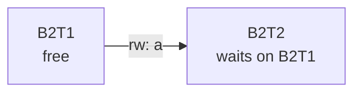

1. **`B2T1` finalized**
   - remove node `B2T1`
   - remove edge `B2T2 -> B2T1`
   - `B2T2` now has zero remaining dependencies, so coordinator emits `B2T2`

2. **`B2T2` finalized**
   - graph becomes empty for this example
   - all four transactions have reached final status

Resulting execution order:

- graph allows only `B1T1` first
- then `B1T2`
- then `B2T1`
- then `B2T2`

Even though there are two blocks, graph is built across all in-flight transactions, not reset per block. That is why `Block 2` transactions can depend on `Block 1` transactions, and why later transactions are released only when all earlier conflicting transactions have final VC status.

### 5.5 How Transactions Become Free Again

Freeing is driven by final status from Validator-Committer stage, not by verifier completion.

Release loop:

1. Validator-Committer manager receives final status from VC service.
2. It maps returned status back to stored `TransactionNode`.
3. It updates `policyManager` first if committed transaction changed namespace/config state.
4. It sends finalized nodes to global dependency manager over `vcServiceToDepGraphValidatedTxs`.
5. Global dependency manager removes completed transaction read/write keys from dependency detector.
6. For each dependent transaction, graph removes one edge from `dependsOnTxs`.
7. Any dependent that now has zero remaining dependencies becomes free.
8. Newly freed transactions are emitted to verifier manager over `depGraphToSigVerifierFreeTxs`.

```text
VC final status
   |
   v
remove finished node from graph
   |
   v
update dependent nodes
   |
   +--> still has dependencies -> keep waiting
   |
   `--> zero dependencies -> emit to Verifier stage
```

## 6. Failure and Recovery

Coordinator is designed to survive stream breaks, worker-service failures, and process restarts. Critical theme: in-flight work may be retried, but final state remains correct because VC path is idempotent and duplicate late responses are tolerated.

### 6.1 Signature Verifier Service Failure

#### 6.1.1 Internal Architecture of Signature Verifier Manager

The `signatureVerifierManager` manages communication with multiple signature verifier service instances. It maintains:

- **Multiple verifier clients**: One `signatureVerifier` instance per verifier service endpoint
- **In-flight transaction tracking**: Each verifier tracks transactions currently being validated in `txBeingValidated` map
- **Retry and requeue mechanism**: On stream failure, pending transactions are requeued for retry

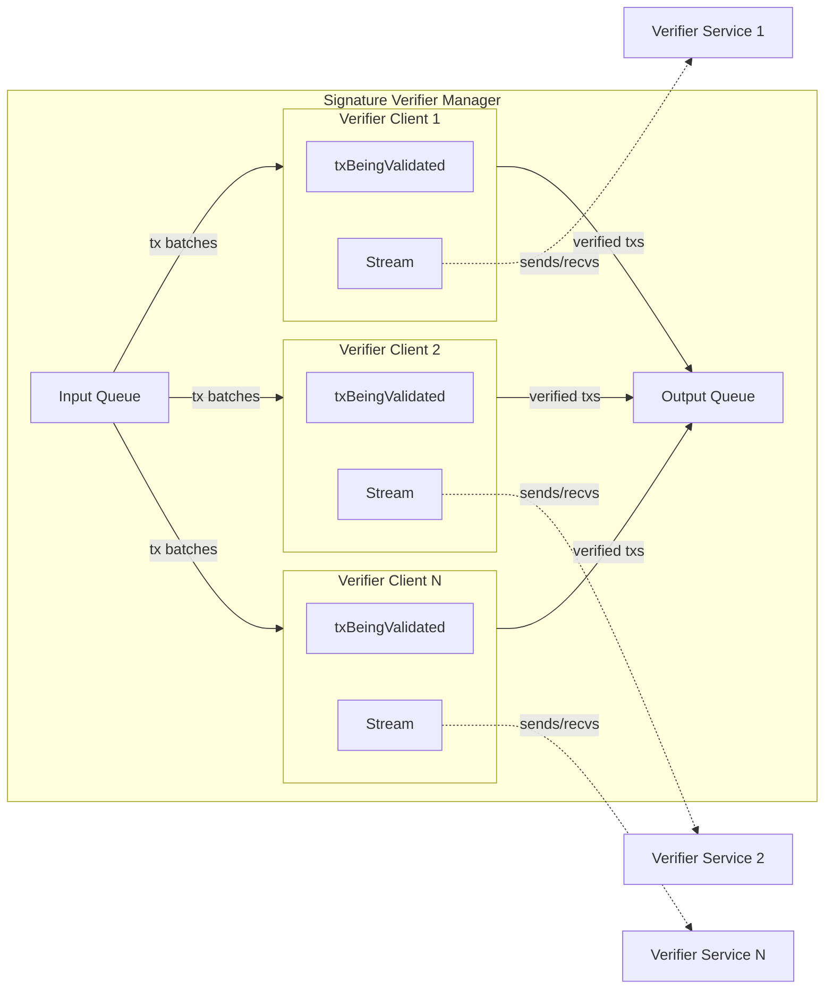

#### 6.1.2 Failure Handling Flow

When a verifier stream fails:

1. **Detect failure**: `sendTransactionsAndForwardStatus()` returns error when `stream.Recv()` or `stream.Send()` fails
2. **Trigger recovery**: `recoverPendingTransactions()` is called via deferred callback
3. **Requeue pending transactions**: All transactions in `txBeingValidated` are written back to input queue
4. **Reconnect**: `retry.Sustain()` loop creates new stream and resumes processing

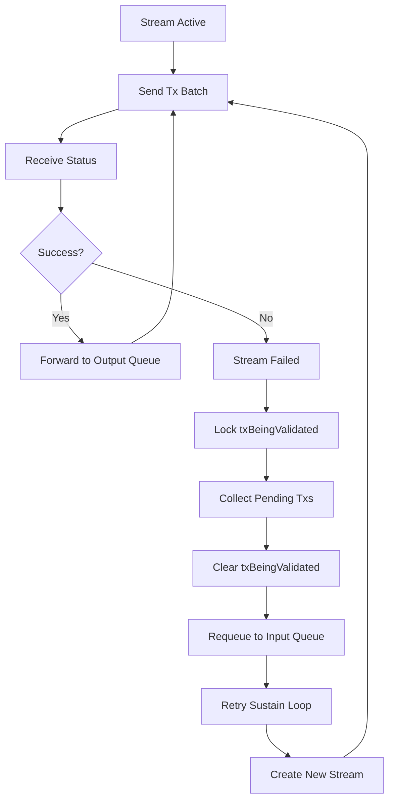

#### 6.1.3 Key Design Properties

- **Idempotent requeue**: Transactions can be safely re-sent to any verifier instance
- **No data loss**: `txBeingValidated` map ensures all in-flight transactions are recovered
- **Parallel retry**: Multiple verifier clients retry independently
- **Policy freshness**: Each requeued transaction gets latest policy/config deltas on retry

| Failure point | What stays in memory | What is retried or rebuilt | What persists | Why result stays correct |
|---|---|---|---|---|
| verifier stream or verifier server fails | `signatureVerifier.txBeingValidated` still tracks in-flight nodes for that verifier instance | manager reconnects using sustained retry loop and requeues pending transactions from `txBeingValidated` | nothing new must persist at verifier stage | verifier stage is retry-safe because transactions are re-enqueued and revalidated |

Key detail:

- verifier manager stores in-flight nodes by transaction height
- on failure, `recoverPendingTransactions()` pushes them back into input queue
- later verifier stream can resend them with latest policy/config deltas

### 6.2 Validator-Committer Service Failure

#### 6.2.1 Internal Architecture of Validator-Committer Manager

The `validatorCommitterManager` manages communication with multiple validator-committer service instances. It maintains:

- **Common client**: Single load-balanced connection for system operations (setup, recovery reads)
- **Multiple VC clients**: One `validatorCommitter` instance per VC service endpoint
- **In-flight transaction tracking**: Each VC tracks transactions by txID in `txBeingValidated` sync map
- **Retry and requeue mechanism**: On stream failure, pending transactions are requeued for retry
- **Dual output fan-out**: Forwards results to both dependency graph (for releasing dependents) and coordinator (for status feedback to Sidecar)

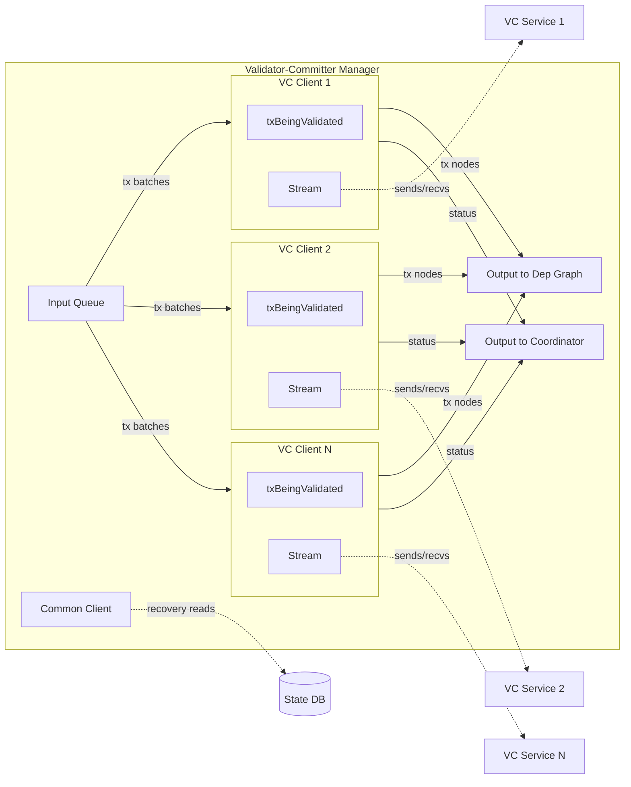

#### 6.2.2 Failure Handling Flow

When a VC stream fails:

1. **Detect failure**: `sendTransactionsAndForwardStatus()` returns error when `stream.Recv()` or `stream.Send()` fails
2. **Trigger recovery**: `recoverPendingTransactions()` is called via deferred callback
3. **Requeue pending transactions**: All transactions in `txBeingValidated` are written back to input queue
4. **Reconnect**: `retry.Sustain()` loop creates new stream and resumes processing

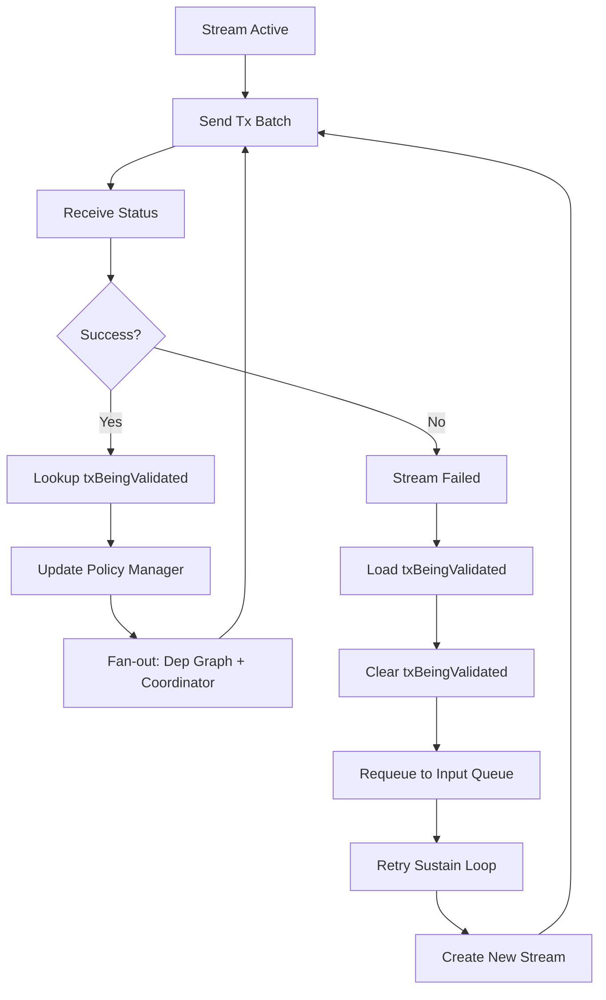

#### 6.2.3 Key Design Properties

- **Idempotent replay**: VC commit path detects already-committed transactions and returns existing status
- **No data loss**: `txBeingValidated` sync map ensures all in-flight transactions are recovered
- **Parallel retry**: Multiple VC clients retry independently
- **Duplicate tolerance**: Late/duplicate responses are dropped if txID no longer tracked
- **Policy freshness**: Policy manager updated before dependents are released

| Failure point | What stays in memory | What is retried or rebuilt | What persists | Why result stays correct |
|---|---|---|---|---|
| VC stream or VC server fails | `validatorCommitter.txBeingValidated` still tracks in-flight nodes for that VC instance | manager reconnects using sustained retry loop and requeues pending transactions from `txBeingValidated` | any transaction already committed by VC stays in DB | replay is safe because VC path can detect already committed transaction status |

Key detail:

- VC manager tracks in-flight nodes by transaction ID
- if stream fails, `recoverPendingTransactions()` requeues nodes
- some of those transactions may already have committed before failure; duplicate replay is tolerated

### 6.3 Sidecar Stream Ends Mid-Flight

| Failure point | What stays in memory | What is retried or rebuilt | What persists | Why result stays correct |
|---|---|---|---|---|
| `BlockProcessing` stream between Sidecar and Coordinator ends | coordinator managers, internal queues, and already received transaction batches may still exist | Sidecar can reconnect and resume later block delivery | VC-persisted transaction status and last committed block data stay in DB | block processing is decoupled from stream after receipt; received work can continue downstream |

Key detail:

- stream-specific goroutines end with stream
- but blocks already received by coordinator may still be forwarded and processed
- status may accumulate in coordinator queue even if stream itself has ended

### 6.4 Duplicate or Late Status After Reconnect

| Failure point | What stays in memory | What is retried or rebuilt | What persists | Why result stays correct |
|---|---|---|---|---|
| coordinator receives delayed or duplicate VC response after retry/reconnect | first successful lookup removes matching node from `txBeingValidated` | duplicate response is effectively ignored because lookup no longer finds tracked node | committed status already stored in DB | same transaction can be submitted more than once, but only first tracked response updates in-memory release path |

Key detail:

- `getTxsAndUpdatePolicies()` loads and deletes tracked node once
- if later duplicate status arrives, node is no longer in `txBeingValidated`
- duplicate status is dropped from status batch before downstream processing

### 6.5 Coordinator Restart and Recovery

| Failure point | What stays in memory | What is retried or rebuilt | What persists | Why result stays correct |
|---|---|---|---|---|
| coordinator process restarts | in-memory graph and queues are lost | coordinator rebuilds runtime state from startup recovery calls and new Sidecar delivery | last committed block, transaction status, namespace policies, and config transaction stay in DB | replay after restart is safe because VC commit path is idempotent and returns existing status for already processed transaction |

Restart flow:

1. validator-committer manager becomes ready
2. coordinator recovers namespace policies and latest config transaction through VC common client
3. policy manager is rebuilt before coordinator signals ready
4. Sidecar asks which block should come next and resumes delivery
5. replayed transactions are safe because VC can return existing status instead of re-committing

### 6.6 Policy Reconstruction on Startup

| Failure point | What stays in memory | What is retried or rebuilt | What persists | Why result stays correct |
|---|---|---|---|---|
| coordinator starts with empty in-memory policy manager | empty policy manager exists only temporarily | startup recovery reads persisted namespace policies and config transaction, then rebuilds policy manager versions | namespace policies and config transaction are stored in DB through VC path | verifier requests after readiness always see recovered policy/config baseline, then only later deltas |

Key detail:

- startup calls `recoverPolicyManagerFromStateDB()` before coordinator signals ready
- policy manager stores versions internally and returns only deltas newer than verifier has already seen
- this avoids pushing full policy snapshot on every verifier request once startup baseline is loaded

## 7. Code Map

Open these files next if you want to connect diagrams back to implementation:

- `service/coordinator/coordinator.go` — external gRPC service, stream handling, channel wiring, and coordinator startup lifecycle.
- `service/coordinator/dependencygraph/manager.go` — top-level dependency graph module that runs local and global stages.
- `service/coordinator/dependencygraph/local_dependency_constructor.go` — within-batch dependency construction and batch-order preservation logic.
- `service/coordinator/dependencygraph/global_dependency_manager.go` — waiting-graph maintenance, release of freed dependents, and output of dependency-free work.
- `service/coordinator/dependencygraph/dependency_detector.go` — read/write index structure that detects read-write, write-read, and write-write relationships.
- `service/coordinator/dependencygraph/transaction_node.go` — node model, dependency sets, and namespace lifecycle key treatment.
- `service/coordinator/signature_verifier_manager.go` — verifier stream management, pending-policy fetch, retry, and requeue of in-flight verification work.
- `service/coordinator/validator_committer_manager.go` — VC stream management, final-status fan-out, policy updates, and duplicate-response handling.
- `service/coordinator/policy_manager.go` — in-memory versioned store for namespace policies and config transaction updates.
