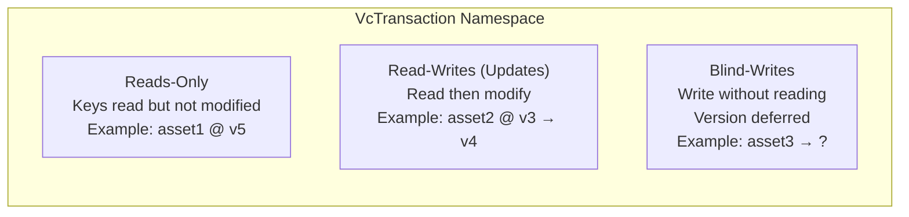
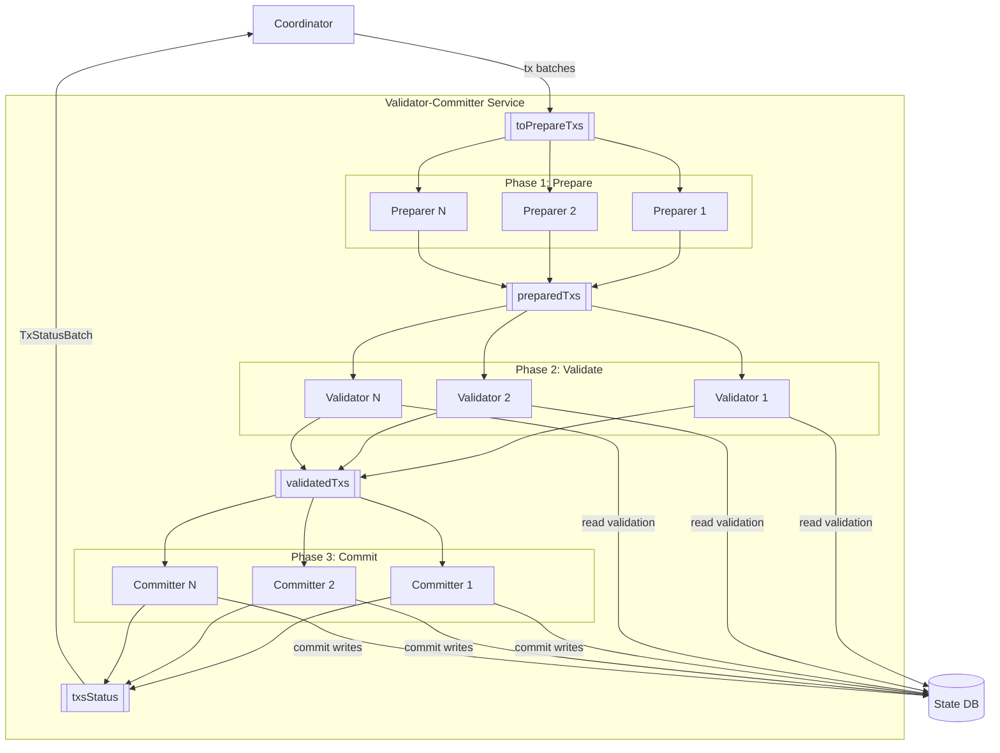
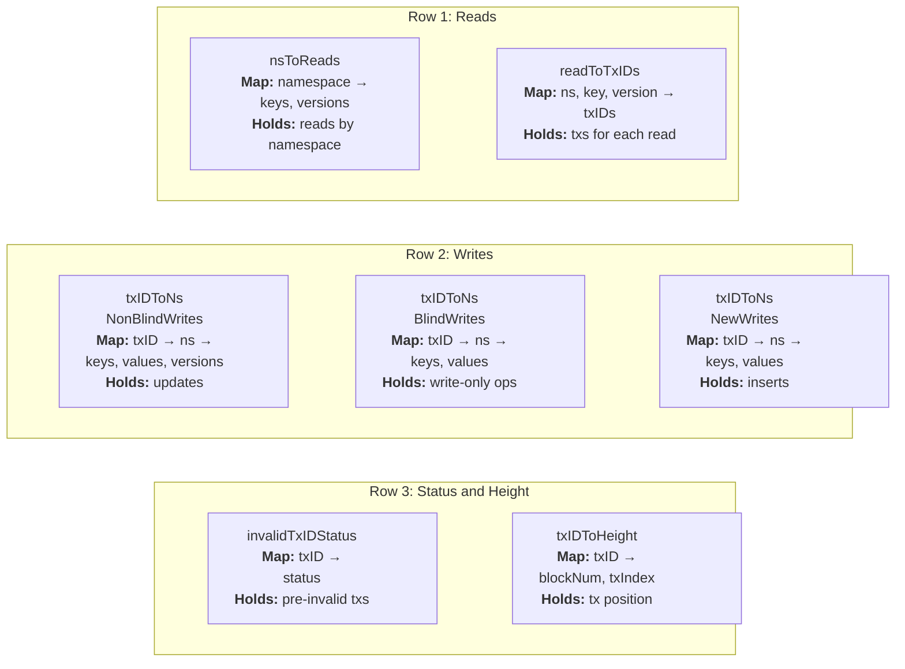
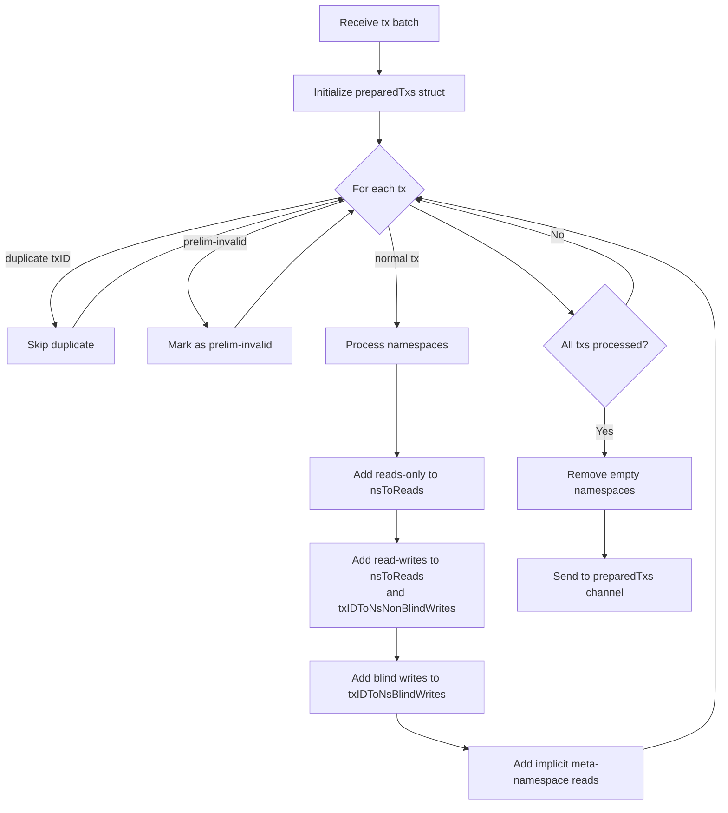
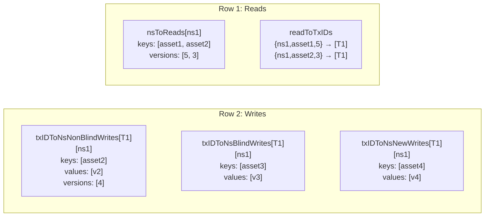
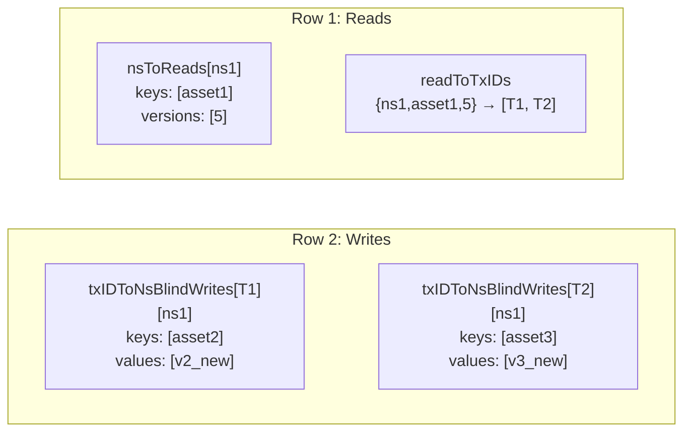
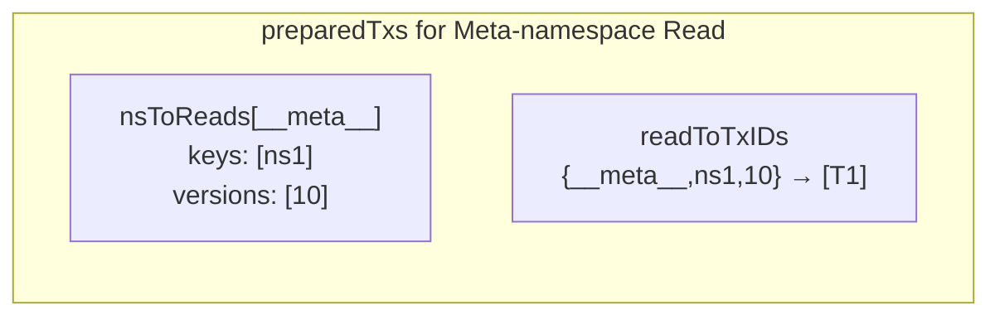
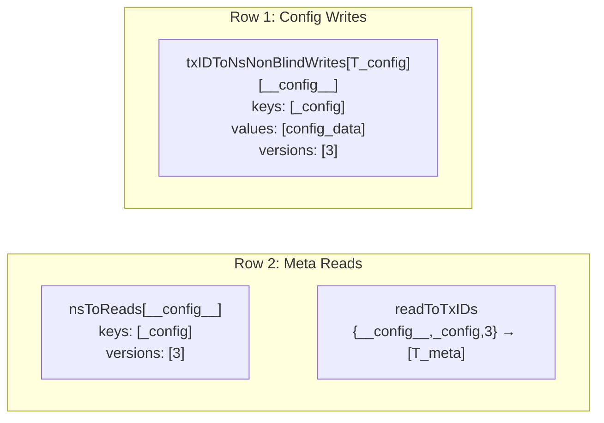
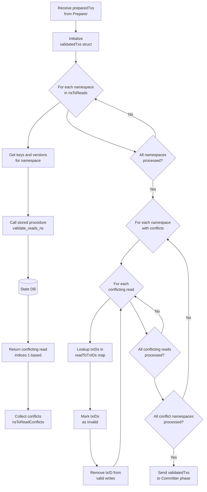
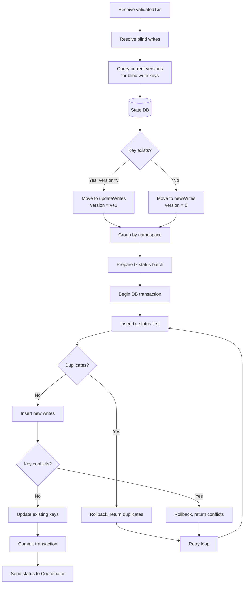

<!--
Copyright IBM Corp. All Rights Reserved.

SPDX-License-Identifier: Apache-2.0
-->
# Validator-Committer Architecture and Block Diagram Guide

1. [Overview](#1-overview)
2. [How to Read This Document](#2-how-to-read-this-document)
3. [High-Level Block Diagram](#3-high-level-block-diagram)
4. [Phase 1: Prepare](#4-phase-1-prepare)
   - [4.1 Output Structure from Preparer](#41-output-structure-from-preparer)
   - [4.2 Prepare Flow Diagram](#42-prepare-flow-diagram)
   - [4.3 Write Categorization](#43-write-categorization)
   - [4.4 Prepare Examples](#44-prepare-examples)
5. [Phase 2: Validate](#5-phase-2-validate)
   - [5.1 Validate Flow Diagram](#51-validate-flow-diagram)
   - [5.2 MVCC Validation Logic](#52-mvcc-validation-logic)
   - [5.3 Validation Examples](#53-validation-examples)
6. [Phase 3: Commit](#6-phase-3-commit)
   - [6.1 Commit Flow Diagram](#61-commit-flow-diagram)
   - [6.2 Blind Write Resolution](#62-blind-write-resolution)
   - [6.3 Commit Examples](#63-commit-examples)
7. [Database Schema and Stored Procedures](#7-database-schema-and-stored-procedures)
8. [Failure and Recovery](#8-failure-and-recovery)
9. [Code Map](#9-code-map)

## 1. Overview

Validator-Committer (VC) service is the final stage in the Fabric-X transaction processing pipeline. It receives conflict-free transaction batches from the Coordinator, performs optimistic concurrency control through MVCC validation, and commits valid transactions to the state database.

Main responsibilities:

- receive conflict-free transaction batches from Coordinator
- categorize writes into blind writes, new writes, and non-blind writes
- validate transaction read-sets against committed database state
- commit transaction statuses of valid/invalid transactions and update world state
- return final transaction status to Coordinator
- provide data access APIs for namespace policies and config recovery

VC service does **not** perform signature verification or dependency tracking. Instead, it focuses on **what** to commit and **when** to mark transactions as committed versus aborted.

## 2. How to Read This Document

Start with [high-level block diagram](#3-high-level-block-diagram) if you need system shape. The diagram shows the three-phase pipeline with multiple parallel workers per phase. Each phase has its own detailed section with flow diagrams and worked examples.

If you want implementation entry points after building mental model, jump to [Code Map](#9-code-map). For configuration fields, gRPC API surface, and existing service overview, also see [`docs/validator-committer.md`](./validator-committer.md).

## 3. High-Level Block Diagram

At highest level, VC service sits between Coordinator and State DB. Coordinator streams transaction batches in and receives transaction status back. VC service processes transactions through three pipelined phases with multiple parallel workers.

### Input Structure to VC Service

Transactions arrive from Coordinator with three operation types per namespace:



**Note**: New writes (inserts) are represented as read-writes with `nil` version (omitted in protobuf).

#### Example: Complete transaction message

Consider a complete `VcTransaction` message with all operation types:

```protobuf
// Complete transaction message from Coordinator to VC service
VcTransaction {
  ref: TxRef {
    tx_id: "tx_001"
    block_num: 100
    tx_index: 5
  }
  
  namespaces: [
    TxNamespace {
      ns_id: "ns1"
      ns_version: 10  // Namespace policy version
      
      // Reads-Only: Keys read but not modified
      reads_only: [
        Read {
          key: "asset1"
          version: 5  // Read at version 5
        }
      ]
      
      // Read-Writes (Updates): Keys read and modified
      // New-Writes (Inserts): Also in read_writes, but with omitted version field
      read_writes: [
        ReadWrite {
          key: "asset2"
          value: "v2_new"
          version: 3  // Read at version 3, will write at version 4
        },
        ReadWrite {
          key: "asset4"
          value: "v4_new"
          // version field omitted = insert
        }
      ]
      
      // Blind-Writes: Keys written without reading
      blind_writes: [
        Write {
          key: "asset3"
          value: "v3_new"
          // No version - endorser did not read
        }
      ]
    }
  ]
  
  // Optional: Set if Coordinator already marked as invalid
  prelim_invalid_tx_status: null
}
```

### High-Level Architecture Flow

The VC service processes these input transactions through three pipelined phases:



Flow description:

1. **Coordinator → Preparer:** Coordinator sends conflict-free transaction batches over `StartValidateAndCommitStream` to `toPrepareTxs` channel.
2. **Preparer → Validator:** Preparer workers categorize reads/writes, send structured data to `preparedTxs` channel.
3. **Validator → Committer:** Validator workers perform MVCC read validation, remove invalid transactions, send valid writes to `validatedTxs` channel.
4. **Committer → DB:** Committer workers query versions for blind writes, validate reads, commit writes to database.
5. **Committer → Coordinator:** Committers send final `TxStatusBatch` messages to `txsStatus` channel, returned to Coordinator.

Key design points:

- **Multiple workers per phase**: Configurable parallelism (e.g., `MaxWorkersForPreparer`, `MaxWorkersForValidator`, `MaxWorkersForCommitter`)
- **Pipelined execution**: All three phases run concurrently on different batches
- **Channel-based communication**: Lock-free queues between phases
- **Stateless workers**: Any worker can process any batch; no sticky assignments

## 4. Phase 1: Prepare

The Preparer phase receives raw transaction batches from the Coordinator and transforms them into a structured format optimized for validation.

See [Input Structure to VC Service](#input-structure-to-vc-service) in Section 3 for visual representation of input transaction structure.

**Why categorization matters**:

- **Reads-only**: Grouped by namespace for batch validation
- **Read-writes (updates)**: Version already calculated; ready for commit if validation passes
- **Blind-writes**: Need database query to determine if key exists (update) or not (insert)
- **New-writes (inserts)**: Optimistically assume key is new; rely on database constraints to detect collisions

**Details on operation types**:

1. **Reads-Only**: Keys read but not modified
   - Used for dependency tracking and MVCC validation
   - Example: Transaction reads `asset1` at version 5 to check balance

2. **Read-Writes (Updates)**: Keys read and then modified
   - Version known from read phase
   - New version = read version + 1
   - Example: Transaction reads `asset2` at version 3, writes new value with version 4

3. **Blind-Writes (Write-Only)**: Keys written without reading
   - Endorser did not read the key before writing
   - Version deferred to commit phase
   - Example: Transaction writes `asset3` without knowing current version

**Note**: New writes (inserts) are represented as read-writes with `nil` version. They are not a separate field in the protobuf message.

### 4.1 Output Structure from Preparer

Preparer transforms raw transactions into grouped data structures:



### 4.2 Prepare Flow Diagram

Preparer receives raw transaction batches and transforms them into structured format optimized for validation.



### 4.3 Write Categorization

Preparer categorizes writes into three types based on whether transaction read the key before writing:

| Write Type | Description | Version Handling | Example |
|---|---|---|---|
| **Non-Blind Writes** (Read-Modify-Write) | Transaction read key before writing | New version = read version + 1 | `T1` reads `ns1:a` at version 5, writes new value with version 6 |
| **Blind Writes** (Write-Only) | Transaction writes key without reading | Version deferred to commit phase | `T2` writes `ns1:b` without reading; version determined at commit time |
| **New Writes** (Inserts) | Transaction creates new key | Version starts at 0 (DB default) | `T3` writes `ns1:c` assuming key does not exist |

Important detail:

- read-write operations with `nil` version are treated as **new writes**
- blind writes are resolved in commit phase by querying current database state
- new writes rely on database unique constraints to detect collisions

### 4.4 Prepare Examples

#### Example 1: Preparation output for complete transaction

Consider the transaction from the [Input Structure](#input-structure-to-vc-service) section:

```
T1 (tx_001, block 100, index 5):
  Namespace: ns1 (policy v10)
  Reads-Only:
    - key: "asset1", version: 5
  Read-Writes (Updates):
    - key: "asset2", value: "v2_new", version: 3
  Read-Writes (Inserts):
    - key: "asset4", value: "v4_new", version: nil
  Blind-Writes:
    - key: "asset3", value: "v3_new"
```

After preparation:



#### Example 2: Multiple transactions with shared reads

Consider two transactions `T1` and `T2` that both read the same key:

```
T1:
  Reads:
    - key: "asset1", version: 5
  Blind-Writes:
    - key: "asset2", value: "v2_new"

T2:
  Reads:
    - key: "asset1", version: 5
  Blind-Writes:
    - key: "asset3", value: "v3_new"
```

After preparation:



**Key insight**: If read version 5 becomes stale, **both** `T1` and `T2` are invalidated together. This is why `readToTxIDs` maps each read to **all** transactions that performed it.

#### Example 3: Implicit meta-namespace reads

Every normal transaction implicitly reads its namespace lifecycle state:

```
T1 in namespace "ns1":
  Explicit Reads:
    - key: "asset1", version: 5
  Explicit Read-Writes (Updates):
    - key: "asset1", value: "v1_new", version: 5

Implicit addition by preparer:
  Meta-namespace read:
    - namespace: "__meta__"
    - key: "ns1"
    - version: 10
```

After preparation:



This ensures namespace lifecycle transactions serialize correctly with normal traffic.

#### Example 4: Config and Meta namespace transactions

Special handling for system namespaces:

```
T_config in "__config__":
  Read-Writes (Updates):
    - key: "_config", value: "config_data", version: 2
  // No implicit reads added for config namespace

T_meta in "__meta__":
  Read-Writes (Updates):
    - key: "ns2", value: "policy_data", version: 5
  Implicit read added (namespace lifecycle):
    - namespace: "__config__"
    - key: "_config"
    - version: 3
```

After preparation:



## 5. Phase 2: Validate

The Validator phase receives prepared transactions from the Preparer and performs MVCC (Multi-Version Concurrency Control) validation. Its main responsibilities are:

**Important distinction**: The Validator **only validates reads**. It does **not** fetch versions for blind writes. Blind write resolution happens in the Committer phase (Phase 3).

**Input**: `preparedTransactions` structure from Preparer containing:

- `nsToReads`: All reads grouped by namespace
- `readToTxIDs`: Mapping from reads to transaction IDs
- Categorized writes (non-blind, blind, new)

**Output**: `validatedTransactions` structure containing:

- `validTxNonBlindWrites`: Writes from transactions that passed validation
- `validTxBlindWrites`: Blind writes from valid transactions (still unresolved)
- `newWrites`: New writes from valid transactions
- `invalidTxStatus`: Status map for invalidated transactions (e.g., `MVCC_CONFLICT`)

**Validation process**:

1. For each namespace, batch all reads together
2. Call stored procedure `validate_reads_ns_${NSID}(keys, versions)` for each namespace
3. Stored procedure returns indices of conflicting reads (where committed version ≠ expected version)
4. For each conflicting read, lookup all transaction IDs in `readToTxIDs` map
5. Mark those transactions as invalid with `ABORTED_MVCC_CONFLICT` status
6. Remove all writes from invalid transactions
7. Send only valid writes to Committer phase

**Key property**: If multiple transactions share the same read and that read conflicts, **all** those transactions are invalidated together. This is why `readToTxIDs` maps each read to a list of transaction IDs.

### 5.1 Validate Flow Diagram

Validator performs MVCC read validation and removes invalid transactions from the pipeline.



### 5.2 MVCC Validation Logic

Validator uses stored procedures to validate reads in bulk:

```sql
-- Stored procedure signature (per namespace)
CREATE FUNCTION validate_reads_ns_${NSID}(
  keys BYTEA[], 
  versions BIGINT[]
) RETURNS INTEGER[]  -- Array of 1-based indices for conflicting reads
```

Key points:

- stored procedure runs inside database for performance (avoids network round-trips)
- returns **indices** of conflicting reads (1-based, SQL convention)
- validator maps indices back to transactions using `readToTxIDs`
- all transactions sharing a conflicting read are invalidated together
- **blind writes are NOT resolved here** - they remain in `validTxBlindWrites` unchanged
- blind write resolution happens in Committer phase (Phase 3)

### 5.3 Validation Examples

#### Example 1: No conflicts (all reads valid)

Database state:

```
ns1 table:
  key="asset1", version=5, value="v1"
  key="asset2", version=3, value="v2"
```

Prepared reads:

```
nsToReads["ns1"]:
  keys:     ["asset1", "asset2"]
  versions: [5, 3]
```

Validation result:

```
validate_reads_ns_ns1(["asset1", "asset2"], [5, 3])
  → []  (empty array, no conflicts)

validatedTxs:
  validTxNonBlindWrites: [T1, T2, T3]  // All transactions remain valid
  invalidTxStatus: {}
```

#### Example 2: Single read conflict

Database state:

```
ns1 table:
  key="asset1", version=7, value="v1_updated"  // Version advanced to 7
  key="asset2", version=3, value="v2"
```

Prepared reads:

```
nsToReads["ns1"]:
  keys:     ["asset1", "asset2"]
  versions: [5, 3]  // asset1 is stale: DB version is 7
```

Validation result:

```
validate_reads_ns_ns1(["asset1", "asset2"], [5, 3])
  → [1]  (index 1, meaning "asset1" conflicts)

readToTxIDs[{ns1, "asset1", 5}]: [T1, T2]

invalidateTxsOnReadConflicts:
  T1.invalidTxStatus = ABORTED_MVCC_CONFLICT
  T2.invalidTxStatus = ABORTED_MVCC_CONFLICT
  
validatedTxs:
  validTxNonBlindWrites: [T3]  // T1 and T2 removed
  invalidTxStatus: {T1: MVCC_CONFLICT, T2: MVCC_CONFLICT}
```

#### Example 3: Multiple conflicts across namespaces

Database state:

```
ns1 table:
  key="asset1", version=10, value="v1_v2"
  key="asset3", version=5, value="v3_updated"

ns2 table:
  key="asset5", version=8, value="v5_new"
```

Prepared reads:

```
nsToReads["ns1"]:
  keys:     ["asset1", "asset3"]
  versions: [5, 3]

nsToReads["ns2"]:
  keys:     ["asset5"]
  versions: [4]
```

Validation result:

```
validate_reads_ns_ns1(["asset1", "asset3"], [5, 3])
  → [1, 2]  (both reads conflict)

validate_reads_ns_ns2(["asset5"], [4])
  → [1]  (read conflicts)

readToTxIDs mapping:
  {ns1, "asset1", 5}: [T1, T4]
  {ns1, "asset3", 3}: [T2]
  {ns2, "asset5", 4}: [T3, T4]

invalidateTxsOnReadConflicts:
  T1.invalidTxStatus = MVCC_CONFLICT
  T2.invalidTxStatus = MVCC_CONFLICT
  T3.invalidTxStatus = MVCC_CONFLICT
  T4.invalidTxStatus = MVCC_CONFLICT  // Conflicts on both ns1 and ns2
  
validatedTxs:
  validTxNonBlindWrites: []  // All transactions invalidated
  invalidTxStatus: {T1, T2, T3, T4: MVCC_CONFLICT}
```

#### Example 4: Meta-namespace conflict blocks all normal traffic

Database state:

```
__meta__ table:
  key="ns1", version=15, value="policy_v2"  // Namespace policy updated
```

Prepared reads (normal transactions):

```
nsToReads["__meta__"]:
  keys:     ["ns1"]
  versions: [10]  // T1, T2, T3 read policy at version 10
```

Validation result:

```
validate_reads_ns___meta__(["ns1"], [10])
  → [1]  (namespace lifecycle conflict)

readToTxIDs[{__meta__, "ns1", 10}]: [T1, T2, T3]

invalidateTxsOnReadConflicts:
  T1.invalidTxStatus = MVCC_CONFLICT
  T2.invalidTxStatus = MVCC_CONFLICT
  T3.invalidTxStatus = MVCC_CONFLICT

Result: All three normal transactions in ns1 are aborted because
        namespace policy changed after they read the policy state.
```

## 6. Phase 3: Commit

### 6.1 Commit Flow Diagram

Committer resolves blind writes, commits to database, and handles duplicates.



### 6.2 Blind Write Resolution

Before committing, committer must resolve blind writes by querying current database state:

```
For each namespace with blind writes:
  1. Query current versions for all blind write keys
  2. For each key:
     - If key exists with version v:
       → Move to updateWrites with version = v + 1
     - If key does not exist:
       → Move to newWrites with version = 0
  3. Clear blind writes map
```

This step is critical because blind writes arrive without version information.

### 6.3 Commit Examples

#### Example 1: Simple commit with no conflicts

Database state before commit:

```
ns1 table:
  key="asset1", version=5, value="v1_old"
  key="asset2", version=3, value="v2_old"
```

Validated writes (after validation phase):

```
validTxNonBlindWrites[T1]["ns1"]:
  keys:     ["asset1"]
  values:   ["v1_new"]
  versions: [6]  // 5 + 1

validTxBlindWrites[T2]["ns1"]:
  keys:     ["asset3"]
  values:   ["v3_new"]
  versions: [0]  // placeholder

newWrites[T3]["ns1"]:
  keys:     ["asset4"]
  values:   ["v4_new"]
  versions: [0]
```

Blind write resolution:

```
Query: SELECT key, version FROM ns_ns1 WHERE key = "asset3"
Result: (no rows)  // Key does not exist

Action: Move T2's write to newWrites
  newWrites[T2]["ns1"]:
    keys:     ["asset3"]
    values:   ["v3_new"]
    versions: [0]
```

Commit sequence:

```
1. Insert tx_status:
   INSERT INTO tx_status (tx_id, status, height)
   VALUES ("T1", COMMITTED, h1), ("T2", COMMITTED, h2), ("T3", COMMITTED, h3)
   → No duplicates, success

2. Insert new writes:
   SELECT * FROM insert_ns_ns1(["asset4", "asset3"], ["v4_new", "v3_new"])
   → No violations, success

3. Update existing keys:
   SELECT * FROM update_ns_ns1(["asset1"], ["v1_new"], [6])
   → Success (version matches)

4. Commit transaction
   → All writes persisted

Final database state:
  ns1 table:
    key="asset1", version=6, value="v1_new"
    key="asset2", version=3, value="v2_old"  // Unchanged
    key="asset3", version=1, value="v3_new"  // New (version from 0 to 1)
    key="asset4", version=1, value="v4_new"  // New
```

#### Example 2: Blind write becomes update

Database state before commit:

```
ns1 table:
  key="asset3", version=8, value="v3_existing"
```

Blind write to resolve:

```
validTxBlindWrites[T1]["ns1"]:
  keys:     ["asset3"]
  values:   ["v3_updated"]
  versions: [0]
```

Blind write resolution:

```
Query: SELECT key, version FROM ns_ns1 WHERE key = "asset3"
Result: ("asset3", 8)  // Key exists with version 8

Action: Move to updateWrites with version = 8 + 1 = 9
  validTxNonBlindWrites[T1]["ns1"]:
    keys:     ["asset3"]
    values:   ["v3_updated"]
    versions: [9]
```

#### Example 3: Duplicate transaction ID detection

Scenario: `T1` was already committed in a previous batch (resubmission due to network issue).

Database state before commit:

```
tx_status table:
  tx_id="T1", status=COMMITTED, height=(block=100, tx_index=5)
```

Current batch:

```
batchStatus:
  T1: COMMITTED
  T2: COMMITTED
  T3: MVCC_CONFLICT
```

Commit sequence:

```
1. Insert tx_status:
   INSERT INTO tx_status (tx_id, status, height)
   VALUES ("T1", COMMITTED, h1), ("T2", COMMITTED, h2), ("T3", MVCC_CONFLICT, h3)
   
   Stored procedure returns: ["T1"]  // Duplicate detected

2. Rollback transaction

3. Query correct status for T1:
   SELECT tx_id, status, height FROM tx_status WHERE tx_id = "T1"
   Result: ("T1", COMMITTED, (100, 5))

4. Check if this is resubmission or true duplicate:
   - If current height matches stored height (100, 5):
     → Resubmission, reuse COMMITTED status
   - If current height differs:
     → True duplicate, return DUPLICATE_TXID status

5. Retry commit with corrected status:
   batchStatus:
     T1: COMMITTED  // Reused from DB
     T2: COMMITTED
     T3: MVCC_CONFLICT
   
   INSERT INTO tx_status (...)
   VALUES ("T2", ...), ("T3", ...)  // T1 excluded
   → Success
```

#### Example 4: New write collision (key already exists)

Database state before commit:

```
ns1 table:
  key="asset4", version=2, value="v4_existing"
```

New writes:

```
newWrites[T1]["ns1"]:
  keys:     ["asset4"]  // T1 thinks this is a new key
  values:   ["v4_new"]
  versions: [0]
```

Commit sequence:

```
1. Insert tx_status:
   → Success (no duplicates)

2. Insert new writes:
   SELECT * FROM insert_ns_ns1(["asset4"], ["v4_new"])
   
   Stored procedure detects primary key violation:
   → Returns violating keys: ["asset4"]

3. Rollback transaction

4. Invalidate transaction:
   T1.invalidTxStatus = REJECTED_DUPLICATE_TX_ID
   (or appropriate conflict status)

5. Retry commit with T1 removed:
   → Success for remaining transactions
```

#### Example 5: Mixed batch with updates, inserts, and blind writes

Database state before commit:

```
ns1 table:
  key="asset1", version=5, value="v1_old"
  key="asset2", version=3, value="v2_old"
  key="asset5", version=1, value="v5_old"

ns2 table:
  key="asset3", version=2, value="v3_old"
```

Validated writes:

```
// T1: Update asset1
validTxNonBlindWrites[T1]["ns1"]:
  keys:     ["asset1"]
  values:   ["v1_new"]
  versions: [6]

// T2: Blind write to asset2 (exists) and asset6 (new)
validTxBlindWrites[T2]["ns1"]:
  keys:     ["asset2", "asset6"]
  values:   ["v2_blind", "v6_blind"]
  versions: [0, 0]

// T3: New write
newWrites[T3]["ns1"]:
  keys:     ["asset4"]
  values:   ["v4_new"]
  versions: [0]

// T4: Update in ns2
validTxNonBlindWrites[T4]["ns2"]:
  keys:     ["asset3"]
  values:   ["v3_new"]
  versions: [3]
```

Blind write resolution:

```
Query ns1 for asset2 and asset6:
  SELECT key, version FROM ns_ns1 WHERE key IN ("asset2", "asset6")
  Result: ("asset2", 3)  // Only asset2 exists

Resolution:
  // asset2 becomes update
  validTxNonBlindWrites[T2]["ns1"]:
    keys:     ["asset2"]
    values:   ["v2_blind"]
    versions: [4]  // 3 + 1
  
  // asset6 becomes new write
  newWrites[T2]["ns1"]:
    keys:     ["asset6"]
    values:   ["v6_blind"]
    versions: [0]
```

Commit sequence:

```
1. Insert tx_status:
   VALUES ("T1", COMMITTED), ("T2", COMMITTED), ("T3", COMMITTED), ("T4", COMMITTED)
   → Success

2. Insert new writes (ns1):
   insert_ns_ns1(["asset4", "asset6"], ["v4_new", "v6_blind"])
   → Success

3. Insert new writes (ns2):
   // No new writes in ns2

4. Update existing keys (ns1):
   update_ns_ns1(["asset1", "asset2"], ["v1_new", "v2_blind"], [6, 4])
   → Success

5. Update existing keys (ns2):
   update_ns_ns2(["asset3"], ["v3_new"], [3])
   → Success

6. Commit transaction
   → All writes persisted

Final database state:
  ns1 table:
    key="asset1", version=6, value="v1_new"
    key="asset2", version=4, value="v2_blind"
    key="asset4", version=1, value="v4_new"
    key="asset5", version=1, value="v5_old"  // Unchanged
    key="asset6", version=1, value="v6_blind"
  
  ns2 table:
    key="asset3", version=3, value="v3_new"
```

## 7. Database Schema and Stored Procedures

### System Tables

**Transaction Status Table (`tx_status`)**:
Stores final status of every transaction.

| Column | Type | Description |
|---|---|---|
| `tx_id` | `BYTEA` | Transaction ID (Primary Key) |
| `status` | `INTEGER` | Status code (COMMITTED, MVCC_CONFLICT, DUPLICATE_TXID, etc.) |
| `height` | `BYTEA` | Block number + tx index (order-preserving encoding) |

**Namespace Metadata Table (`ns__meta`)**:
Stores endorsement policies for namespaces.

| Column | Type | Description |
|---|---|---|
| `key` | `BYTEA` | Namespace ID (Primary Key) |
| `value` | `BYTEA` | Endorsement policy |
| `version` | `BIGINT` | MVCC version |

**Configuration Table (`ns__config`)**:
Stores system configuration transaction.

| Column | Type | Description |
|---|---|---|
| `key` | `BYTEA` | Fixed key `_config` (Primary Key) |
| `value` | `BYTEA` | Configuration transaction envelope |

**User Namespace Tables (`ns_${NSID}`)**:
One table per namespace storing world state.

| Column | Type | Description |
|---|---|---|
| `key` | `BYTEA` | State key (Primary Key) |
| `value` | `BYTEA` | State value |
| `version` | `BIGINT` | MVCC version |

### Stored Procedures

**`insert_tx_status(tx_ids, statuses, heights)`**:
Inserts transaction statuses. Returns array of duplicate tx_ids on primary key violation.

**`validate_reads_ns_${NSID}(keys, versions)`**:
Validates read versions. Returns 1-based indices of conflicting reads.

**`update_ns_${NSID}(keys, values, versions)`**:
Updates existing keys. Fails if key does not exist or version mismatch.

**`insert_ns_${NSID}(keys, values)`**:
Inserts new keys. Returns array of violating keys on primary key violation.

## 8. Failure and Recovery

### 8.1 Preparer Failures

| Failure | Impact | Recovery |
|---|---|---|
| Preparer panics | `preparedTxs` channel closes | VC service restarts; Coordinator resends unacknowledged batches |
| Duplicate tx in batch | Second occurrence skipped | Preparer detects via `txIDToHeight` map |

### 8.2 Validator Failures

| Failure | Impact | Recovery |
|---|---|---|
| Validator panics | `validatedTxs` channel closes | VC service restarts; batches re-validated from scratch |
| Read validation error | Batch fails | Entire batch retried; idempotent because reads are re-validated |

### 8.3 Committer Failures

| Failure Point | What Persists | What Retries | Why Correct |
|---|---|---|---|
| After `insert_tx_status` but before commit | Nothing (uncommitted) | Full batch retry | Transaction rolled back; `insert_tx_status` detects duplicates on retry |
| During `insert_ns` | Nothing (uncommitted) | Retry with reduced batch | Violating keys returned; corresponding txs marked invalid |
| During `update_ns` | Nothing (uncommitted) | Retry | Updates cannot conflict (versions pre-validated) |
| Final commit fails | Nothing | Retry | All changes in single transaction |

### 8.4 Duplicate Transaction Handling

Duplicates can arise from:

1. **Coordinator resubmission**: VC stream fails, Coordinator resends to another VC instance
2. **Network issues**: Same tx appears in multiple batches that get merged
3. **True duplicates**: Application submits same tx twice

Handling strategy:

```
1. Insert tx_status FIRST (before writes)
   → Detects duplicates early via primary key constraint

2. If duplicate found:
   a. Rollback transaction
   b. Query stored status from tx_status
   c. If height matches: resubmission, reuse status
   d. If height differs: true duplicate, return DUPLICATE_TXID

3. Retry with corrected status
```

### 8.5 VC Service Restart

Recovery flow:

1. VC service restarts with empty channels
2. Coordinator detects broken stream via health check
3. Coordinator resends unacknowledged batches to available VC instances
4. VC service processes batches idempotently:
   - Already-committed txs return existing status
   - Uncommitted txs processed normally

Key property:

- **VC is stateless** regarding pipeline state
- **Database is source of truth** for committed transactions
- **Coordinator tracks** which batches are acknowledged

## 9. Code Map

Open these files next to connect diagrams to implementation:

### Core Pipeline

- `service/vc/validator_committer_service.go` — gRPC service, stream handling, channel wiring, batching logic.
- `service/vc/preparer.go` — Transaction preparation, write categorization, read extraction.
- `service/vc/validator.go` — MVCC read validation, invalidation of transactions.
- `service/vc/committer.go` — Blind write resolution, database commit, duplicate handling.

### Database Layer

- `service/vc/database.go` — Database connection, stored procedure calls, retry logic.
- `service/vc/dbinit.go` — Table and stored procedure creation.

### Data Structures

- `preparedTransactions` (in `preparer.go`) — Read/write organization before validation.
- `validatedTransactions` (in `validator.go`) — Valid writes after read validation.
- `statesToBeCommitted` (in `database.go`) — Grouped writes for database commit.

### Tests

- `service/vc/preparer_test.go` — Preparer unit tests.
- `service/vc/validator_test.go` — Validator unit tests.
- `service/vc/committer_test.go` — Committer unit tests.
- `service/vc/database_test.go` — Database operation tests.
