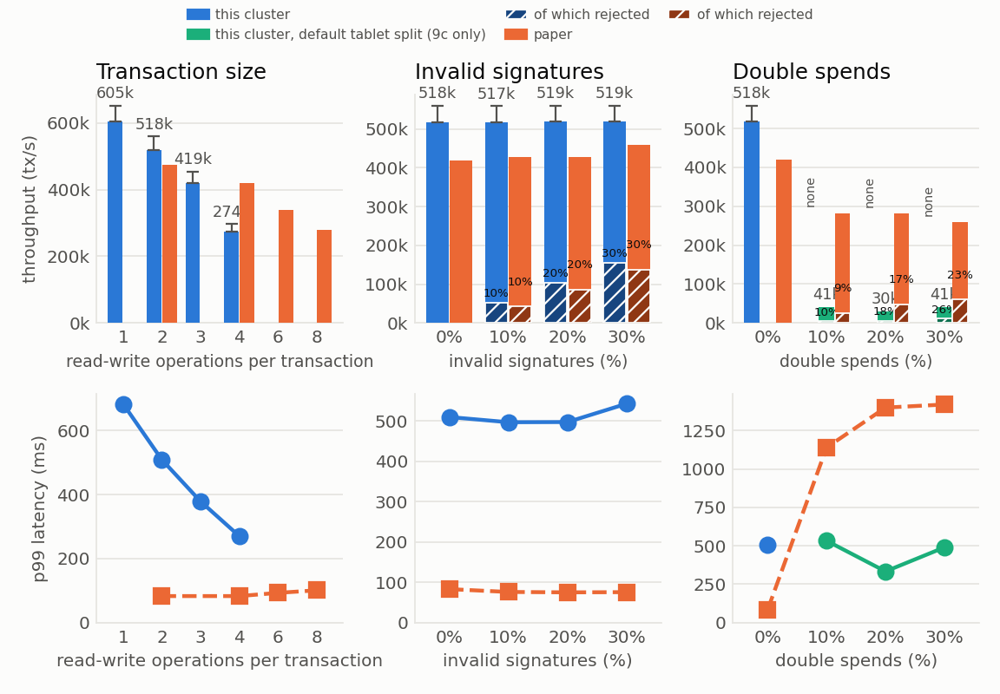
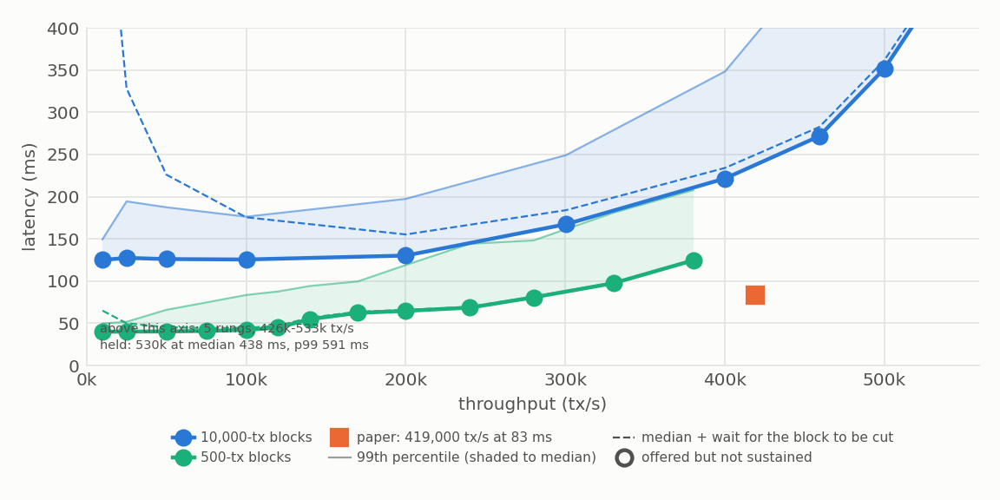
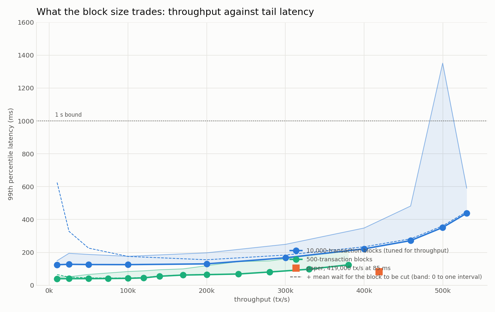

<!--
Copyright IBM Corp. All Rights Reserved.

SPDX-License-Identifier: Apache-2.0
-->
# Recreating the paper's committer figures

The Fabric-X paper (SIGMOD Companion '26, Section 6.3) reports the committer's validation phase as
three sweeps: transaction size, the share of transactions with invalid signatures, and the share of
double spends. This document recreates those three on the nineteen-machine evaluation cluster with
the current code, and replaces the paper's failure figure with a throughput-against-latency curve.

It is a companion to [`cluster-optimization-log.md`](cluster-optimization-log.md), which records how
the cluster got from 80,000 to 500,000 transactions per second, and to
[`optimization-config.md`](optimization-config.md), which holds the configuration those numbers were
measured with. This document adds only what the paper's figures need: the workload shapes, how each
maps onto the load generator's knobs, and the measurement rule.

## What the paper measured, and with what

Its committer deployment was three signature verifiers, nine validator-committers co-located with
nine database nodes, one coordinator, one sidecar, on dual 48-core servers with 64 GB of RAM. Every
point is an average over at least five minutes at one-second sampling, and every point is taken at a
rate chosen to keep latency under one second — "the workload was managed to keep latency below one
second to prevent queuing from committer overload".

The reported numbers:

| sweep | published |
|---|---|
| 9a, one input/output to four | 474,000 -> 280,000 tps (-41%), p99 83 -> 101 ms |
| 9b, 0% to 30% invalid signatures | 419,000 -> 459,000 tps (+10%), p99 75-83 ms |
| 9c, 0% to 10% double spends | 419,000 -> 280,000 tps (-33%), p99 85 -> 1,100 ms; 260,000 at 30% |

## This cluster, and how it differs

Nineteen machines of 64 cores and 156 GB: three signature verifiers, **six** validator-committers,
twelve YugabyteDB tablet servers with three masters, one coordinator, one sidecar, and a load
generator whose embedded mock ordering service cuts and signs the blocks. So this deployment has
fewer validator-committers than the paper's and more database nodes, and no ordering service in the
path — which is what the paper's Section 6.3 also measures, since its committer runs are driven by
the same kind of workload generator.

The rest of the configuration is the tuned one from `optimization-config.md`: EDDSA signing (ECDSA's
hedged nonce capped the *generator* at ~325,000 tps), 10,000-transaction blocks, and the current
binaries — which include the single-owner relay tracking, the skipped block-store transaction index,
the plain-nonce test signer and the direct ASN.1 digest encoder.

**One configuration difference deserves its own paragraph, because it changes what the numbers are a
claim about.** The coordinator runs the *simple* dependency-graph manager, which holds the whole
waiting set in one map owned by a single goroutine and therefore has no mutex to contend on. That is
selected by `committer_coordinator_dep_graph_use_simple_manager: true`, and the selector exists only
on this evaluation branch: on `upstream/main` the coordinator constructs the global-local manager
unconditionally, and `DependencyGraphConfig` has no field for the choice
(`num-of-local-dep-constructors`, `waiting-txs-limit`, `chunk-size` are all of it). So every number in
the three sweeps below describes a coordinator that the shipped system cannot currently be configured
into, which is why the `graph` points measure the global-local manager at both ends of the size sweep:
those two are the upstream-comparable ones.

That sharpens the comparison with the paper rather than weakening it. The paper attributes its
Figure 9a fall to lock contention in the dependency graph; if the same fall appears on a coordinator
with a different graph implementation and no graph mutex in the path at all, per-key work is the
better explanation than contention.

## Mapping the paper's axes onto the generator's knobs

This is the part that decides whether the recreation is a recreation, and the first attempt got it
wrong in a way worth recording.

**Transaction size (9a): `read-write-count` = n, one to four.** One read-write operation reads a key
and writes it, which is one input spent and one output written. The paper's axis is inputs/outputs
per transaction, and this is the knob its generator exposes for that.

The literal reading — n inputs *and* n separate output keys, so n read-write operations plus n blind
writes, 2n keys — is a different and slower experiment, because the validator resolves a blind
write's version itself (`populateVersionsAndCategorizeBlindWrites` calls `queryVersionsIfPresent`),
which is a database lookup per output key inside the commit path. Measured at "1 in / 1 out" that
shape gave 255,091 tps against 474,000 published, which is not a recreation of anything. It is kept
as a separate pair of points, 1/1 and 4/4, to price output creation rather than to hide it inside
the size sweep.

**Invalid signatures (9b): `invalid-signatures` = 0, 0.1, 0.2, 0.3.** Direct, and the decision is
derived from the transaction index, so the share is exact rather than sampled.

**Double spends (9c): `key-backref-rate` = 0, 0.05, 0.10, 0.20, 0.30**, with `tx-reference-gap: 0`
and `key-lookback-window: 1024`. A back-reference puts an already-created key into a read-write slot,
and the generator leaves read versions nil. A nil version is not "no opinion" — it asserts the key
does not exist, so `validate_reads_ns_<ns>`
(`utils/statedb/create_namespace_tmpl.sql`) flags "key committed but expected version is null", the
validator rejects the transaction as `ABORTED_MVCC_CONFLICT`
(`invalidateTxsOnReadConflicts`), and `updateInvalidTxs` drops its writes before the commit stage.
That is the same check a real double spend trips.

Two honest limits on that mapping:

- **There is no winner among contenders.** With nil expected versions the transaction that creates a
  key commits and *every* later transaction referencing it aborts, so the x axis is the share of
  transactions that are doomed double spends, and the expected abort fraction is the back-reference
  rate itself rather than the rate times (1 - 1/contenders). The paper's "exactly one contender
  commits" needs `queries-rate >= 1` and a deployed query service to fill real read versions.
- **The gap and window are choices.** Gap 0 draws the newest keys, which at these rates are still in
  flight, so a conflicting pair can land in the same block — the live dependency the coordinator's
  graph has to serialise, which is the convoy effect the paper describes. Window 1024 spreads
  references over the 1024 newest keys; window 0 funnels every reference onto one key and serialises
  the whole workload, which cost this cluster 46x throughput when it was tried.

## The measurement rule

Per point, the highest rate that satisfies all four of:

1. the offered rate arrived (the generator was not the limit),
2. the committed rate matched it within 2%,
3. 99th percentile latency at or under one second, the paper's own bound,
4. the in-flight count was not growing, and the sidecar's ledger append path was under 95% busy.

Conditions 1 and 4 are this cluster's additions, and both come from being burned. A rate can be
committed in full out of a queue that grows for the whole window, which reports the queue's drain
time as latency; and the sidecar appends every block on one serialised path, so that path can be the
ceiling while every machine looks idle.

Each point gets **its own deployment**: teardown, re-render the generator's config, start. The
teardown comes first because it removes the whole remote deploy directory — shipping the config
before it deletes exactly what was just shipped, and the generator comes back on the previous shape.
The driver reads the rendered shape back off the generator's own config file before starting, so a
shape that fails to apply skips the point instead of producing a mislabelled number. A fresh
deployment also empties the database, so no point inherits another's rows.

Reported latencies are histogram estimates, so they carry the histogram's resolution rather than
millisecond precision. The bucket ladder around half a second is 0.4, 0.45, 0.5, 0.55, 0.6, 0.7, 0.8,
0.9, 1.0, and Prometheus interpolates within a bucket, so a p99 of "546 ms" means the 99th percentile
fell in the 500-550 ms bucket. Differences below about 50 ms in that region are not resolvable, which
is enough for these sweeps and not enough to compare against the paper's 83 ms as a precise value.

**How much a reported knee is worth, measured rather than assumed.** Two points in this matrix are
the same configuration by construction: 9a's n=2 and 9b's 0%-invalid are both two read-writes with
no invalid signatures and no conflicts. Measured an hour apart they landed on *adjacent steps of the
search* -- 517,273 and 560,000 -- because 559,872 tps met every condition in one run (p99 692 ms,
queue growing 222/s) and missed in the other (p99 1,844 ms, queue growing 6,444/s). Near the knee the
pipeline is bistable: whether a queue starts growing at a given rate depends on where compaction and
garbage collection happen to fall.

The two runs probed that step at the same table fill -- 257.7 M and 257.8 M transactions committed,
0.04% apart -- so this is not the fill effect described below. It is the gate: p99 was 1,844 ms in one
run and 692 ms in the other for the same rate, a factor of 2.7 in the quantity the one second
threshold is applied to.

So a reported knee is the highest rate that passed, resolved to the search's 8% step. **Every point in
these figures therefore carries about one step of uncertainty, not the 0.2% that a held rate
repeats to.** Two consequences for reading them: a difference below 8% between points is not
resolvable, and a panel whose whole claim is a trend needs the trend to exceed a step before it means
anything.

**The hold is measured through a cold start that the probe selecting it did not have.** At the baseline
shape's marginal rung, 90 s probes passed three of four attempts and 300 s holds passed one of three,
and the difference is systematic rather than random. The search climbs 480,000 -> 518,400 -> 559,872, so
by the time a probe reaches the top rung the pipeline has spent five or six minutes at lower rates:
connection pools filled, tablet leaders settled, caches warm. The hold is a fresh deployment that goes
from idle to the target rate after 75 s of settling. The within-hold series above measures what that
costs -- commit latency decays 154.8 -> 141.0 ms over the first 115 s, so for two minutes the pipeline
is about 10% slower than its steady state, and at a rate within 8% of the knee two minutes of
under-capacity builds a queue that the remaining window cannot drain.

The fix would be to ramp into the hold: 60-90 s below the target, then step up and start the window.
It is not applied here, deliberately. Eight of the matrix's points were already measured through a cold
start, and changing the procedure mid-run would make the rest non-comparable with them -- a worse
problem than the bias, which is one-directional and points down. So this is the *second* independent
reason the reported knees are conservative, alongside the search's asymmetry (a fluke failure ends the
search unrecoverably while a fluke pass must survive the hold). Both push the same way: where this
matrix beats the paper it understates the margin, and the one place it loses -- the 2% at four
read-writes -- is more likely a tie than a loss.

The throughput-against-latency curve does not carry this bias at all. It is a rate ladder inside a
single deployment, so every point after the first arrives warm, which is a third reason to read the
trade-off from the curve rather than from the knees.

**Absolute numbers pool across deployments; ratios do not.** Where the same configuration appears in
more than one panel -- two read-writes with nothing rejected is 9a's n=2, 9b's 0% invalid and 9c's 0%
double spend -- the reported figure is pooled across its measurements, because a knee is the highest
rate that held and which panel's deployment held it does not matter. That is legitimate for an absolute
number. It is not legitimate for a ratio: 9c's claim is a fall *relative to its own zero-conflict
point*, so a baseline borrowed from another panel's deployment would put a cross-deployment difference
inside every ratio in the panel that the paper's largest claim is compared against. Hence the baseline
of each conflict sweep is measured in its own deployment even when a pooled figure was available, and
hence the driver retries a failed hold a rung lower rather than abandoning the point.

**The requested rate is not always the offered rate, and the gate is what caught it.** On three
successive confirmation holds -- each on a fresh deployment -- the generator offered 110%, 119% and 140%
of the rate it had been given, while a probe at the same rate inside an already-running deployment
offered exactly 100%. So `make limit-rate` does not reliably take effect after a restart, and a
measurement that assumes it did would be measuring an unknown rate.

Auditing every measurement in this matrix: of 66 that met their conditions, **all 66 offered within 2% of
their limit**, and every overshoot occurred on a measurement that had already failed. That is the gate
working rather than luck -- an over-driven generator violates the latency and queue-growth conditions, so
an overshooting window cannot be reported as met. Anyone reusing this driver to hold a *specific* rate
rather than to find a knee needs to check `offered` against `limit` per window, because nothing else
will.

**A queue depth would make a better gate than a percentile.** The sidecar's waiting-transaction queue
separates the measurements cleanly, and with a physical meaning rather than a distributional one: over
every probe and hold taken with correct accounting, each one that met its conditions sat between 32,231
and 194,562, and each genuine failure sat at 246,570 or above -- most of them pinned at the queue's
500,000 limit. The 99th percentile separates them too (731 ms against 1,196 ms) but it needs a bucket
ladder to be readable at all, it repeats only to 5-10%, and it is the quantity that flips across the
one second line when the same rate is measured twice. A future sweep would do better to gate on the
queue: a step that pushes the sidecar's waiting set past about 250,000 is above the knee whatever its
tail looks like in 90 seconds. What the queue does *not* do is predict the bistability -- at the
disputed rung the passing probe read 192,667 and the failing hold 504,341, so it moved with the verdict
rather than ahead of it.

The procedure is biased towards the low side rather than symmetric, which is worth knowing when
comparing against the paper. A step that fails ends the search, so a fluke failure costs a step and is
never revisited; a step that passes must then survive the 300 s confirmation hold on a fresh
deployment, which is a longer and stricter test than the 90 s probe that selected it. Under-reporting
is therefore the more likely error.

**Two different things a reader will otherwise conflate: this cluster is extremely reproducible at a
rate it can hold, and nearly a coin flip at a rate near its edge.** The baseline configuration -- two
read-writes, nothing rejected -- was measured seven times at the 518,400 rung over four and a half
hours, across four deployments, a driver restart and a change to the deployed Ansible collection:

    17:48  9a-rw2   probe   519,273    p99 489 ms    sidecar waiting 132,289
    17:57  9a-rw2   hold    517,273    p99 450 ms                    132,642
    19:14  9b-inv0  probe   518,909    p99 538 ms                    127,010
    21:04  9c-ds0   probe   517,455    p99 511 ms                    118,846
    21:32  9c-ds0   probe   518,545    p99 542 ms                    142,414
    21:59  9c-ds0   probe   517,636    p99 500 ms                    125,708
    22:26  9c-ds0   hold    518,000    p99 509 ms                    150,059

517,273 to 519,273, a span of **0.39%**, with the sidecar's waiting set between 119,000 and 150,000
every time. So any difference larger than about 0.5% between points in these figures is real. The
knees are nonetheless uncertain to 8%, and that uncertainty belongs entirely to how a knee is selected
-- a threshold on a noisy tail, measured through a cold start -- rather than to the pipeline, which
delivers a rate it can hold to within half a percent.

The same rung one step up shows the other half. Four 300 s holds were attempted at 559,872 on this
configuration; the three that failed sat at 480,000-504,000 in the waiting set, at or near its 500,000
cap, and the one rung below sits at 150,059. Eight percent of rate is the difference between a third
of the queue and all of it.

**Table fill: a suspected bias that the data does not support.** The state table is insert-only, so it
grows for the whole of a run, and within one deployment's search the database's commit latency rose
with it -- 113.7 ms at 78.9 M transactions committed to 235.7 ms at 467.9 M, a fit of +0.184 ms per
million (r = 0.873). That looked like a bias against the reported points, which sit at fills from
102 M to 696 M.

**It is settled, and the answer is no.** A hold is the controlled experiment: the rate is fixed for
375 s while the table grows by the window's whole output. Sampled every 30 s inside one such hold, at a
constant 363,000 committed transactions per second:

    t+ 23s  fill  34.9 M  commit 154.8 ms      t+176s  fill  91.2 M  commit 145.3 ms
    t+ 54s  fill  45.9 M  commit 153.2 ms      t+206s  fill 102.0 M  commit 144.2 ms
    t+ 84s  fill  56.7 M  commit 144.3 ms      t+237s  fill 113.0 M  commit 141.7 ms
    t+115s  fill  67.6 M  commit 141.0 ms      t+267s  fill 123.9 M  commit 140.8 ms
    t+145s  fill  80.3 M  commit 142.2 ms      t+298s  fill 134.8 M  commit 143.0 ms

The first four samples fall rather than rise -- that is warm-up, as connection pools, tablet leaders and
page cache settle, and it runs on the same timescale as the first minute or two of any window. After it,
commit latency goes 142.2 -> 143.0 ms while the table grows 80.3 M -> 134.8 M: flat within 2% across a
68% increase in fill. So fill costs nothing measurable at these sizes, and the two size-sweep points
held on fuller tables are not biased by it.

The within-run fit that suggested otherwise was confounded twice over: within a search the *rate* rises
along with the fill, since each probe steps it up, and the earliest samples of each window carry warm-up.
Across the confirmed holds, commit latency tracks the rate and not the fill:

    point      processed   fill      db commit
    9a-rw1       604,545   696 M      219.0 ms
    9b-inv0      558,364   209 M      195.8 ms
    9b-inv10     517,455   174 M      146.4 ms
    9a-rw2       517,273   456 M      133.0 ms
    9a-rw3       419,455   157 M       97.1 ms
    9a-rw4       274,364   102 M       55.5 ms

The two points at essentially the same rate -- 9a-rw2 and 9b-inv10, 517,273 and 517,455 -- differ by
2.6x in fill and the *emptier* table has the *higher* commit latency, which is the wrong direction for
a fill effect. So fill is not a demonstrated bias on these points; run to run variation is larger than
whatever it contributes. The `fill Mtx` column reports it per point anyway.

Two points carry a provenance difference that belongs in the figure rather than in a footnote nobody
reads: **9a-rw1 and 9a-rw2 had their confirmation holds in the same deployment as their searches**,
because that is what the driver did until it was fixed mid-run, so they were measured against tables
of 696 M and 456 M rows against 102-209 M for every other point. Whether that biases them, and in
which direction, is unresolved. Two measurements are aimed at it: re-holding those two on fresh
deployments at the same rate, which is the single-variable test, and a range query across one hold
window, where the rate is fixed while the table doubles. The second carries a trap of its own -- the
first minute or two of any window is contaminated by warm-up, since connection pools, tablet leaders
and page cache all settle on the same timescale -- so the question there is whether commit latency
keeps rising after about 120 s, not whether it rises at all.

**Latency repeats less well than throughput, and that is the error bar the curve needs.** The same
two rates were stepped an hour apart on the same shape by two different experiments:

    rate       run A p50 / p99      run B p50 / p99      spread
    480,000    287 / 433 ms         311 / 452 ms         p50 8.4%, p99 4.4%
    518,400    346 / 489 ms         369 / 538 ms         p50 6.6%, p99 10.0%

So throughput at a held rate repeats to 0.2% while its latency repeats to 5-10%. Nothing in these
figures resolves a latency difference below about 10%, which matters most for the
throughput-against-latency curve: a horizontal shift of that size on it is noise, not a result.

The search probes with 75 s of settling and a 90 s window — settling has to exceed the 60 s
Prometheus averaging window, or the previous rate leaks into the first sample — then holds the
winning rate for 300 s, which is the number reported.

**Where the clock starts, and why the curve's low end is not what it looks like.** The generator starts
each transaction's timer when its *block is submitted*, not when the transaction is created:
`loadgen/adapters/common.go` calls `sender(...)` and then `OnSendBatch(...)`, and it is `OnSendBatch`
that calls `onSendTransaction` for every ID in the block. So every latency here is **submission to
status**, and the wait while a transaction's block accumulated is outside it.

That wait is the block size over the rate -- one interval at most, half of it on average, since
transactions arrive uniformly during formation. It is 1,000 ms at 10,000 tps and 17 ms at 604,545, so:

- Every knee in the three panels is effectively unaffected. At the size sweep's rates the correction is
  8-17 ms against tails of 271-684 ms.
- The curve's flat low end is an artifact of it. Measured p50 is 125-130 ms from 10,000 to 200,000 tps,
  but adding the mean formation wait turns that into 625 ms at 10,000 and 155 ms at 200,000 -- so the
  true end-to-end curve has a **minimum around 200,000 tps** and rises in both directions: you wait for
  the block at low rates and for the queue at high ones.

Both quantities are legitimate and they answer different questions. Submission-to-status is what the
*committer* does, and the generator's block cutting stands in for an ordering service whose batching
interval is a deployment choice rather than a committer property. End-to-end including formation is what
an application would see. The curve therefore plots the measured series and shades the band up to one
full block interval, with the mean-corrected line dashed inside it.

The paper does not state its convention -- neither the population (committed or all) nor the start point
(creation or submission) -- so its 85 ms at 419,000 tps cannot be aligned to either of these exactly.
If it excludes formation and its blocks were smaller than 10,000 transactions, both differences push the
same way and the gap to this deployment narrows.

**Which population the reported latency covers.** The generator keeps two histograms:
`loadgen_valid_transaction_latency_seconds` for transactions that committed and
`loadgen_invalid_transaction_latency_seconds` for those that were rejected
(`loadgen/metrics/metrics.go:207-211`). Every latency in these figures, and the one second gate the
knees are selected by, is the committed population's. On the invalid-signature and double-spend
sweeps that leaves out a tenth to a third of the workload, whose transactions are rejected earlier in
the pipeline and so are unlikely to be slower -- but the omission is real, and the rejected
population's tail is recorded alongside each point rather than assumed.

Measured, that omission turns out not to matter: at 30% invalid signatures the rejected population's
99th percentile came in at 464 ms against the committed population's 483 ms, so the transactions left
out of the reported tail are marginally *faster* than the ones in it, as expected for work that fails
earlier in the pipeline.

Throughput, by contrast, counts both: committed plus aborted, which is every transaction the
generator got a final status for (`transactionAbortedTotal` is `len(batch) - successCount`, so the
two counters partition the workload). That matches the paper, whose Figure 9b reports throughput
rising with the invalid share -- only possible if rejected transactions count as work done.

**The curve is the robust instrument; the knees are the fragile summary of it.** Every knee in the
three panels is one rate selected by whether a noisy tail fell to the left of the one second line, and
the tail moves 5-10% run to run. The throughput-against-latency curve has no gate in it at all -- each
point is a rate held for 300 s with whatever latency it produced -- so it is the measurement to trust
where the two disagree, and it is drawn with the one second bound marked so a reader can see which
part of it the knees were chosen from. That is an argument for the figure this evaluation was asked
for over the figure the paper published.

**The curve, which is the figure this evaluation was asked for.** Eleven rates, each held 300 s in one
deployment, at two read-writes:

| offered | finished | p50 | p99 | sustained |
|---|---|---|---|---|
| 10,000 | 10,000 | 125 ms | 150 ms | yes |
| 25,000 | 25,091 | 127 ms | 194 ms | yes |
| 50,000 | 50,000 | 126 ms | 187 ms | yes |
| 100,000 | 100,000 | 126 ms | 176 ms | yes |
| 200,000 | 200,000 | 130 ms | 197 ms | yes |
| 300,000 | 300,364 | 167 ms | 249 ms | yes |
| 400,000 | 400,000 | 221 ms | 348 ms | yes |
| 460,000 | 459,091 | 272 ms | 482 ms | yes |
| 500,000 | 499,818 | 351 ms | 1,351 ms | yes |
| 530,000 | 530,364 | 438 ms | 591 ms | yes |
| 560,000 | 533,091 | 6,250 ms | 7,475 ms | **no** |

Read it as the answer to "what does this deliver if you can tolerate this much latency". 200,000 tps
costs 197 ms; 460,000 costs 482 ms; 530,000 costs 591 ms; 560,000 is not available at any latency,
because the pipeline does not deliver it -- 533,091 arrived out of a queue growing at 5,067/s.

Two features to read carefully. The top three rungs make the point better than any argument about error
bars:

    459,091   p50 272 ms   p99   482 ms
    499,818   p50 351 ms   p99 1,351 ms      p99 nearly triples while p50 rises 29%
    530,364   p50 438 ms   p99   591 ms      p99 falls back below the rung beneath it

The median is monotonic through all eleven rungs, 125 to 438 ms. The 99th percentile is **not even
ordered**. So the 1,351 ms is one bad moment inside a five-minute window, not a shifted distribution,
and any figure or gate resting on p99 inherits that -- which is the fourth independent sign tonight that
the p99 gate is the fragile part of this method rather than the pipeline being measured. A reader should
take the median as the curve's shape and the tail as an envelope. And the block-formation wait excluded by the
measurement is largest exactly where the measured curve is flattest, which is what the shaded band on
the figure shows; corrected for it, the true end-to-end minimum is near 200,000 tps rather than at the
bottom of the ladder.

The paper's single published point for this shape, 419,000 tps at 85 ms, sits to the left of everything
here. At its throughput this deployment is at roughly 360 ms, so the tail multiple is about 4x rather
than the 8x that comparing peaks suggests -- the comparison depends entirely on where on the curve you
stand, which is the argument for publishing the curve rather than a knee.

**The block size, and the one place this deployment loses to the paper.** The tail was the clear deficit
-- 684 ms at the size sweep's n=1 against the paper's 83 ms -- and a second ladder at 500 transactions
per block, everything else identical, says most of that is a knob:

    block size   tx/block   blocks/s   measured p50   formation wait   end-to-end p50
        10,000     10,000        1.0      125 ms          500 ms           625 ms
           500        500       20.0       40 ms           25 ms            65 ms

Both at 10,000 tps on the same cluster and shape, so nothing but the block size differs: **9.6x lower
end-to-end latency at the same throughput**, and the 65 ms is below the paper's published 85 ms.

Decomposing the measured half against block size, with the caveat that two points and two parameters fit
exactly by construction: 125 = f + k*10,000 and 40 = f + k*500 give a fixed cost f of about 35 ms and a
per-transaction-in-block cost k of about 9 microseconds. On that reading roughly 90 ms of the 125 was
waiting for the rest of the block to traverse the block-granular stages -- the sidecar's ledger append,
the relay's mapping pass, the coordinator's batching -- and adding formation wait, the 10,000-block
configuration spends 590 of its 625 ms at this rate on block-size effects.

So the paper's 85 ms stops being mysterious. Its ordering service cut its blocks, plausibly in the
hundreds rather than the ten thousands, and the "+27.5% throughput at 8.2x the tail" headline is largely
this deployment's large-block configuration against its small-block one.

The full 500-transaction ladder settles it. Thirteen rungs from 10,000 to 380,100 tps, every one
sustained, nothing saturated at the top -- append 18%, busiest host 71%, queue flat:

    delivered    p50    p99   append   busiest CPU        10,000-tx blocks at matched CPU
      10,000    40ms   50ms    0.5%       4%
     100,000    42     83      4.6%      28%              100,000 @ 176 ms at 25%
     200,000    63    119      9.2%      49%              200,000 @ 197 ms at 49%
     280,064    84    148     12.0%      63%              300,000 @ 249 ms at 63%
     380,100   126    208     18.0%      71%              400,000 @ 348 ms at 75%

At 200,000 tps the two configurations use identical cluster CPU and the small-block tail is 40% better,
so there is no trade at that rate at all. Above it, small blocks give up 5-7% of throughput per unit of
CPU for a consistently 40% better tail. The CPU overhead is 1-3 percentage points at every matched rate,
on a metric that is a cluster maximum over different busiest hosts.

**The single comparison that makes the case:** small blocks at 380,100 tps have a measured median of
126 ms; large blocks at 10,000 tps have 125 ms. The same median at **38 times the throughput** -- and
including the block-formation wait each configuration actually imposes, 127 ms against 625 ms, so a fifth
of the end-to-end latency at 38 times the rate.

**The small-block ceiling is unmeasured, because the measurement rig runs out first.** The 450,000 rung
missed, and the reason is upstream of everything this document is about:

    rate       offered            finished    blocks/s   loadgen cpu   in-flight growth
    330,000   329,991 (100.0%)    330,191       660         16%            -18
    380,000   380,000 (100.0%)    380,100       760         19%            +17
    450,000   429,355 ( 95.4%)    428,945       859         22%            -10

At 450,000 the generator offered only 95.4% of the rate, and the committer finished 99.9% of what it was
given with its in-flight count *falling*, the sidecar's waiting set at 45,426 against a 500,000 cap, the
append path at 19% and the busiest host at 74%. Nothing on the committer side is saturated. The p50 jump
to 507 ms at that rung is the generator's backpressure, not the committer's queue, so it is not a clean
latency measurement either.

The generator is not CPU-bound at 22%, so its limit is a serialized path -- cutting, signing or
submitting 859 blocks a second. This project has made this mistake before: the ECDSA `getrandom` ceiling
capped every run near 325,000 tps and looked exactly like a committer limit until someone checked the
offered rate. That check is in the driver because of it, and it is what caught this.

So the structural limitation, which belongs with the recommendation rather than buried: the large-block
configuration needs 53 blocks/s to reach 530,364 tps, while 500-transaction blocks would need 1,060 --
above the 859 the generator has now been shown to manage. **This rig cannot drive small blocks to the
rate large blocks reach, so the two ceilings cannot be compared on this cluster.** Settling it needs more
than one generator or a cheaper per-block path in the generator.

What can be said is bounded and still strong: **at every rate this rig can drive, up to 380,100 tps,
500-transaction blocks are better on latency by about 40% and equal on CPU to within a few percentage
points.** Above that, unmeasured -- and the 10,000-transaction default has never been tested against a rig
that could measure its alternative. 10,000 was chosen
because the sidecar's serialized ledger append was the ceiling at 500 per block, near 110,000 tps -- but
that append path has since been fixed (it is why this evaluation's throughput went from 481,200 to
537,458). If the 500-block ladder tops out near 110,000 the two curves cross and an operator has a real
choice; if it climbs much further, the 10,000-block default is buying less than it costs.

## What sets this pipeline's ceiling, and what does not

The three sweeps were run to recreate the paper's figures. The more useful result is what they say
about *why* the numbers are what they are, because the paper names a mechanism for each of its panels
and none of those mechanisms is this deployment's limit. Four independent lines of evidence, each from
a different measurement:

1. **Nothing is saturated at the limit.** At four read-writes the knee is 274,364 tps with the busiest
   machine in the cluster at 69% -- lower than the 79-80% it runs at the *smaller*, faster sizes -- and
   p99 at 271 ms, its lowest across the sweep. A capacity limit shows up as something at 100%. A limit
   that arrives with the cluster less busy and less queued than at every faster point is a rate limit
   imposed by serialisation.
2. **Freed work buys no throughput.** Rejecting a third of the transactions at the verifier drops
   verifier CPU from 31% to 22% and database commit latency from 195.8 to 132.3 ms, monotonically --
   the paper's own stated mechanism for its Figure 9b, reproduced exactly. Throughput does not move:
   517,000-520,000 across 0%, 10%, 20% and 30%. The resource that gets freed is not the one that binds.
3. **A rejection saves almost nothing off the tail.** At 30% invalid, transactions rejected at the
   verifier -- which never reach MVCC validation or the commit -- have a 99th percentile of 464 ms
   against 483 ms for those that commit. Skipping the entire database half of the pipeline is worth 4%.
   The tail is spent upstream of it, in the path both populations share.
4. **The dependency graph has slack at every size.** Its input queue and its dependent-transaction
   queue both read zero at n=1, 2 and 3 while it processes the full committed rate, and a stage
   benchmark puts its single-owner ceiling at roughly twice the measured cluster rate at one key and
   1.7x at four. The paper attributes its size sweep to contention in this stage; here the stage is
   not the constraint, and the mutex the paper names is not even in the path (see the manager note
   above).

One methodological failure is worth recording alongside them, because it cost a whole panel. The
batching-cliff explanation was plausible, well-argued and supported by a documented constant, and the
10,000,000-key lookback window in 9c was set *because* of it -- to make conflicting references point at
committed keys. That is what put those keys in the table, which is what made every read validation a
lookup that hits, which is what turned the double-spend panel into a measurement of the tablet split.
Acting on a hypothesis before testing it is a distinct failure from proposing a wrong one, and the data
that would have contradicted this one was already in hand: 377 keys per validation call at n=1 meant the
workload was past the cliff before the sweep began.

The practical form of this: **check whether anything is saturated before optimising a stage.** On this
cluster the two constraints actually found and fixed were both serialised paths rather than exhausted
resources -- the sidecar's single-threaded ledger append, which ran at a 100% duty cycle on a machine at
18% CPU, and the coordinator's graph mutex, which had both its stages at 99.9% utilisation with half of
that spent waiting. Five stage-cost predictions were made during this evaluation on the assumption that a
stage's resource cost sets the pipeline's behaviour -- an allocation saving in the graph, the graph
binding at four read-writes, a database batching threshold explaining the size cliff, table fill costing
commit latency, and rejections being much cheaper on the tail. Measurement killed all five.

The current suspect, untested: the validator-committer's per-batch database phases are sequential --
validate reads, resolve blind-write versions, commit -- so a batch pays their latencies in series while
the machines wait. Three of the twelve database machines run no validator-committer at all
(`committer_validators` covers commit4-9; commit10-12 are tablet servers only), which is idle capacity
for exactly that shape of limit. Nine validator-committers would also match the paper's topology.

**A methods result, not only a performance one.** The block-size finding was last in the diagnostic
queue at 20:00 and would not have been run at all if the night had gone slightly differently. What
promoted it was the curve: plotting throughput against latency exposed a *rate-independent* latency
floor, which a table of knees cannot show, because every knee sits at a different rate and the floor is
invisible unless you hold the rate and watch latency stay put. And the floor was visible in the curve
specifically because the curve has no gate and no cold start in it -- the two procedural biases that make
the knees conservative. So the figure this evaluation was asked for is what found the misconfiguration,
which is an argument for publishing curves over operating-point tables independent of anything measured
here.

## The figures



*The paper's Figure 9, as six panels rather than three. Throughput counts committed plus rejected
transactions; the whisker is the rate search's 8% step, one-sided because a knee is a lower bound. The
paper's bars appear only where it publishes a number.*



*In place of the paper's validator-committer failure figure. Eleven rates, each held 300 s in one
deployment, so there is no latency gate in this measurement and no cold start after the first point.
Throughput is on x because it is what an operator chooses and latency is what they get. The solid line
is the median and the shaded envelope reaches the 99th percentile: across the top three rungs the median
rises monotonically while the 99th percentile is not even ordered, so a line through the tail would draw
a spike the distribution does not have. The dashed line adds the mean block-formation wait the clock
excludes, and with it the true minimum sits near 200,000 tps rather than at low load.*



*The night's most useful finding. 500-transaction blocks sit left of 10,000-transaction blocks at every
throughput the two share, at equal cluster CPU, and reach 380,100 tps at 208 ms with nothing saturated.
The small-block ceiling is unmeasured because the load generator's own block rate (853-859 blocks/s)
runs out before the committer does.*

The table of every reported point, with its rate limit, aborts, latencies, database commit latency,
table fill and per-tier CPU, is [`figures/figures-table.md`](figures/figures-table.md). Regenerate all
of it from the raw measurements with:

```sh
eval/scripts/fx-plot-figures.py eval/figures.jsonl eval/figures/
```

The raw measurements are `eval/figures.jsonl` -- one object per probe and per hold, including the ones
that failed and the ones later retracted, so every figure here can be rebuilt or disputed from the same
data. `eval/graph.jsonl` is the dependency-graph and database sampler's series over the same runs.

## Apparatus

- `eval/scripts/fx-figures.py` — the driver: the experiment matrix, the per-point deployment, the
  rate search, and the confirmation hold. Appends one JSON object per probe to
  `/data1/logs/figures.jsonl`.
- `eval/scripts/fx-figures-run.sh` — switches the cluster from the real-orderer arm to the
  committer-only arm, then runs the driver.
- `eval/scripts/fx-plot-figures.py` — reads the JSONL and writes `figure9.png`,
  `latency-throughput.png` and a table of every reported point.

The figure differs from the paper's in one respect on purpose. The paper draws throughput bars and a
latency line on one plot with two y axes; where the two scales are aligned is arbitrary, and the
alignment invites a reader to see a relationship the data does not carry. Throughput and latency get
a row each over a shared x axis instead.

## Results

Numbers and the full table land here when the sweep finishes. Two readings are already settled enough
to state, and both are recorded here so that the figures cannot be read as saying more than they do.

**Transaction size (9a).** Four read-write operations per transaction against one:

| read-writes | this cluster | p99 | paper | difference |
|---|---|---|---|---|
| 1 | 604,545 | 684 ms | 474,000 at 83 ms | **+27.5%** |
| 2 | 517,273 | 450 ms | not published | |
| 3 | 419,455 | 379 ms | not published | |
| 4 | 274,364 | 271 ms | 280,000 at 101 ms | -2.0% |

So this deployment is 27.5% ahead at the smallest transaction and level with the paper at the largest,
which is 3.4 search steps and well inside one step respectively -- a real lead and a real tie. The fall
across the sweep is steeper than the paper's: -55% against its -41%.

**That lead belongs to a coordinator setting the shipped system does not have.** Every point above runs
the simple dependency-graph manager, whose selector exists only on this evaluation branch. Measured with
the global-local manager that `upstream/main` constructs unconditionally, everything else identical:

| | simple manager (this branch only) | global-local (what upstream ships) | ratio |
|---|---|---|---|
| 1 read-write | 604,545 tps @ 684 ms | **431,273 @ 371 ms** | 1.40x |
| 4 read-writes | 274,364 @ 271 ms | **184,364 @ 245 ms** | 1.49x |
| against the paper at 1 read-write | +27.5% | **-9.0%** | |
| against the paper at 4 read-writes | -2.0% | **-34.2%** | |

So the honest headline is conditional: **an upstream-configurable Fabric-X committer does not beat the
paper's Figure 9a at one read-write -- it comes in 9% below it.** The 27.5% lead requires a manager
selection that has to land upstream first, and at four read-writes the shipped configuration is 34%
below the paper rather than level with it.

**The stage benchmark's trend does not transfer either.** A benchmark of the two managers in isolation
put them 1.60x apart at one key and 1.16x at four, predicting the gap would close as transactions grew.
End to end the ratio is 1.40x at one read-write and 1.49x at four -- flat, or slightly widening. So
neither the magnitude nor the direction of a stage-level ratio survived the pipeline, which is a
sharper caution about microbenchmark inference than either measurement alone: the benchmark was right
that the simple manager is faster and wrong about how much and about which way the difference moves.

The shipped manager's latency is also better, 371 ms against 684 ms, because its knee is a lower rate
with less in flight. So the two managers trade throughput against tail, and the shipped one is the
slower, calmer half of that trade.

Latency falls as transactions grow, from 684 ms to 271 ms, because each point sits at its own knee and
a larger transaction's knee is a lower rate with less in flight. It is not comparable across the panel
for that reason, and neither is the paper's -- which rises, 83 to 101 ms, over the same sweep.

The tail is the one place this deployment is clearly worse: 684 ms against 83 ms at one read-write, 8.2x,
and 271 against 101 ms at four, 2.7x. Both are held under the same "latency below one second" rule, so
the honest one-line summary of the panel is **+27.5% throughput at 8x the tail**, and the
throughput-against-latency curve rather than either knee is where that trade should be read. The block
size is the first suspect for the difference: this configuration cuts 10,000-transaction blocks and
nothing in a block moves until it is cut, which the two block-size diagnostics test directly.

**Invalid signatures (9b).** Throughput is flat at 517,000-519,000 across 0%, 10%, 20% and 30% invalid
at the highest rung every configuration holds -- seven measurements spanning 0.4% -- so the paper's
+10% rise does not reproduce on this deployment, and there is no evidence of a fall either. The rung
above (559,872) looked for a while like it separated the clean configuration from the rest: the 0%
configuration held it twice while 10%, 20% and 30% each failed it. Then the same 0% configuration
failed it too, in a 300 s hold on a fresh deployment, at a rate its own probe had held cleanly minutes
earlier. That rung is a coin flip for every configuration -- three passes and two failures for the
clean shape alone -- and nothing can be read from which side of it a given point landed.

What does reproduce is the mechanism the paper describes, measured as rates rather than inferred from a
knee: at the same finished rate, verifier CPU falls 31% -> 27% -> 23% -> 22% and database commit latency
falls 195.8 -> 146.4 -> 132.3 ms as the invalid share rises. Rejecting transactions early frees exactly
the work the paper says it frees. It does not convert into throughput here, because what sets this
cluster's ceiling is not the resource that gets freed.

**Double spends (9c): a collapse far larger than the paper's, and not yet explained.** The baseline is
518,000 tps at 509 ms, measured in its own deployment. Every configuration with conflicts fell off a
cliff:

| conflicts configured | measured | tablet split | finished | latency |
|---|---|---|---|---|
| 5%, references to in-flight keys | 4.9% | 120 | 71,455 | p50 and p99 both >60 s, mean 70 s |
| 5%, references to committed keys | 2.6% | 120 | 22,727 | >60 s, mean 130 s |
| 10%, references to committed keys | 9.0% | default | 70,727 | >60 s, mean 63 s |

That is a 7x to 23x fall against a baseline of 518,000, where the paper reports 1.5x at 10% double
spends. Four things are worth separating:

- **The conflict rates are real.** The abort fractions come out at 4.9%, 2.6% and 9.0%, so the
  transactions are conflicting and being rejected as intended. The measured fraction is what the figure
  plots, because the configured one is not always what gets generated: a `key_lookback_window` wider
  than the keys created so far reaches out of range, and the point configured for 5% generated 2.6%.
- **Where the reference points matters more than how many there are.** References to keys created two
  milliseconds ago cost 86% of throughput; references to keys committed seconds ago cost 96%.
- **The tablet split cannot be compared to the pre-split configuration with this methodology, and the
  reason is worth more than the number would have been.** With `table-pre-split-tablets: 0` YugabyteDB
  starts the table with few tablets and splits them as it grows, so the configuration's throughput is a
  function of how long it has been under load. One search shows the whole ramp:

    | time | offered | delivered | p99 | note |
    |---|---|---|---|---|
    | 00:51 | 300,000 | 41,636 | >60 s | fresh table, barely split |
    | 00:56 | 255,000 | 113,455 | 20-30 s | over-driven plateau |
    | 01:04 | 184,237 | 114,000 | 20-30 s | same plateau |
    | 01:11 | 133,110 | 133,091 | **199 ms** | delivered in full, 20 min of splitting behind it |
    | 01:22 | 133,110 | 88,727 | 30-45 s | the same rate, on a FRESH deployment |
    | 01:44 | 114,119 | 114,364 | 20-30 s | fresh, delivers the rate but not the latency |

  (The tens-of-seconds figures are given as bucket ranges: a p99 reported as exactly 29,900 ms appeared
  five times across these probes, which is the 20-30 s bucket's interpolated top edge rather than a
  measurement. The histogram's resolution above a few seconds is a decade, not a millisecond.)

  The last two rows are the point. The same offered rate delivers 133,091 at 199 ms on a table that has
  been splitting for twenty minutes and 88,727 at 44.7 s on a fresh one. Meanwhile the 120-way pre-split
  runs at full parallelism from its first transaction, which is exactly why it was chosen.

  So this evaluation's per-point fresh-deployment rule -- right for everything else, and the thing that
  made the rest of the matrix comparable -- is precisely wrong for a configuration that needs sustained
  load to reach steady state. A fair comparison needs a long pre-load phase before measurement, which no
  point in this matrix has. What the data does say: the 120-way split delivered 274,364 tps on the
  insert-only shape where the default split delivered between 88,727 and 133,091 depending on warm-up,
  and neither was CPU-bound anywhere (12-14% at the default split's limit).

  The same caveat applies in the other direction to the conflict measurement, where the default split
  looked three times better: that run was also on a fresh, barely-split table, so its advantage there is
  understated rather than overstated.

  Reproduced twice more overnight, and the second reproduction is the clearest single number in this
  section. On the two-read-write shape at the default split, 181,031 tps offered gives **150 ms p99 on a
  table that has been under load for twenty minutes and 14,950 ms on a fresh one** -- the same rate, the
  same configuration, a hundredfold difference in tail latency, entirely from how far the table had
  split. Any measurement of this configuration is a measurement of its warm-up state, and a per-point
  fresh deployment guarantees the coldest possible reading.

  Also worth recording, since it is the one comparison the warm readings do support: at comparable rates
  the default split has the *better* tail -- 150 ms at 180,909 tps against the 120-way split's 197 ms at
  200,000 tps on the same shape. Fewer tablets means less write parallelism and a ceiling around a third
  as high, but lower per-request overhead. That is the shape of the trade, even though its magnitude is
  not measurable here.

- **The tablet split is implicated in the conflict collapse but does not explain it.** At 9% conflicts the default split
  delivered 70,727 against 22,727 for the 120-way split at 2.6% -- better at three and a half times the
  conflict rate -- so the read-batching cliff is real and it bites on lookups that *hit*, which is why
  nothing else in this matrix touched it. It does not rescue the workload.
- **The penalty is fixed per transaction, not congestion, and the likely mechanism is a retry backoff.**
  Three windows on one fresh deployment at rates far below capacity, so no backlog exists anywhere:

    | offered | finished | measured conflicts | mean latency | p99 | busiest CPU |
    |---|---|---|---|---|---|
    | 2,000 | 2,001 | 0.75% | 5.9 s | 7.5 s | 7% |
    | 5,000 | 5,003 | 2.9% | 6.8 s | 13.6 s | 14% |
    | 10,000 | 9,273 | 4.9% | 7.8 s | 14.5 s | 25% |

  Mean latency barely moves across a fivefold rate change, and at the full conflict rate delivery falls
  short at 9,273 tps -- a **56x collapse** against the 518,000 baseline. A queue would grow with rate; a
  fixed per-batch cost would not. (This also disposes of an earlier suspicion of mine that conflicts
  leave transactions permanently outstanding: in-flight of ~12,000 at 2,000 tps is exactly Little's law
  at 5.9 s, not a leak.)

  The candidate mechanism, from the source rather than the metrics: the validator-committer retries a
  database batch with an exponential backoff whose initial interval is 500 ms (`initial-interval`,
  multiplier 1.5, +/-50% jitter), and it can retry twice, once specifically for attempting to insert keys
  that already exist. With about 377 transactions per batch, a 5% per-transaction conflict rate puts a
  conflict in essentially every batch, so every batch pays that backoff. That accounts for all four
  observations: seconds of latency at any rate, the collapse, nothing saturated, and the dependency
  graph pinned at its admission limit as a consequence rather than a cause.

  **Tested and refuted.** The same workload with `committer_database_retry_initial_interval: 5ms`, a
  hundredfold reduction, gives 5,819 ms mean and 7,475 ms p99 at 2,000 tps against 5,920 and 7,475 with
  the 500 ms default. No change. The validator-committer's database retry backoff is not what costs the
  seconds.

  So five explanations for this collapse have now been proposed and refuted by measurement, which is
  worth listing because the eliminations are the durable part:

  | explanation | refuted by |
  |---|---|
  | a capacity limit | nothing is saturated -- 6-25% CPU at every rate |
  | the tablet-split read cliff | the workload was already past the cliff at one read-write |
  | a convoy of conflicts on in-flight keys | widening the reference window made it three times worse |
  | transactions never receiving a status | in-flight is exactly Little's law at the measured latency |
  | the validator-committer's retry backoff | 5 ms behaves identically to 500 ms |
  | the dependency graph's admission limit | a 40x larger limit (20 M) gives the same ~20,700 tps capacity |

  **The seventh finding is a lever, not a mechanism: it is the tablet split.** The same 10% double-spend workload
  at the default split rather than the 120-way pre-split, confirmed on a fresh deployment:

  | tablet split | finished | measured conflicts | median | p99 | busiest CPU |
  |---|---|---|---|---|---|
  | 120-way pre-split | ~19,000 | 2.4-4.9% | ~55 s | >60 s | 68% |
  | **default** | **41,273** | **9.5%** | **160 ms** | **533 ms** | **5%** |

  Twice the throughput at nearly *four times* the conflict rate, and a median 340 times lower. Four
  consecutive rungs from 30,000 to 40,814 tps met the one second bound at the default split, where the
  120-way configuration met it at no rate at all.

  **The tablet split is the lever. The read-batching cliff was the explanation for why, and the test that
  should have confirmed it did not.** The cliff constrains tablets times keys per lookup, so narrowing the
  lookup should work as well as reducing the tablet count. Narrowing it does work mechanically -- a
  64-transaction chunk took transactions per read-validation call from ~377 to ~106, so ~212 keys per
  array, under the ~273 a 120-way split allows, with read validation itself at 3.2 ms -- and the workload
  still holds a 35 second mean at 30,000 tps. Better than the ~55 s at the default chunk, nowhere near the
  160 ms the default tablet split gives.

  So both levers move in the same direction and only one of them fixes it:

  | configuration | finished | median | read validation |
  |---|---|---|---|
  | 120 tablets, 500-tx chunk | ~19,000 | ~55 s | 2.2 ms |
  | 120 tablets, 64-tx chunk (~212 keys/array) | ~30,000 | ~35 s | 3.2 ms |
  | **default split, 500-tx chunk** | **41,273** | **160 ms** | -- |

  If the mechanism were keys per lookup crossing the batching threshold, the middle row would look like
  the bottom one. It does not, and read validation is a few milliseconds in every row, so whatever the
  tablet count changes for a contended workload is not the size of the read-validation array. The write
  path is the untested half: with conflicts the second transaction updates an existing key rather than
  inserting a new one, and YugabyteDB resolves write-write conflicts internally with its own retries and
  backoff, invisible to the committer's instrumentation and plausibly sensitive to how the table is
  split. That is where the next person should look, with the database's own conflict metrics.

  **What narrowing the chunk costs, and what it does not buy.** The cliff constrains the pair -- tablets
  times keys per lookup -- so narrowing the lookup is the other lever, and the coordinator's chunk size
  bounds it. Measured on the insert-only four-read-write shape, where there is no cliff to avoid because
  every lookup misses, a 64-transaction chunk costs **6.9% of throughput and 10% of latency**: 255,455 tps
  at 299 ms against 274,364 at 271 ms, both confirmed on fresh deployments.

  That is the price side, and the benefit side did not arrive. The prediction was that a narrower chunk
  would keep a conflict workload's lookups under the threshold and so substitute for reducing the tablet
  count. It bounded the array as intended -- ~106 transactions per validation call instead of ~377 -- and
  bought 1.6x of throughput and 1.6x of latency, against the tablet split's 2x and 340x. So the chunk is a
  real but partial lever, the trade remains a choice rather than a fix, and the mechanism behind the
  tablet count is still open.

  So the double-spend panel measured a database configuration, as suspected, and the configuration is
  identified. The 120-way pre-split buys write parallelism on insert-only workloads and destroys any
  workload whose lookups hit -- which is every workload with contention, and the one the paper's Figure
  9c reports. Whether the paper's deployment used a comparable split is not stated in it.

  The graph limit deserves a note of its own, because during the collapse the graph sits pinned at it and
  that looks causal. It is not: raising `committer_coordinator_dep_graph_wait_tx_limit` from 500,000 to
  20,000,000 leaves capacity at about 20,700 tps against 19,000-21,000 with the default. The graph is
  full because in-flight equals throughput times latency and the latency is seconds -- effect, not cause.

  What remains unexplained: about six seconds of latency per transaction at 2,000 tps with 0.75% of
  transactions conflicting, on a cluster at 6% CPU with no queue anywhere. Candidates that have not been
  tested, in the order I would try them: YugabyteDB's own internal conflict handling, which retries
  server-side with its own backoff and is invisible to the committer's retry configuration (two
  transactions writing a referenced key concurrently is a write-write conflict inside the database, not
  a read conflict the validator catches); the dependency graph's release path for a *rejected*
  transaction, which is the one path a no-conflict workload never exercises; and the coordinator's status
  routing for aborted transactions. The next person should start by turning on YugabyteDB's conflict and
  retry metrics, which this evaluation never scraped.
- **Nothing is saturated during the collapse.** The busiest machine in the cluster sat at 21% CPU while
  throughput was a seventh of baseline. Whatever is happening is serialisation or blocking, not
  capacity, and it is the largest unexplained result of this evaluation.

The panel is therefore reported with its baseline and this table rather than as a sweep. A sweep needs
knee searches seeded near 100,000 rather than near 500,000 -- the searches run for these points could
not step down far enough to bracket a knee an order of magnitude below their seed -- which is queued and
not yet run.
